# kali Linux安全工具集合

> ❝
>
> 在Linux安全领域，无论是防守还是进攻，都有一系列强大的工具可以帮助专业人士保护他们的系统或评估潜在的安全漏洞。今天，我们将介绍一些顶级的Linux安全工具，这些工具被广泛用于各种安全任务，包括侦察、漏洞扫描、网络攻击、密码破解、移动安全、逆向工程、利用、无线攻击、社会工程、网络应用渗透测试、后渗透以及报告与文档。
>
> ❞

### 防守工具

在防御方面，我们有如iptables、SELinux和ClamAV等工具，它们可以帮助我们建立防火墙规则、执行访问控制和防止恶意软件感染。这些工具确保了系统的基本安全防线，是任何Linux系统管理员的必备工具。

### 攻击工具

而在攻击性安全工具方面，我们有Metasploit、John the Ripper和Aircrack-ng等知名工具，它们使安全研究人员能够测试系统的弱点、执行密码破解和进行无线网络渗透测试。这些工具在渗透测试和红队操作中扮演着关键角色，帮助安全团队发现和修复潜在的安全漏洞。

### 安全工具的选择

选择正确的工具对于确保Linux系统的安全至关重要。无论是开源还是商业工具，每个工具都有其独特的功能和用途。通过这些工具的帮助，我们可以更好地理解和加强我们的网络和系统安全，无论是通过防御还是通过模拟攻击来识别和修补漏洞。

在这个数字化不断进步的时代，了解并利用这些工具来保护我们的信息资产变得越来越重要。无论您是安全新手还是经验丰富的专家，这些Linux安全工具都是您值得掌握的重要资源。

💡

以下内容太过庞杂，工作繁忙，实时更新中，序号可能有错位，最新版本请访问**官网[1]**查看。

------

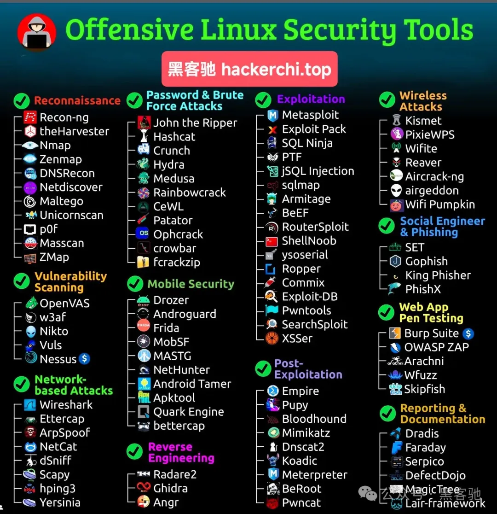进攻工具合集

💡注意事项：

权限和合法性： 在使用这些工具进行侦察、扫描或枚举之前，确保你有足够的权限，并且你的行为符合当地法律法规。未经授权的侦察和扫描可能会导致法律问题。

保持工具更新： 这些工具都在不断地更新和改进，以适应新的技术和安全挑战。定期检查并更新你使用的工具，可以确保你利用最新的功能和技术。

学习和实践： 网络安全一个不断发展的领域，持续学习新的技术和方法对于保持你的技能处于最前沿至关重要。参与CTF（Capture The Flag）比赛、阅读相关的书籍和文章、加入安全社区和论坛，都是提升技能的好方法。


## 侦察 (Reconnaissance)

1. Recon-ng

2. - Recon-ng是一个基于Web的侦察框架，使用Python编写。首先，你需要安装Recon-ng，可以通过克隆其GitHub仓库或使用包管理器安装。
   - 启动Recon-ng后，通过workspaces create [工作区名称]创建一个新的工作区，以隔离不同的侦察项目。
   - 使用marketplace search搜索可用的模块。找到需要的模块后，使用marketplace install [模块路径]安装模块。
   - 加载模块后，使用options set [选项] [值]配置模块所需的选项，如目标域名等。
   - 配置完成后，使用run执行模块，收集信息。

3. theHarvester

4. - theHarvester用于收集目标的电子邮件、子域名、主机、员工名单等信息。一个常见的命令行用法是：theHarvester -d example.com -b google，这将使用Google作为数据源，搜索与example.com相关的信息。
   - l选项可以限制搜索结果的数量，例如l 500限制为500个结果。

5. Nmap

6. - Nmap是最广泛使用的网络探测和安全审核工具之一。例如，nmap -sS -T4 -A -v example.com命令会对example.com进行SYN扫描，使用较快的扫描速度（-T4），同时启用操作系统和服务版本检测（-A）并开启详细模式（-v）。
   - p-选项告诉Nmap扫描65535个标准端口，如果你只对特定端口感兴趣，可以用p 80,443指定端口。

7. Zenmap

8. - Zenmap是Nmap的GUI版本，提供了一个用户友好的界面来执行Nmap扫描。它特别适合那些不喜欢命令行的用户。在Zenmap中，你可以保存扫描配置作为个人配置文件，以便以后快速使用。

9. DNSRecon

10. - DNSRecon提供了广泛的DNS枚举功能。例如，dnsrecon -d example.com -t std会对example.com执行标准记录枚举，包括A, AAAA, SOA等记录。t选项用于指定枚举类型，std代表标准枚举。

11. Netdiscover

12. - Netdiscover通常用于本地网络。一个简单的用法是运行netdiscover -r 192.168.1.0/24，这将扫描192.168.1.x的子网，寻找活动的设备。r选项指定了要扫描的范围。

13. Maltego

14. - Maltego是一款强大的开源情报收集工具，允许用户通过图形方式探索目标的网络关系。在Maltego中，你可以选择一个实体，如一个人名或域名，然后使用变换来查找与该实体相关的数据。

15. Unicornscan

16. - Unicornscan提供了灵活的端口扫描功能，支持异步扫描，使其在大规模扫描中特别有用。例如，unicornscan -mT -Iv -p 80,443 example.com将对example.com的80和443端口进行TCP扫描，Iv选项提供了更多的输出信息。

17. p0f

18. - p0f可以通过分析被动捕获的数据包来识别远程主机的操作系统。一个基本的用法是sudo p0f -i eth0

19. Masscan

20. - Masscan被称为“互联网上最快的端口扫描器”，它能在几分钟内完成对整个互联网的扫描。由于其速度极快，使用时需要特别注意，以避免给网络设备或目标主机造成过大负载。
    - 一个基本的使用示例是：masscan -p80,443 10.0.0.0/8 --rate=10000。这个命令扫描10.0.0.0到10.255.255.255范围内的主机的80和443端口，扫描速率为每秒10000个包。
    - 使用-rate参数可以控制扫描的速度，这对于避免网络拥塞和减少被侦测的机会非常重要。

21. ZMap

22. - ZMap也是一个高速网络扫描器，专为研究者和安全从业者设计，用于对整个互联网或大型子网进行扫描。与Masscan类似，ZMap在使用时也需要注意不要对网络造成过大的影响。
    - 使用ZMap进行扫描的一个示例命令是：zmap -p 80 -o scan_results.csv 192.168.1.0/24。这个命令扫描192.168.1.0/24网段的80端口，并将扫描结果保存到scan_results.csv文件中。
    - o参数指定输出文件，这对于后续分析扫描结果非常有用。


## 基于网络的攻击 (Network-based Attacks)

1. OpenVAS (Open Vulnerability Assessment System)

2. - OpenVAS是一个强大的漏洞扫描和管理框架，由一系列服务和工具组成，提供全面的漏洞扫描解决方案。

   - 使用方法：

   - 1. 安装OpenVAS。在许多Linux发行版中，可以直接通过包管理器安装。
     2. 初始化和更新OpenVAS数据库，通常通过运行greenbone-nvt-sync、greenbone-scapdata-sync和greenbone-certdata-sync命令来完成。
     3. 启动OpenVAS服务。
     4. 通过Web界面或命令行工具创建和配置扫描任务，指定目标地址和扫描参数。
     5. 启动扫描任务，等待扫描完成，并查看报告。

3. w3af (Web Application Attack and Audit Framework)

4. - w3af是一个用于Web应用程序的安全扫描工具，它能够识别和利用Web应用程序中的多种漏洞。

   - 使用方法：

   - 1. 安装w3af。
     2. 启动w3af的GUI界面或命令行界面。
     3. 配置目标URL和扫描策略。w3af提供了多种插件和选项，用于定制扫描过程。
     4. 启动扫描，并在完成后查看报告。

5. Nikto

6. - Nikto是一个开源的Web服务器扫描器，能够检测Web服务器上的多种潜在问题，包括超过6700种不同的已知漏洞。
   - 使用方法：nikto -h [目标地址]。Nikto的使用非常简单，只需指定目标地址即可开始扫描。扫描完成后，Nikto将在终端中显示结果。

7. Vuls

8. - Vuls是一个开源的漏洞扫描器，专注于Linux/FreeBSD的漏洞扫描。它通过定期扫描来检测已知的漏洞，并生成详细的报告。

   - 使用方法：

   - 1. 安装Vuls及其依赖。
     2. 配置Vuls，包括扫描目标和扫描参数。
     3. 运行Vuls进行扫描。
     4. 查看生成的报告，了解发现的漏洞和建议的修复措施。

9. Nessus

10. - Nessus是一个非常流行的漏洞扫描工具，它提供了广泛的漏洞库和多种扫描选项，适用于各种环境和需求。

    - 使用方法：

    - 1. 安装Nessus。
      2. 通过Web界面访问Nessus，并完成初始化设置。
      3. 创建新的扫描任务，配置扫描目标和选项。
      4. 启动扫描任务，并等待扫描完成。
      5. 查看和分析扫描报告，了解发现的漏洞和提供的修复建议。


## 密码破解与暴力攻击 (Password & Brute Force Attacks)

### 1. John the Ripper

- 介绍：John the Ripper是一个快速的密码破解工具，支持多种密码加密类型。它通常用于破解加密的密码，以检测弱密码。
- 基本用法：john --format=md5crypt /etc/shadow，这条命令尝试破解/etc/shadow文件中的md5crypt加密密码。

### 2. Hashcat

- 介绍：Hashcat是世界上最快的密码恢复工具之一，支持多种算法和加密类型。它利用GPU加速技术来提高破解速度。
- 基本用法：hashcat -m 0 -a 3 hash.txt ?l?l?l?l?l，这条命令使用暴力破解方法破解hash.txt文件中的MD5哈希。

### 3. Crunch

- 介绍：Crunch是一个字典生成器，可以根据用户定义的标准生成所需的字典用于密码破解。
- 基本用法：crunch 4 6 123 -o dict.txt，生成一个包含所有4到6位数密码组合的字典文件。

### 4. Hydra

- 介绍：Hydra是一款非常快速的网络登录破解工具，支持多种协议，包括SSH、FTP、HTTP等。
- 基本用法：hydra -l user -P passlist.txt >，尝试使用passlist.txt中的密码列表破解FTP登录。

### 5. Medusa

- 介绍：Medusa与Hydra类似，是一款速度快、并行处理能力强的登录破解工具。
- 基本用法：medusa -h 192.168.0.1 -u admin -P password.txt -M ssh，尝试破解SSH登录。

### 6. Rainbowcrack

- 介绍：Rainbowcrack使用彩虹表技术来破解哈希值，相比传统破解方法，可以大大减少破解时间。
- 基本用法：使用Rainbowcrack通常需要先生成或下载彩虹表，然后使用rcrack命令与彩虹表一起破解哈希。

### 7. CeWL

- 介绍：CeWL是一个定制字典生成器，可以爬取网页并生成基于页面内容的字典。
- 基本用法：cewl-m 5 -w dict.txt，从example.com生成至少5个字符长度的词汇字典。

### 8. Patator

- 介绍：Patator是一个多用途的破解工具，支持多种类型的服务破解，包括SSH、FTP、MySQL等。
- 基本用法：patator ftp_login host=192.168.0.1 user=FILE0 0=users.txt password=FILE1 1=passwords.txt，尝试破解FTP登录。

### 9. Ophcrack

- 介绍：Ophcrack是一个基于彩虹表的Windows密码破解工具，能够破解大多数Windows用户的密码。
- 基本用法：通常直接在图形界面中使用，加载彩虹表并选择要破解的系统SAM文件。

### 10. crowbar

- 介绍：brute force攻击工具，支持多种协议，包括VPN、SSH等。
- 基本用法：crowbar -b vpn -s 192.168.0.1/32 -u user -C /path/to/passwords.txt -n 22，这条命令尝试使用密码列表文件破解指定IP的VPN。

### 11. Fcrackzip

- 介绍：Fcrackzip是一个快速的zip密码破解工具，支持多种破解方法，包括暴力破解和字典攻击。
- 基本用法：fcrackzip -u -c 'aA1!' -l 4-6 -p aaaa file.zip，这条命令尝试破解file.zip文件的密码，密码长度为4到6个字符，包含小写字母、大写字母和数字。

### 使用技巧和注意事项

- 字典和彩虹表：对于字典攻击和彩虹表攻击，选择或生成高质量的字典和彩虹表是成功破解密码的关键。对于特定目标或场景，定制化的字典可能更有效。
- 硬件加速：对于支持GPU加速的工具（如Hashcat），使用合适的GPU硬件可以大幅提高破解速度。


1. 移动安全 (Mobile Security)

2. - Drozer
   - Androguard
   - Frida
   - MobSF
   - MASTG
   - NetHunter
   - Android Tamer
   - Apktool
   - Quark Engine
   - Bettercap

3. 逆向工程 (Reverse Engineering)

4. - Radare2
   - Gdb
   - Angr

5. 利用 (Exploitation)

6. - Metasploit
   - Exploit Pack
   - SQL Ninja
   - PTF
   - jSQL Injection
   - sqlmap
   - Armitage
   - BeEF
   - RouterSploit
   - ShellNoob
   - yoserial
   - Ropper
   - Commix
   - Exploit-DB
   - Pwntools
   - SearchSploit
   - XSSer

7. 无线攻击 (Wireless Attacks)

8. - Kismet
   - PixieWPS
   - Wifite
   - Weaver
   - Aircrack-ng
   - airgeddon
   - WiFi Pumpkin

9. 社会工程与钓鱼 (Social Engineer & Phishing)

10. - SET
    - Gophish
    - King Phisher
    - PhishX

11. 网络应用渗透测试 (Web App Pen Testing)

12. - Burp Suite
    - OWASP ZAP
    - Arachni
    - Wfuzz
    - Skipfish

13. 后渗透 (Post-Exploitation)

14. - Empire
    - Pupy
    - Bloodhound
    - Mimikatz
    - Dnscat2
    - Koadic
    - Meterpreter
    - BeRoot
    - Pwncat

15. 报告与文档 (Reporting & Documentation)

16. - Dradis
    - Faraday
    - Serpico
    - DefectDojo
    - MagicTree
    - Lair-framework


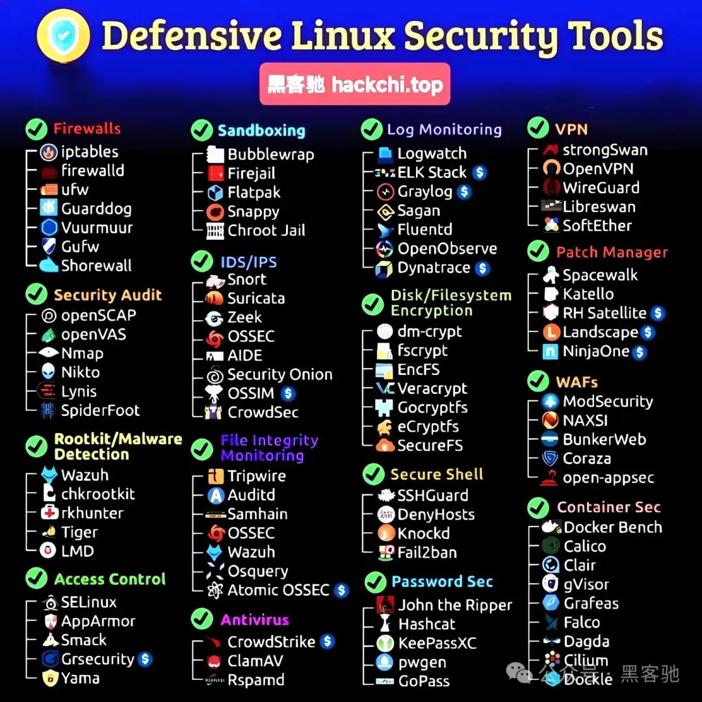防御工具合集

1. 防火墙 (Firewalls)

2. - iptables
   - Firewalld
   - ufw
   - Guarddog
   - Vuurmuur
   - Gufw
   - Shorewall

3. 沙箱 (Sandboxing)

4. - Bubblewrap
   - Firejail
   - Flatpak
   - Snappy
   - Chroot Jail

5. 安全审计 (Security Audit)

6. - OpenSCAP
   - openVAS
   - Nmap
   - Nikto
   - Lynis
   - SpiderFoot

7. 入侵检测/防御系统 (IDS/IPS)

8. - Snort
   - Suricata
   - Zeek
   - OSSEC
   - AIDE
   - Security Onion
   - OSSIM
   - CrowdSec

9. 根木马/恶意软件检测 (Rootkit/Malware Detection)

10. - Wazuh
    - chkrootkit
    - rkhunter
    - Tiger
    - LMD

11. 访问控制 (Access Control)

12. - SELinux
    - AppArmor
    - Smack
    - Grsecurity
    - Yama

13. 日志监控 (Log Monitoring)

14. - Logwatch
    - ELK Stack
    - Graylog
    - Sagan
    - Fluentd
    - OpenObserve
    - Dynatrace

15. 磁盘/文件系统加密 (Disk/Filesystem Encryption)

16. - dm-crypt
    - fscrypt
    - EncFS
    - Veracrypt
    - Gocryptfs
    - eCryptfs
    - SecureFS

17. 文件完整性监控 (File Integrity Monitoring)

18. - Tripwire
    - AIDE
    - Samhain
    - OSSEC
    - Wazuh
    - Osquery
    - Atomic OSSEC

19. 安全Shell (Secure Shell)

20. - SSHGuard
    - DenyHosts
    - Knockd
    - Fail2Ban

21. 密码安全 (Password Sec)

22. - John the Ripper
    - Hashcat
    - KeePassXC
    - pwgen
    - GoPass

23. 杀毒软件 (Antivirus)

24. - CrowdStrike
    - ClamAV
    - Rspamd

25. VPN

26. - strongSwan
    - OpenVPN
    - WireGuard
    - Libreswan
    - SoftEther

27. 补丁管理 (Patch Manager)

28. - Spacewalk
    - Katello
    - RH Satellite
    - Landscape
    - NinjaOne

29. 网络应用防火墙 (WAFs)

30. - ModSecurity
    - NAXSI
    - BunkerWeb
    - Coraza
    - open-appsec

31. 容器安全 (Container Sec)

32. - Docker Bench
    - Calico
    - Clair
    - gVisor
    - Grafeas
    - Falco
    - Dagda
    - Cilium
    - Dockle

33. 

## OWASP ZAP 渗透测试一条龙

> `OWASP ZAP`是一款自动化的web漏洞扫描工具。能够帮助我们快速的检查站点漏洞。

### 安装

需要注意的是，在最新版kali中，默认是没有zap这款工具的，需要我们手动进行安装。

```
apt-get install zaproxy
```

安装完成。在菜单中搜索`zap`即可运行。

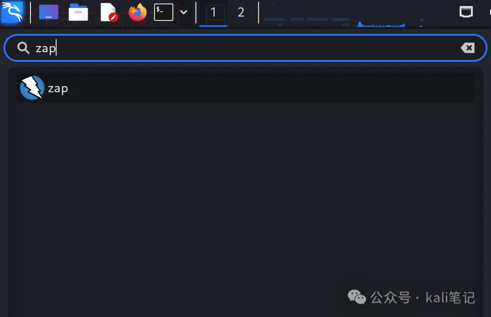

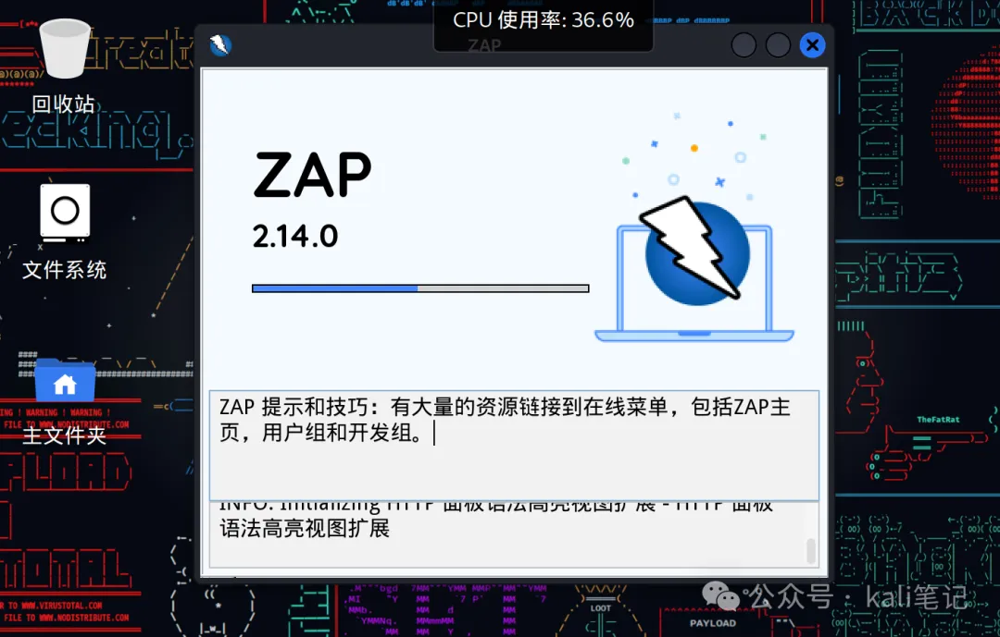

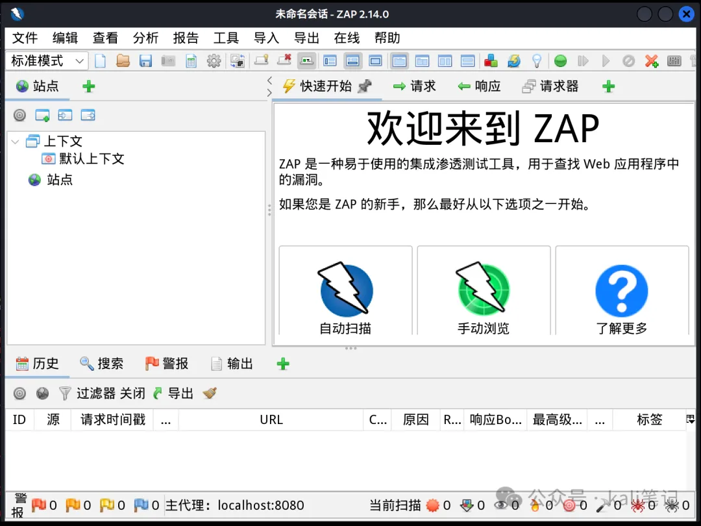

### 扫描模式

ZAP提供了两种扫描方式，Automated Scan（**自动扫描**）和 Manual Explore（**手动扫描**）

#### 自动扫描

自动扫描是我们最常用的扫描方式，点击自动扫描后，输入网址后点击攻击即可。

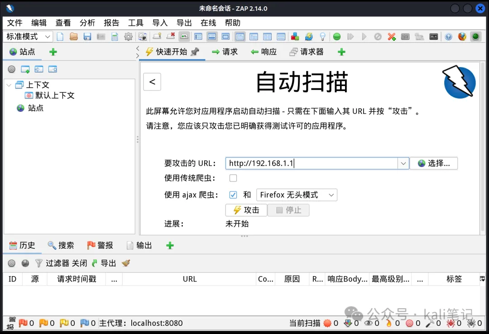

自动扫描结束后可点击`Alerts`（警报） 查看漏洞信息。

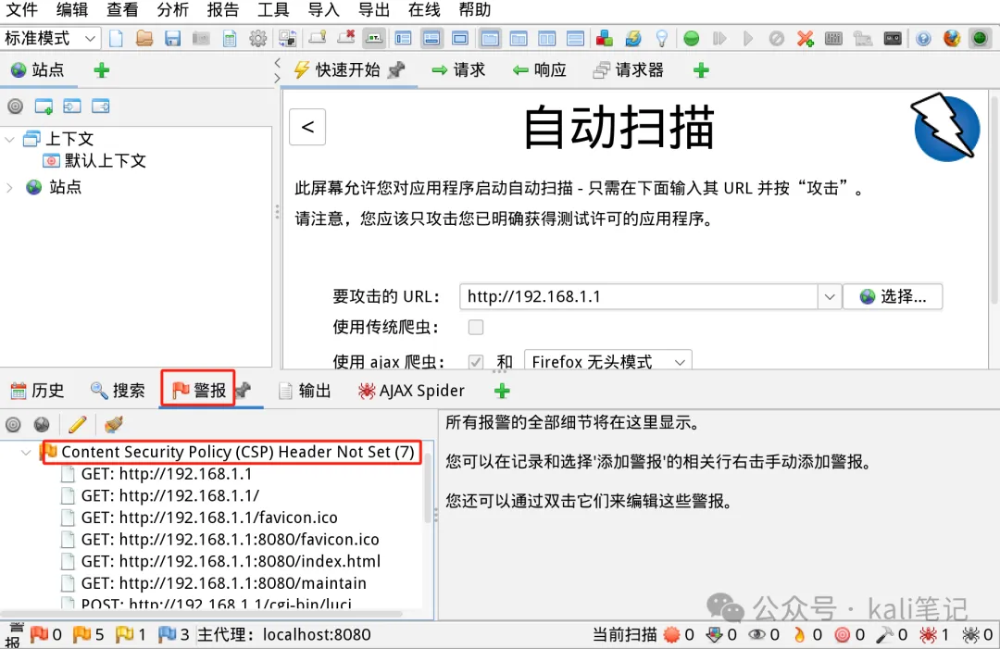

#### 手动扫描

进入自动扫描配置界面，输入要测试的网址，点击启动浏览器

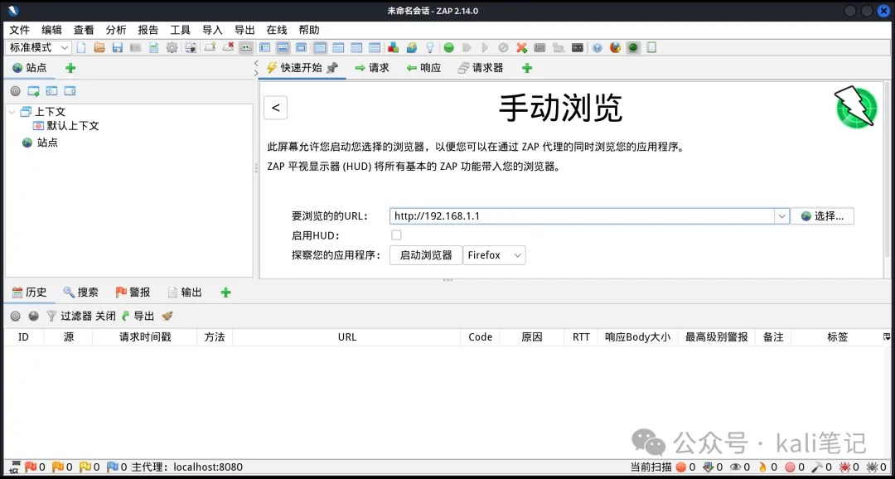

##### 设置代理

在工具栏选择`Options`按钮进入设置界面，选择`Local Proxies`，默认使用8080端口，也可自行设置端口号。然后在对应浏览器设置一样的代理信息就可以了。和在burp中配置代理的一样。

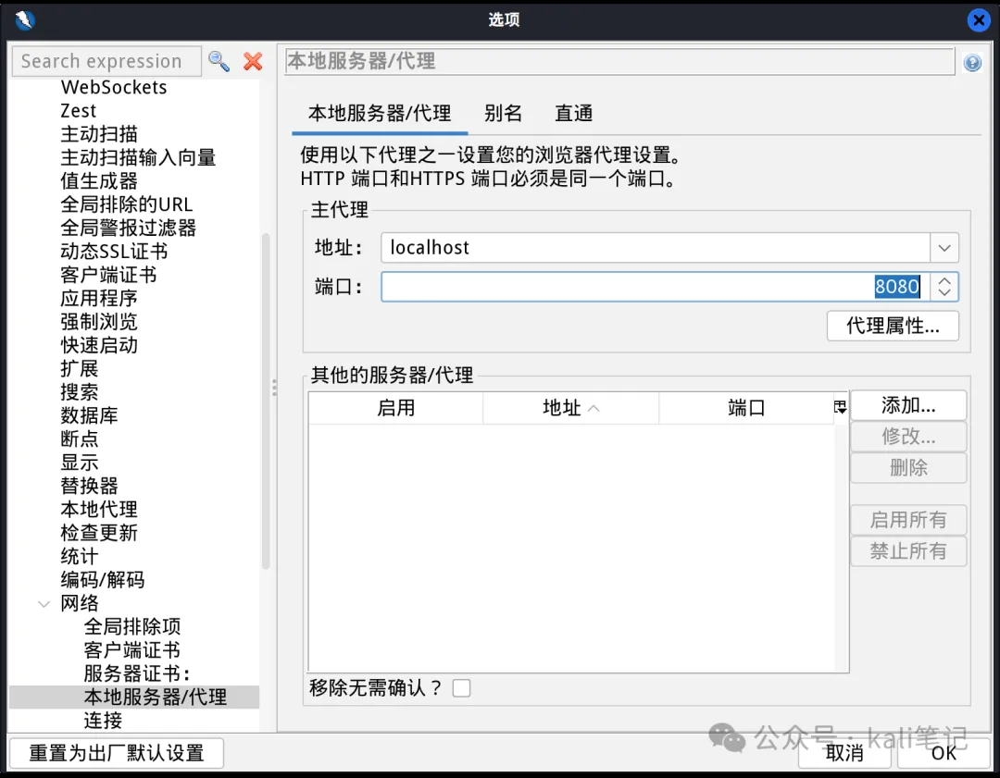

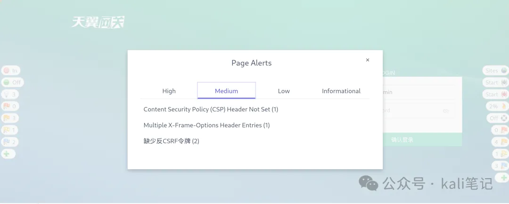

### 拦截请求

在工具栏，点击断点图标变成红色的状态，表示当前正在开启断点模式。

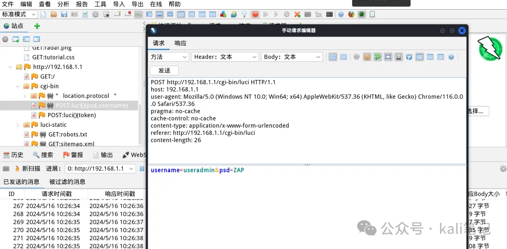

### 暴力破解

在Request区域右键选择“Fuzz”进入爆破设置界面，选中需要参数化的部分，点击“Add”进入设置爆破内容，ZAP提供了多种Type的选择，枚举输入爆破内容后依次添加，点击“Start Fuzzer”开始执行爆破。

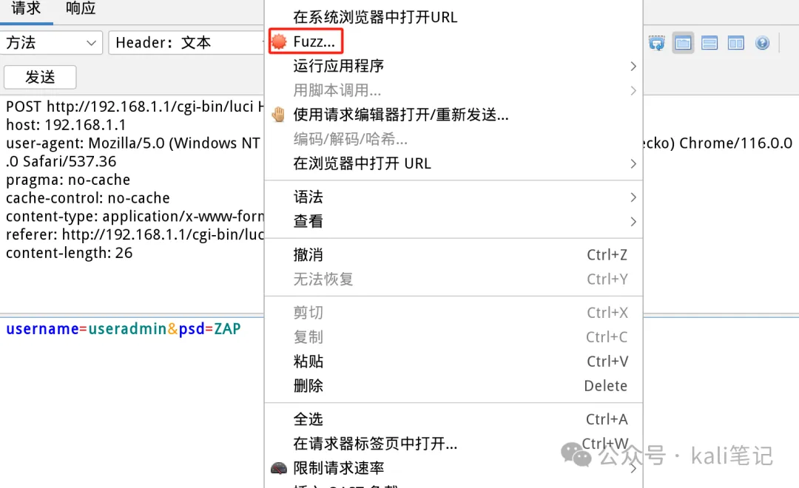

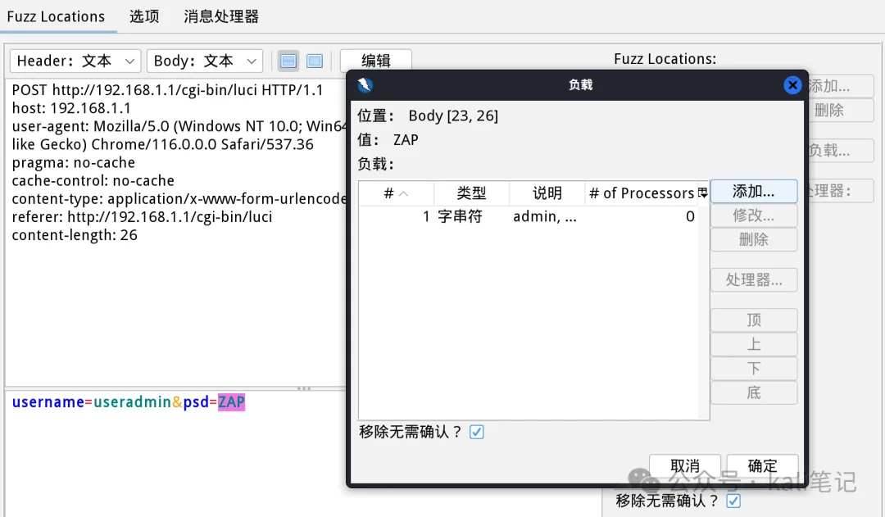