# 手机安装Kali Linux

## termux安装kali linux

> 有很多问题，这次加以记录和整理，总体来说，大多是国际网络问题和linux命令错误，就算实现了国际网络，但你的安装程序不一定通过国际网络进行！如果出现安装错误，多考虑这两个问题。


💡

其实网上的教程有很多，方式也各不相同，但综合起来说，可行方案中，其实就三部分。本文章希望用国内网络实现安装，方便实现，全文 已亲自部署！已亲自实验！

1、termux提供基础环境

2、各种不同的脚本方式安装kali

3、vnc可视化连接（可选）

💡

注意！部分命令添加了  “#” 为解释命令所用，请不要复制并粘贴井号及其后面的内容到termux中运行！会造成命令错误！


一、Termux环境1、F-Droid方案 1️⃣ 下载F-Droid

**https://f-droid.org/zh_Hans/packages/com.termux/**

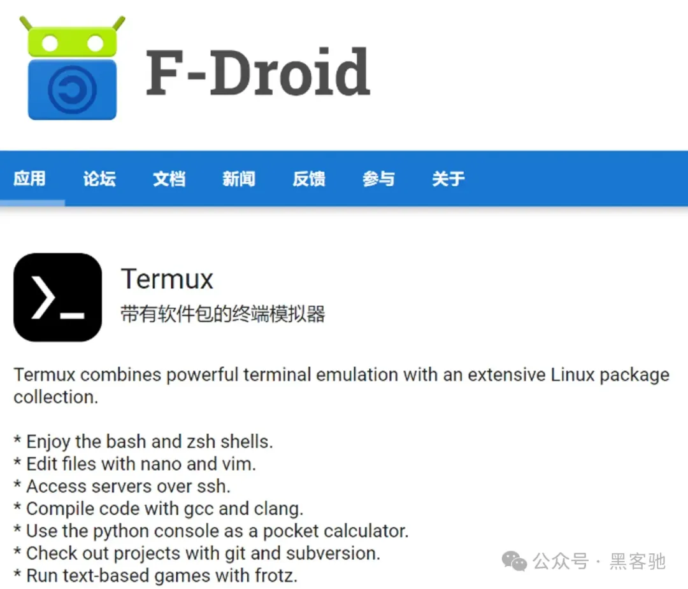

2️⃣在F-Droid内查询Termux并安装

F-Droid有时可访问，如果遇到网路慢可考虑国际网络，F-Droid更新完数据进行下面Termux安装


如网络实在不便，可直接安装termux链接：**https://pan.baidu.com/s/1tUwn2XeaTE66_nfjBsqMzA**提取码：6666  （termux github版本）

3️⃣开启Termux的后台运行


2、配置存储和换源1️⃣ 开启Termux的系统存储权限

```
termux-setup-storage
```

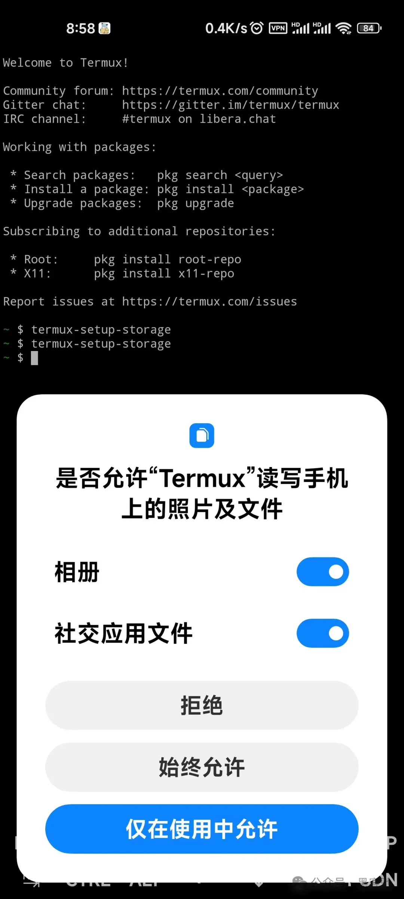

2️⃣Termux换源

```
sed -i 's@^\(deb.*stable main\)$@#\1\ndeb https://mirrors.tuna.tsinghua.edu.cn/termux/apt/termux-main stable main@' $PREFIX/etc/apt/sources.list
```

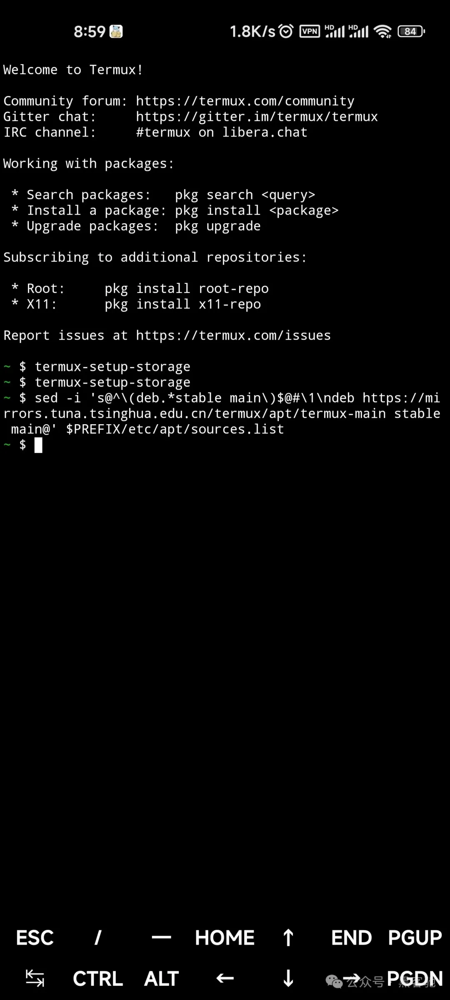

3、基本工具安装资料：**PRoot 是chroot[1]**、 mount --bind 和 binfmt_misc的用户空间实现。这意味着用户不需要任何权限或设置来执行诸如使用任意目录作为新的根文件系统、使文件可在文件系统层次结构中的其他位置访问或通过 QEMU 用户模式透明地执行为另一个 CPU 架构构建的程序等操作。


proot是通过使用Linux内核提供的chroot系统调用来创建虚拟环境的。chroot系统调用可以将当前进程的根目录设置为指定的目录,使得该目录成为进程所能访问到的最高级目录。proot利用这一特性,在指定目录下创建一个与主系统隔离的虚拟环境。在该环境中,用户可以执行各种操作,包括安装软件、运行程序等,而不会对主系统造成影响。在使用proot创建虚拟环境时,需要指定一个根目录。这个根目录可以是一个已存在的目录,也可以是一个新创建的目录。

```
#遇到提问无脑全y即可。
pkg update  #同步镜像
pkg upgrade #升级
pkg install proot #创建虚拟环境
pkg install git   #git环境
pkg install wget  #下载工具
pkg install vim   #文字编辑工具
```

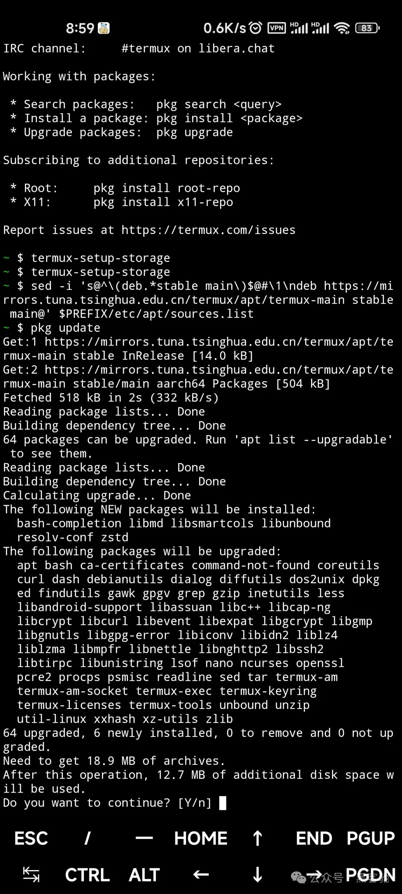

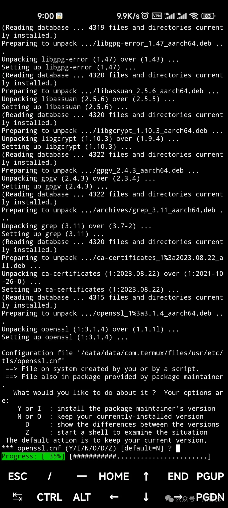


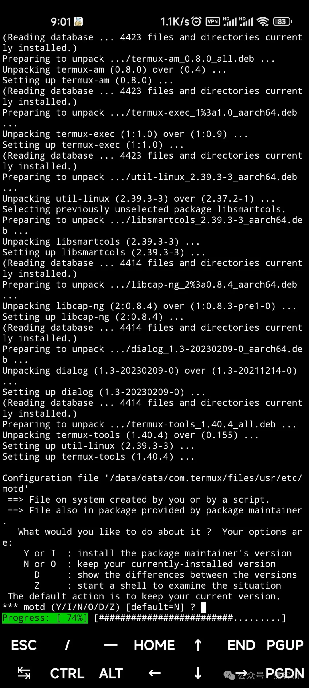

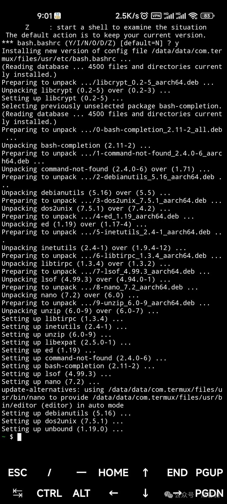


二、Kali Linux第三方脚本方式安装 1、下载安装脚本为脚本执行进行Python准备，尽可能的减少错误，需要安装Python2、Python3两个版本，以后运行脚本之类的也有用。

```
pkg install python 
pkg install python2
git clone https://gitee.com/hyphentech/Nethunter-In-Termux.git
cd Nethunter-In-Termu
# 赋予脚本运行权限
chmod +x kalinethunter finaltouchup.sh 
#启动安装脚本，下载时间较长，记得抽时间给我点赞，转发！
./kalinethunter


#如果遇到误操作等需要重新下载等情况，请执行cd到上级目录，删除下载文件，然后重新运行脚本。
```

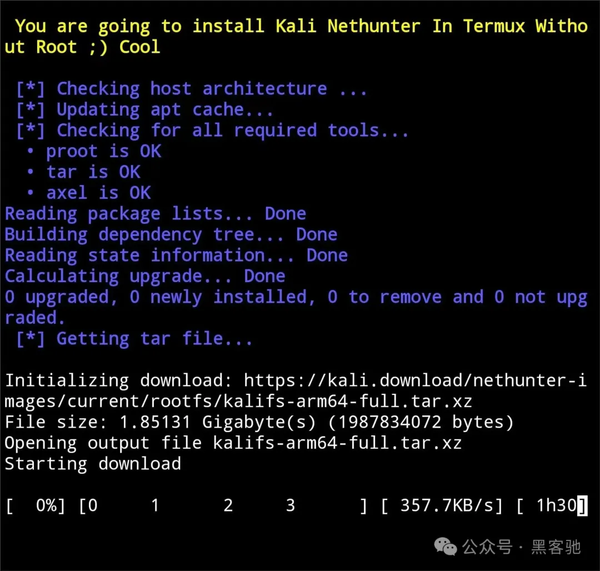

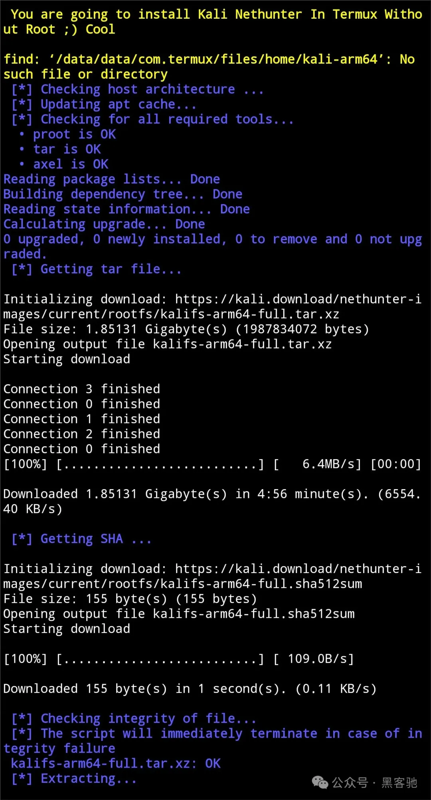

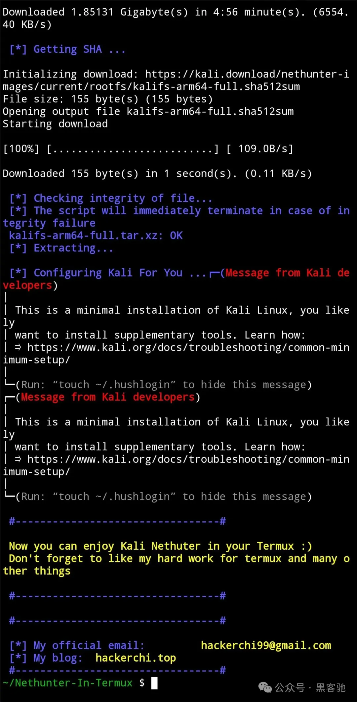


2、更换apt源

```
startkali
vim /etc/apt/sources.list
#加入两行，其他全部注释，然后ESC  :wq 保存退出
deb http://mirrors.aliyun.com/kali kali-rolling main non-free contrib
deb-src http://mirrors.aliyun.com/kali kali-rolling main non-free contrib

#更新
apt update

#需要高权限升级
sudo apt upgrade 
#密码
kali
```

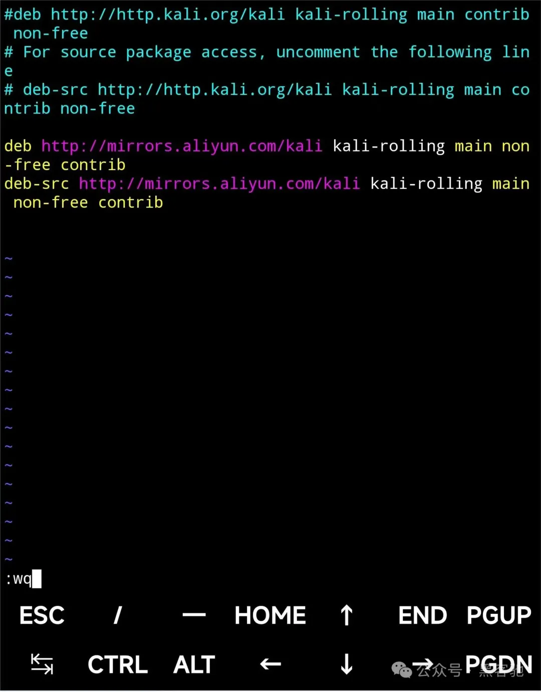

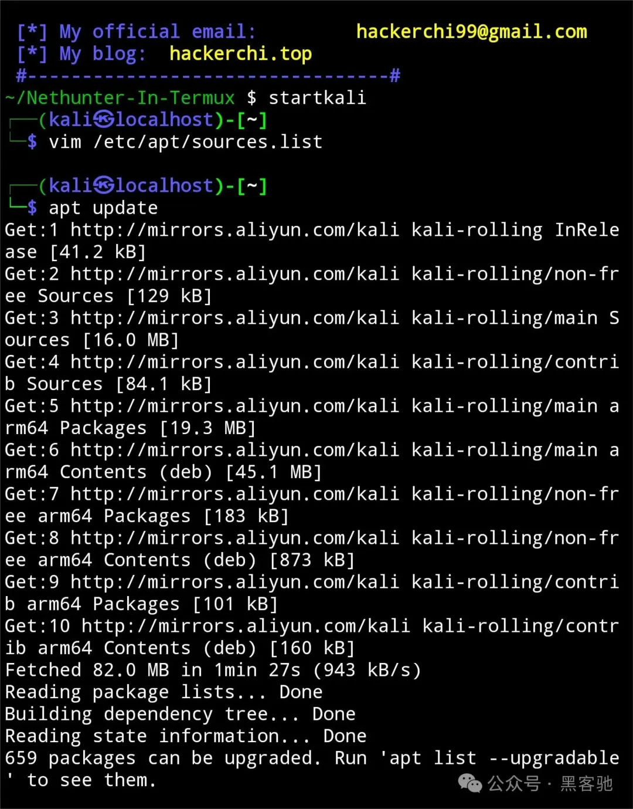


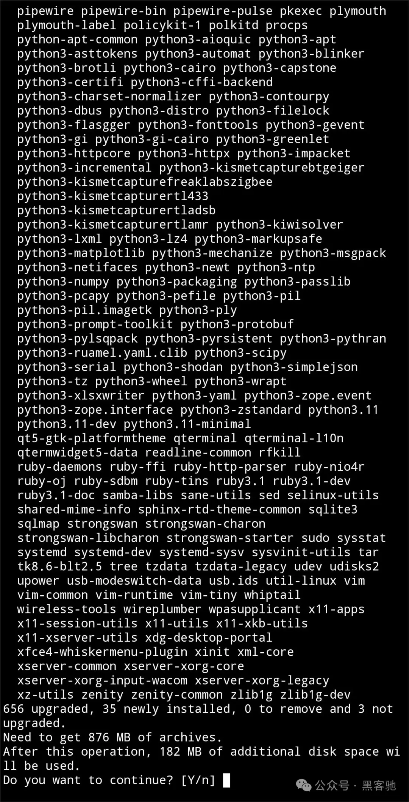

3、图形化

```
sudo apt install xorg xdm xfce4
sudo apt install tightvncserver

#启动vncserver
vncserver
```


4、启动VNC客户端连接即可～！

理论上任何VNC客户端都可以，连接时注意地址和端口号。

Nethunter app :**https://pan.baidu.com/s/1MbFMtO5UM2PYXvBeipcztA** 提取码:6666 复制这段内容打开「百度网盘APP 即可获取」

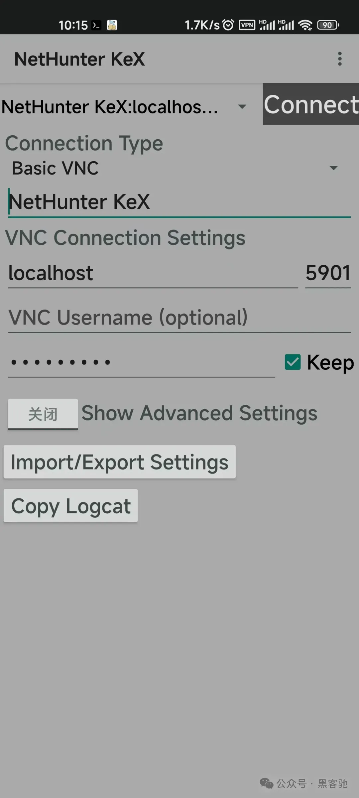


5.通过电脑端连接

考虑手机操作不便，尤其是打字的时候很费劲，考虑直接用win或mac连接KaliLinux，但实现起来有难度，据说需要端口转发，不能直接访问，我才用隔山打牛的方法，通过在网络互通的情况下，先访问termux，然后通过termux去操作KaliLinux。


（1）安装tigervnc和xfce4

```
pkg install tigervnc xfce4
```

（2）配置参数

```
#编辑 ~/.vnc/xstartup
vim ~/.vnc/xstartup


#添加xfce4，其他全部注释掉
xfce4-session &
```

（3）启动termux VNC，记得记住密码

```
vncserver
```

（4）通过电脑访问。

以上模式和实现kalilinux中的图形化很类似，但是设计兼容性问题很多WM有错误，不好配置，其实还有很多WM可以选择，有想法的朋友都可以试试。

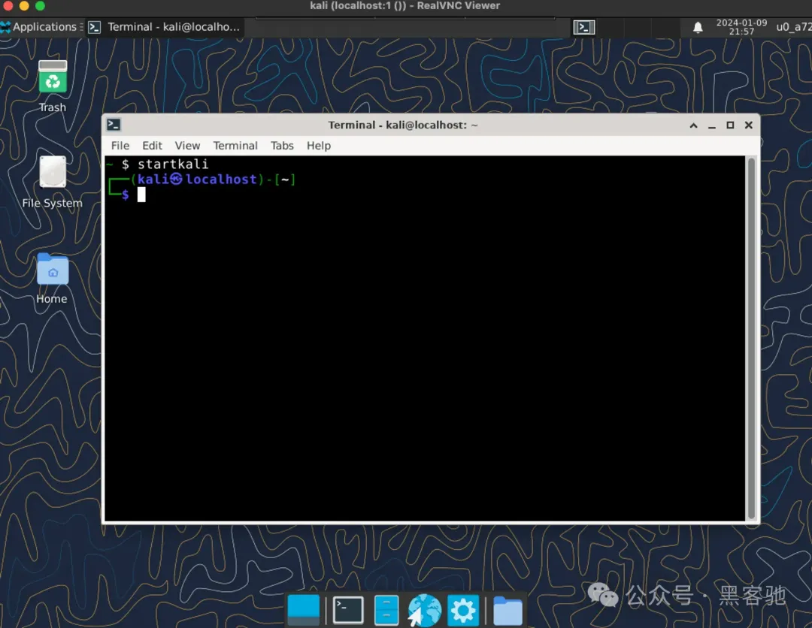


三、报错汇总

💡

为提升安装成功效率，特集合常见安装错误，有错误的朋友请参考解决，如果没有罗列到的，请留言，我会添加进去。

1、Kali Linux的VNC连接失败或灰屏

```bash
#这种方法我亲自试验过，其他的没成功，仅供参考，熟悉内情的朋友请指教！不胜感激！
sudo apt install icewm -y
vim ~/.vnc/xstartup

然后将下面的图片内容替换原文
```


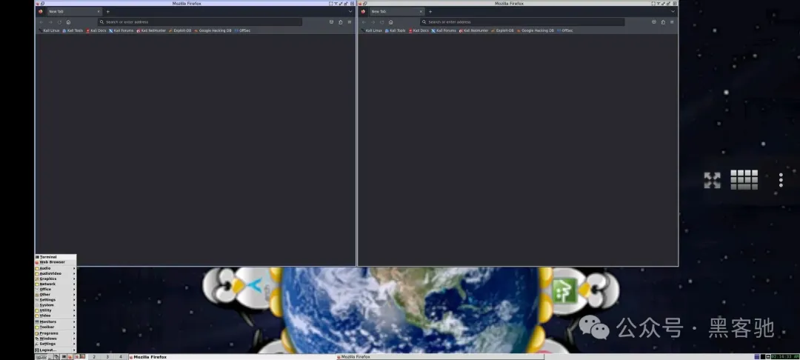

💡

如果上面还是没成功连接图形桌面，还可参考如下几个解决方案：**https://blog.csdn.net/xiaokai1999/article/details/129143605****https://blog.csdn.net/kong1287988804/article/details/78614154**


2、Kali Nethunter未配置DNS报错报错信息：Failed to fetch **http://mirrors.aliyun.com/kali/dists/kali-rolling/InRelease[2]** Temporary failure resolving ‘**mirrors.aliyun.com[3]**’ W: Some index files failed to download. They have been ignored, or old ones used instead. H: Failed to fetch **http://http.kali.org/kali/dists/kali-rolling/InRelease[4]** Temporary failure resolving ‘**http.kali.org[5]**’ W: Some index files failed to download. They have been ignored, or old ones used instead.

解决命令如下：

vim /etc/resolv.conf  #root模式下，所有命令都是 #替换下面图片内容，建议原有的三行注释掉，添加下面三行命令 search localdomain nameserver 223.5.5.5 nameserver 8.8.8.8

3、Kali Nethunter的VNC连接失败报错信息：failed to execute child process “dbus-launch” (no such file or directory)

解决命令 ：apt install dbus-x11


4、Kali Linux更新upgrade时postgresql报错报错信息：mainError: Data directory /var/lib/postgresql/15/main must not be owned by root … failed! E: Sub-process /usr/bin/dpkg returned an error code (1)

\#主要是删除postgresql*和重新配置configure sudo apt update && sudo apt full-upgrade -y

sudo rm -rf /var/lib/dpkg/info/postgresql*

sudo dpkg --configure -a

sudo apt update && sudo apt full-upgrade -y5、Kali未正确关闭VNC session报错报错信息：vncserver: No matching VNC server running for this user! Linking lock file (/tmp/.X1-lock) in place failed: No such file or directory

\#避免经常出现此问题，每次图形化之后logout或vncserver -kill rm -rf  /root/.vnc #删除 .vnc下所有文件 rm -rf /tmp #删除tmp下所有文件，包括隐藏文件 .X1-lock .X11-unix 这两个必须删除，然后执行下面命令或vncserver vncserver -depth 24 -geometry 1920x1080 #删tmp下面文件后显示Linking lock file (/tmp/.X1-lock) in place failed: No such file or directory，采取将tmp备份，然后删除tmp创建个空的tmp目录 如果还未解决，可参考其他方案，如下：**https://blog.csdn.net/Qwertyuiop2016/article/details/118105155**


6、Kali的自带Firefox报错报错信息：Gah Your tab just crashed

解决方案如下：打开火狐配置 about:config 搜索sandbox 更改如下配置后重启

其他方案如下：

\#检测火狐是否开启了系统代理，然后完成上面图片配置更改，如果还不能上网，启动下面命令 vim /etc/NetworkManager/NetworkManager.conf managed=false改成true service networking restart systemctl enable --now NetworkManager  #没有NetworkManager 换 network-manager  还没有安装下面的nmcli #上面错误执行下面 apt install nmcli

NetworkManager start #此时 systemctl 将失效7、Termux的Kali默认没有Systemctl报错信息：System has not been booted with systemd as init system(PID 1)

apt-get install  systemd apt-get install  systemctl 后期安装其他工具导致systemctl失效的解决方案如下：

sudo apt-get install aptitude

sudo aptitude install systemctl8、Kali自带的apache2报错报错信息：Starting Apache httpd web server: apache2/usr/sbin/apache2ctl: 102: ulimit: error setting limit (Operation not permitted) Setting ulimit failed. See README.Debian for more information. AH00558: apache2: Could not reliably determine the server’s fully qualified domain name, using ::1. Set the ‘ServerName’ directive globally to suppress this message (13)Permission denied: AH00072: make_sock: could not bind to address [::]:80 (13)Permission denied: AH00072: make_sock: could not bind to address 0.0.0.0:80 no listening sockets available, shutting down AH00015: Unable to open logs

1️⃣AH00558: apache2: Could not reliably determine the server’s fully qualified domain name, using ::1. Set the ‘ServerName’ directive globally to suppress this message

sudo vim /etc/apache2/apache2.conf ServerName localhost:8080 #文件尾添加 2️⃣apache2ctl: 102: ulimit: error setting limit (Operation not permitted)

sudo vim /usr/sbin/apache2ctl ULIMIT_MAX_FILES="${APACHE_ULIMIT_MAX_FILES:-ulimit -n 8192}" #此部分改为ULIMIT_MAX_FILES="" if [ "x$ULIMIT_MAX_FILES" != "x" ] ; then $ULIMIT_MAX_FILES 3️⃣(13)Permission denied: AH00072: make_sock: could not bind to address [::]:80(13)Permission denied: AH00072: make_sock: could not bind to address 0.0.0.0:80 no listening sockets available, shutting down

sudo vim /etc/apache2/ports.conf #改监听端口 #改为 Listen 8080四、其他参考资料


1、终端间的VNC连接软件**https://github.com/rustdesk/rustdesk**


2、Termux后台进程被杀死优化提示信息：Process completed (signal 9) - press Enter

Android12带GMS的ADB命令如下：

adb shell "/system/bin/device_config set_sync_disabled_for_tests persistent; /system/bin/device_config put activity_manager max_phantom_processes 2147483647" 其他具体操作，参考如下教程：**https://www.bilibili.com/read/cv20060713/**

https://huaweicloud.csdn.net/64e5d7dba3cccc782cc565ca.html

https://blog.csdn.net/m0_72123696/article/details/125349732


3、Termux开启Apache2

```bash
pkg install apache2
apachectl #开启apache，会有ServerName报错，不影响使用，解决详情见4-8
apachectl -k stop #关闭
cd $PREFIX/share/apache2/default-site/htdocs/ #apache的主页目录位置
```


4、Termux开启SSH不建议在Termux安装的Linux中使用SSH服务，下面教程在termux中操作

```bash
pkg install openssh
sshd #开启服务
passwd #设置密码  whoami 查看用户名
cat .ssh/authorized_keys  #证书位置，需要导入客户端公钥才可使用
cat  client.pub >> .ssh/authorized_keys
```

\#Windows连接termux**https://blog.csdn.net/a18845594188/article/details/126544125**

\#公网连接termux**https://www.bilibili.com/read/cv25822574/**

*https://blog.csdn.net/m0_70980326/article/details/131012390**

### 参考资料

[1] PRoot 是chroot: *https://en.m.wikipedia.org/wiki/Chroot*

[2] http://mirrors.aliyun.com/kali/dists/kali-rolling/InRelease: *http://mirrors.aliyun.com/kali/dists/kali-rolling/InRelease*

[3] mirrors.aliyun.com: *http://mirrors.aliyun.com/*

[4] http://http.kali.org/kali/dists/kali-rolling/InRelease: *http://http.kali.org/kali/dists/kali-rolling/InRelease*

[5] http.kali.org: *http://http.kali.org/*

[6] hackerchi.top: *http://www.hackerchi.com/*