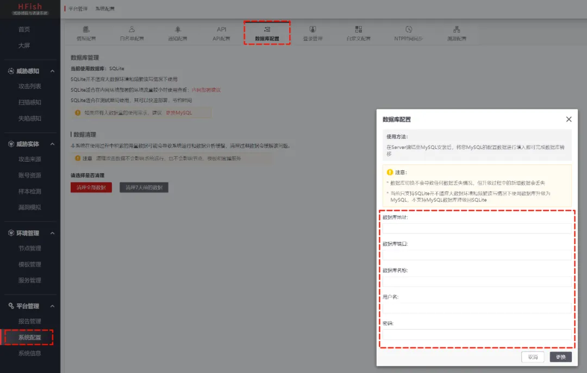
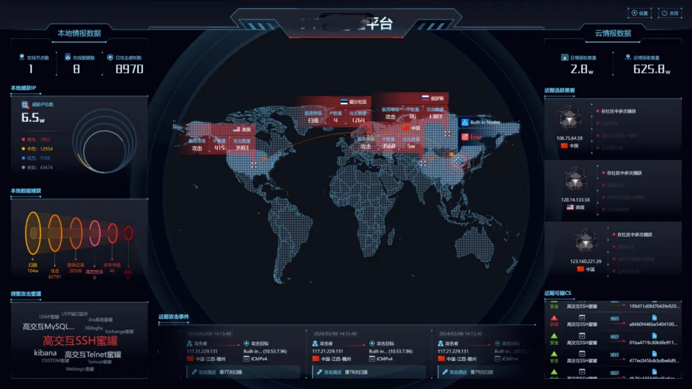
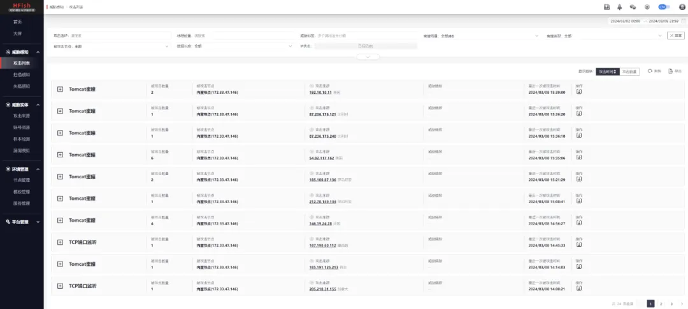
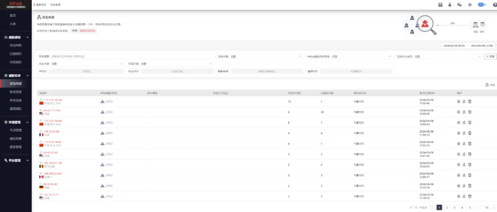
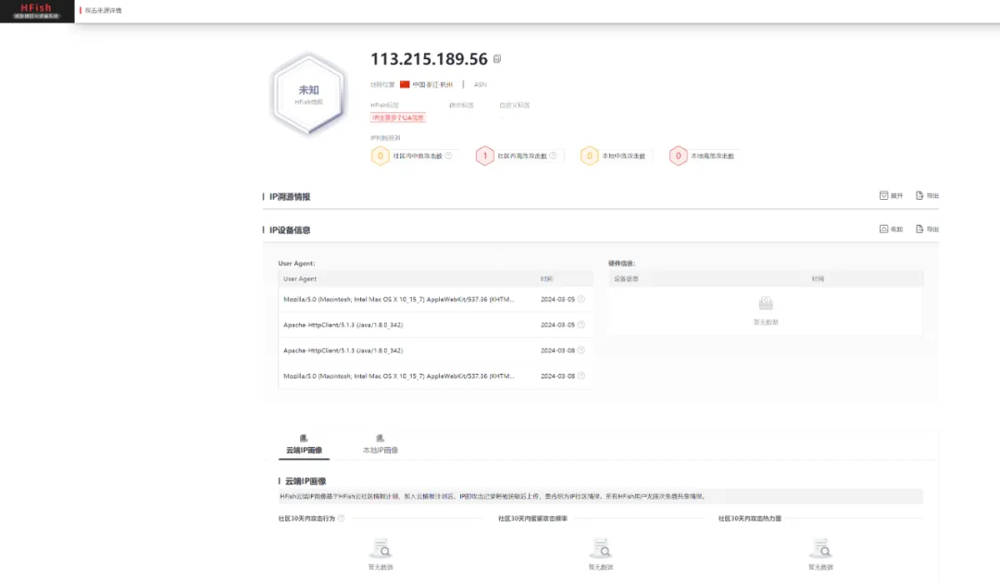
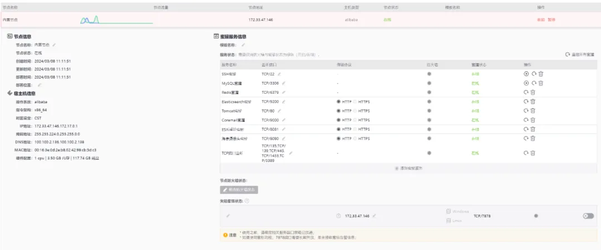
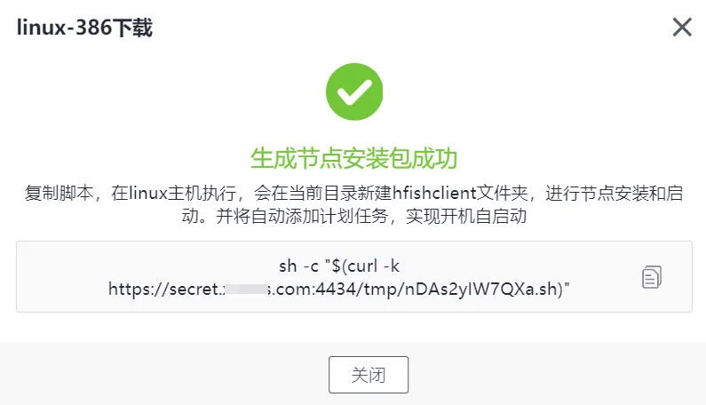
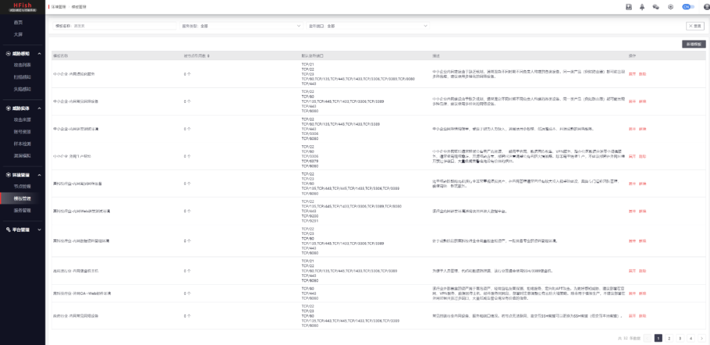
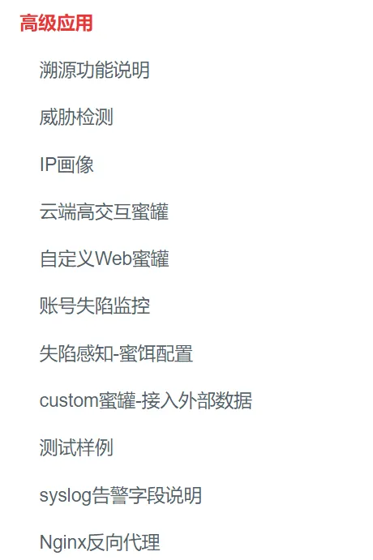

# HFish_永久免费—巧设蜜罐迷局

## HFish

**官网：**https://hfish.io

HFish 蜜罐系统的出现，为网络防御战线带来了全新的思维和实践模式。不同于传统防火墙、入侵检测系统等硬性防御设施，HFish蜜罐更像是一位善于伪装的侦探，它通过模拟真实的网络服务和系统，诱导潜在攻击者主动暴露其攻击意图和手段，为安全团队提供了一种主动出击、先发制人的可能性。


## HFish 设计理念

HFish是一款社区型免费蜜罐，侧重企业安全场景，从内网失陷检测、外网威胁感知、威胁情报生产三个场景出发，为用户提供可独立操作且实用的功能，通过安全、敏捷、可靠的中低交互蜜罐增加用户在失陷感知和威胁情报领域的能力。

HFish 支持基本网络 服务、OA系统、CRM系统、NAS存储系统、Web服务器、运维平台、安全产品、无线AP、交换机/路由器、邮件系统、IoT设备等90多种蜜罐服务、支持用户制作自定义Web蜜罐、支持流量牵引到免费云蜜网、支持可开关的全端口扫描感知能力、支持可自定义的蜜饵配置、一键部署、跨平台多架构，支持 Linux x32/x64/ARM、Windows x32/x64 平台和多种国产操作系统、支持龙芯、海光、飞腾、鲲鹏、腾云、兆芯等国产CPU、极低的性能要求、邮件/syslog/webhook/企业微信/钉钉/飞书告警等多项特性，帮助用户降低运维成本，提升运营效率。

## 什么是蜜罐？

**蜜罐** 技术本质上是一种对攻击方进行 **欺骗的技术**，通过布置一些作为 **诱饵的主机**、**网络服务** 或者 **信息**，诱使攻击方对它们实施攻击，从而可以对攻击行为进行**捕获** 和 **分析**，了解攻击方所使用的工具与方法，推测攻击意图和动机，能够让防御方清晰地了解他们所面对的安全威胁，并通过技术和管理手段来增强实际系统的安全防护能力。

## 安装部署

### 5.1、一键部署

CentOS 是 HFish 团队主力开发和测试系统，推荐选用 CentOS 系统部署管理端

官方团队为了更好的让大家体验到产品的强大功能，在安装层面下足了功夫，针对 CentOS 系统，一条命令，全程自动化：

```
# bash <(curl -sS -L https://hfish.net/webinstall.sh)
```

完成安装后，通过以下网址、账号密码登录（记得是 https）：

```
登陆链接：https://[ip]:4433/web/
账号：admin
密码：HFish2021
```

### 5.2、容器化不麻烦

Docker 也是推荐的部署方式之一，当前的版本拥有以下特性：

1. 自动升级：每小时请求最新镜像进行升级，升级不会丢失数据。
2. 数据持久化：在宿主机 `/usr/share/hfish` 目录下建立 data 目录用于存放攻击数据，建立 logs 目录用于存放日志。

运行 HFish ：

```
docker run -itd --name hfish \
-v /usr/share/hfish:/usr/share/hfish \
--network host \
--privileged=true \
threatbook/hfish-server:latest
```

配置为后续自动升级：

```
docker run -d    \
 --name watchtower \
 --restart unless-stopped \
  -v /var/run/docker.sock:/var/run/docker.sock  \
  --label=com.centurylinklabs.watchtower.enable=false \
--privileged=true \
  containrrr/watchtower  \
  --cleanup  \
  hfish \
  --interval 3600
```

### 5.3、数据库选择

除非性能极度紧张或环境所限，否则HFish官方 **强烈建议使用MySQL/MariaDB数据库！**

经过实战测评，MySQL/MariaDB 数据库可以适应目前绝大多数场景，其数据处理和并发兼容能力都要优于 SQLite。



## 功能分享

先来个大屏，目前我们已经专门为它搞了个大屏，并且未来准备接入更多的机器进来！




威胁操作：




攻击来源：






节点管理（一键添加）：






模版管理（满足多种企业场景）：




更多功能：




结合 https://hfish.io/#/6-0-detail 详细的介绍，不用担心你不会使用。一款好的产品，值得被期待！！！