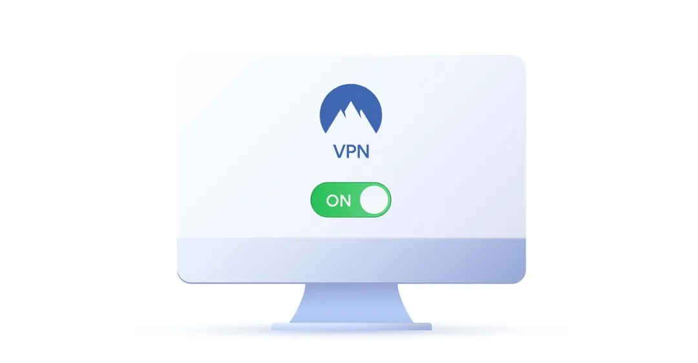

# 你是否在正确的使用vpn

或许你知道使用 VPN 翻墙属于违法行为吧？2023 年，宁夏一男子使用手机翻墙软件，多次登录推特账号浏览国外色情网站，时长高达两年半，最终被当地网警抓获，并予以警告和罚款。这时有人可能会问，为什么自己使用 VPN 这么久了，也没见有人来抓呢？

要想合法使用 VPN，我们需要厘清两个概念。VPN 并不等同于翻墙，它是通过对数据包进行加密来实现远程访问的。就好比我们玩游戏时使用的加速器，可以在我们和境外游戏服务器之间搭建起一座桥梁，这就属于 VPN 的一种。使用这种游戏加速器显然是合法的，大家可以放心使用。

“翻墙”又称“破网”，是指通过虚拟专用网络（VPN）技术规避国家网络监管，突破IP封锁、内容过滤、域名劫持、流量限制等，非法访问被国家禁止的境外网站行为。“翻墙”中的“墙”指的是“国家公共网络监控系统”（The Great Fire Wall of China，GFW），俗称中国国家防火墙。依据法律规定，此类“翻墙”行为属于违法行为，轻者会被警告，重者将被处以不超过 15000 元的罚款。若情节严重，如制作并销售 VPN，则属于典型的情节恶劣、影响严重的行为。

制作和售卖 VPN 是被国家法律明令禁止的，哪怕你只是觉得 VPN 价格贵而找他人合买一个，从严格意义上讲，也构成了贩卖 VPN 的行为，是会坐牢的，这条法律红线绝对不能触碰。

如果只是自己使用 VPN 浏览一些普通网站，而非用于贩卖，那么这种行为是否犯法呢？就如我们视频开头所讲，一名男子使用 VPN 浏览境外色情网站，这就是典型的违法行为。一旦被抓典型，不仅要被罚款，更重要的是，如果留下案底，还会影响后代参军和考公。

这时肯定有人会问，那些海归、华侨以及在华的外籍人士，确实有正当需求，难道要把他们全都抓起来吗？先别着急，其实还有很多合法使用 VPN 的途径。如果有正当需求，可以申请使用正规 VPN，比如科研项目的研究人员，实验室的学生就可以向科技组导师申请校园网的 VPN。只要是用于正规项目，不仅不违法，还有可能获得研究成果的奖励。

个人使用 VPN 用于娱乐是否会被抓，要视情况而定。例如，你使用的游戏加速器也是 VPN 的一种，但打游戏显然不违法。然而，如果你用 VPN 看油管，严格来说确实是违法行为。不过，就像我们刚才所说，只有在情节特别严重的情况下才会被抓，比如传播一些违法内容，不抓你抓谁呢。

不过，如果是观看一些不适当的内容，也算是违法行为。看片的人有很多，撞上了就会被当成典型抓起来。但如果看的是普通视频，严格意义上讲也是违法的。只是目前确实还没有看到相关新闻报道有人因为用 VPN 看正常视频而被抓。那么看到这里，相信大家已经清楚这条红线的位置了。我个人认为，这与你是否使用 VPN 关系不大，主要看你的行为是否会对社会造成不良影响。