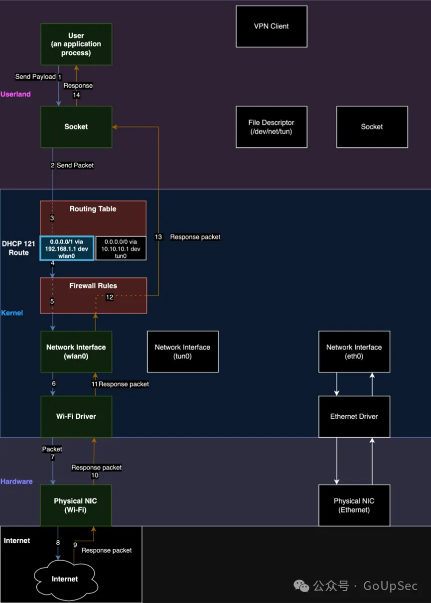

# 可监听VPN的黑客技术

VPN的主要功能是将互联网流量封装在一个加密隧道中，并隐藏用户的IP地址。但是近日，研究人员发现一种名为TunnelVision的攻击方法，可以窃取几乎所有VPN应用的流量。

研究人员表示除了安卓系统之外，几乎所有其他操作系统中的VPN应用目前都没有办法防御此类攻击。

研究人员还指出，这种攻击技术可能从2002年就已存在，并且可能已经被发现并用于实战。

## 攻击方法详解

研究者发布的攻击演示视频（链接在文末）解释了TunnelVision的技术细节，“受害者的流量将被解密并直接路由到攻击者那里。攻击者可以读取、丢弃或修改泄漏的流量，而受害者仍然保持与VPN和互联网的连接。”

该攻击通过操纵分配IP地址给本地网络连接设备的DHCP服务器来实现。DHCP服务器中有一个名为“选项121”的设置，它允许服务器覆盖默认路由规则，这些规则会将VPN流量通过启动加密隧道的本地IP地址发送出去。通过使用选项121将VPN流量路由到DHCP服务器，攻击会将数据转移到DHCP服务器本身。来自Leviathan Security Group的研究人员解释道：

“攻击者在与目标VPN用户相同网络上运行一个DHCP服务器，并将攻击端配置为网关。当流量到达攻击者的网关时，攻击者可使用DHCP服务器上的流量转发规则将流量传递到合法网关，同时进行窥探。”

“攻击者使用DHCP选项121在VPN用户的路由表中设置路由，可以根据需要设置任意路由，也可以设置多个路由。通过推送比大多数VPN使用的/0CIDR范围更具体的路由，攻击者可以创建优先级高于VPN创建的虚拟接口路由的路由规则。攻击者可以设置多个/1路由来重建大多数VPN设置的0.0.0.0/0全部流量规则。”

“推送路由还意味着网络流量将通过与DHCP服务器相同的接口发送，而不是虚拟网络接口。这是一个未在RFC中清楚说明的预期功能。因此，攻击者推送的路由永远不会被VPN的虚拟接口加密，而是由与DHCP服务器通信的网络接口传输。攻击者可以选择哪些IP地址通过隧道传输，哪些地址通过与DHCP服务器通信的网络接口传输。”

*图片：恶意DHCP121路由选项，导致流量永远不会被VPN进程加密*

研究者表示，这种技术也可以用于已经建立的VPN连接（当VPN用户的主机需要从攻击者的DHCP服务器续订租约时）。攻击者可以通过在DHCP租约中设置较短的租约时间来人为地创建这种场景，这样用户会更频繁地更新其路由表。此外，VPN控制通道仍然完好，因为它已经使用物理接口进行通信。在研究者的测试中，VPN一直显示已连接，从未断开。

研究者指出，这种攻击最有效的方式是由控制目标用户所连网络的人实施。在这种情况下，攻击者可将DHCP服务器配置为使用选项121。网络上的非特权用户也可以通过设置他们自己的恶意DHCP服务器来发动此类攻击。

## 攻击后果与缓解方法

攻击可以让部分或全部流量通过未加密的隧道路由。在这种情况下，VPN应用程序仍会报告所有数据都通过受保护的连接发送。任何偏离隧道的流量都将不会被VPN加密，并且远程用户可看到VPN用户的真实IP，而不是VPN应用指定的IP。

值得注意的是，**由于未实现选项121，安卓是唯一可以完全保护VPN应用免受攻击的操作系统。**对于所有其他操作系统，目前没有彻底的修复方法。当应用程序运行在Linux上时，有一个设置可以最小化影响，但即使这样，TunnelVision也可以用于利用侧信道来取消对目标流量的匿名化并执行拒绝服务攻击。网络防火墙也可以配置为拒绝进出物理接口的入站和出站流量。这种补救措施存在两个问题：

（1）连接到不受信任网络的VPN用户无法控制防火墙

（2）它会打开与Linux缓解措施相同的侧信道

目前最有效的缓解方法是在网络适配器未设置为桥接模式的虚拟机内运行VPN，或者通过手机的Wi-Fi网络将VPN连接到互联网。