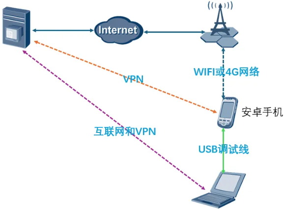
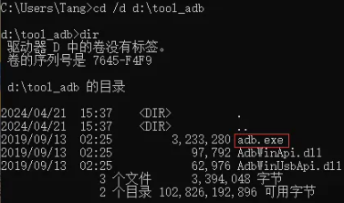
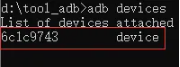
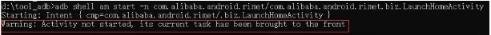
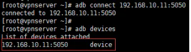
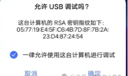
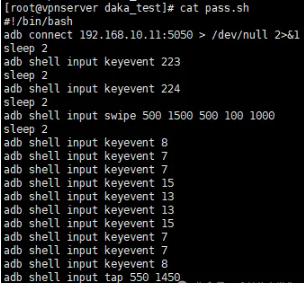
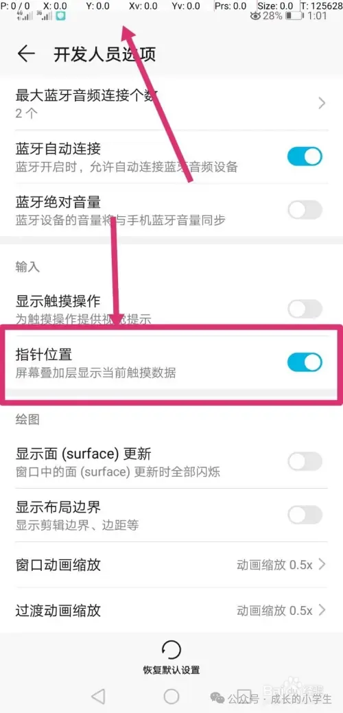
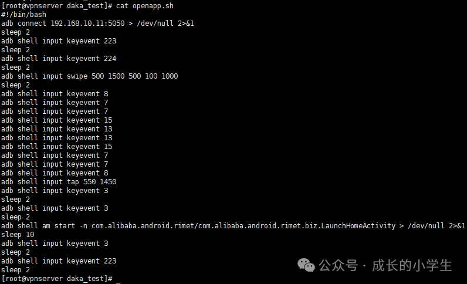

# 在家打卡的方法

## 实现原理：

在控制端设备上运行脚本控制手机运行指定的APP打卡，比如使用钉钉打卡，一般会有“快速打卡”功能，只需要在指定的范围内，重新打开APP就会自动打卡，如果没有开放“快速打卡”功能，也可以点击打卡位置进行打卡。

整个过程所使用的脚本和命令都是系统默认支持的，除需要使用的硬件设备外，代码不需要花费任何费用。

**虚拟定位是个好东西，就是容易被抓。**

## 前提条件：

安卓手机一台：准备一台淘汰的安卓系统的手机，为了安全，可以设置使用密码登录，后面将手机放在指定的打卡地址；手机需要开启远程调试功能；root过的手机会比较方便，这里我以没有root过的手机进行操作。

智能插座一个：智能插座用于给手机充电，可以设置为定时充电，也可以远程访问智能插座手动执行充电操作，更高级一点的，可以根据手机当前电量值设置充电操作，比如当电量低于指定值时进行充电；智能插座大概40左右一个，如果不需要使用手机APP控制的会更便宜。

一台控制终端：控制终端目前采用的是一台云服务器，安装了CentOS7.6操作系统，云服务器用于执行脚本和作为VPN服务器，具体用途在文章中讲解；云服务器最近阿里、腾讯99元就可以使用一年，当然也可以使用其他方法替代，后续再一一介绍。调试过程中，需要有一台电脑使用USB线直连手机进行调试，我的电脑是Win 10。

## 拓扑图：

整个环境网络拓扑结构如下图所示，其中：

(1)公网服务器：配置了一个公网IP地址，可从互联网访问；用于部署VPN服务端和运行打卡脚本；

(2)安卓手机：手机通过WIFI或者4G网络可访问互联网；通过VPN与公网服务器组成内网访问；

(3)笔记本电脑：笔记本电脑可以正常访问互联网，可以通过服务器公网IP地址远程调试服务器，接入VPN后可以使用内网地址访问到安卓手机，另外使用数据线对安卓手机进行调试，无法通过网络访问手机端时方便进行调试。



## 1.部署VPN服务

在公网服务器上部署VPN服务端。

请看文档：《基于Linux内核的VPN工具》

文档中已详细记录了VPN的安装环境、安装步骤、使用方法等。

安卓手机VPN客户端下载地址：

下载链接：

```
https://pan.baidu.com/s/1ieCqMyIzc0z2fCotp_v_ng?pwd=vpnp
```

## 2. 下载adb调试工具

adb调试工具用于对安卓手机进行调试。

### 2.1 笔记本下载adb工具

adb工具的下载链接我已经上传到百度网盘，如果不适用于你的手机，请自行搜索下载。

下载链接：

```
https://pan.baidu.com/s/1IYcUv90gpkud0tpOsSaYxA?pwd=adbp
```

### 2.2 公网服务器下载adb工具

公网服务器需要使用adb命令远程控制手机端，安装步骤如下；

(1)安装扩展YUM源，基础YUM源是没有adb工具包的

```
yum install epel-release
```

(2)安装adb命令

```
yum install adb
```

### 2.3 注意

不管是使用数据线还是远程调试手机，第一次调试时需要在手机上进行授权，手机会自动弹出授权，你需要点击确定，否则无法连接到手机。

## 3. 调试软件

因为我们需要远程控制手机打开钉钉，所以需要先获取手机上关于钉钉的信息。

### 3.1 获取手机上钉钉的名称

步骤1：在笔记本电脑上打开CMD控制台，进入adb工具所在目录，如：



步骤2：使用数据线连接手机，确保手机已开启USB调试，笔记本电脑可以正常查看到连接的手机：

```
adb devices
```



步骤3：在手机上打开钉钉，打开后显示在主页，或者在“消息”页面：


步骤4：获取应用的包名和应用名

```
adb shell "dumpsys window | grep -i mCurrentFocus"
```

记录：

```
com.alibaba.android.rimet/com.alibaba.android.rimet.biz.LaunchHomeActivity
```

### 3.2 测试使用命令找开钉钉

测试时，先将前面打开的页面退出后再测试，使用返回键或者直接返回到手机主页即可，执行命令：

```
adb shell am start -n com.alibaba.android.rimet/com.alibaba.android.rimet.biz.LaunchHomeActivity
```



对于显示信息“Warning: Activity not started, its current task has been brought to the front”可以忽略，因为钉钉在后台处于运行状态，如果再次打开则会有警告信息；

如果后台没有运行就不会有相关提示，但在登录时钉钉需要好几秒钟才会被完全打开，在后面的脚本中，我们会设置延时来保证APP完全正常运行。

注意：此时手机必须处于解锁状态。

当我们可以使用adb命令打开钉钉时，就已经学习到重点了。

## 4. 开启手机远程调试

在第3章时，我们是使用数据线直接连接手机，通过USB接口调试，在使用网络访问手机时需要具备以下条件：

(1)服务器可以访问手机：因为手机已连接VPN，所以与服务器在同一内网之中，可以使用内网IP地址访问；

(2)手机开启远程调试，在笔记本电脑上执行命令：

```
adb tcpip 5050
```


端口5050可以自定义，手机重启后端口需要重新开启，这个问题在后续处理。

## 5. 在服务器上远程访问手机

连接手机，手机的IP地址是192.168.10.11：

```
adb connect 192.168.10.11:5050
```



注意，首次连接时，需要在手机端确认，否则无法连接，提示offline：



测试启动钉钉：

 ```bash
 adb shell am start -n com.alibaba.android.rimet/com.alibaba.android.rimet.biz.LaunchHomeActivity
 ```

执行完命令后，手机端可以正常打开钉钉APP；

当我们可以使用服务器打开手机上的APP时，就可以开始写脚本了，因为后面涉及的命令就比较多了，以上只是整个远程打卡环节的重点。

## 6. 亮屏和密码输入

手机默认情况下肯定是黑屏状态，为了安全我们还设置了密码，我们在使用手机时，一般先把屏幕点亮，然后输入密码，使用完手机后，会顺手将手机黑屏。

### 6.1 亮屏和息屏

使用224代码进行亮屏，223进行熄屏：

```bash
adb shell input keyevent 224
adb shell input keyevent 223
```

使用代码26也可以亮屏，代码26相当于我们手动按开机/关机键：

```bash
adb shell input keyevent 26
```

再执行一次命令则息屏。

命令执行过程中可能会因为网络质量问题，导致命令执行时间过长。

注意，时间间隔太长的话，服务器与手机的连接可能会超时，需要重新连接手机：

```bash
adb connect 192.168.10.11:5050
```

### 6.2 输入密码

密码基本上都是数字，以下是每个数字的代码：


手机上的密码都有很多种，我使用的是自定义模式。更多关于代码的操作，参考：

```
https://blog.csdn.net/tabactivity/article/details/128370108
```

### 6.3 编写脚本

以下通过脚本将手机从黑屏状态切换到手机主页。

vi pass.sh

```
#!/bin/bash
adb connect 192.168.10.11:5050 > /dev/null 2>&1
sleep 2
adb shell input keyevent 223
sleep 2
adb shell input keyevent 224
sleep 2
adb shell input swipe 500 1500 500 100 1000
sleep 2
adb shell input keyevent 8
adb shell input keyevent 7
adb shell input keyevent 7
adb shell input keyevent 15
adb shell input keyevent 13
adb shell input keyevent 13
adb shell input keyevent 15
adb shell input keyevent 7
adb shell input keyevent 7
adb shell input keyevent 8
adb shell input tap 550 1450
```



代码说明：

```bash
adb connect 192.168.10.11:5050 > /dev/null 2>&1    #连接手机
sleep 2
adb shell input keyevent 223    #先息屏，防止手机处于亮屏状态
sleep 2
adb shell input keyevent 224    #亮屏
sleep 2
adb shell input swipe 500 1500 500 100 1000  #滑动屏幕进入密码输入界面
sleep 2
adb shell input keyevent 8  #依次输入手机解锁密码
adb shell input keyevent 7
adb shell input keyevent 7
adb shell input keyevent 15
adb shell input keyevent 13
adb shell input keyevent 13
adb shell input keyevent 15
adb shell input keyevent 7
adb shell input keyevent 7
adb shell input keyevent 8
adb shell input tap 550 1450  #输入密码后需要确认，可能是手机没有root过，只能用点击指定坐标，图片中"完成"所在坐标可以通过550,1450进行点击
```


执行命令后，成功登录手机。

## 7. 坐标位置获取方法

### 7.1 操作方法

前提：手机开启开发者模式；

### 7.2 打开设置

#### 7.2.1 打开开发人员选项


#### 7.2.2 打开指针位置



#### 7.2.3 按住屏幕获取坐标

手指在屏幕滑动的时候，上面的dxdy就会变化。


## 8. 完善脚本

通过以上一系列的操作，下面将需要使用的命令一并写入到脚本之中，完成整个过程。

vi openapp.sh

```bash

#!/bin/bash
adb connect 192.168.10.11:5050 > /dev/null 2>&1
sleep 2
adb shell input keyevent 223
sleep 2
sleep 2
adb shell input swipe 500 1500 500 100 1000
sleep 2
adb shell input keyevent 8
adb shell input keyevent 7
adb shell input keyevent 7
adb shell input keyevent 15
adb shell input keyevent 13
adb shell input keyevent 13
adb shell input keyevent 15
adb shell input keyevent 7
adb shell input keyevent 7
adb shell input keyevent 8
adb shell input tap 550 1450
adb shell input keyevent 3
sleep 2
adb shell input keyevent 3
sleep 2
adb shell am start -n com.alibaba.android.rimet/com.alibaba.android.rimet.biz.LaunchHomeActivity > /dev/null 2>&1
sleep 10
adb shell input keyevent 3
sleep 2
adb shell input keyevent 223
sleep 2
```



参数说明：

```bash
adb connect 192.168.10.11:5050 > /dev/null 2>&1    #连接手机
sleep 2
adb shell input keyevent 223    #先息屏，防止手机处于亮屏状态
sleep 2
adb shell input keyevent 224    #亮屏
sleep 2
adb shell input swipe 500 1500 500 100 1000  #滑动屏幕进入密码输入界面
sleep 2
adb shell input keyevent 8  #依次输入手机解锁密码
adb shell input keyevent 7
adb shell input keyevent 7
adb shell input keyevent 15
adb shell input keyevent 13
adb shell input keyevent 13
adb shell input keyevent 15
adb shell input keyevent 7
adb shell input keyevent 7
adb shell input keyevent 8
adb shell input tap 550 1450
adb shell input keyevent 3  #返回手机主页，防止APP正在桌面运行，一般APP需要重新点击才能完成“快速打卡”操作
sleep 2
adb shell input keyevent 3
sleep 2
#启动钉钉
adb shell am start -n com.alibaba.android.rimet/com.alibaba.android.rimet.biz.LaunchHomeActivity > /dev/null 2>&1
sleep 10    #设置延时，防止APP没有完全打开，造成打卡失败，这里根据实际测试设置时延
adb shell input keyevent 3  #再次返回到手机主页
sleep 2
adb shell input keyevent 223  #息屏
sleep 2
```

执行脚本：

```bash
sh openapp.sh
```

如果钉钉设置了快速打卡，当APP重新打开后，则会自动进行打卡。

## 8. 总结

以上就是实现远程打卡的核心配置了，当然还需要很多功能来保障，比如：

```
(1)怎么保障手机网络不中断，VPN可以正常访问？
(2)怎么智能管理手机电量？
(3)脚本执行后是否完成打卡操作怎么通知给你？还有就是很多APP不能同时在多台手机登录，怎么确定打卡成功？
(4)打开APP如果要求登录，该怎么办？
(5)怎么定时完成打卡操作？
```