# 基于Linux内核的VPN工具

wireguard工具在linux内核5.6版本中已合并，它相对于其他VPN软件来说，使用更加方便，运行速度也更快，支持不同类型的终端设备，重点还可以在手机端上使用。

## 1. 测试环境

我的测试环境使用一台云服务器测试，用于部署WireGuard工具。

操作系统：CentOS7.6；

关闭SELinux服务；

### 1.1 配置阿里源

配置阿里的YUM源：

```bash
wget -O /etc/yum.repos.d/CentOS-Base.repo https://mirrors.aliyun.com/repo/Centos-7.repo
wget -O /etc/yum.repos.d/epel.repo https://mirrors.aliyun.com/repo/epel-7.repo
```

操作前可以先备份一下默认的YUM源文件；

### 1.2 转发配置

（1）服务器端开启转发

vim /etc/sysctl.conf

\#文档末尾添加

```
net.ipv4.ip_forward = 1
net.ipv4.conf.all.proxy_arp = 1
```

将配置内容写入内核：

```
sysctl -p
```

设置IP地址伪装(NAT)：

```
systemctl start firewalld
systemctl enable firewalld
firewall-cmd --zone=public --add-masquerade --permanent
firewall-cmd --reload
```

### 1.3 逻辑拓扑图

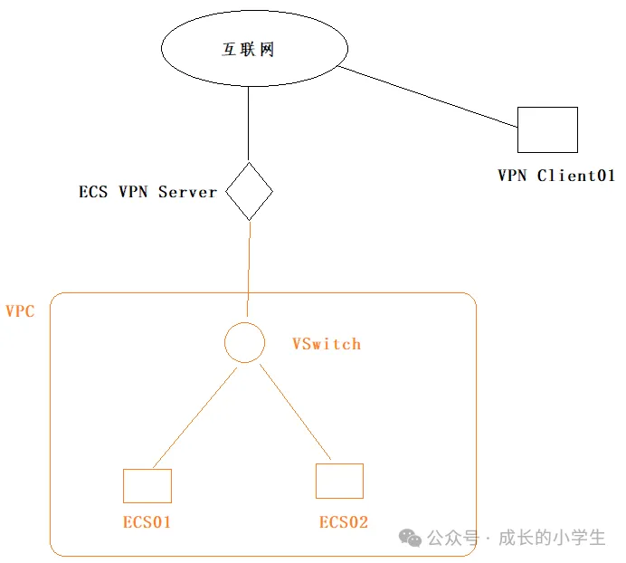

测试目的使所有ECS云服务器可以与VPN Client01通过指定的内网地址相互通信；

## 2. 安装配置WireGuard

### 2.1 安装WireGuard

```bash
yum install elrepo-release
yum install yum-plugin-elrepo
yum install kmod-wireguard wireguard-tools
```

安装完成后需要重启WireGuard服务器，检查WireGuard的安装版本：

```bash
wg --version
```

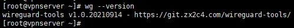

### 2.2 生成公私钥

进入配置文件目录：

```bash
cd /etc/wireguard/
```

创建服务端的公私钥:

```bash
wg genkey | tee privatekey-server | wg pubkey > publickey-server
```

创建客户端端的公私钥:

```bash
wg genkey | tee privatekey-client | wg pubkey > publickey-client
```

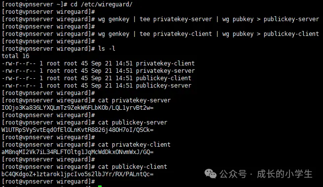

执行完命令后，会在执行命令的当前文件夹自动生成4个文件。

### 2.3 创建配置文件

vim /etc/wireguard/vpnserver.conf

\#增加内容如下

```bash
[Interface]
# Name = vpnserver
Address = 192.168.10.1/24
ListenPort = 51820
PrivateKey = IOOjo3Ka836LYXQLmTz9ZekW6FLbKOb/LQL1yrvBt2w=
[Peer]
# Name = client01
PublicKey = bC4QKdgoZ+1ztarok1jpcIvo5s2lbJYr/RX/PALntQc=
AllowedIPs = 192.168.10.2/32
```

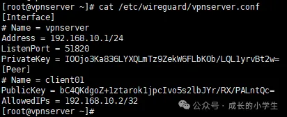

参数说明：

```bash
[Interface]：定义当前节点的配置
# Name：这是 INI 语法中的标准注释，用于展示该配置部分属于哪个节点。
Address：定义当前节点应该对哪个地址范围进行路由。如果是常规的客户端，则将其设置为节点本身的单个 IP（使用 CIDR 指定，例如 192.168.168.10/32）；如果是中继服务器，则将其设置为可路由的子网范围。
例如：
常规客户端，只路由自身的流量：Address = 192.168.100.1/32
中继服务器，可以将流量转发到其他节点（peer）：Address = 192.168.100.0/24
这个地址是用于VPN连接的，不要与服务器的私网IP地址一样。
ListenPort：当前节点是中继服务器时，需要通过该参数指定端口来监听传入 VPN 连接，默认端口号是51820。常规客户端不需要此选项。
注意在系统防火墙和服务器安全组中放行该端口。大部分连不通都是端口原因。
PrivateKey：当前节点的私钥，所有节点（包括中继服务器）都必须设置。不可与其他服务器共用。
[Peer]：定义对等节点（其他节点）的配置。可以有多个。
中继服务器必须将所有的节点（除了自身节点）定义为对等节点（peer）。其他的节点只需定义中继服务器作为对等节点（peer）。
PublicKey：对等节点（peer）的公钥，所有节点（包括中继服务器）都必须设置。
AllowedIPs：如果对等节点（peer）是常规的客户端，则将其设置为节点本身的单个 IP；如果对等节点（peer）是中继服务器，则将其设置为可路由的子网范围。可以指定多个 IP 或子网范围。该字段也可以指定多次。
```

这个地址也是用于VPN连接的，不要与客户端的私网IP地址一样。

### 2.4 启动server节点

语法：*wg-quick up [vpn配置文件中的名称]*

```bash
wg-quick up vpnserver
```

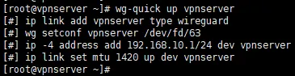

启动后会生成名为vpnserver的网卡：

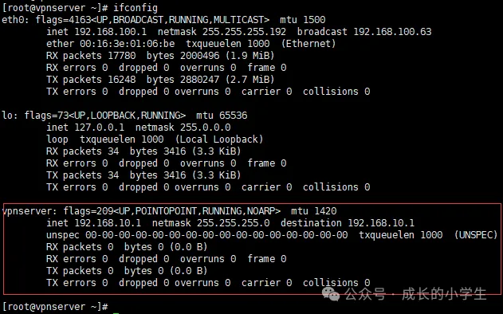

自动生成路由条目：

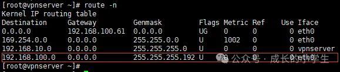

注意，服务启动后，监控的是UDP端口：

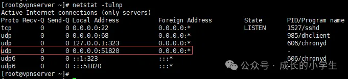

停止服务使用：

```bash
wg-quick down vpnserver
```

### 2.5 配置防火墙

把udp端口51820放通：

```bash
firewall-cmd --zone=public --permanent --add-port=51820/udp
firewall-cmd --reload
```

## **3. 安装客户端**

客户端为Windows 10操作系统，客户端：wireguard-amd64-0.4.11.msi

客户端下载地址：

```bash
https://git.zx2c4.com/wireguard-windows/snapshot/wireguard-windows-0.4.11.zip
```

其他版本下载地址：

```bash
https://git.zx2c4.com/wireguard-windows
```

GitHub地址：

```bash
https://github.com/WireGuard
```

运行后会自动安装：

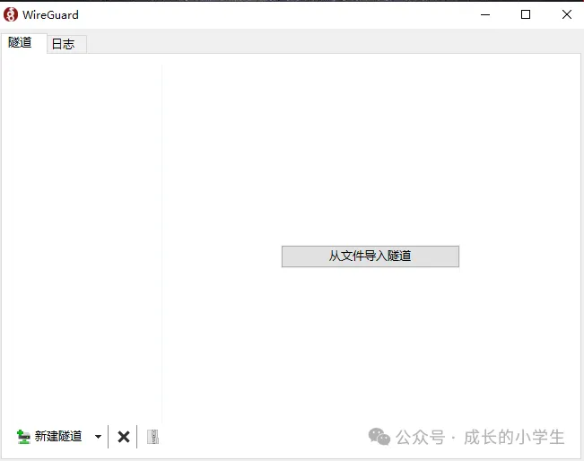

默认安装目录：C:\Program Files\WireGuard

### 3.1 新建空隧道

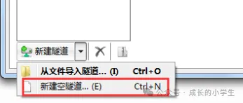

名称填写：client01，然后把以下内容粘贴进入：

```bash
[Interface]
# Name = client01
Address = 192.168.10.2/32
PrivateKey = aM8nqMI2Vk7iL34RLFTOltg1JqMcWdDkxONvmWxJ/GQ=
[Peer]
# Name = vpnserver
PublicKey = W1UTRpSVySvtEqdOfElOLnKvtR8826j48OH7oI/QSCk=
Endpoint = x.x.x.x:51820
AllowedIPs = 192.168.10.0/24,192.168.100.0/24
PersistentKeepalive = 25
```

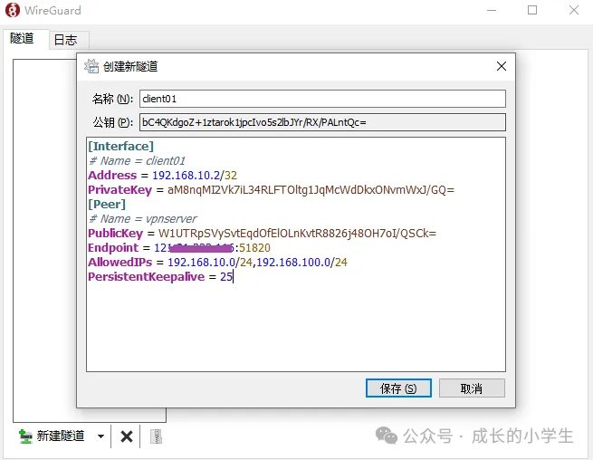

配置说明，跟vpnserver节点配置相比，有以下不同之处：

```bash
[Interface]：Address设置的单一IP，表示当前节点的IP。去掉了ListenPort项（当前节点是中继服务器时才需要）；PrivateKey填写的是client的privatekey文件中的内容。
[Peer]：增加了Endpoint项，该项通常指定中继服务器的公网IP，当然有稳定公网 IP 的节点也可以指定。PublicKey填写的是vpnserver的publickey文件中的内容；PersistentKeepalive = 25表示每隔 25 秒发送一次 ping 来检查并维持连接（如果本节点没有固定的公网IP，必须指定）。
192.168.100.0/24是服务器内网其他客户端的网段，用于在客户端上生成路由条目；
```

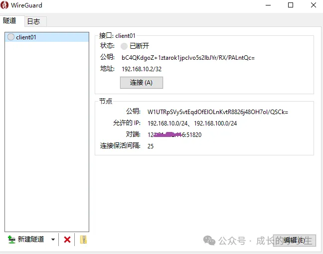

点击连接：

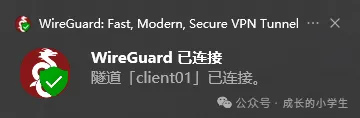

连接成功后会提示已连接：

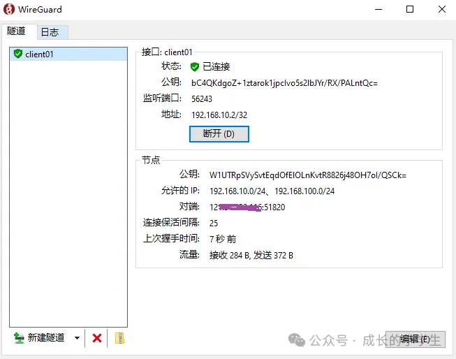

在客户端上查看路由条件，执行命令：

```bash
route print
```


可以看到两组明细路由；

### 3.2 在服务器查看连接状态

在VPN服务器上可以查看到客户端的连接状态：

```bash
wg show vpnserver
```

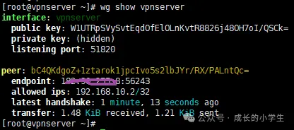

### 3.3 在客户上测试

在客户端上ping服务器VPN端口IP地址：

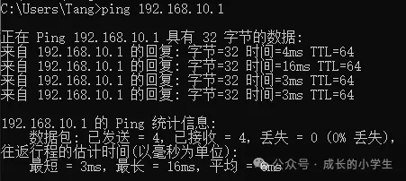

从客户端到服务端访问正常；

ping服务器内部网段IP：

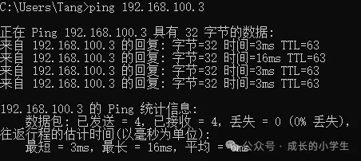

VPN服务器流量转发已经生效，可正常访问。

### 3.4 在服务器端ping

在VPN server上ping客户端：

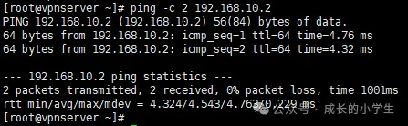

在VPN Server后端的客户端上ping：

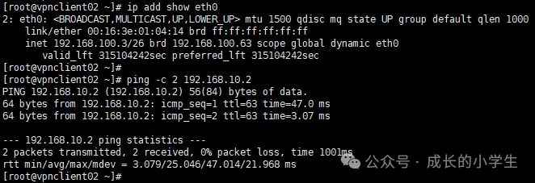

## 4. 将服务设置为后台运行

```bash
systemctl enable wg-quick@vpnserver
systemctl start wg-quick@vpnserver
systemctl status wg-quick@vpnserver
```


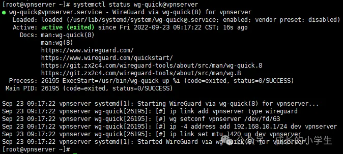