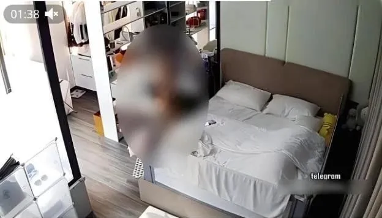
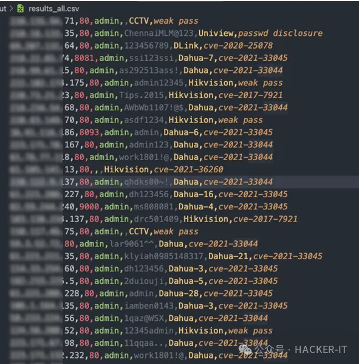

# 检测自家摄像头是否存在漏洞

## 1.摄像头不用了要遮挡，小心被黑客

为什么现在好多人都喜欢把电脑的摄像头遮挡起来，是大家都有什么被迫害妄想症还是什么原因，今天简单的来了解一下。


电脑摄像头作为视频的必要设备，其数据传输与控制也面临一定的安全风险。如果长期将不使用的摄像头直接暴露在外，很容易被黑客利用进行非法监视或攻击。

黑客入侵电脑摄像头进行非法监控的案例时有发生。他们通过检测到暴露的但未被关闭的摄像头，入侵访问其系统获取控制权，在你根本察觉不到任何异样的情况下，打开摄像头实时监视用户甚至进行视频录制，严重侵犯个人隐私与信息安全。


例如，某某下班回到家，卸下了一天的疲惫，褪去了束缚，一个人坐在电脑前看电影，未遮挡的摄像头如果已经被被黑控制，此刻用户的隐私已经泄露无疑。


有人做个一个实验，在电脑正前面贴了一张纸，黑客短短几分钟就入侵了电脑，并利用摄像头拍下一张照片，甚至还可以在你不知情的情况下录制视频。

就连脸书创始人的笔记本摄像头和麦克风都是被遮住的。其实只要时间足够，摄像头是最容易被攻破的。

黑客为什么要入侵摄像头呢，从摄像头除了可以知道你的一举一动，还可能将录制的视频进行出售，或者上传某网站盈利。现在Ai技术如此发达，通过你的视频进行人物换脸，欺骗人脸识别系统。


例如很多网站的认证注册需要上传身份信息或者生物核验，不法分子可以通过你的视频信息进行相关的资料信息合成，进行一些非法行为。

保护自己的摄像头安全是十分重要的，我们可以通过简单地遮盖摄像头来降低电脑摄像头被黑客利用入侵窥视的风险。在长时间不使用电脑的情况下，直接拆除摄像头主体是最为可靠的方案。

## 2.租房、外出住酒店，如何判断房间内有没有隐藏摄像头？

男子玩手机刷短视频竟然刷到了自己的卧室！竟然被偷拍半年，令人不寒而栗。


男子小王周末在家里刷视频的时候，竟然刷到了自己的卧室，他自己和妻子的“一举”和“一动”都被录了下来，经过警方的调查，这个偷拍的人就是小王的同事，而这个针孔摄像头早在半年前就藏进了小王的家里。


针孔摄像头真的很难被发现吗？偷拍的人他的针孔摄像头一定是对着床，厕所或者是浴室。隐藏方式通常是藏在改装的遥控器，插排，电视机指示灯，烟盒，纸巾盒，鞋面，玩具布偶，热水壶底座，花盆绿植，空气清新剂盒，卧室的灯泡内以及藏在空调的通风口，屋顶的烟雾报警器内，墙壁插座内，浴室置物架底盘下面。


寻找探测针孔摄像头方法的脚步从未停止，可是很遗憾的是，除了专业的红外热感仪之外，网络上流传的所有排查方法都不能够准确的揪出那双偷窥你的眼睛。

网络上流传的一些探测摄像头的方法：

第一个，对于红外线摄像头来说，拉上室内窗帘，关闭所有灯光，让房间保持完全黑暗状态，拿出手机打开手机拍照功能绕房间一圈，若发现屏幕上有红点，则很有可能是针孔摄像头。

第二个，对于普通摄像头，可以通过手电筒寻找反光物。


第三个，可以连接到屋里的路由器查看局域网内除了自己网络设备以外的其他可疑设备。

第四个，对于经常外出需要住店的朋友很实用，购买一个红微型红外摄像头，可以连接到手机app使用的，同样需要让室内保持黑暗，让隐藏的针孔摄像头触发光敏开启红外夜视模式，这时用你手里的红外摄像头绕房间转一圈有发白光的地方很有可能就是摄像头！


因为针孔摄像头真的是太小了，隐藏的位置也极其隐蔽，很多方法不可能百分百成功找出隐藏的摄像头，最准确的还是需要红外热成像仪去查，因为偷拍的摄像头，以及为摄像头供电的插头百分之百会发热，电子产品开机发热这个特征没办法改变。


热成像仪这个方法还没有被普及，因为实在是太贵了，普通的也要好几千，最便宜的也要1000多。

## 3.警惕!你的家用摄像头可能已被黑客入侵

警惕!你的家用摄像头可能已被黑客入侵。

随着智能家居时代的来临，各种家用摄像头正在进入千家万户。然而很多消费者忽视了家用摄像头的安全隐患。其实，看似安全的摄像头，很可能已经被不法分子入侵。


几年前就曾曝光过非法团伙，他们仅用半小时就利用软件破解了成千上万户家庭的摄像头密码。原因在于许多用户懒得更改出厂默认密码，使用简单易猜的密码如“123”“abc”。这为犯罪分子提供了可乘之机。他们利用大数据分析穷举法，很快就能破解普通密码。


更恐怖的是，即使你设置了复杂密码，摄像头也难逃入侵的命运。2021年曝光的硅谷安防公司数据库被入侵事件中，包括特斯拉工厂在内的15万个摄像头被黑客直接控制。


事实证明，家用摄像头连接到互联网后，就存在被入侵利用的风险。那么如何防范家用摄像头的安全隐患?这里给大家几点建议:

1. 选择大品牌，安防和隐私意识强的产品。网上监控摄像头品牌五花八门，家用的摄像头价位从几十块到几百块也是选的眼花缭乱，尽量避免购买价格便宜且不知名品牌的产品。

2. 安装后立即修改默认密码，并定期更新复杂密码。有些价格低廉的视像头出场设定就没有修改默认密码的功能，甚至密码简单到只是abc123。如果被黑客扫到弱密码，简直就是白送人头。

3. 

4. 注意摄像头安装位置，避开私密区域（例如：卧室，更衣室，洗手间等隐私场所），很多家庭为了记录宝宝日常，在卧室和客厅安装了云台摄像头。这也增大了个人隐私泄露的概率。

5. 

6. 加强安防意识，时刻注意摄像头角度是否异常。如果发现摄像头角度发生改变，要及时和家里人确认是否有操作过摄像头，避免被黑客直播个人生活。

   

只要我们提高警惕，注重网络安全素养，就能有效保护家庭免受不法分子利用。让我们共同为构建一个安全的联网环境贡献力量。

### 黑掉一个摄像头只要3步！看着家里的摄像头，我陷入了沉思…

如今，许多人出于“看家”的目的，选择在家里安装可旋转的云台网络摄像头。然而，这些摄像头可能会成为他人窥探我们隐私的“眼睛”，想到这，不禁让人背后冒出一身冷汗！



实际上，现在家庭摄像头被入侵的技术门槛已经相当低，大多数入侵行为并非由黑客实施，而是一些为了售卖摄像头利益的人在背后捣鬼。如今，网络上售卖家庭摄像头已经形成了一条完整的产业链。


目前，通过漏洞入侵摄像头的事件报道相对较少，而通过弱密码入侵摄像头的事件却时有发生。许多用户购买摄像头后并未修改默认密码，例如“abc123”“12345”“admin”“888888”等。甚至，一些所谓的硬币大小的摄像头根本没有设置密码的功能。


在这条摄像头利益链条背后，存在着庞大的组织和分工。现在，国内外都有公司搭建了**全球网络设备搜索平台**，只要是联网设备，在互联网上都可以搜索到。有人专门负责在**公网寻找可入侵的弱密码**单个设备 IP 段。

如果成功登录一个弱密码摄像头，他们会对该 IP 段进行**批量扫描探测**弱密码。通过这种方法扫描到大量弱密码设备后，他们会进行分类整理，然后由全国各地的线上线下代理进行售卖。

有网友做了一个实验，在海康录像机下连接了13台摄像头，品牌包括海康威视、TP-link、天视通和onvif协议摄像头，并将PC电脑与录像机连接到路由器上。


在PC端打开一款免费的远程登录监控摄像头的工具。正常需要输入 IP 地址、端口号、用户名和密码才能远程登录并显示画面。然而，这款软件在未输入任何设备信息的情况下，自动搜索并显示出了局域网内的天视通和 onvif协议的所有监控设备画面。


那么当家里的wifi被邻居连接后，在邻居的电脑上安装了这款软件，同样也可以搜索并查看到你局域网内的部分摄像头画面。

### 家用摄像头有多危险？可能你正在被直播！

如今，监控摄像头已走入千家万户，你的安全感是它给的，你的隐私安全泄露也是它给的。


数据显示，目前消费级监控摄像头的市场规模庞大，而智能摄像头更是无处不在。但许多人对其安全性认识不足，甚至对可能购买到不安全摄像头的概率浑然不觉。早在 2017 年，国家质检总局就曾发布摄像头质量安全风险警示，在抽检的40批样品中，竟有32批次存在质量安全隐患，问题产品比例高达80%。


不仅如此，家用摄像头背后还隐藏着一条黑色产业链。有人专门破解摄像头，有人贩卖控制权限，甚至还有人教授劫持摄像头的方法。而我们日常购买的廉价或二手摄像头，很可能就是缺乏安全防护的“三无产品”。这些摄像头极易被入侵，所拍摄的内容也毫无加密可言，就如同在家里进行“现场直播”。

此外，一些摄像头会配备云平台功能，原本是为了方便用户查看监控，但实际上云平台是一个危险的公共空间。管理员拥有特殊权限，可以无阻碍地查看所有摄像头，而同平台的其他用户也可能通过注册账号观看你的监控视频。如果是小厂家生产的不正规产品，风险系数更高。


更令人担忧的是，你的监控视频可能会被“二次加工”。经过恶意剪辑、拼接、换脸等操作后，这些视频可能会被卖到黄色网站，成为引流工具。甚至根据摄像头的位置、角度以及主人的外貌等因素，被划分成不同等级进行售卖。


为了避免这些风险，在选购和使用监控摄像头时，需要注意坚决不购买廉价、三无或无法修改密码的摄像头，应选择正规厂家生产的产品，并仔细查看相关资质信息、出厂日期、防伪标志、3C 认证等。其次，密码设置要尽量复杂，如采用数字+大小写字母+特殊符号的组合。最后，要定期检查摄像头的角度，确保不会拍到私密空间。

我们在使用监控摄像头时，必须增强安全防范意识，才能保护好自己的隐私和安全。希望大家能够将这篇文章分享出去，让更多人意识到危险。

## 4.电脑的摄像头有必要遮住吗?

为什么要遮住电脑的摄像头，当然是不怕一万就怕万一，毕竟世上没有绝对的万无一失，绝对的安全。

黑客可以通过黑🈲摄像头来监视另外一个人，还能关掉摄像头的指示灯，在你神不知鬼不觉的情况下，你的情况就已经被黑客掌握的一清二楚。


有些机智过人的小伙伴卸载了视频驱动，认为这样子就不会被监控了，其实黑客是可以远程进行驱动安装的，所以卸载视频驱动是没有任何卵用的。

网传就连ins和Facebook都可以通过手机麦克风收录你的声音，用摄像头来捕捉你的动态。


一个真实的案例：李先生一天发现自己的摄像头指示灯频繁闪烁,怀疑被入侵。很快，他就在一个隐秘论坛上发现自己的更衣视频被贴出。后经调查，李先生电脑中一个破解版软件包含了远控木马，使黑客可以随时操控其电脑摄像头。

其实电脑摄像头是最容易被攻破的，平时遮住摄像头可以很大概率保护你的个人隐私。


针对摄像头安全，一位网络安全专家也给出过专业建议——使用独立的遮挡装置，而不是贴纸，以防光线穿透。购买专用摄像头盖板是一个不错的选择。
摄像头监控严重侵犯隐私，可能造成严重后果。除了遮挡镜头，也要注意不乱下载应用，避免中木马；使用杀毒软件定期扫描等。用户也应提高信息安全意识，保护好个人隐私。同时监管部门需要加强对这类隐私泄露的打击力度。


入侵他人计算机监控他人这种行为违反了《中华人民共和国刑法》中的“非法侵入计算机信息系统罪”和“侵犯公民个人信息罪”。

非法远程控制他人计算机摄像头，属于“非法侵入计算机信息系统”，会被判处3年以下有期徒刑或者拘役。

通过此种方式获取、复制、出售他人图像、视频等个人信息，触犯“侵犯公民个人信息罪”，最高可被判处7年有期徒刑。

如果相关行为导致严重后果，比如严重侵害公民或组织的合法权益，则刑期可以加重至7年以上有期徒刑。

除刑事责任外，行为人还将承担相应的民事责任，可能包含公开道歉、消除影响、赔偿损失等内容。

## 5.黑进一个摄像头原来这么简单！看着家里监控陷入了沉思！

我们家里安装的智能摄像头，很有可能已经成为别人偷窥我们隐私的眼睛！

之前看到过一个视频，帽子叔叔抓获了一批售卖别人隐私视频的犯罪嫌疑人。

查获该犯罪嫌疑人非法控制她人监控摄像头5万多个，这个数量听起来还是很炸裂的，吓的我赶紧把我家的监控摄像头从头到尾都改了一遍密码。


现在大多数人为了方便看家，看孩子，看保姆，看宠物，看父母，都在家里的客厅，卧室安装了监控摄像头，但是万万没想到的是这将成为别人偷窥牟利的工具。

历史曝光的摄像头泄露时间中，大量摄像头存在弱密码想象，不法分子同构各种扫描脚本，扫台工具找到这些ip后，就可以轻松查看，远程操纵，甚至录制视频进行售卖。


有没有很纳闷？很好奇？他们是怎么入侵我们的摄像头的呢？

首先选定老版本的网络摄像头，再找到一个网络设备搜索平台，搜索到指定品牌的所有网络摄像头ip地址，选择一个IP地址进入到该设备的web管理登录界面，尝试弱口令账号和密码。


例如账号admin密码12345等，登录成功后下载指定插件就可以查看监控画面，操作摄像头云台旋转，录制视频等。上述方法证明可行之后，通过扫描脚本对该版本摄像头进行批量扫描，进行弱密码爆破。


为了防止摄像头被非法入侵，我们购买摄像头一定要选择大品牌，正规途径购买，修改设备初始密码，切勿使用12345\abc123之类的弱密码，如果可以修改账号，也要修改默认账号，可以提高密码爆破的难度。


如果设备提示可升级，要将设备升级到最新版本，避免老版本存在漏洞，被不法分子远程登录。摄像头不要安装在卧室，浴室等个人隐私区域。

如果不需要远程查看摄像头的话，可以只在局域网内使用，避免来自网络的危险。

## 最可怕的搜索引擎，可以搜索到你的摄像头！

如果有一个搜索引擎能够窥探到你家中的摄像头，你会不会感到毛骨悚然？实际上，这样的工具确实存在，它名为Shodan，被人们称为最“吓人”的搜索引擎。


在这个充满神秘与科幻的数字世界中，Shodan 仿佛是一个拥有超凡能力的“黑暗之眼”，能够穿越时空的壁垒，探寻着网络中的每一个角落。它的存在让人们不禁心生恐惧，担心自己的隐私在不知不觉中被暴露无遗。


当你轻轻敲击键盘，输入那个神秘的关键词“webcam”时，仿佛打开了一扇通向另一个世界的大门。无数的监控画面在你眼前展开，它们来自于世界的各个角落，透过这些画面，你似乎能够窥见他人的生活，仿佛置身于一个无尽的监控网络之中。

Shodan 可不是一般的搜索引擎，它能搜索全球所有接入互联网的设备，什么电脑、手机、打印机、网络电视、智能空调、冰箱、语音智能窗帘等等，统统不放过。想象一下，你家里的那些智能设备，说不定都在被这个“怪物”偷偷观察着呢！

Shodan 的发展历史可以追溯到 2009 年，当时它还是由约翰·马瑟利（John Matherly）创建的一个小玩意。不过，随着时间的推移，Shodan 变得越来越强大，现在已经成为了网络世界的“大魔王”。


那么，怎么才能不让 Shodan 搜到自己的设备呢？这里有几个小建议：

1.给设备换个“马甲”：许多设备都有默认的用户名和密码，这可不行，得赶紧改。不然，黑客们可就轻而易举地入侵啦！

2.关掉不必要的“服务”：如果有些服务你用不到，那就关掉吧。这样可以减少被攻击的风险，让你的设备更安全。


3.给设备打个“补丁”：设备的制造商会定期发布更新，这些更新通常都是为了修复已知的漏洞。所以，定期更新设备的软件和固件非常重要哦！

4.装个“防火墙”：防火墙就像是一道门，可以阻止那些未经授权的访问，保护你的设备不被“外敌”入侵。

5.用个“VPN”：VPN 就像是给你的网络连接加了一层密码，这样可以保护你的设备，让你更放心。

要保护自己的设备和网络安全，就得采取一些必要措施。


## 6.针孔摄像头，到底有多清晰

手机摄像头，电脑台式机摄像头，家庭安防监控摄像头，道路交通摄像头这些都是比较容易见到的摄像头，都是大个头的摄像头没什么可介绍的，下面介绍介绍针孔摄像头。


针孔摄像头，到底有多清晰，4k画质清晰度能达到电影级别，而且还能录制声音人脸识别，你能现象到的功能他都可以有。


针孔摄像头的大小你可能猜不到，仅仅只有米粒一般大小，包括针孔摄像头镜头、信号发射器、信号接收器和电池等，但也有部分品种是发射器内置到摄像头里面的一台完整的针孔摄像头设备体积只有一枚硬币差不多大小，可以放在任何你想不到地方。

针孔摄像头最初的作用是办案取证和记者安暗访使用。如今针孔摄像头却频频出现在酒店，被称为偷拍神器。为什么会有人在酒店安装针孔摄像头呢，主要还是拍摄成本低，素材能容丰富，背后有十分完善的产业链。


酒店容易被偷偷安装针孔摄像头的位置也是很多，可以说是防不胜防，屋顶的报警器，床上的氛围灯，吊灯，挂钟，音响，空调的出风口，插座的螺丝帽，卫生间的镜子，电视遥控器，饮水机，电扇，路由器，电视机顶盒等指示灯改装，玩具玩偶，打火机花瓶等进行伪装。这些伪装位置都很不错，基本都对着床和卫生间，如果被拍摄到可定是多机位同步，画面不会太单一。


入驻酒店时我们如何快速找出这些隐藏的摄像头呢，进屋第一件事就是关门拉上窗帘，让屋内保持黑暗，打开手机手电筒寻找异常的反光点。或者使用专业的热成像仪进行扫描检测。毕竟只要是正常工作的电子设备都会发热，只要有热源，就会被检测到。

很多小伙伴会提出的问题：

**1、为什么不限制购买？**

其实已经限制了，普通渠道根本没法买到。

**2、为什么不限制生产？**

在某些案情侦办的时候或者调查记者暗访的时候，是需要这样的特殊设备的。设备本身是无罪的，用这个设备作恶的人才是有罪的。

## 7.酒店客房查找隐藏针孔摄像头

在针孔摄像头的监控下，你的一举一动都在被围观记录，甚至是被直播，有可能还是多机位多角度。

以前的针孔摄像开启夜视功能，需要红外灯辅助夜晚才可以录制清晰，但是带红外的针孔摄像头有一个致命的缺点就是摄像头会发光，很容易就会被发现。


因为背后是有一条完整的产业链，所以升级出了可以不发光的针孔摄像头，晚上红外功能启动了，也不会发光不被轻易发现。例如现在家用摄像头有的小伙伴会使用940红外补光灯增强夜视效果，肉眼不可见光。所以之前网上教大家的入驻酒店一件事拉窗帘，关灯，用手机相机去看哪里有小红点，保证不出意外啥也找不到。


隐藏在酒店手机充电器上的针孔摄像头

介绍一些网上说的比较有用的方法可以试一试

用强光手电去照射你认为可能是针孔摄像头的地方，因为摄像头镜片因反光度高，会形成明显的亮点。

具体寻找摄像头可以隐藏的位置，结合一些特定条件，针孔摄像头需要供电，虽然电池但不可能三天两头去更换电池，那有电源的地方也就是最需要重点关注的地方。


例如正对着床的位置有电视机，但是改装电视机比麻烦，基本都是会安装到电视下方的插座里，或者旁边改装的机顶盒和路由器。空调的出风口，排水管，烟感器，吊灯底座，卫生间的镜子，置物架螺丝灯位置以及正对着马桶的位置。


寻找隐藏额针孔摄像头主要还是遵循两大原则，第一就是有电的地方，第二就是可以看清床的位置。只要遵循这两点可以解决掉很大的麻烦。

热成像是一个不错的探测针孔摄像头的工具，但是价格着实贵的一批，只要电子产品在工作就会发热，热成像就可以检测到热源。没有几个小伙伴舍得入手这么贵的设备了。

如果入驻前就找到了针孔摄像头，那就需要先报警了，如果事后才发现针孔摄像头，你如果不好意思的话，可以先拔出sd卡清除里的内容，然后在报警。


建议大家入住酒店时穿着也不要太随意，不要拎着松花蛋满屋乱窜。

## 9.中国“天网”工程有多厉害？

你是否在日常生活听说过“天网”系统？知道它的威力有多大吗？

什么是天网系统，就是利用布置在大街小巷各处的监控摄像头组成的巨大监控网络系统，这些监控摄像头分布在全国各个重要的交通位置上，而且每一台都具有人脸识别功能。


这些监控不仅可以实现24小时监控，而且还能在一秒钟内识别出逃犯并进行警报，逃犯所在位置的当地帽子叔叔就会迅速处境抓捕犯罪分子。

通过该系统在短时间内就可以抓住了大量已经被通缉了几个月甚至几年的在逃人员，人民生命财产安全得到了巨大的保障。


这些监控摄像头主要分为两大类，第一大类就是专门进行交通违法抓拍，第二大类就是治安管理和违法打击，也就是天网系统。

我国目前已经建成全世界最大的视频监控网，视频镜头超过2000万，其中北上广深等大城市已经形成无死角覆盖，让不法分子无处遁形。

到2020年全国基本实现了全域覆盖、全网共享、全时可用、全程可控的公共安全视频监控建设联网应用。


全网共享意味着天网系统将成为一个整体，所有的数据都将整合到一个数据库内使用。

“天网”系统可以对人的行踪进行实时监控，只要你在中国境内任何地方，一切都在掌控之中。你经常去什么地方，这几天的行程轨迹都可以被查的一清二楚。


现在的监控摄像头都非常的智能，在安装了识别辨认系统过后，可以精准的识别交通工具，车牌号，人脸信息，监控中出现的每张脸都能对应到身份证，通过回溯这个人的行动轨迹，把人与交通工具进行匹配，可以计算出与其经常接触的人群。


当有人进入监控摄像头的范围内时，这个人的上面标注着年龄、性别、服装颜色等详细信息。


## 10.Ingram扫描摄像头漏洞

如今很多家庭不仅在室外安装了监控摄像头，而且不少小伙伴在室内的客厅和卧室也安装了监控摄像头，来进行远程看管孩子和独居老人。

只要连接到网络的设备就存在被攻击的可能性，避免不了摄像头存在的各种漏洞。


虽然有些小伙伴很有安全意识，知道修改初始密码，或者使用复杂的密码，一旦摄像头本身存在远程攻击漏洞，黑客将不需要密码就可以直接登录你的摄像头。



网络上的摄像头黑产如今依旧比较猖獗，弱密码破解，摄像头漏洞等以各种方式侵入我们的生活。

所以从现在开始我们要掌握一项必备的技能，检测自家摄像头是否存在高危漏洞。

### Ingram扫描摄像头漏洞

这期教程用到的是一款开源工具“**Ingram扫描摄像头漏洞** ”，在github上可以搜索到，在Linux或Mac系统使用，确保安装了3.8及以上版本的Python，尽量不要使用3.11，因为对许多包的兼容不是很好。

Ingram主要针对网络摄像头的漏洞扫描框架，目前已集成海康、大华、宇视、dlink等常见设备。  

### 第一步：克隆仓库安装工具包:

```bash
git clone https://github.com/jorhelp/Ingram.git
```

### 第二步：进入项目目录，创建一个虚拟环境，并激活该环境：

- cd Ingram
- pip3 install virtualenv
- 切换root账号 Sudo su root
- python3 -m virtualenv venv
- 激活虚拟环境：source venv/bin/activate


### 第三步：安装依赖

```bash
pip3 install -r requirements.txt
```


至此安装完毕！由于是在虚拟环境中配置，所以，每次运行之前，请先激活虚拟环境：ource venv/bin/activate

### 怎么运行

创建一个target.txt文件

Touch target.txt


编辑输入需要扫描的设备IP地址 Vim target.txt  


里面保存着你要扫描的 IP 地址，每行一个目标，具体格式如下：

 

启动扫描，并指定端口例如80，8000等端口 

python3 run_ingram.py -i target.txt -o ingram -p 80 8000  

-i指定目标文件txt文档

-o 指定输出文件夹

-p 指定扫描端口


在我输入的11个摄像头IP地址里面扫描结果显示只有一个漏洞，居然是CVE-2021-36260的远程高危漏洞。


 results.csv 里保存了完整的结果, 格式为: ip,端口,设备类型,用户名,密码,漏洞条目


到这里我们已经知道了哪个摄像头存在漏洞了，我们就要去对应品牌的官网去找客服获取相对应的固件进行升级即可。