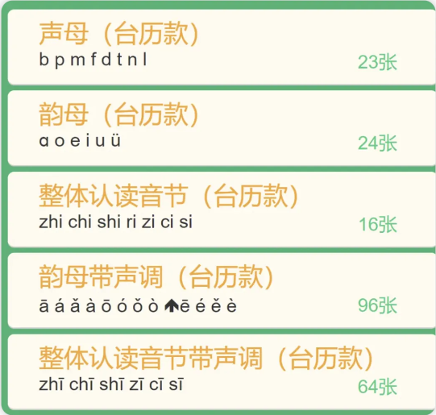

# 浏览器插件—ModHeader_助你绕过微信授权登录限制

插件名：【ModHeader】

下载方法：浏览器商店内搜索插件名字即可安装

——————————————————————————————

“请使用微信客户端访问？我绕了！”


web访问页面，显示 "请使用微信客户端访问" 无非就两种检验

需要使用微信进行授权登录，这种无法自动绕过

不需要微信进行授权登录，但是微信有检验ua头，导致无法访问

直接访问

http://www.xxxx.cn

显示"请使用微信客户端访问"


## 1、不需要进行登录绕过

只需要使用我推荐的插件持续修改ua头即可


浏览器插件配置

```
User-Agent: Mozilla/5.0 (Windows NT 10.0; Win64; x64) AppleWebKit/537.36 (KHTML, like Gecko) Chrome/107.0.0.0 Safari/537.36 NetType/WIFI MicroMessenger/7.0.20.1781(0x6700143B) WindowsWechat(0x6309071d) XWEB/8461 Flue

Accept: text/html,application/xhtml+xml,application/xml;q=0.9,image/avif,image/webp,image/apng,*/*;q=0.8,application/signed-exchange;v=b3;q=0.9

Accept-Encoding: gzip, deflate

Accept-Language: zh-CN,zh;q=0.9
```

## 2、需要登录

这种不仅会检验ua，也会检验cookie，所以单单的修改ua是无法绕过的，需要设置cookie才可以绕过！


### a. 将url发送到微信


### b. 使用burp抓到微信的数据包

等到网页成功进入后在刷新进行抓包



### c. 刷新进行使用burp进行抓包，并且复制其cookie


将得到的cookie设置到刚刚那个插件中，即可成功访问


浏览器插件配置

```
  User-Agent: Mozilla/5.0 (Windows NT 10.0; Win64; x64) AppleWebKit/537.36 (KHTML, like Gecko) Chrome/107.0.0.0 Safari/537.36 NetType/WIFI MicroMessenger/7.0.20.1781(0x6700143B) WindowsWechat(0x6309071d) XWEB/8461 Flue
  
  Accept: text/html,application/xhtml+xml,application/xml;q=0.9,image/avif,image/webp,image/apng,*/*;q=0.8,application/signed-exchange;v=b3;q=0.9
  
  Accept-Encoding: gzip, deflate
  
  Accept-Language: zh-CN,zh;q=0.9
  
  Cookie: JSESSIONID=744C7402E92D00D0568380639446C265
```

