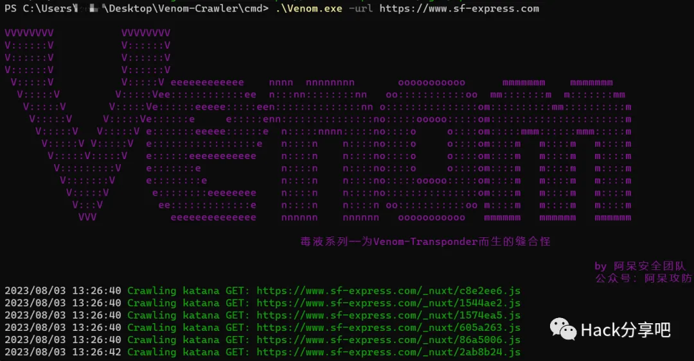
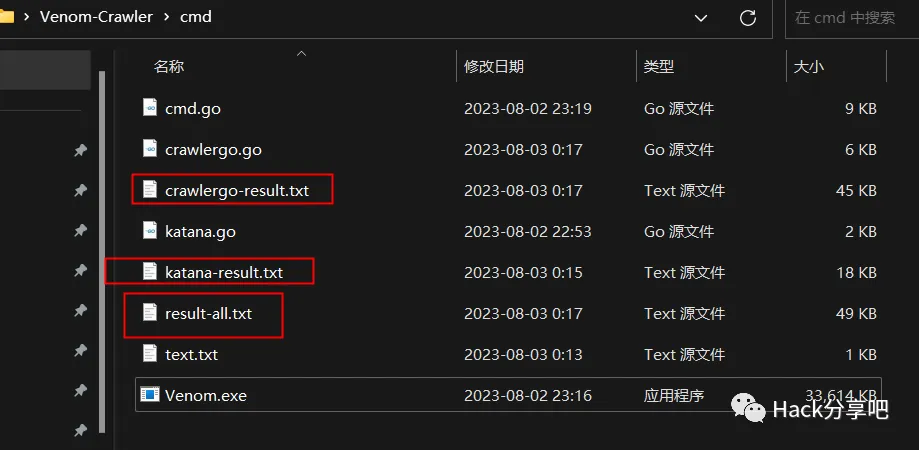
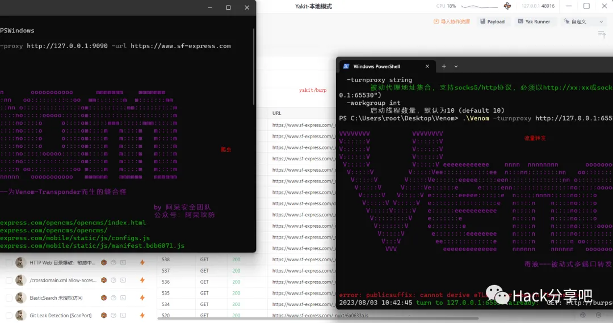
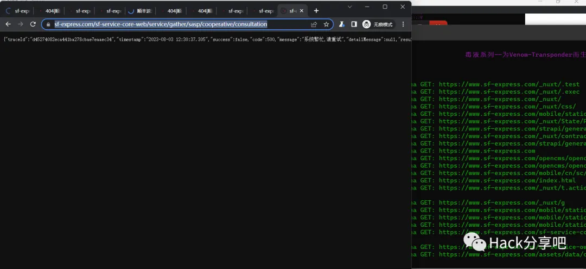
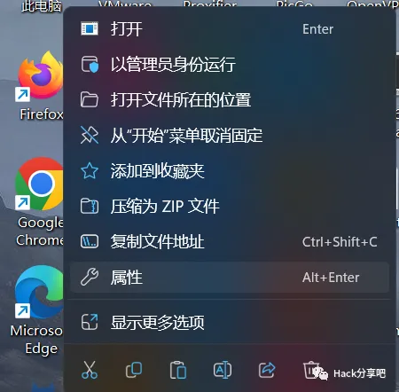
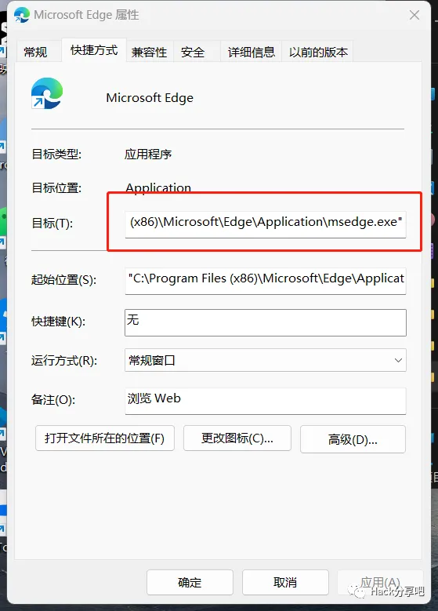

# Venom-Crawler转为捡洞而生的爬虫神器

**工具介绍**

毒液爬行器Venom-Crawle：为Venom-Transponder专为捡洞而生的一个爬虫神器。

**安装依赖：**

```
go mod tidy # go mod依赖加载cd cmdgo build . #然后把cmd.exe重命名一下就好
```


**使用说明**

**不再加入Gospider原因：**

感觉Katana+Crawlergo的爬行结果以及足够完整，再加入Gospider可能会造成时间的大量决策，个人比较倾向于基于Chromium的爬行结果，参数可靠。


**功能介绍：**

- 为了使爬虫爬行的URL问题完整，所以使用Katana+Crawlergo的方法结合获取所有符合的URL，思路是：先由katana爬行，将爬行的结果最终挖掘Crawlergo再进行二次爬取，左侧脚踩右脚旋转升天。
- 如果配置-proxy将流量代理给海绵环境监听的端口（比如：Venom-Transponder、Xray、w13scan等）
- 这里防止为了爬偏，爬行规则就是输入的URL路径，不会爬行其他域名以及子域名
- Katana和Crawlergo的结果都会单独保存在txt中，并且result-all.txt是去重后的最终结果

```
 -headless   是否让爬行时候headless结果可见 
 -chromium   如果在代码执行过程中报查询不到环境中的浏览器， 将Chrome或者Chromium路径填入即可 
 -headers    爬行要求带入的JSON字符串格式的自定义请求头，默认只有UA 
 -maxCrawler URL启动的任务最大的爬行个数,这个针对Crawlergo配置 
 -mode       爬行模式，simple/smart/strict,默认smart,如果simple模式katana不爬取JS解析的路径 
 -proxy      配置代理地址，支持扫描器、流量转发器、Burp、yakit等 
 -blackKey   黑名单关键词，用于避免被爬虫执行危险操作，用,分割，如：logout,delete,update 
 -url        执行爬行的单个URL 
 -urlTxtPath 如果需求是批量爬行URL，那需要将URL写入txt，然后放txt路径 
 -encodeUrlWithCharset  是否对URL进行编码，Crwalergo的功能但katana跑完的结果走Crawlergo后也会被编码 
 -depth      爬行深度，默认3
```


**不联动其他工具：**

```
.\Venom.exe -urlTxtPath .\text.txt.\Vebom.exe -url    https://www.sf-express.com
```






**联动其他工具：**

```
.\Venom.exe -urlTxtPath .\text.txt -proxy http://127.0.0.1:9090.\Vebom.exe -url  https://www.sf-express.com -proxy http://127.0.0.1:9090
```




上图的使用思路将，爬虫爬取的URL通过代理转发器给流量转发器，再由流量转发器转发器给代理工具/漏扫。


如果想在爬取过程中查看爬行效果的话，可以在命令后面带上-headless就会启动浏览器界面。




这还不开启捡洞模式？？？


**注意事项**

浏览器上下文创建错误：exec: "google-chrome": executable file not found in %path%：

浏览说明设备没有安装或者%path%环境里面没有chromium的地址（用edge/chrome/chromium都可以解决）。





这里搭配-chromium参数即可。

**下载地址**：**https://github.com/z-bool/Venom-Crawler**
