# APK逆向工具

## APK渗透之反编译神器Gadx-Gui

> 在前篇文章中我们讲到了常见的APK反编译工具。各自都有自身的优势和缺点。本文作者为大家推荐一款个人认为算是比较完美的反编译工具`gadx-gui`

### 关于

`jadx`是个人比较喜欢的一款反编译利器，同时支持命令行和图形界面，能以最简便的方式完成apk的反编译操作。

**项目地址**：https://github.com/skylot/jadx

下载项目后，双击`jadx-gui`就可以打开图形界面。

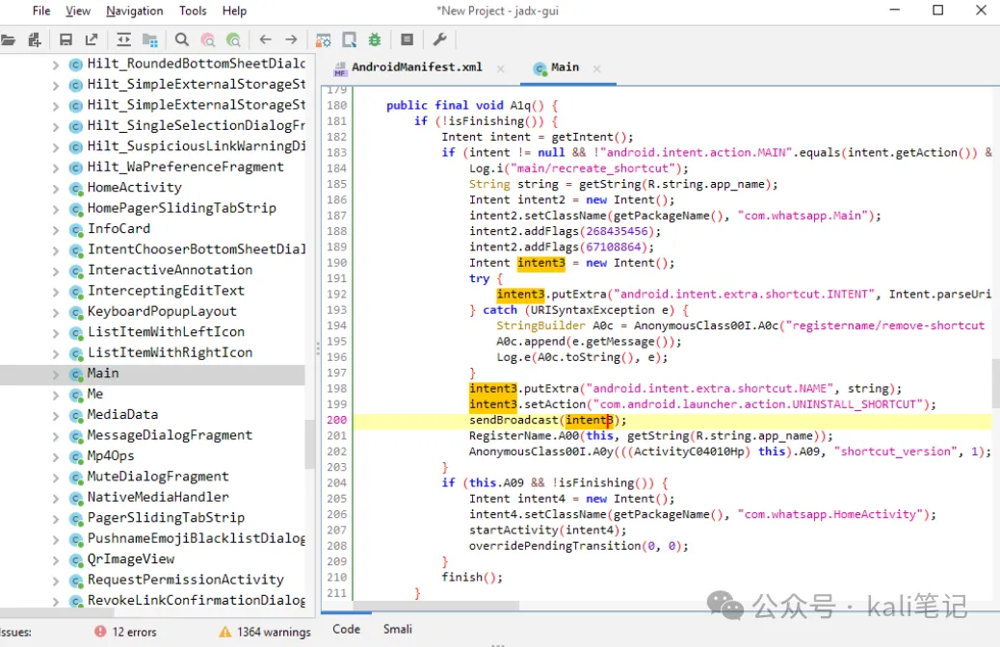**在kali中安装**

在最新版的kali中已经默认安装，我们只需要执行下面的命令即可。

```
git clone https://github.com/skylot/jadx.git
cd jadx
./gradlew dist
```

如果不能正常安装，将kali更新到最新版即可。

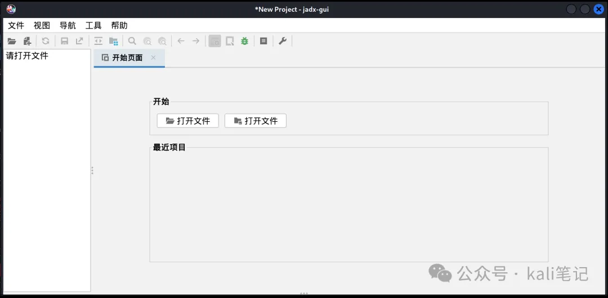运行效果如下

### 反编译app

工具支持`apk`、`dex`、`jar`、`aar`等格式的文件，可以通用File - Open file选择文件或者直接将文件拖进窗口中，可以算得上一键反编译了，非常简单易用，

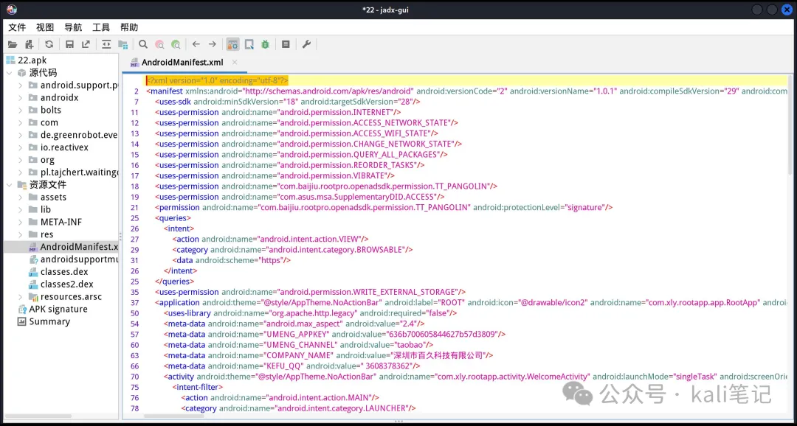关键词搜索，我们想查找app中隐藏的以下关键词如`password`

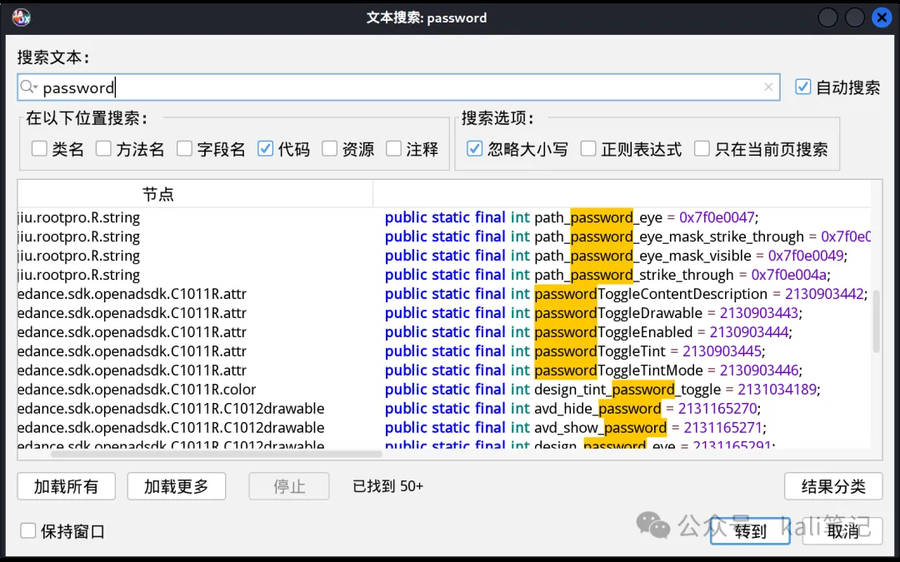

**利用ADB调试**

此款工具的强大之处在于可以配合adb进行调试。

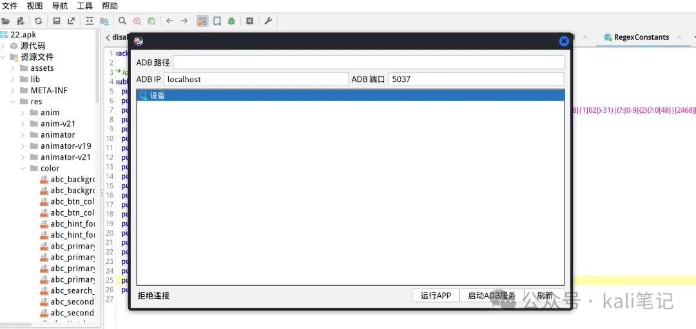**jar反编译**

我们可以利用此工具，可以对Java程序进行反编译。

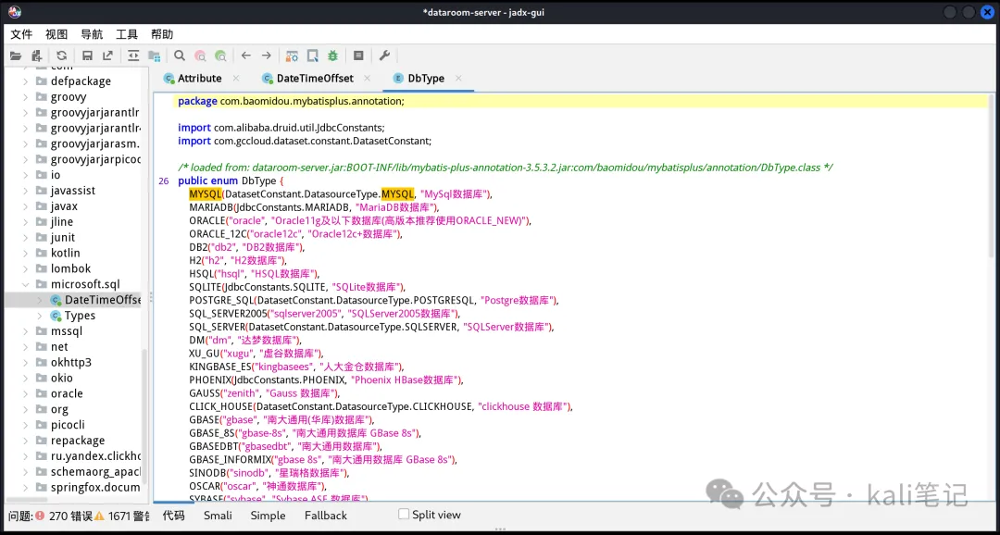

### 总结

`gadx-gui`是一款很便捷的反编译工具，比`dex2jar` `jd-gui`组合，更省心。但是当文件比较大时，需要耐心的等待。

# APK渗透测试之工具篇

> 在渗透测试中，对APP的渗透测试也越来越多。通过对APP测试，我们可以发现app中存在的IP地址等信息，运气好的话，可以得到相关的账号和密码。但是工欲善其事，必先利其器。本文我们来谈谈常用的apk反编译工具吧。

## AndroidKiller

`AndroidKiller`是一款Windows平台下的apk反编译工具，也是apk反编译初学者推荐使用的工具。

工具项目地址：https://github.com/liaojack8/AndroidKiller

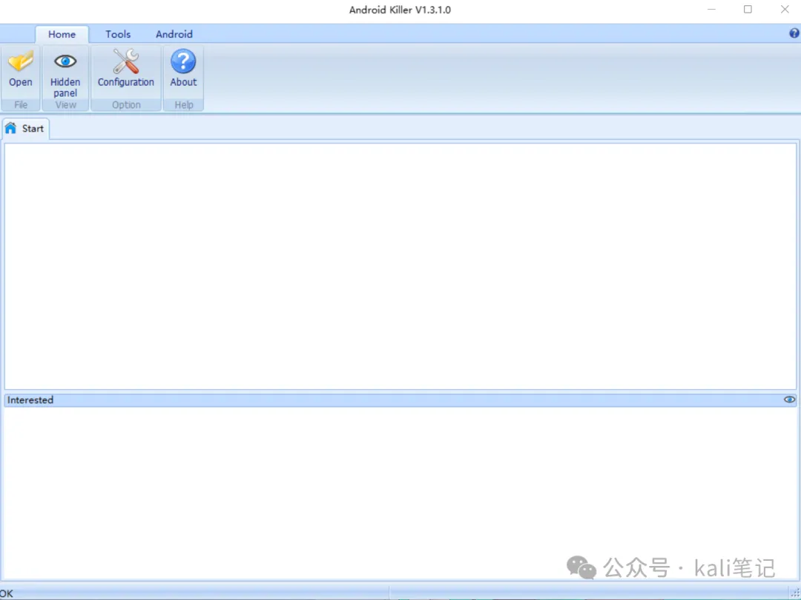**使用**

它的使用非常简单，只需要将apk拖动到程序中即可。

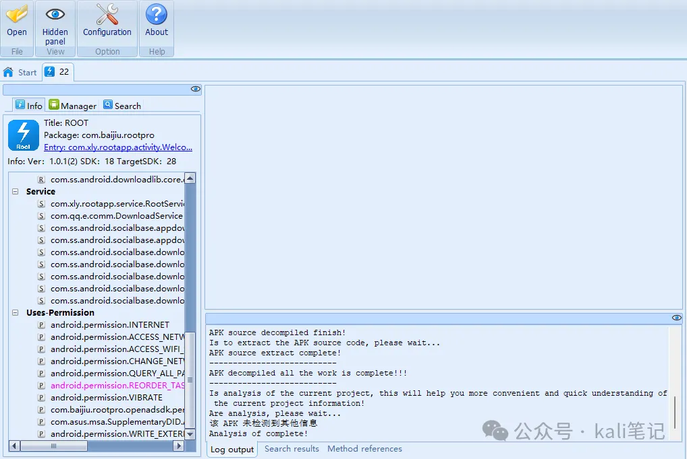等待分析完成，我们可以查看apk的源码信息。（加壳的需要先脱壳）

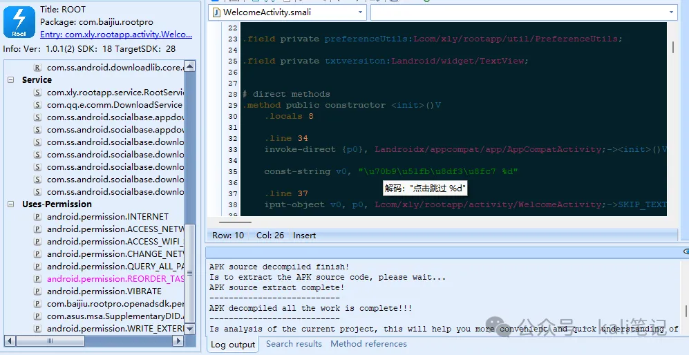点击资源管理，可以对app的图片等资源管理。

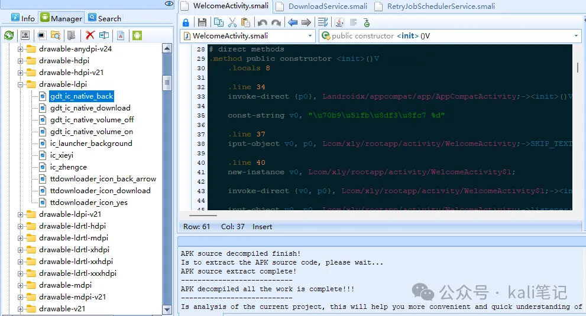当然，如果我们想要修改apk的资源，如logo，app的名称，只需要对文件进行替换。打包即可。

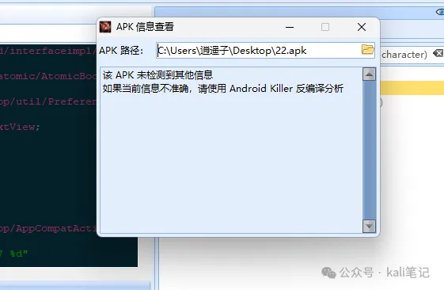同时，该工具还为大家提供了方便的查壳工具。最后，我们来看看工具的回编使用。当我们对apk进行修改后，可以对其进行二次汇编。点击android按钮，可以对当前项目进行汇编。

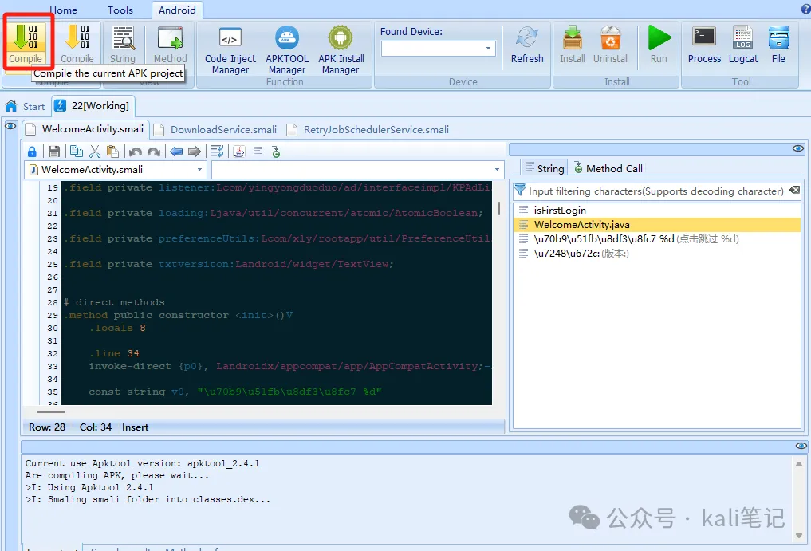

## apktool

apktool是最便捷的一款apk反编译工具，其实市面上的很多工具，都是依赖于此工具进行开发的。在kali中，我们需要执行下面命令进行安装。

```
apt-get install apktool
```

接下来，反编译apk

```
apktool d xx.apk
```

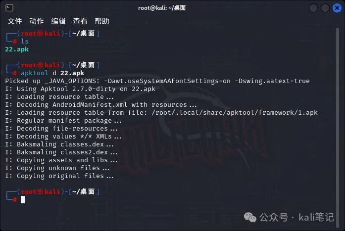

反编译后，能够更好的浏览apk的资源文件，但是搜索关键词不是很方便。回编apk，我们只需执行下面命令即可。

```
apktool b 22 
```

注意：`22`为上步中解压的目录。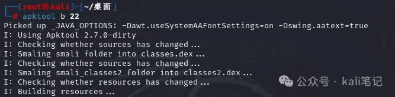

## 在线Android APK反编译工具 - ToolFK工具箱

随着智能手机的普及，移动应用程序的开发变得越来越流行，尤其是Android平台。然而，由于一些原因，有时候需要对APK文件进行反编译以获得源代码。这时候，在线Android APK反编译工具就派上用场了。

### 基础知识

在线Android APK反编译工具是一款功能强大、操作简单的apk反编译破解工具，支持编译、反编译、签名等多项功能。通过使用该工具，用户可以将反编译的APK文件保存到同名目录中，并提供源码下载。这个工具非常适合那些需要查看和修改已编译应用程序的人员。

如何使用

首先，您需要访问在线Android APK反编译工具的链接：https://www.toolfk.com/tools/decompile-apk.html

在打开的网页上，您会看到一个文本框和一个“浏览”按钮。点击浏览按钮，选择您想要反编译的APK文件，并点击“上传”按钮。

上传完成后，您可以看到反编译的数据已经生成。您可以通过点击“下载”按钮来下载反编译后的源代码，或者直接在页面上查看生成的源代码。

### 总结

在线Android APK反编译工具是一个非常有用的工具，它为您提供了一个快速且简单的方法来反编译APK文件。使用该工具，您可以轻松地获取Android应用程序的源代码，以便于查看和修改。该工具非常易于使用，任何人都可以在不需要额外学习的情况下使用它。如果您需要对APK文件进行反编译，我们强烈推荐您使用在线Android APK反编译工具。


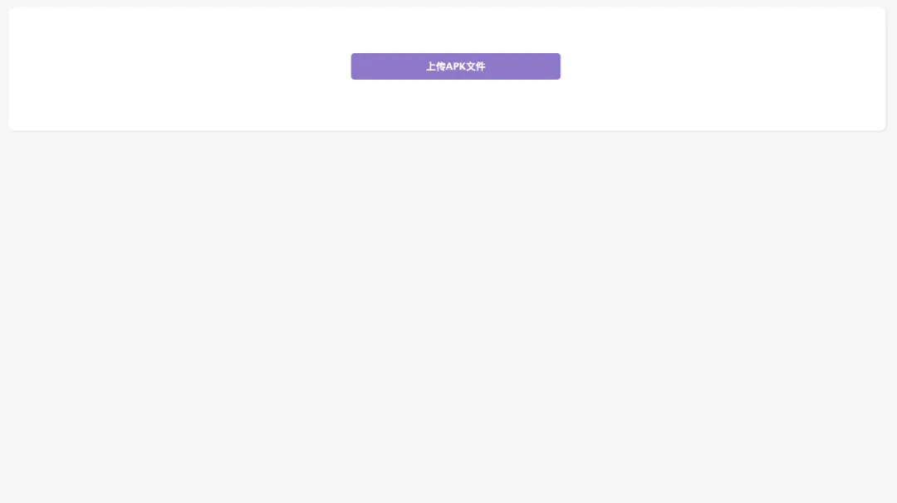

工具链接：https://www.toolfk.com/tools/decompile-apk.html

# APP逆向工具清单

## 抓包工具

### Charles

https://www.charlesproxy.com/

抓应用层Http(s)请求，比较好用，能按域名进行归类，推荐使用

### Fiddler

windows端的“Charles", 抓应用层Http(s)请求。但不推荐使用，不好操作证书

### WireShark

https://www.wireshark.org/

会话层抓包很方便，通常需要配合反编译找到协议的组成方式，初学者不建议使用。

### TcpDump

适用于会话层抓包，在使用没有无线网卡的电脑或无法开热点的情况下可以直接在手机上运行Tcpdump然后导出文件在电脑端WireShark中打开，与直接使用WireShark抓包效果相同

### Postern

Android系统里一款非常流行的代理/ 虚拟专用网络管理程序，是一个全局代理工具。支持的代理协议有:

HTTPS/HTTP、SSH隧道、Shadowsocks、SOCKS5代理等

### HTTPCanary

VPN抓包工具，原理是在本地创建一个VPN，使所有请求都从VPN中流过，从而实现不适用代理抓包的效果

### Hping

面向命令行的用于生成和解析TCP/IP协议数据包汇编/分析的开源工具。它支持TCP，UDP，ICMP和RAW-IP协议，具有跟踪路由模式


## 反编译

### apktool

https://github.com/iBotPeaches/Apktool

一款功能强大且操作简单的apk反编译工具,能够将反编译的apk文件保存到同名目录中,还能帮用户将反编译的dex、odex 重新编译成dex文件

### JEB

JEB是一个功能强大为安全专业人士设计的安卓应用程序反编译工具，用于逆向工程或者审计apk文件

### dex2jar

https://github.com/pxb1988/dex2jar

将安卓可执行文件dex转为jar包

### Jadx/Jadx-gui

https://github.com/skylot/jadx

非常方便的Java反编译工具，一般用到的功能主要是搜索、反混淆、查找方法调用这几样

### ByteViewer

https://github.com/Konloch/bytecode-viewer

支持apk、dex等多种文件格式的反编译

### AndroidKiller

https://github.com/liaojack8/AndroidKiller

### Android 應用程式逆向工具(apk反編譯工具)


## Hook工具

### Xposed

https://github.com/rovo89/Xposed

功能十分强大的Hook框架，很多逆向工具都是基于它来写的，有特殊需求时也可以自己写一个模块使用

### Frida

https://github.com/frida/frida

作为Hook工具，相对于Xposed而言Frida的受欢迎度不断上升，它的功能在某些方面要比Xposed强得多。

它是一种动态插桩工具，可以插入一些代码到原生app的内存空间去，动态地监视和修改其行为，可对内存空间里的对象方法实现监视、修改甚至替换

### Objection

https://github.com/sensepost/objection

Frida的集成化工具，简单易用

### fridaUiTools

https://github.com/dqzg12300/fridaUiTools

fridaUiTools是一个界面化整理脚本的工具。新人的练手作品。参考项目ZenTracer，觉得既然可以界面化，那么应该可以把功能做的更加完善一些。跨平台支持：win、mac、linux

### lamda

https://github.com/rev1si0n/lamda?tab=readme-ov-file

LAMDA 是一个用于逆向及自动化的辅助框架，设计为减少安全分析以及应用测试人员的时间及琐碎问题，以编程化的接口替代大量手动操作


## 脱壳工具

### Frida

如上介绍

### dexDump

https://github.com/hluwa/FRIDA-DEXDump

号称“葫芦娃”，Frida集成工具，实现一键脱壳

### Fart

https://github.com/hanbinglengyue/FART

内存中DexFile结构体完整dex的dump进行脱壳

### DeveloperHelper

基于Xposed写的辅助工具，常用于查看Activity名、查看加固类型、查看Activity结构、自动脱壳。

### UCrack

基于Xposed写的辅助工具，集成了自动网络抓包、网络堆栈爆破、文件日志、WebView调试环境、自动脱壳、Native函数注册监控、记录程序自杀堆栈等功能

### BlackDex

https://github.com/CodingGay/BlackDex

BlackDex是一个运行在Android手机上的脱壳工具，支持5.0～12，无需依赖任何环境任何手机都可以使用，包括模拟器。只需几秒，即可对已安装包括未安装的APK进行脱壳。


## 调试工具

### Postman

https://www.postman.com/

请求接口调试，支持cURL导入

### IDA Pro

强大的调试工具，逆向中常用于so动静态分析，帮助破解Native加密逻辑

### DDMS

Dalvik Debug Monitor Service，是 Android 开发环境中的Dalvik虚拟机调试监控服务，它提供查看线程和堆信息、logcat、进程、广播状态信息等功能

### AndBug

脚本式Android动态调试器，但不支持单步调试Android程序，并且无法对自定义的方法设置断点，因此在使用过程中可能会感到诸多不便，可以根据实际需要使用它

### APPium

用于自动化 iOS 手机、 Android 手机和 Windows 桌面平台上的原生、移动 Web 和混合应用。核心是一个是暴露 REST API 的 WEB 服务器。它接受来自客户端的连接，监听命令并在移动设备上执行，答复 HTTP 响应来描述执行结果

## 其他工具

### Magisk

https://github.com/topjohnwu/Magisk

Magisk是一套用于定制Android的开源软件，支持Android 6.0以上的设备。

一些突出特点:

- MagiskSU:为应用程序提供root访问权限
- Magisk Modules:通过安装模块来修改只读分区
- MagiskBoot:最完整的解压和重新打包Android引导映像的工具
- Zygisk:在每个Android应用程序的进程中运行代码

### mt管理器

https://mt2.cn/
