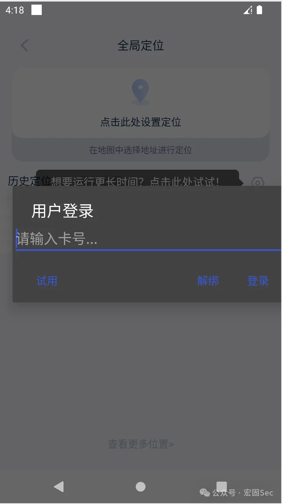
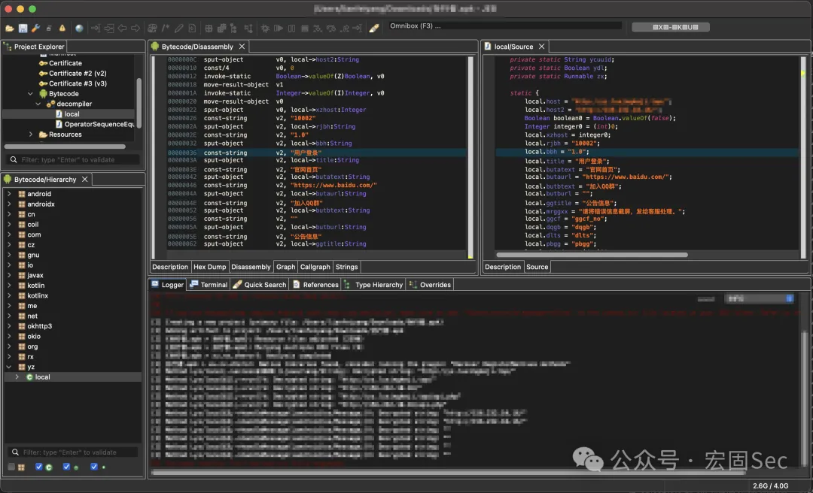
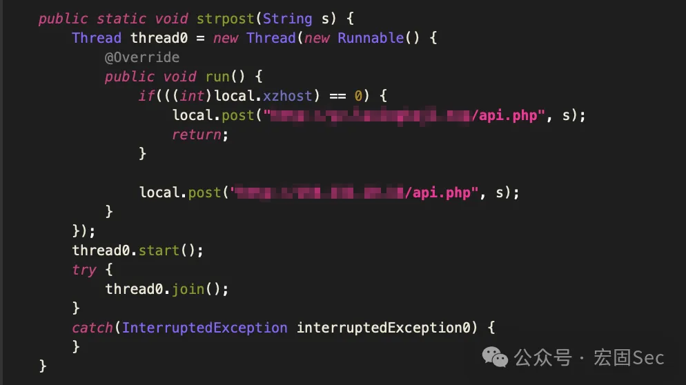
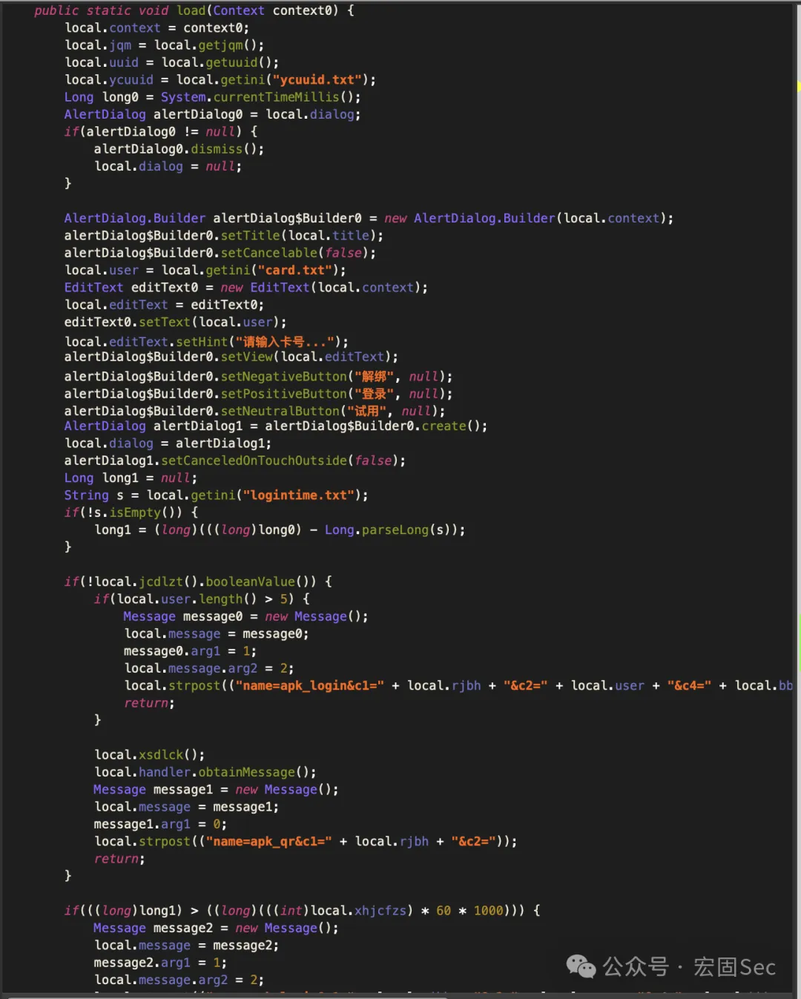
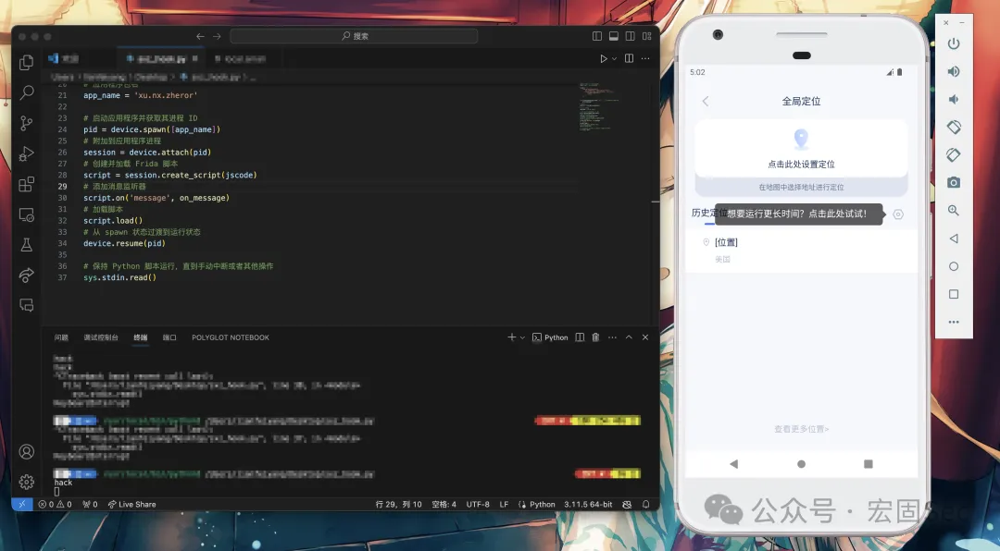
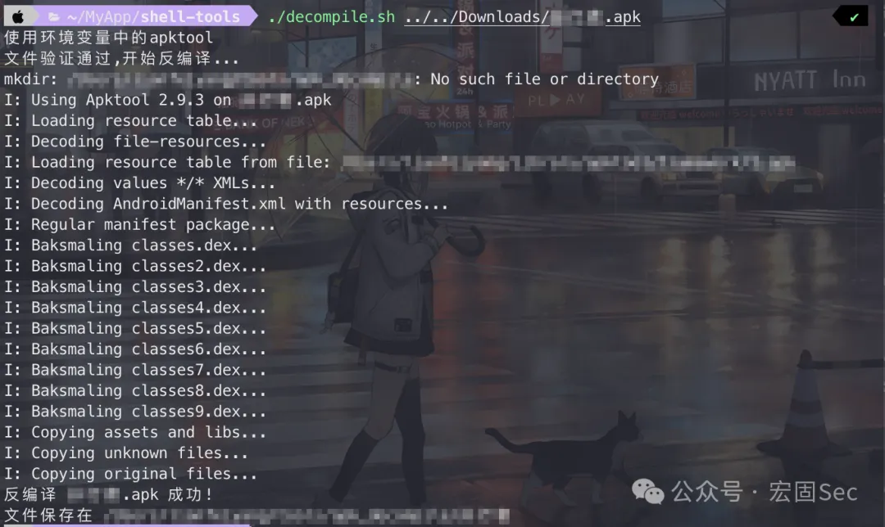
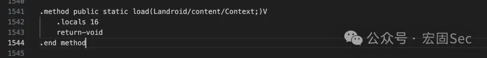
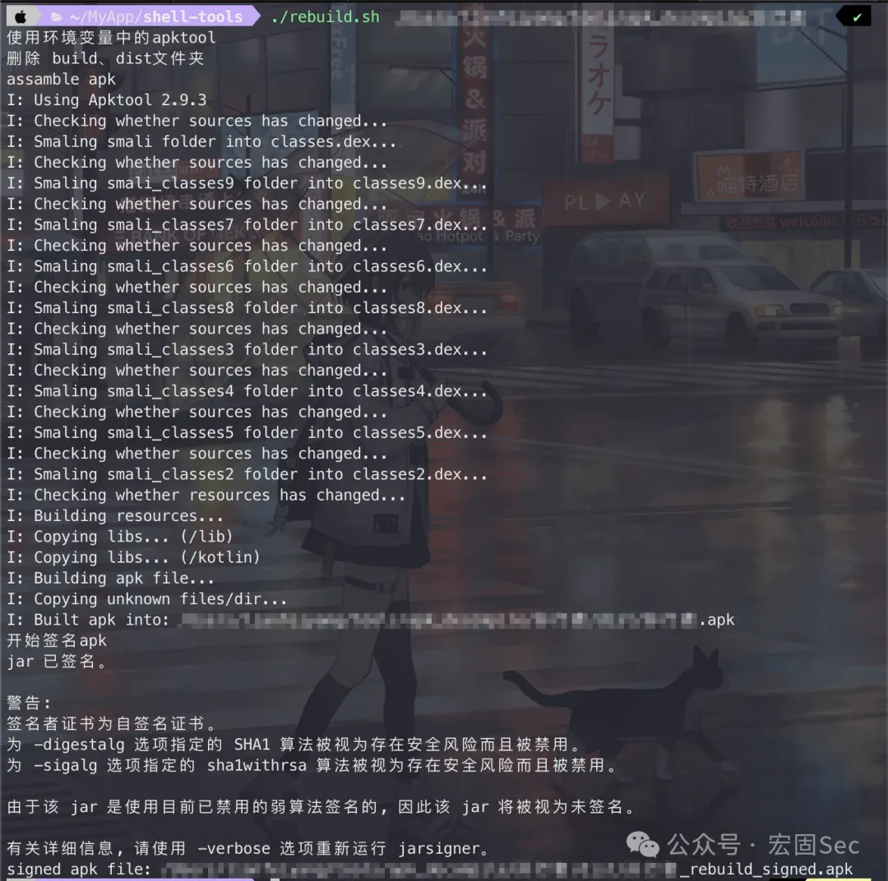

# APP逆向破解教程

原文：[某灰产收费虚拟定位APP逆向破解教程 - 『移动安全区』 - 吾爱破解 - LCG - LSG |安卓破解|病毒分析|www.52pojie.cn](https://www.52pojie.cn/thread-1904103-1-1.html)

## 环境和工具

### 环境

- • MacOS 13.6.3
- • Java 20.0.2
- • Python 3.11.5

### 工具

- • Android Studio 2022.3.1 Patch 2
- • JEB 5.2.0.202308292043
- • frida 16.1.8
- • apktool 2.9.3
- • shell-tools

## 破解过程

### 逆向分析

首先打开未破解的APP，映入眼帘的就是要求输入卡密才能使用......（什么CrackMe？）



先打开JEB，搜索字符串“登录”，很快啊，在`yz.local`下就找到了：



初步判断`yz.local`就是和登录以及卡密获取、试用逻辑啥的相关的一个类。可以看到类中的成员变量`local.host`和`local.host2`这两个域名和IP（图中已打码部分），初步判断这个就是来**远程判断是否拥有卡号（卡密）**的，这样的话，应该有和API直接交互的逻辑。往下找：



果然啊，有个和API进行交互的方法。而且通过构造传递给API的参数（在别的方法中可以找到需要传递的参数），可以确认这个API就是检验卡号是否正确以及有没有过期的（幽默订阅制）。

那么目前可以确定的就是卡号的合法性验证逻辑在**远程，并且需要联网访问**，但是返回的值判断却在本地（因为API只返回状态值），因此要绕过理论是可以通过发伪包的（没试过）。

现在还要确认的是实现这个虚拟定位功能需不需要和远程的某个API进行交互。通过购买了卡号的朋友断网验证：**虚拟定位的逻辑是写在本地的**。这就有些搞笑了，这也就意味着只有卡号验证是要通过远程API来的，而实际的功能部分却写在了本地。换言之，**卡号验证只是一个限制，只要绕过了这个限制，就能免费正常使用虚拟定位的功能。**

那么要做的事情就很简单了，绕过卡号验证，也就是crack掉最开始的那个输入框。经过简单的寻找，发现这个框的逻辑是写在`local.load`这个方法里的：



### frida hook

还是个public的静态方法，写个frida hook验证一下：

```
import frida  # 导入frida模块
import sys    # 导入sys模块

jscode = '''
    Java.perform(function(){
        var targetClass = Java.use('yz.local');
        targetClass.load.implementation = function() {
            console.log('hack');
            return;
        }
    });
'''

def on_message(message,data): #js中执行send函数后要回调的函数
    print(message)

# 获取设备
device = frida.get_usb_device()
# 应用程序包名
app_name = 'xu.nx.zheror'
# 启动应用程序并获取其进程 ID
pid = device.spawn([app_name])
# 附加到应用程序进程
session = device.attach(pid)
# 创建并加载 Frida 脚本
script = session.create_script(jscode)
# 添加消息监听器
script.on('message', on_message)
# 加载脚本
script.load()
# 从 spawn 状态过渡到运行状态
device.resume(pid)
# 保持 Python 脚本运行，直到手动中断或者其他操作
sys.stdin.read()
```

跑一下，成功绕过，只能说过于幽默了：



### crack

决定采用最简单粗暴也最有效的方法：**解包，硬改smali，重签名打包**。

解包和签名打包的脚本用的是：https://github.com/8enet/shell-tools

首先是解包，执行：

```
./decompile.sh ***.apk    # ***.apk是安装包路径
```

不出意外的话会得到类似这样的结果：



然后找到`apk解包后的目录/smali_classes9/yz/local.smali`打开，搜索“load”找到smali对应的方法，把方法中其都删掉，只保留一个.locals和return，修改后的如下图：



然后保存修改后的smali文件。

最后是重签名打包，执行：

```
./rebuild.sh ***    # ***是解包后的路径
```

**失败的话记得用keytool先生成keystore的签名文件，然后修改`rebuild.sh`里的keystore路径等信息**，成功的话会得到类似这样的结果：



将修改后重签名的apk安装到实机上测试（如果之前有安装过的话记得卸载，不然会有签名冲突），赋予相应权限后可以看到虚拟定位的功能可以正常使用，破解成功：


## 后记

没有暗桩、加壳、加密、混淆，判断逻辑写在Java层，它真我哭。是有些幽默了，破解难度感觉还没我逆向课程设计高，这种也就只能赚不懂技术的人的钱了。（这下断人财路了）

### 参考

- • 修改smali插入代码：
- https://blog.zzzmode.com/2017/07/27/modify_smali_code_part1/
- • frida入门总结：
- https://www.52pojie.cn/thread-1128884-1-1.html
- • frida hook 工具基础使用(一)：
- https://www.52pojie.cn/thread-1746855-1-1.html
- • 8enet/shell-tools：
- https://github.com/8enet/shell-tools