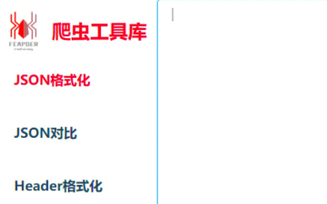
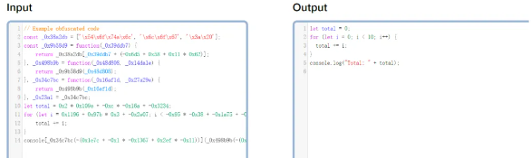

# JS逆向工具清单

## 调试工具

### spidertools

https://spidertools.cn/#/

一个超级全的爬虫工具库，能解析请求地址、参数、头部、cookie格式化等

**在线加解密**

http://tool.chacuo.net/cryptdes

超全的在线模拟加解密工具、逆向的时候可以使用他模拟加解密算法

**AET混淆工具**

https://astexplorer.net/

能够模拟各种JavaScript节点树、方便调试混淆代码还原操作

**调试工具**

**tampermonkey**

https://www.tampermonkey.net/

Tampermonkey，又称作油猴，篡改猴，允许用户自定义并增强网页的功能。

**v_jstools**

https://github.com/cilame/v_jstools

v 神出品的用于快速调试 JS 代码的插件，内置 dom 对象 hook、pac 代理、AST 解混淆、代码模板等强大功能。

**ReRes**

https://github.com/annnhan/ReRes

把远程 css 文件或者 js 映射到本地的文件上，通过修改本地文件进行调试和开发。

**chrome-wasm-debugger**

https://github.com/itszn/chrome-wasm-debugger

一个 chrome 扩展，为 WASM 模块提供稍微更简单的调试 UI。

**xpath**

https://chromewebstore.google.com/detail/xpath-helper/hgimnogjllphhhkhlmebbmlgjoejdpjl?pli=1

轻松提取、编辑和评估 XPath 查询。

**Trace**

https://github.com/L018/Trace

Trace 是一个用于网站分析的 Chrome 扩展, 包括追踪Cookie、追踪事件、追踪对象、脚本注入、阻止请求、变量追踪、JS反混淆、响应流转等功能。

**js-hook-framework**

https://github.com/JSREI/crawler-js-hook-framework-public

JS 逆向 Hook 工具集。将JS逆向时用到的一些工具封装为油猴脚本，降低逆向成本。

#### 调试运行

**PyExecJS**

https://github.com/doloopwhile/PyExecJS

在 Python 中运行 JavaScript 代码，现已停止维护。

**bestV8**

https://github.com/BestToYou/bestV8_release

一个可以跑 js 的逆向工具。

**vm2**

https://github.com/patriksimek/vm2

Node.js 的高级虚拟机/沙箱，因为包含严重的安全问题，现已停止维护。

**vthread**

https://github.com/cilame/vthread

python 更加方便的多线程库，以最小的代码侵入，做到最高效的多线程、线程池 coding 效率。在不改变源代码的情况下，一行代码即可实现线程池操作。

####  代码混淆

**obfuscator**

https://www.obfuscator.io/

OB 在线混淆。

**deobfuscate**

https://deobfuscate.io/

一个简单但功能强大的反混淆器，支持 OB 反混淆。

**decode-js**

https://github.com/echo094/decode-js

使用AST方式（依赖Babel插件）实现的JS代码净化工具。

**ob-decrypt**

https://github.com/DingZaiHub/ob-decrypt

ob 混淆还原工具。

#### 指纹相关

**curl_cffi**

https://github.com/yifeikong/curl_cffi

curl-impersonate 的 Python 绑定，基于 cffi，支持 JA3/TLS 和 http2 指纹模拟。

**Tls-Client**

https://github.com/FlorianREGAZ/Python-Tls-Client

Python-Tls-Client 是一个基于 requests 和 tls-client 的高级 HTTP 库。

**pyhttpx**

https://github.com/zero3301/pyhttpx

基于 socket 开发的一个网络库，支持 tls1.2/tls1.3 和 h1/h2。