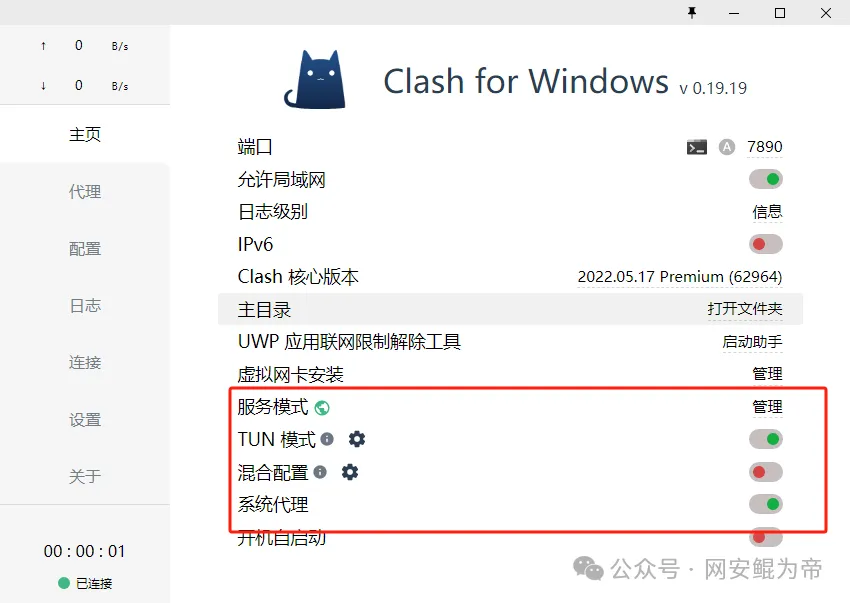
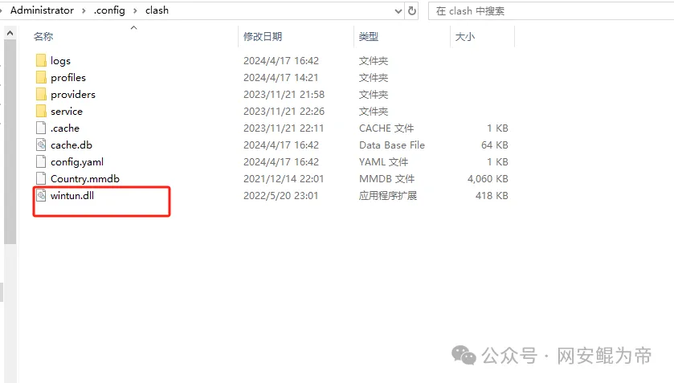
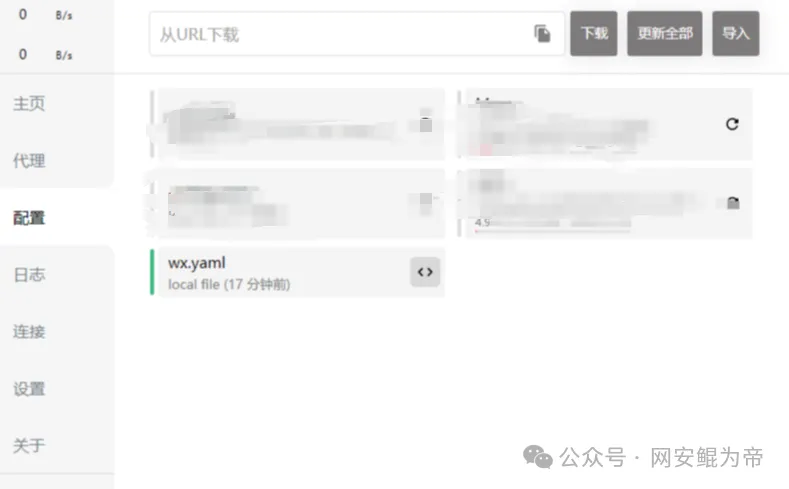
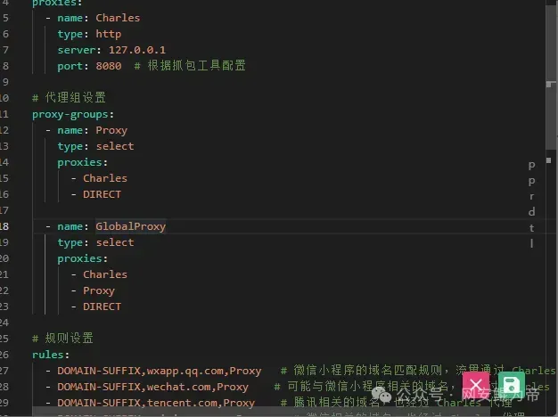
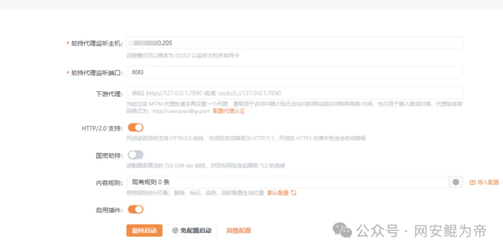
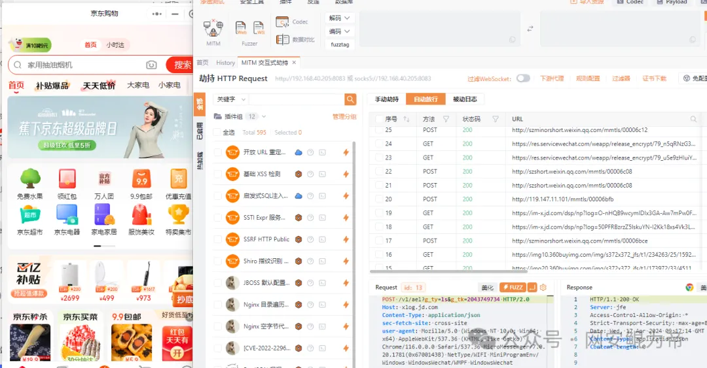

# clash+yakt抓包微信小程序

## **0x00** 免责声明

本文仅用于技术讨论与学习，利用此文所提供的信息而造成的任何直接或者间接的后果及损失，均由使用者本人负责，文章作者及本公众号团队不为此承担任何责任。

## 0x01 前言

在抓app和微信小程序时，通常使用Proxifier进行代理，但是总是莫名其妙的没有反应，这时就只能重启电脑。这时我们就可以使用clash进行抓包，亲测可用。

## 0x02 代理模式设置

开启服务模式，系统代理



确保wintun.dll存在



## 0x03 配置代理文件

在配置选项中导入配置文件





该配置文件提供了只抓微信小程序和全局代理两个节点

```yaml

# 代理设置
proxies:
  - name: Charles
    type: http
    server: 127.0.0.1
    port: 8080  # 根据抓包工具配置

# 代理组设置
proxy-groups:
  - name: Proxy
    type: select
    proxies:
      - Charles
      - DIRECT

  - name: GlobalProxy
    type: select
    proxies:
      - Charles
      - Proxy
      - DIRECT

# 规则设置
rules:
  - DOMAIN-SUFFIX,wxapp.qq.com,Proxy   # 微信小程序的域名匹配规则，流量通过 Charles 代理
  - DOMAIN-SUFFIX,wechat.com,Proxy    # 可能与微信小程序相关的域名，也经过 Charles 代理
  - DOMAIN-SUFFIX,tencent.com,Proxy    # 腾讯相关的域名，也经过 Charles 代理
  - DOMAIN-SUFFIX,weixin.qq.com,Proxy    # 微信相关的域名，也经过 Charles 代理
  - DOMAIN-SUFFIX,qq.com,Proxy    # QQ 相关的域名，也经过 Charles 代理
  - MATCH,GlobalProxy   # 默认规则，可在 GlobalProxy 中切换全局代理和直连

# DNS 配置
dns:
  enable: true
  ipv6: false
  enhanced-mode: fake-ip # 或使用 redir-host，取决于设备和需求
  nameserver:
    - 8.8.8.8
    - 1.1.1.1

# 其他设置
tun:
  enable: true
  stack: system # 或 gvisor，取决于设备支持
  dns-hijack:
    - 198.18.0.2:53
  auto-route: true
  auto-detect-interface: true # Clash 会自动检测出口网卡

# 日志级别，可选 "info", "warning", "error", "debug", "silent"
log-level: info
```


## 0x04 抓包效果

配置与yakt联动(如使用burp微信必须在3.7.6版本以下)，ip填写本机ip或127.0.0.1（本地记得导入yakt证书）



抓包效果，可以看到抓取成功



## 0x05 总结

  该方法不仅适用pc端，还可适用于抓取手机app但是clash本身不会无视客户端的证书校验，所以需要一些其它方式去解决证书问题，鸽鸽们可以自行研究一下，配置文件Android和pc基本可以通用。

```yaml
# 代理设置
proxies:
  - name: Charles
    type: http
    server: 127.0.0.1
    port: 8080  # 根据抓包工具配置

# 代理组设置
proxy-groups:
  - name: Proxy
    type: select
    proxies:
      - Charles
      - DIRECT

  - name: GlobalProxy
    type: select
    proxies:
      - Charles
      - Proxy
      - DIRECT

# 规则设置
rules:
  - DOMAIN-SUFFIX,wxapp.qq.com,Proxy   # 微信小程序的域名匹配规则，流量通过 Charles 代理
  - DOMAIN-SUFFIX,wechat.com,Proxy    # 可能与微信小程序相关的域名，也经过 Charles 代理
  - DOMAIN-SUFFIX,tencent.com,Proxy    # 腾讯相关的域名，也经过 Charles 代理
  - DOMAIN-SUFFIX,weixin.qq.com,Proxy    # 微信相关的域名，也经过 Charles 代理
  - DOMAIN-SUFFIX,qq.com,Proxy    # QQ 相关的域名，也经过 Charles 代理
  - MATCH,GlobalProxy   # 默认规则，可在 GlobalProxy 中切换全局代理和直连

# DNS 配置
dns:
  enable: true
  ipv6: false
  enhanced-mode: fake-ip # 或使用 redir-host，取决于设备和需求
  nameserver:
    - 8.8.8.8
    - 1.1.1.1

# 其他设置
tun:
  enable: true
  stack: system # 或 gvisor，取决于设备支持
  dns-hijack:
    - 198.18.0.2:53
  auto-route: true
  auto-detect-interface: true # Clash 会自动检测出口网卡

# 日志级别，可选 "info", "warning", "error", "debug", "silent"
log-level: info
```