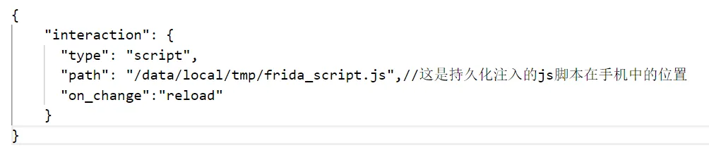
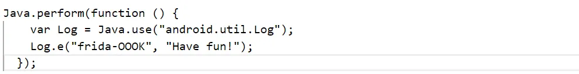
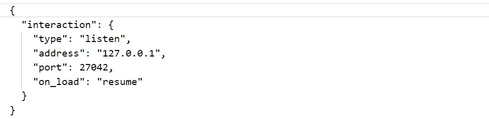
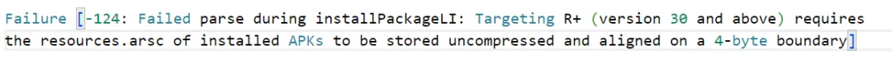
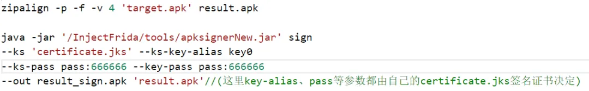

# frida入门使用介绍

## 简介

frida是android逆向分析最常用的工具之一，其是一种hook框架，可以在不改动目标源码的情况下，动态查看函数运行入参，返回值，注入代码，更改程序逻辑等，使得android逆向人员能够快速掌握一些问题的本质。本文将带大家了解各种frida的使用方法以及其中的一些坑。

frida官网：https://github.com/frida/frida

## frida-server的使用方法

frida-server是最常用的一种hook方式。

**条件：**手机root

**效果：**无法实现持久化注入，需要依赖于电脑端脚本即时执行

**使用方法：**

1. 从官网下载frida-server-xxx(注意对应版本与架构)
2. pip install frida==版本号；pip install frida-tools==版本号（相当于安装电脑客户端，可以不带版本号安装最新版本）；pip install objection
3. 将下载的frida-server-xxx放入手机端的/data/local/tmp目录下
4. chmod 777 frida-server-xxx(这里必须是root权限执行这个操作)
5. ./frida-server-xxx -P(启动手机端的frida-server)
6. frida -U -l xxx.js pid 、frida -U -l xxx.js -n process_name 或者 objection -g process_name explore（进行电脑端连接）
7. 后续操作手机执行到hook位置即可。

对于objection可以在连接后加入js文件或者直接输入命令进行hook:

import xxx.js（引入hook的js文件）

对于java方法的hook，一般使用命令如下：

android hooking watch class_method method_name --dump-args --dump-return --dump-backtrace（hook单独一个方法）

android hooking watch class class_name --dump-args --dump-return --dump-backtrace（hook类下面所有方法）

**注：**后面三个参数用来表示hook到目标时显示的内容，其依次为显示参数、显示返回值、显示调用栈，可根据自身需求进行添加。

**踩坑点：**

1.objection -g process_name 与frida -U -n process_name这里面的进程名不是ps -A 下的进程名而是frida-ps -U下的进程名（即使这里显示的是中文上面的进程名也需要对应中文才能连接到）

2.`./frida-server-xxx -P`中的-P参数是为了更稳定地运行，其主要是防止预加载优化，大多数情况下加上这个参数更好，防止hook时手机崩溃重启等。

注:为了更稳定地运行，有时可以使用setenforce 0来关闭SELinux安全限制。

3.objection下的hook（尤其是android hooking命令时）很多时候只针对于已经存在的代码，对于动态加载的代码（甚至一些跨进程调用的代码）都无法找到对应的方法，这时候建议使用frida -U -l xxx.js 的方式去hook特定的方法。

4.对于有源码的方法来hook时，最好不要使用源码的方法路径进行hook，有时代码会进行混淆，有些方法名等会有一些变化，一般利用jeb等工具逆向后的路径即可。

## frida-gadget用法

frida-gadget主要是针对非root情况下的一种hook方式。

**条件（满足其中一个即可）：**

1. 具有hook应用的签名
2. hook的代码与应用的签名权限无关且应用无签名权限也可运行到功能处

因为frida-gadget需要重新打包apk文件，所以如果没有应用的签名可能会导致功能无法正常完成。

注：frida-gadget并不需要应用是debuggable，测试应用是否可调试都可以完成hook。

**效果：**既可以实现持久化注入（在手机端持续运行脚本）也可以远程（在电脑端）运行脚本。

## 使用方法：

下面分为两种情况的使用持久化与非持久化

### 持久化操作（在手机端运行脚本）：

1.从官网下载frida-gadget-xxx(注意版本架构对应)并解压出其中的so

2.将so按照架构放入需要hook的apk的lib目录下的特定目录中

注:arm64-v8a目录对应arm64;armeabi-v7a目录对应arm；x86目录对应为x86(主要是针对模拟器)。

3.创建config文件，命名为libfrida-gadget.config.so（命名中的libfrida-gadget与放入libs目录下的so名字保持一致即可）,放入与so相同的目录下。里面的内容示例如下：

其中具体的含义可以参考https://frida.re/docs/gadget/中的说明。

4.将system.loadlibrary(“frida-gadget”)的smali汇编语言注入apk开始的代码位置（一般是启动activity或application开始的位置）。如果apk本身存在加载其他so的代码，也可以利用lief的感染elf文件的功能实现so注入，具体使用方法可参考https://lief-project.github.io//doc/latest/tutorials/09_frida_lief.html。原理可参考https://gslab.qq.com/portal.php?mod=view&aid=163

5.最后对加入so与config和加入特殊smali代码的应用进行打包与重签名。

6.2—5步是frida-gadget使用的关键步骤，目前网上已经有现成的框架帮忙一次性实现了这几步。

详细框架及使用方法可参考：

https://github.com/nszdhd1/UtilScript/tree/main

这个框架本身是利用了lief或者直接在smali代码中插入代码完成so的注入。

**注：**这里的框架的签名是自己的签名，想要使用自己的证书签名就直接使用signerNew.jar这种工具对生成的未签名的apk进行签名即可。

7.安装签名后的注入so的应用

8.将写好的脚本重名为frida_script.js并放入/data/local/tmp目录下（主要与第3步的config配置文件保持一致即可）

这里给出一个示例脚本：

这个就是hook的Log函数，在打印日志时会多打印Have fun!一个日志。

**注：**这里打印一定要用Log.e等方法，不要使用console.log，因为这是持久化注入，没有电脑端界面进行显示。

9.运行到hook的函数位置，通过查看log日志等方式就可看到完成了hook的持久化注入。

### 非持久化操作（在电脑端连接引入脚本操作）：

这个本身与持久化操作大致相同，这里只说明一下其中不同的点：

1. config配置文件内容不同，因为这里是需要与电脑端连接，因此需要开放接口，配置文件一般如下：

上面参数的意思主要就是开放127.0.0.1:27042接口进行监听。其中resume是让应用功能正常进行，后续再连接也可。相对的还有一个参数是wait，其意思主要是当应用加载到frida-gadget.so时就会暂时阻塞，等待连接而不进行完整功能。详细的参数意思可以参考官方文档：https://frida.re/docs/gadget/

上述持久化操作用法中提到的框架在/InjectFrida/tools目录下存在相应的config文件，可以根据自己的需求进行修改。

2. 在安装好注入了so的应用后，不需要将js文件放入手机中，在手机端打开存在frida-gadget.so的应用后，可以先利用adb shell netstat -l查看当前手机的接口监听状态，这里如果注入成功应该会发现对应接口（27042）处于监听状态。后续可以利用frida -H 0.0.0.0:27042 -n Gadget -l frida_script.js来进行连接注入js脚本。

注：这里最好使用0.0.0.0:27042，比较容易连接得到，正常也可以使用127.0.0.1:27042（只要进行了接口转发）也能够进行连接。

### 踩坑点：

1.如果是利用框架进行so注入，需要根据自身情况修改里面的配置文件，框架自带的配置文件主要存在于/UtilScript/InjectFrida/tools下，包括config文件、frida-gadget.so、aapt等运行文件，都可以按照自己的实际需求对版本进行修改。

2.在使用框架时一定要先根据脚本中用到的库进行安装（包括lief），可以自己根据报错进行慢慢补全。同时，根据自己的环境可能脚本运行时会报一些错，一般主要可能是文件路径、文件名一些相关的问题，这里也可以根据报错信息结合自己实际情况进行修改。

3.对apk签名后安装时可能会遇到一些问题安装不上。一个常见的问题报错如下：

错误有时不会提示30。按照官方解释是如果以 Android 11（API 级别 30）或更高版本为目标平台的应用包含压缩的 resources.arsc 文件或者如果此文件未按 4 字节边界对齐，应用将无法安装。

这里可以采用zipalign工具来实现对齐,这里要采用先对齐后签名的操作，主要执行命令如下：

这里是一个示例，其中的路径参数以及证书等都可以自行进行替代修改。详细的命令以及使用方法可参考：https://blog.csdn.net/qq_23045311/article/details/125814795

4.最后连接时尽量用命令frida -H 127.0.0.1:27042 -n Gadget -l frida_script.js来进行连接，网络上一些文章解释会使用-U这种USB的连接方式包括frida -U Gadget与frida-ps -U这种方式连接，个人尝试即使进行了端口转化，只有非常偶然的一次连接执行成功，大多数情况下都不太容易完成连接。

### frida-inject使用方法

frida-inject是一种存在于手机端的持久化注入方式，简便好用，依赖安装少。

**条件：**手机root

**效果：**只能实现持久化注入，脚本要存在于手机端

**使用方法：**

1. 从官网下载frida-inject-xxx（注意对应的版本与架构）并解压
2. 将解压后的文件放入手机中的/data/local/tmp目录下
3. chmod 777 frida-inject-xxx(对其赋予权限)
4. 将要运行的js文件同样放入手机中，一般放在与frida-inject-xxx同一个目录下
5. ./frida-inject-xxx -h可以看见其运行参数说明，后续按照参数说明进程与脚本即可完成持久化注入，这里给一个命令例子：

./frida-inject-16.1.4-android-arm64 -s frida_script.js -p 5795

**注：**整个过程很简单，不需要电脑端的python、frida安装或者注入so代码等操作。详细纯手机端完整视频操作可参考https://www.youtube.com/watch?v=Bnz9mZ7mJsk

**踩坑点：**

利用这个进行hook时，有时-n app_name会找不到进程导致很难hook到，这里的名字正常是指应用的名字而不是包名，例如有一个应用Test包名为com.example.test这里应该使用Test而不是com.example.test。这里建议还是尽量使用-p pid这种方式，虽然麻烦点，但可以精确到进程。

**总结**

本文主要介绍了frida-server、frida-gadget、frida-inject的环境配置、简单的使用以及踩坑点。关于frida在hook场景下的特殊用法包括方法的主动调用、so库的hook、内存地址的修改查看、特殊参数结果的显示打印等并没有深入探讨，这些更需要在实际需求的情况进行探究学习，读者可以根据https://frida.re/docs/javascript-api/的介绍自由进行扩展，尽情领略frida在android逆向中的魅力。