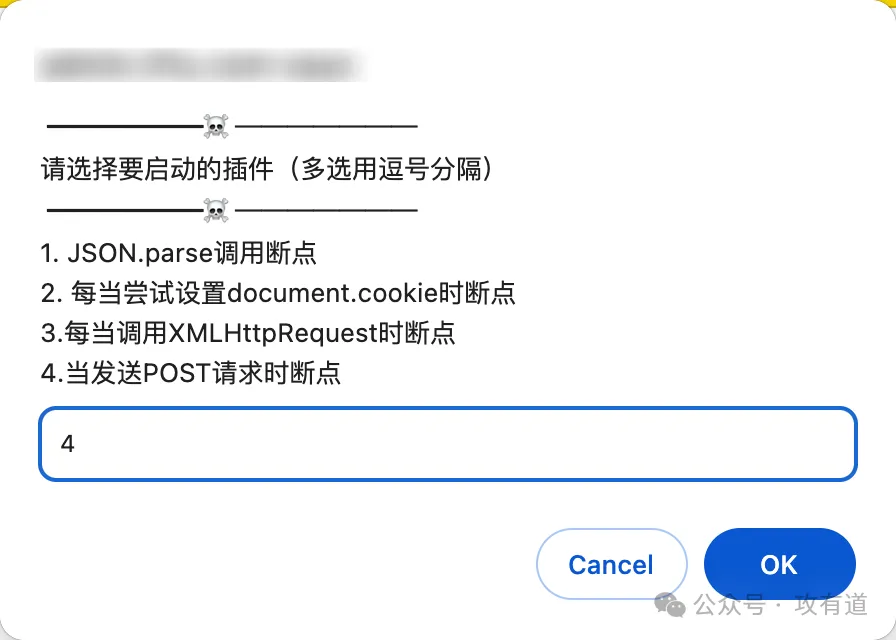
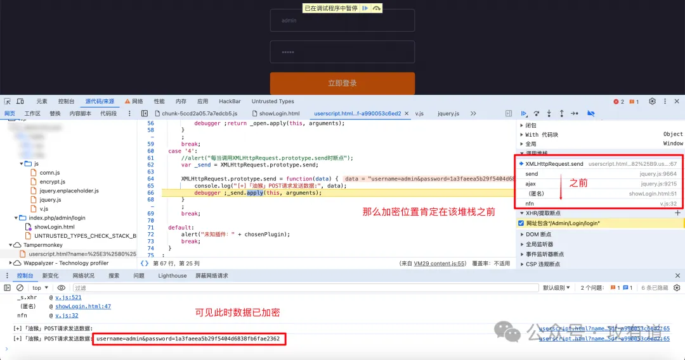
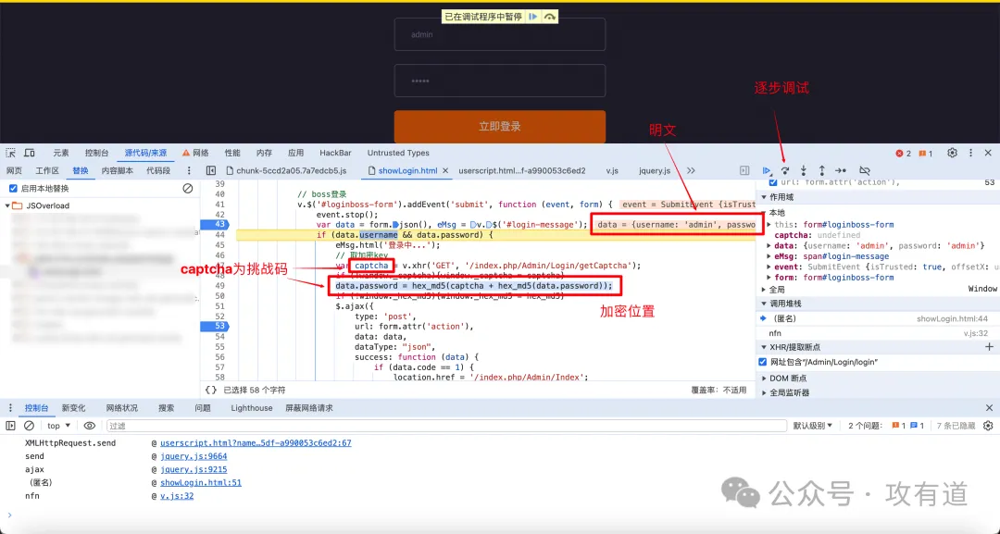
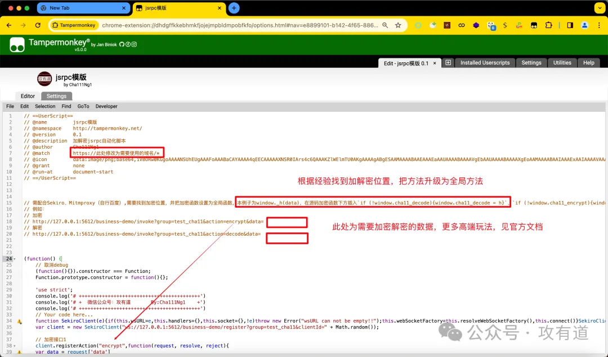
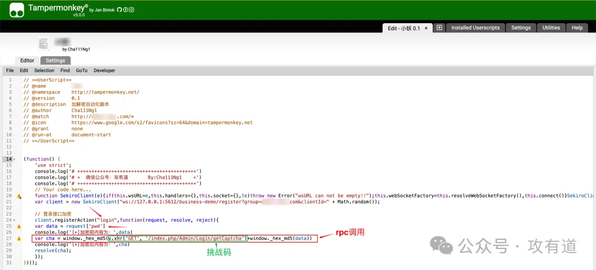
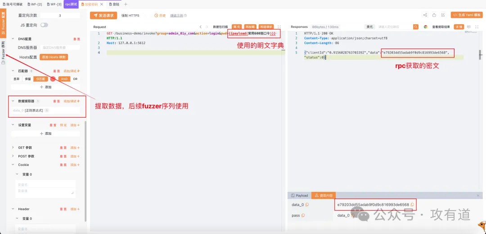
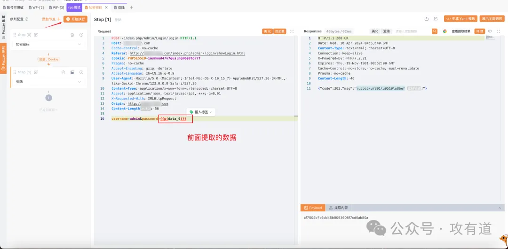
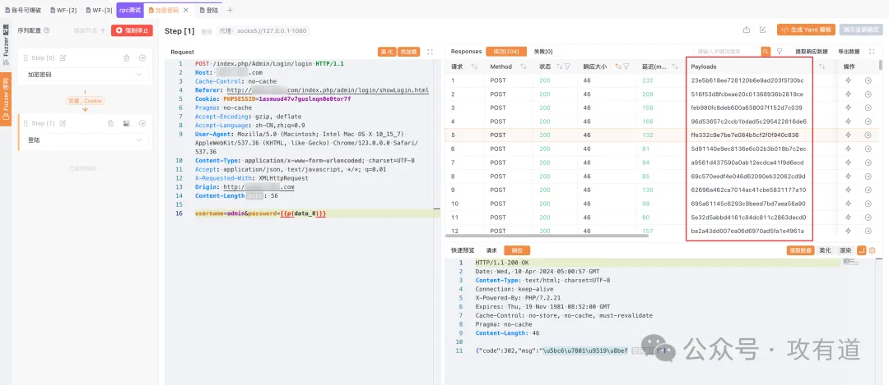

# js 逆向

## 自用油猴脚本

### 准备工作

#### 你需要知道的网站运行的时间轴

url-->加载 html-->加载 js-->运行 js 初始化-->用户触发某个事件--调用了某段 js-->明文数据-->加密函数-->加密后的 数据-->send（给服务器发信息{XHR--SEND}） -->接收到服务器数据-->解密函数-->刷新函数-->刷新网页渲染

#### 认识浏览器的调试功能

> ❝
>
> Chrome 高阶调试指南：https://zhuanlan.zhihu.com/p/62177097


#### 如何快速定位加解密函数

- 搜索关键字：登陆时的 uri、passwd、Encrypt、Decrypt、.....
- 使用一个神奇的脚本提高效率：https://github.com/Cha111Ng1/Tampermonkey_cha11/blob/main/HookScript.js

#### 如何利用加解密函数

> ❝
>
> 有一些加密函数是可以直接扣出来使用的，而有一些却不能，以下是测试过程中我常用的三种方式。

- 复原原加密逻辑
- 抠出原有 js
- rpc 主动调用

#### 当你懒，你会用什么工具？

> ❝
>
> 项目地址：https://github.com/Cha111Ng1/Tampermonkey_cha11
>
> 一个渗透测试油猴脚本库，整理常用脚本

#### HookScript.js

- 一些用于 hook 的常用断点+禁用无限 debug

```js
// ==UserScript==
// @name        「Hook Script」fuck断点
// @namespace    http://tampermonkey.net/
// @version      0.1
// @description  一些用于hook的常用断点，禁用无限debug
// @author       Cha111Ng1
// @match        http*://*/*
// @icon
// @grant        none
// @run-at       document-start
// ==/UserScript==

(function () {
	// 取消vm debug
	(function () {}).constructor === Function;
	Function.prototype.constructor = function () {};

	("use strict");
	console.log("# ++++++++++++++++++++++++++++++++++++++++++");
	console.log("# +  微信公众号：攻有道       By:Cha111Ng1    +");
	console.log("# ++++++++++++++++++++++++++++++++++++++++++");

	var userChoices = prompt(
		" ━━━━━━️☠─────── \n请选择要启动的插件（多选用逗号分隔）\n ━━━━━━️☠─────── \n1. JSON.parse调用断点\n2. 每当尝试设置document.cookie时断点\n3.每当调用XMLHttpRequest时断点\n4.当发送POST请求时断点"
	);

	if (userChoices) {
		var choicesArray = userChoices.split(",").map(function (choice) {
			return choice.trim();
		});

		choicesArray.forEach(function (chosenPlugin) {
			switch (chosenPlugin) {
				case "1":
					//alert("JSON.parse调用断点");
					var _parse = JSON.parse;
					JSON.parse = function (arg) {
						console.log("[+]「油猴」JSON.parse调用断点:", arg);
						debugger;
						return _parse(arg);
					};
					break;

				case "2":
					//alert("每当尝试设置document.cookie时断点");
					Object.defineProperty(document, "cookie", {
						set: function (a) {
							debugger;
						},
					});
					break;
				case "3":
					//alert("每当调用XMLHttpRequest.prototype.open时断点");
					var _open = XMLHttpRequest.prototype.open;
					XMLHttpRequest.prototype.open = function (
						method,
						url,
						async,
						user,
						password
					) {
						console.log(
							"[+]「油猴」调用XMLHttpRequest.prototype.open断点:",
							method,
							url
						);
						debugger;
						return _open.apply(this, arguments);
					};
					break;
				case "4":
					//alert("每当调用XMLHttpRequest.prototype.send时断点");
					var _send = XMLHttpRequest.prototype.send;

					XMLHttpRequest.prototype.send = function (data) {
						console.log("[+]「油猴」POST请求发送数据:", data);
						debugger;
						_send.apply(this, arguments);
					};
					break;

				default:
					alert("未知插件：" + chosenPlugin);
					break;
			}
		});
	} else {
		//alert("没有选择插件");
		console.log("[x]没有选择插件");
	}
})();
```

#### NoDebugger.js

- 代码中禁用无限 Debugger

```js
// ==UserScript==
// @name         代码中禁用无限Debugger
// @namespace    http://tampermonkey.net/
// @version      0.1
// @description  禁用无限Debugger
// @author       Cha111Ng1
// @match        http*://*/*
// @icon
// @grant        none
// @run-at       document-start
// ==/UserScript==

(function () {
	// 破解无限Debugger
	var constructorHook = constructor;
	Function.prototype.constructor = function (s) {
		if (s == "debugger") {
			return function () {};
		}
		return constructorHook(s);
	};
	const setInterval = window.setInterval;
	window.setInterval = function (fun, time) {
		// console.log(time, 'ddddd', fun.toString());
		if (fun && fun.toString) {
			var funString = fun.toString();
			if (funString.indexOf("debugger") > -1) return;
			if (funString.indexOf("window.close") > -1) return;
		}

		return setInterval(fun, time);
	};
})();
```

#### jsrpc.js

- 加解密 jsrpc 自动化脚本，配合 sekiro、Mitmproxy（可选）使用

```js
// ==UserScript==
// @name         jsrpc模版
// @namespace    http://tampermonkey.net/
// @version      0.1
// @description  加解密jsrpc自动化脚本
// @author       Cha111Ng1
// @match        https://此处修改为需要使用的域名/*
// @icon
// @grant        none
// @run-at       document-start
// ==/UserScript==

// 需配合Sekiro、Mitmproxy（自行百度）,需要找到加密位置，并把加密函数设置为全局函数，本例子为window._h(data)，在源码加密函数下方插入`if (!window._h){window._h = h}`
// 例如：
// 加密
// http://127.0.0.1:5612/business-demo/invoke?group=test_cha11&action=encrypt&data=
// 解密
// http://127.0.0.1:5612/business-demo/invoke?group=test_cha11&action=decode&data=

(function () {
	// 取消debug
	(function () {}).constructor === Function;
	Function.prototype.constructor = function () {};

	("use strict");
	console.log("# ++++++++++++++++++++++++++++++++++++++++++");
	console.log("# +  微信公众号：攻有道       By:Cha111Ng1    +");
	console.log("# ++++++++++++++++++++++++++++++++++++++++++");
	// Your code here...
	function SekiroClient(e) {
		if (((this.wsURL = e), (this.handlers = {}), (this.socket = {}), !e))
			throw new Error("wsURL can not be empty!!");
		(this.webSocketFactory = this.resolveWebSocketFactory()), this.connect();
	}
	(SekiroClient.prototype.resolveWebSocketFactory = function () {
		if ("object" == typeof window) {
			var e = window.WebSocket ? window.WebSocket : window.MozWebSocket;
			return function (o) {
				function t(o) {
					this.mSocket = new e(o);
				}
				return (
					(t.prototype.close = function () {
						this.mSocket.close();
					}),
					(t.prototype.onmessage = function (e) {
						this.mSocket.onmessage = e;
					}),
					(t.prototype.onopen = function (e) {
						this.mSocket.onopen = e;
					}),
					(t.prototype.onclose = function (e) {
						this.mSocket.onclose = e;
					}),
					(t.prototype.send = function (e) {
						this.mSocket.send(e);
					}),
					new t(o)
				);
			};
		}
		if ("object" == typeof weex)
			try {
				console.log("test webSocket for weex");
				var o = weex.requireModule("webSocket");
				return (
					console.log("find webSocket for weex:" + o),
					function (e) {
						try {
							o.close();
						} catch (e) {}
						return o.WebSocket(e, ""), o;
					}
				);
			} catch (e) {
				console.log(e);
			}
		if ("object" == typeof WebSocket)
			return function (o) {
				return new e(o);
			};
		throw new Error("the js environment do not support websocket");
	}),
		(SekiroClient.prototype.connect = function () {
			console.log("sekiro: begin of connect to wsURL: " + this.wsURL);
			var e = this;
			try {
				this.socket = this.webSocketFactory(this.wsURL);
			} catch (o) {
				return (
					console.log(
						"sekiro: create connection failed,reconnect after 2s:" + o
					),
					void setTimeout(function () {
						e.connect();
					}, 2e3)
				);
			}
			this.socket.onmessage(function (o) {
				e.handleSekiroRequest(o.data);
			}),
				this.socket.onopen(function (e) {
					console.log("sekiro: open a sekiro client connection");
				}),
				this.socket.onclose(function (o) {
					console.log("sekiro: disconnected ,reconnection after 2s"),
						setTimeout(function () {
							e.connect();
						}, 2e3);
				});
		}),
		(SekiroClient.prototype.handleSekiroRequest = function (e) {
			console.log("receive sekiro request: " + e);
			var o = JSON.parse(e),
				t = o.__sekiro_seq__;
			if (o.action) {
				var n = o.action;
				if (this.handlers[n]) {
					var s = this.handlers[n],
						i = this;
					try {
						s(
							o,
							function (e) {
								try {
									i.sendSuccess(t, e);
								} catch (e) {
									i.sendFailed(t, "e:" + e);
								}
							},
							function (e) {
								i.sendFailed(t, e);
							}
						);
					} catch (e) {
						console.log("error: " + e), i.sendFailed(t, ":" + e);
					}
				} else this.sendFailed(t, "no action handler: " + n + " defined");
			} else this.sendFailed(t, "need request param {action}");
		}),
		(SekiroClient.prototype.sendSuccess = function (e, o) {
			var t;
			if ("string" == typeof o)
				try {
					t = JSON.parse(o);
				} catch (e) {
					(t = {}).data = o;
				}
			else "object" == typeof o ? (t = o) : ((t = {}).data = o);
			(Array.isArray(t) || "string" == typeof t) && (t = { data: t, code: 0 }),
				t.code ? (t.code = 0) : (t.status, (t.status = 0)),
				(t.__sekiro_seq__ = e);
			var n = JSON.stringify(t);
			console.log("response :" + n), this.socket.send(n);
		}),
		(SekiroClient.prototype.sendFailed = function (e, o) {
			"string" != typeof o && (o = JSON.stringify(o));
			var t = {};
			(t.message = o), (t.status = -1), (t.__sekiro_seq__ = e);
			var n = JSON.stringify(t);
			console.log("sekiro: response :" + n), this.socket.send(n);
		}),
		(SekiroClient.prototype.registerAction = function (e, o) {
			if ("string" != typeof e) throw new Error("an action must be string");
			if ("function" != typeof o) throw new Error("a handler must be function");
			return (
				console.log("sekiro: register action: " + e),
				(this.handlers[e] = o),
				this
			);
		});
	var client = new SekiroClient(
		"ws://127.0.0.1:5612/business-demo/register?group=test_cha11&clientId=" +
			Math.random()
	);

	// 加密接口1
	client.registerAction("encrypt", function (request, resolve, reject) {
		var data = request["data"];
		console.log("[+]「油猴加密」明文：", data);
		var cha = window._v(data);
		console.log("[+]「油猴加密」密文：", cha);
		resolve(cha);
	});

	// 解密接口1
	client.registerAction("decode", function (request, resolve, reject) {
		var data = request["data"];
		console.log("[+]「油猴解密」密文：", data);
		var chaa = window._h(data);
		console.log("[+]「油猴解密」明文：", chaa);
		resolve(chaa);
	});
})();
```

### 实战

#### 脚本简单演示

> ❝
>
> 接下来我们通过一个简单的示例，初步的了解并应用以上的内容，由于是教你偷懒的教程，so 这边直接使用最快捷的方式进行操作。

##### 例子 1:寻找加密位置「HookScript.js」

首先我们使用 HookScript.js 脚本快速定位发送请求的位置，此处我们选择方式 4:





相同密码多次重复登陆但其值不一样可判断其加盐了


点击堆栈 nfn，然后下断点逐步调试，最终获得加密位置，然后可根据该加密流程写对应的脚本进行后续的渗透测试等操作。



##### 例子 2:jsrpc 主动调用「jsrpc.js」

###### 启动 sekiro

> ❝
>
> 项目地址：https://sekiro.iinti.cn/sekiro-doc

```bash
# win 运行
bin/sekiro.bat
# linux 运行
bin/sekiro.sh
# mac 运行
bin/sekiro
```


浏览器加载脚本，为方便，所以写成了油猴脚本`jsrpc.js`，加载油猴脚本



##### 登陆暴力实战「yakit+sekiro+油猴」

本例子：



配置完成后启用，并测试：

```bash
http://127.0.0.1:5612/business-demo/invoke?group=xxxxxxxx&action=login&pwd=``<明文>
```


使用 yak 进行暴力破解

> ❝
>
> 官方教程：https://www.yaklang.io/products/Web%20Fuzzer/fuzz-sequence

请求包 1 配置：



请求包 2 配置：



开始执行，即可对密码进行暴力破解，以下为效果演示



### 拓展资料

sekiro 官方手册：https://sekiro.iinti.cn/sekiro-doc

Chrome 高阶调试指南：https://zhuanlan.zhihu.com/p/62177097

项目地址：https://github.com/Cha111Ng1/Tampermonkey_cha11
