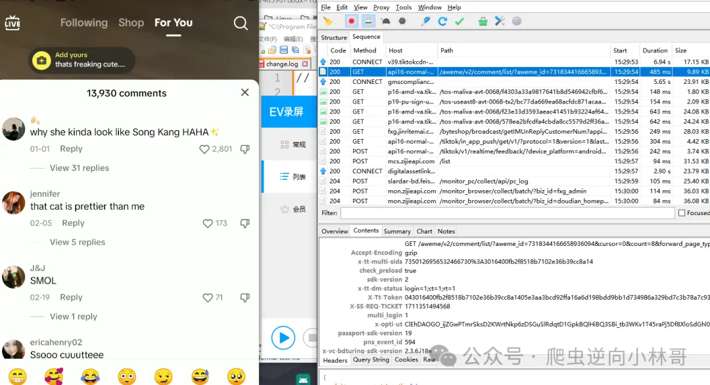
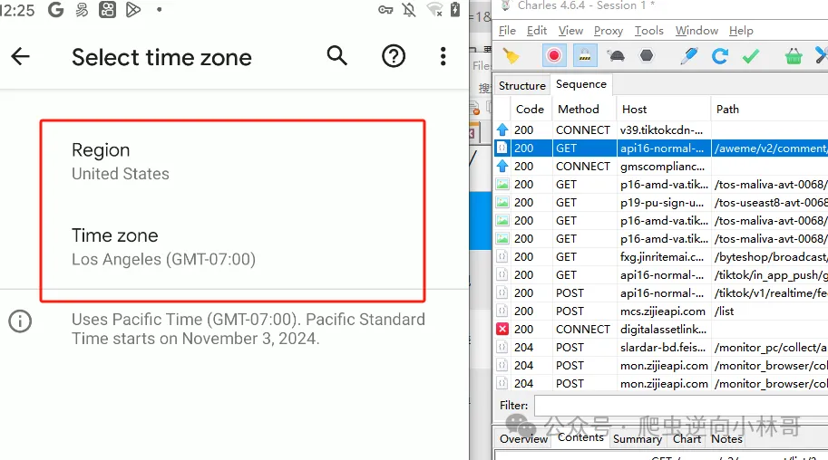
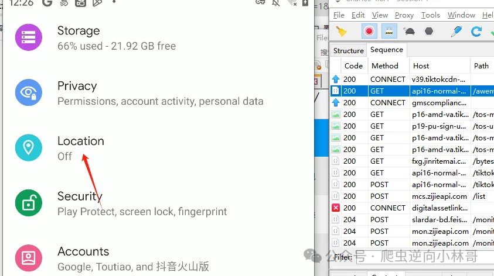
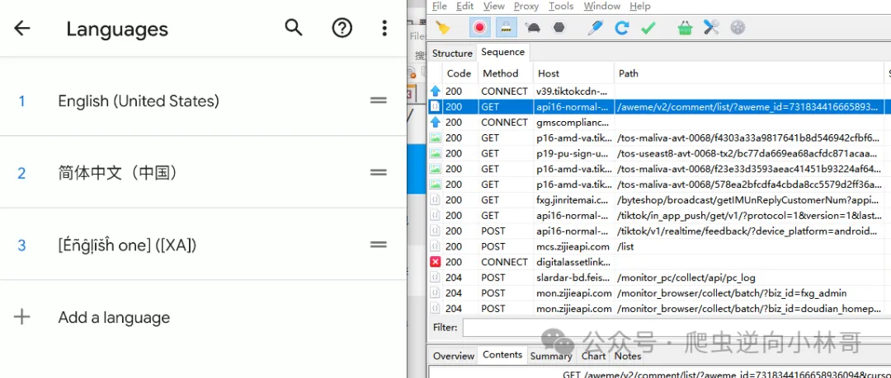
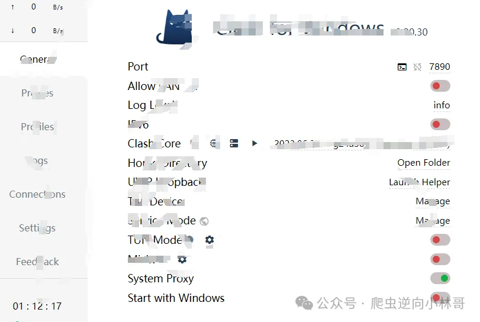
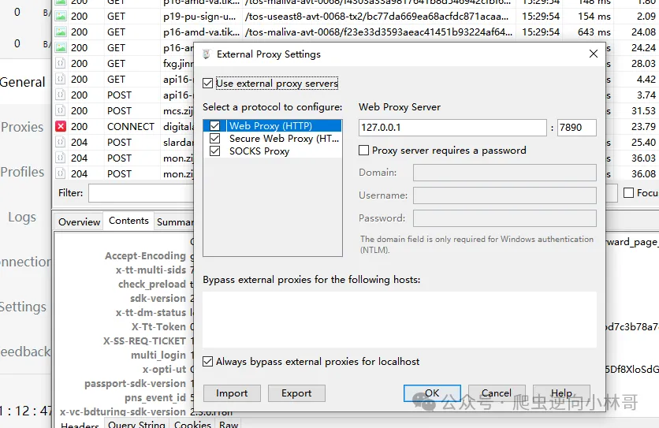
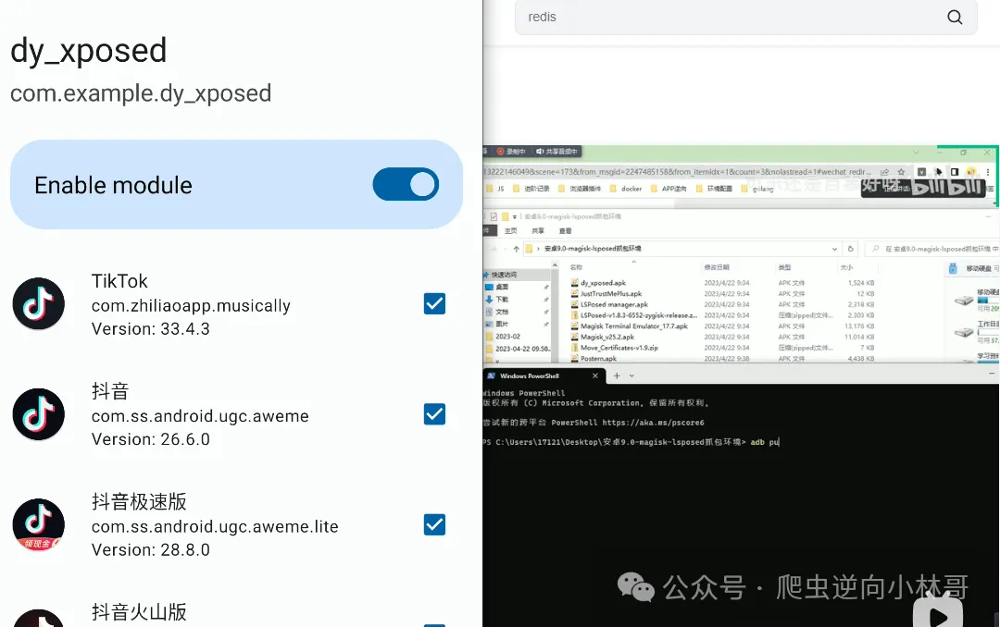

# 【安卓逆向】某音海外版tiktok抓包





## 01 逆向目标

安装包：

```
链接：https://pan.baidu.com/s/1Swvx86EpzJAk42REfX6SmQ 提取码：m3b0 --来自百度网盘超级会员V5的分享
```

## 02 设备

```
1 真机root2 vpn代理3 安卓抓包环境 （之前文章有分享）
```


## 03 网络隔断

tiktok会访问宿主机所在**位置**、**地区**、**时间**、**语言**、**运营商**等设备信息来进行访问限制。

因此我们要做的就是：

```
拔掉手机卡设置时区、时间为老美禁止app访问位置信息设置语言为英语
```


### 一：时区



### 二：禁止访问位置信息




### 三：语言为英语



然后跟之前抓某音不同的是需要开代理，然后charles打开外部代理



具体步骤可以参考：https://blog.csdn.net/dounine/article/details/78469391




最后就是Quic降级协议问题参考之前B站发的视频和CSDN的文章：

- https://blog.csdn.net/jmm18363027827/article/details/132217390
- https://www.bilibili.com/video/BV1U24y1c7Pa/


```java
Java.perform(function() {
    var targetClass='org.chromium.CronetClient';
    var methodName='tryCreateCronetEngine';
    var gclass = Java.use(targetClass);
    gclass[methodName].overload('android.content.Context','boolean','boolean','boolean','boolean','java.lang.String','java.util.concurrent.Executor','boolean').implementation = function(arg0,arg1,arg2,arg3,arg4,arg5,arg6,arg7) {
    }

})
```

改一下包名重新build一下模块或者会frida的话自己hook进行降级

当然在下也提供字节系通杀抓包模块，有啥问题可以通过下文加v沟通

