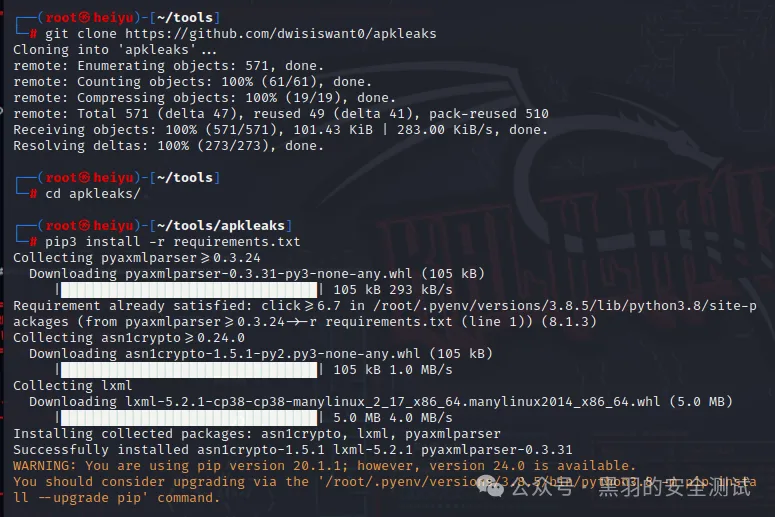

# 【车联网】车载 Android 应用攻击-逆向工具

## 静态分析工具

### 逆向工具

#### JADX

1）逆向工具jadx，最主流的逆向工具，不解释

下载地址：https://github.com/skylot/jadx

#### GDB

GDA 也是一个强大的逆向分析工具。它不仅支持基本的反编译操作 还支持恶意行为检测、隐私泄露检测、漏洞检测、路径求解、打包者识别、变量跟踪分析，解混、Python 和Java 脚本编写、设备内存提取、数据解密和加密等众多功能。另外，它只支持 Windows。

https://github.com/charles2gan/GDA-android-reversing-Tool

2）是否存在敏感字符串

检查 APK中是否存在一些敏感的明文字符串，比如Passwords、URL、API、Encryption、 Backdoors、Tokens、Bluetooth UUID。该过程可以使用反编译工具手动搜索，也可以使用以下 自动化工具。

#### apkurlgrep

地址为 https://github.com/ndelphit/apkurlgrep，可以帮助扫描出 APK 中使用的 URL。

安装步骤如下：

1) 安装apkurlgrep工具本身

2) 安装apktool，步骤如下（用的linux平台）

1. Download the Linux wrapper script. (Right click, Save Link As `apktool`)

   

   

2. Download the latest version of Apktool.

   

   

3. Rename the downloaded jar to `apktool.jar`.

   

   

4. Move both `apktool.jar` and `apktool` to `/usr/local/bin`. (root needed)

   

   

5. Make sure both files are executable. ( `chmod+x`)

   

   

6. Try running `apktool` via CLI.

   

使用方式如下：

#### apkleaks

apkleaks，地址为：https://github.com/dwisiswant0/apkleaks，可以帮助扫描APK中的密 钥、URI，可以建立自己的规则文件。

安装如下：

使用如下

