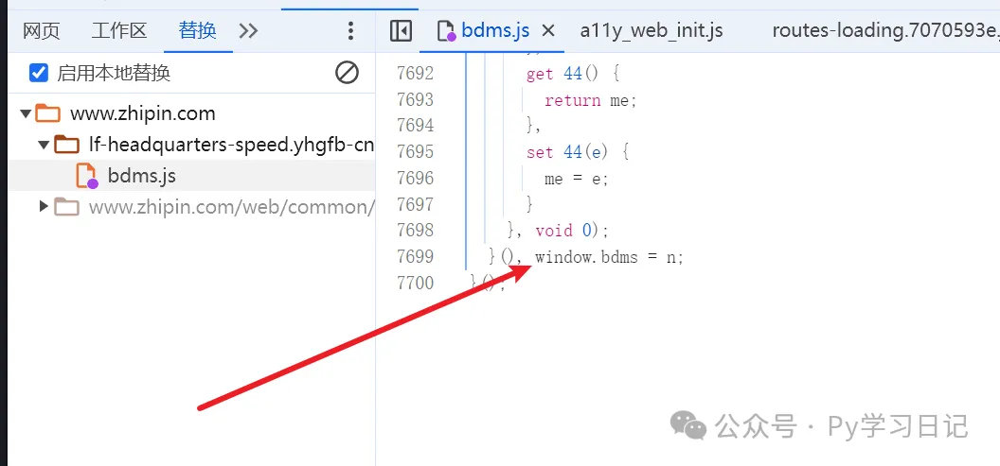
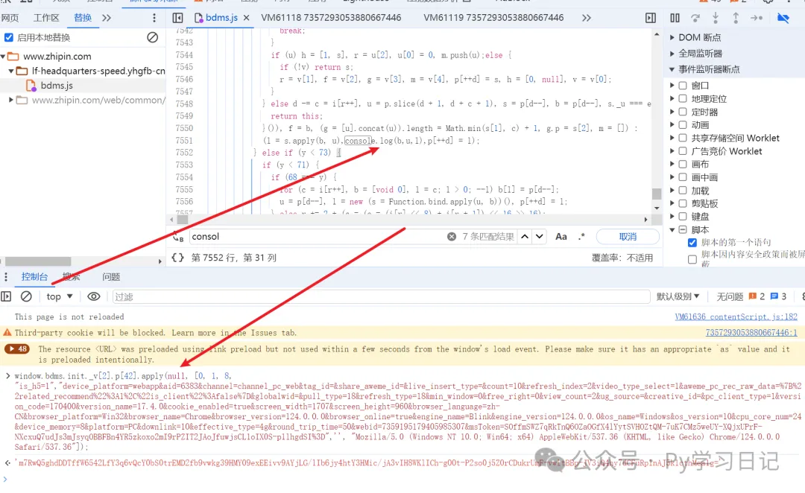
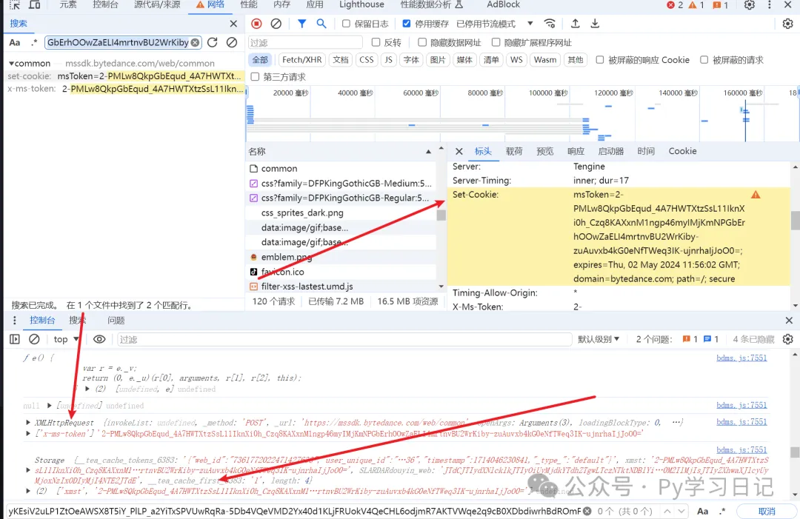
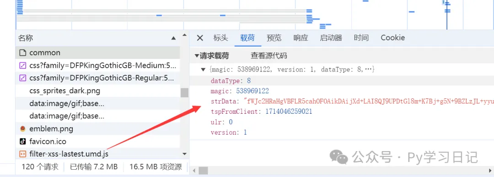
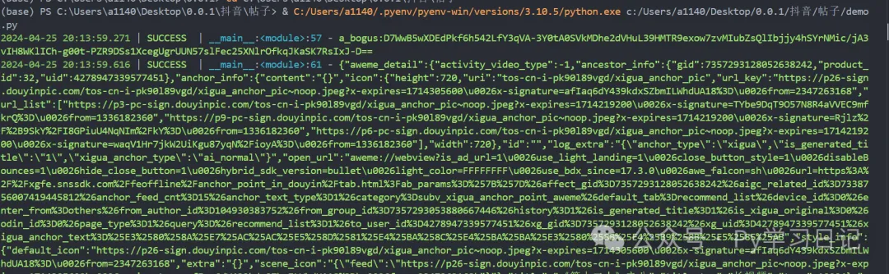

# 抖音abogus逆向分析

## 目标网站

```
aHR0cHM6Ly93d3cuZG91eWluLmNvbS92aWRlby83MzU3MjkzMDUzODgwNjY3NDQ2
```

## 插桩生成位置分析 

定位abogus定位生成的文件 window下注册了bdms，肯定有用直接插桩，至于为什么插桩这里，我将会在星球里面以视频方式讲述

## msToken和abogus

xmst = msToken
通过插桩发现xmst从Storage中取回来，Storage里从xml请求得到



多了个strData和magic参数，后续需要再分析先留坑

```
l = s.apply(b, u) vmp的经典apply调用
```

## vmp的解决思路

1. 反编译jsvmp<留坑以后再挖>
2. 插桩还原算法
3. 插桩补环境
4. 等死

我这里选择了用补环境的形式去面对,要知道vmp所有东西都是迷惑的，混淆的，唯有作用域才不会骗人，选择在合适的地方插桩就可以大致的流程，作用域赋值，if-else，函数调用等等。
直接放出最终请求成功图！



## 番外

考虑到用文字描述还原复杂，我将会在星球用视频讲解思路，欢迎来捧场！
另外5.20号之前星球会涨价，还没来的兄弟赶紧了！
联系我有优惠券进星球哦！！！
星球里面大佬多多哦！！
加我请备注来意！
加我请备注来意！
加我请备注来意！

## Next-Target

1. 后期思路是vmp反编译还原某音ab部分vmp。
2. dy，xhs全参分析
3. 阿里140
4. 主动调用Android-Wechat文本信息
5. 腾讯滑块tdc
6. 顶象
7. 数美
8. 易盾
9. js盾