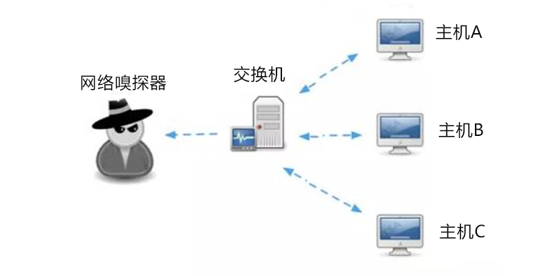

# 网络嗅探的原理和常用工具

嗅探（Sniffers）是一种网络流量数据分析的手段，常见于网络安全攻防技术使用，也有用于业务分析领域，本文主要介绍了嗅探的原理、常见的嗅探工具以及如何防范嗅探。

## 一、嗅探简介

嗅探（Sniffers）一般是指使用嗅探器对数据流的数据截获与分组分析。

任何工具均有两面性，网络管理员使用嗅探器可以随时掌握网络的真实情况，搜索网络漏洞和检测网络性能，当网络性能急剧下降的时候，可以通过嗅探器分析网络流量，找出网络阻塞的来源。

但是，黑客使用嗅探器可以攫取网络中的大量敏感信息，进行ARP欺骗手段，很多攻击方式都要涉及到arp欺骗，如会话劫持和ip欺骗。黑客使用Sniffer 可以很轻松截获在网上传送的用户账号、验证码、口令、身份证、银行卡号、等信息，冒充用户消费或套现。

## 二、嗅探的工作原理

嗅探（Sniffers）安装了嗅探器的计算机能够接收局域网中计算机发出的数据包，并对这些数据进行分析。以太网中是基于广播方式传送数据的，所有的物理信号都要经过主机节点。TCP/IP 协议栈中的应用协议大多数明文在网络上传输，明文数据可能会包含一些敏感信息(如账号、密码、银行卡号等）。使用嗅探工具后，计算机则能接收所有流经本地计算机的数据包，从而实现盗取敏感信息。由于嗅探器的隐蔽性好，只是被动接收数据，而不向外发送数据，所以在传输数据的过程中，难以觉察到有人监听。

## 三、常见的嗅探工具

dSniff

Ettercap

Tcpdump

Javvin Packet Analyzer

Kismet

Microsoft Network Monitor

NetStumbler

Network General

## 四、如何防范网络嗅探

1.对数据进行加密：对数据的加密是安全的必要条件。其安全级别取决于加密算法的强度和密钥的强度。使用加密技术，防止使用明文传输信息。

2.实时检测监控嗅探器：监测网络通讯丢包和带宽异常情况，及时发现可能存在的网络监听机器。

3.使用安全的拓朴结构：将非法用户与敏感的网络资源相互隔离，网络分段越细，则安全程度越大。

## 五、总结

嗅探（Sniffers）作为一种工具，具有正反两面性。我们要不断挖掘嗅探技术在网络管理上的价值，更要防范嗅探器的危害。

## 定义嗅探攻击

在互联网世界中，攻击者可以使用应用程序、网络、以及主机级别的硬件设备，通过执行嗅探，以读取或截获任何网络数据包中的文本信息。此类信息包括：用户名、密码、密钥、银行账号、交易记录等任何有价值的内容。我们可以简单地将此类攻击在技术上等同于物理窃取。

## 嗅探动机：

- 获取用户名和密码。
- 窃取银行和交易的相关信息。
- 监控电子邮件和聊天消息。
- 实施身份信息盗窃。

## 嗅探的类型

嗅探可分为主动和被动两种。顾名思义，主动是指：攻击者为了获取信息而进行的一系列活动或交互。而在被动状态下，攻击者只是隐蔽且被动地获取信息。下面，让我们看看两者的特点：

### (1) 被动嗅探：

此类嗅探往往发生在集线器(hub)上。由于集线器设备可以在某个端口上接收流量，然后在所有其他端口上重新转发该流量，因此，如果攻击者将嗅探器放置在集线器上，则可以直接捕获所有流经集线器的网络流量。而且，嗅探器可以长时间“安静”地在那里监控网络中的一举一动。不过，如今随着集线器使用的减少，以及被交换机所取代，这种攻击方式已显得比较老套了。

### (2) 主动嗅探：

交换机能够学习带有目标MAC地址的CAM(二层交换机地址)表。根据该表，交换机可以决定将哪个网络数据包发送到何处。在主动嗅探时，嗅探器将使用大量虚假的请求发往交换机，以填满CAM表。CAM满后，交换机将不得不把网络流量，以“合法”的形式发往所有端口，进而方便攻击者进行嗅探。

## 网络攻击的种类

MAC泛洪：如上文所述，大量的MAC地址涌入交换机，以使CAM表溢出，并方便嗅探的执行。

DNS缓存中毒：攻击者通过更改DNS的缓存记录，以便将请求重定向到恶意网站，进而捕获这些流量。由于这些恶意网站在外观上酷似真实的合法网站，因此极具欺骗性。用户一旦输入与账户相关的登录信息，就会立即被嗅探到。

邪恶双胞胎攻击(Evil Twin Attack)：攻击者通过恶意软件来更改受害者的DNS，并通过设置一对DNS，来响应各种请求。据此，攻击者可以轻松地嗅探流量，并将其重新路由到自己设定的目标网站。

MAC欺骗：为了收集到所有连接着交换机的MAC地址，攻击者将嗅探设备的MAC地址，设置为与目标主机相同，以嗅探并截获发往目标主机的消息。

## 如何识别嗅探器?

嗅探器既可能是安装在某个系统上的软件，又可能是嵌入式的硬件设备，还可能是DNS级别的嗅探器或其他网络节点。如您所知，网络在逻辑上被分为7层，每一层都有着各自的专属任务。那么嗅探攻击到底发生在哪一层上呢?总的说来，嗅探器可以从各个层次上捕获PDU(协议数据单元)，其中最常见的是第3层(网络)和第7层(应用)。而针对每一层的协议，目前都存在着非安全版本，以及对应的安全版本。下面我们来讨论那些容易受到嗅探攻击的协议：

### (1) HTTP：

超文本传输协议位于OSI模型的第7层。作为一个应用层协议，它以纯文本形式传输信息，这一般适用于静态的、或不需要用户输入任何信息的网站。其显著缺点是：任何人都可以在通信双方之间设置一个中间人攻击(Man-in-the-Middle Attack，MITM)的代理，用来接受所有流量，甚至修改某些数据流。随着Web 2.O时代的到来，为了用户之间交互的安全性，我们需要使用HTTP的安全版本(即HTTPS)，来保证数据流在离开第7层时就已经被加密了。

### (2) TELNET：

Telnet是一种客户端-服务器协议，它可以通过虚拟终端来提供通信功能。由于Telnet在默认情况下并不加密通信内容，因此那些有权访问到客户端和服务器所连接的交换机或集线器的攻击者，都可以嗅探到Telnet的通信内容，进而获取用户名和密码等信息。用作不安全Telnet的替代协议，SSH能够对流量进行加密，进而保证数据的机密性和完整性。

### (3) FTP：

FTP常被用于在客户端和服务器之间传输文件。为了进行身份验证，FTP使用了纯文本的用户名和密码机制。不过，和Telnet类似，攻击者完全可以通过嗅探流量，以获取身份凭据，进而访问到服务器上的所有文件。FTP既可以通过SSL/TLS来进行加固，也可以被更安全的SFTP(SSH的文件传输协议)所代替。

### (4) POP：

电子邮件客户端可以使用POP协议，从邮件服务器上下载邮件。由于同样使用纯文本机制进行通信，因此该协议也容易受到嗅探攻击。其后续的版本--POP2和POP3，都比原始版本要安全得多。

### (5) SNMP：

简单网络管理协议(SNMP)可被用于与网络上的受管理设备进行通信。对于通信过程中的各种往来消息，SNMP使用社区字符串(community string)来执行客户端的身份验证。由于community string传输的是明文形式的密码，因此SNMP早已被SNMP V2和V3所取代，其中V3被认为是最新且最安全的。

## **优秀嗅探工具**

### (1) Wireshark：

作为一款开源的数据包捕获器和分析器，Wireshark支持Windows和Linux等操作系统。而作为Tcpdump的替代品，该工具是基于GUI的。Wireshark使用pcap去监控和捕获那些来自网络接口的数据包，并根据IP地址、协议和许多其他参数，对数据包进行过滤。不同的数据包可以基于相关性被分组或标记。据此，我们可以按需进行选择和分解。

### (2) dSniff：

dSniff可以被用于对各种网络协议进行分析和密码嗅探。它可以从FTP、Telnet、POP、rLogin、Microsoft SMB、SNMP、以及IMAP等协议中获取信息。

### (3) Microsoft network monitor：

顾名思义，它可以被用于针对网络数据包进行捕获、分析、以及故障排查。在功能上，该软件支持大量(300多种)协议、无线监控模式、以及碎片消息的重组等。

### (4) Debookee：

它是一款付费工具，可用于监控和分析网络。不论目标设备是笔记本电脑、网络设备、甚至是电视，它都可以拦截和分析来自其所在子网中数据流量。通常，Debookee能够提供如下三种模块：

- 网络分析模块：扫描已连接的设备，拦截子网中的流量，扫描TCP端口，对HTTP、DNS、TCP、以及DHCP协议在网络层面上进行分析和监控，分析VoIP呼叫等。
- WiFi监控模块：提供覆盖范围内的各种AP、无线客户端、WiFi统计等详细信息。
- SSL/TLS解密模块：支持监控和分析各种安全协议。

### 一、Wireshark

Wireshark是一款功能强大的网络协议分析器，支持数百种网络协议，可以运行在Linux、Windows、macOS等多个平台上。它提供了丰富的过滤和显示选项，可以帮助用户快速定位感兴趣的数据包。此外，Wireshark还支持动态gzip解压功能，可以方便地查看压缩过的数据包内容。

### 二、tcpdump

tcpdump是一款轻量级的网络嗅探工具，它可以在命令行界面下捕获并显示网络中的数据包。tcpdump支持多种过滤条件，可以根据源地址、目的地址、端口号等条件来筛选数据包。此外，tcpdump还可以将捕获到的数据包保存到文件中，供后续分析。

### 三、dsniff

dsniff是一款集成了多种网络嗅探功能的工具套件，包括arpspoof、dnsspoof、webspoof等。dsniff可以通过伪造ARP响应来欺骗目标主机，使其将数据包发送到嗅探器所在的机器上。此外，dsniff还可以伪造DNS响应，将目标主机的DNS请求重定向到指定的服务器。

### 四、ettercap

ettercap是一款功能强大的网络嗅探和攻击工具，它支持多种嗅探和攻击模式，包括ARP欺骗、DNS欺骗、会话劫持等。ettercap具有友好的图形化界面，方便用户进行操作。同时，ettercap还提供了丰富的插件系统，可以通过安装插件来扩展其功能。

### 五、bettercap

bettercap是一款基于Ruby编写的网络嗅探和攻击工具，它具有简单易用的图形化界面和强大的功能。bettercap支持多种嗅探和攻击模式，包括ARP欺骗、DNS欺骗、HTTP代理等。此外，bettercap还提供了丰富的API接口，方便用户进行自定义扩展。

### 六、netsniff-ng

netsniff-ng是一款基于libpcap库开发的网络嗅探工具，它支持多种操作系统和硬件平台。netsniff-ng具有高效的数据包捕获和分析能力，可以捕获并分析大量的网络数据。此外，netsniff-ng还支持多种输出格式，包括文本、XML、JSON等。

### 七、cain

cain是一款专注于无线网络安全的嗅探工具，它支持802.11a/b/g/n等多种无线协议。cain提供了多种无线网络攻击手段，包括暴力破解、字典攻击、密钥恢复等。此外，cain还提供了图形化界面和详细的操作指南，方便用户进行操作。

## 防范嗅探攻击的措施

(1) 连接到受信任的网络中：请不要为了“蹭网”，连接隔壁咖啡店提供的不受信任的免费Wi-Fi。攻击者往往会利用用户缺乏网络安全意识的特点，在公共网络中实施流量嗅探，或者自行创建与既有网络ID相似的新网络，以诱骗受害者“入局”。特别是在机场，您会发现有许多名称类似“免费机场Wi-Fi”的无线网络。说不定其中就暗藏着攻击者的嗅探器节点。因此，请您只连接到家庭或办公室之类受信任的网络中。

(2) 加密!加密!加密!重要的事情说三遍：请对离开本系统的所有流量进行加密，以确保即使流量被嗅探到，攻击者也将无法理解其“字面意思”。例如：使用了HTTPS协议加密流量的网站，显然比只使用HTTP的网站更加安全。当然，值得注意的是：单纯的加密也并非万无一失，攻击者很可能会通过捕获大量的数据，运用解密工具来寻找特征，进而破解。因此，请您根据深度防御原则(defense in depth principle)，做好多层次的安全加固。

(3) 网络扫描和监控：您必须定期对目标网络进行扫描，以查找可能以span模式捕获流量的入侵尝试，或是任何类型的恶意设备。此外，我们还需要实时监控目标网络，以尽早发现那些处于混杂模式的设备，以及网络中被安置的嗅探器。