# 不刷固件武装家用路由器

> ❝
>
> 路由器型号：Redmi 路由器 AC2100

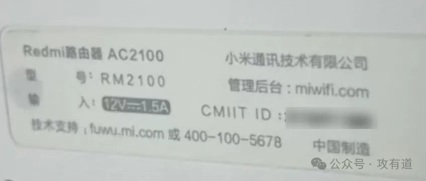

# **开启路由器 SSH**

> ❝
>
> `<STOK>`为登陆后 get 请求所带凭证，其他小米品牌路由器我在网上看到都差不多，大家可自行百度。

- 开启 ssh

```bash
http://192.168.31.1/cgi-bin/luci/;stok=<STOK>/api/misystem/set_config_iotdev?bssid=Xiaomi&user_id=longdike&ssid=-h%3B%20nvram%20set%20ssh_en%3D1%3B%20nvram%20commit%3B%20sed%20-i%20's%2Fchannel%3D.*%2Fchannel%3D%5C%22debug%5C%22%2Fg'%20%2Fetc%2Finit.d%2Fdropbear%3B%20%2Fetc%2Finit.d%2Fdropbear%20start%3B
```

- 修改 root 用户密码为 admin

```bash
http://192.168.31.1/cgi-bin/luci/;stok=<STOK>/api/misystem/set_config_iotdev?bssid=Xiaomi&user_id=longdike&ssid=-h%3B%20echo%20-e%20'admin%5Cnadmin'%20%7C%20passwd%20root%3B
```

当然也可 ssh 后修改密码：`passwd root`

测试 SSH 连接，看到雷总 ARE U OK 了没，看见了的话，你就成功了。

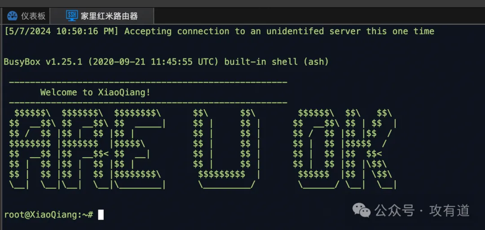

# **安装科学工具**

成功登陆 SSH 后，直接输入以下命令，根据提示完成安装，如不成功可排查网络原因等，或试试项目的其他源：https://github.com/juewuy/ShellCrash/blob/master/README_CN.md

```
#作者私人源
export url='https://gh.jwsc.eu.org/master' && sh -c "$(curl -kfsSl $url/install.sh)" && source /etc/profile &> /dev/null
```

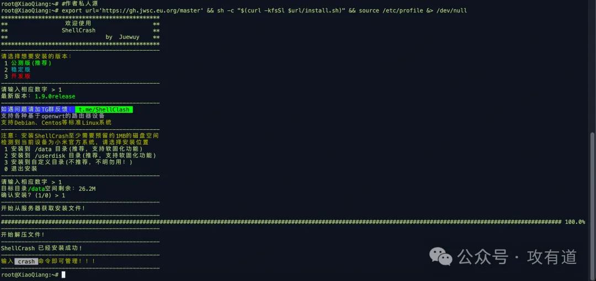

安装完成后，直接在 SSH 中使用`crash`命令即可管理脚本！你也可以使用`crash -h`，命令查看帮助列表。

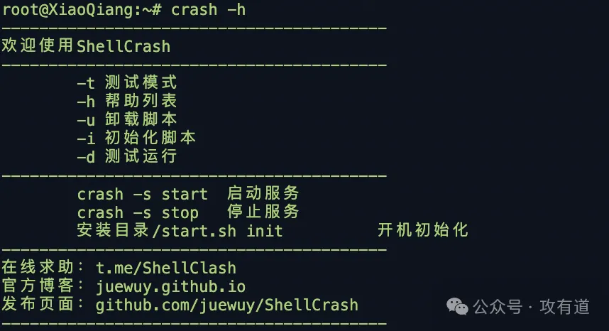

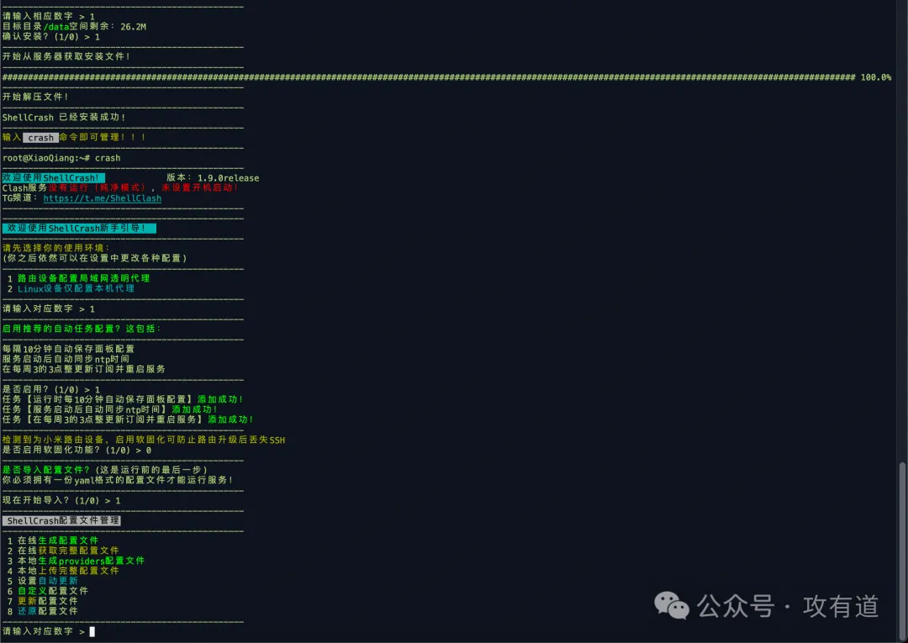

## **安装 crash 本地 WEB 面板**

建议安装本地面板，比较方便，在线的我存在连接不上的问题。

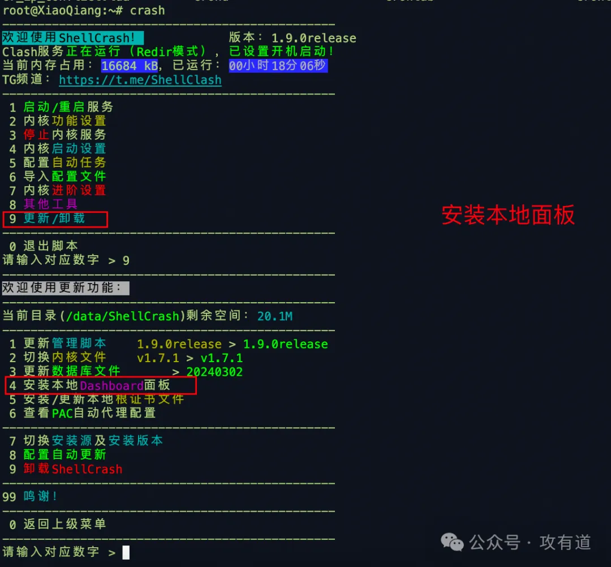


测试效果（远程的家里电脑所以有点糊）


# **安装内网穿透**

查看系统架构：`uname -a`

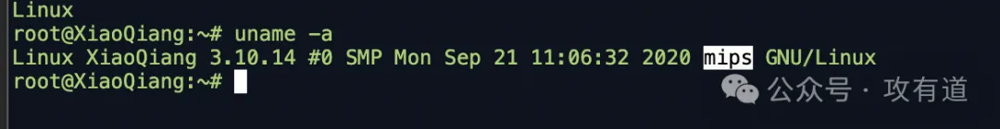

这边可看到是 mips 架构的，可去 nps 的 GitHub 下载该架构的二进制客户端程序（大家可根据自身路由器的情况去下载合适的版本），下载地址：https://github.com/ehang-io/nps/releases。

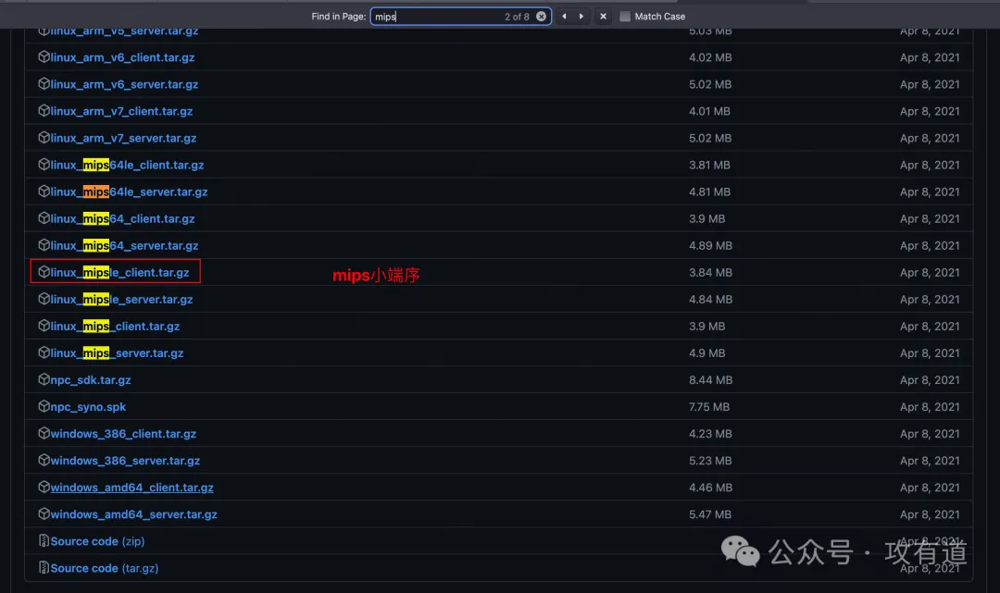

## **测试运行 NPC**

首先想办法把二进制文件下载到路由器上，我这款路由器 wget 和 curl 命令都是有的，这里我直接用`wget http://1.1.1.1:8080/npcle`,自己在另外的局域网电脑上起一个 web 服务供下载。

选择合适的应用二进制程序，启动测试

```
# 后台保持运行加上&
./npcle -server=1.1.1.1:8024 -vkey=xxxxxxxx -type=tcp &
```

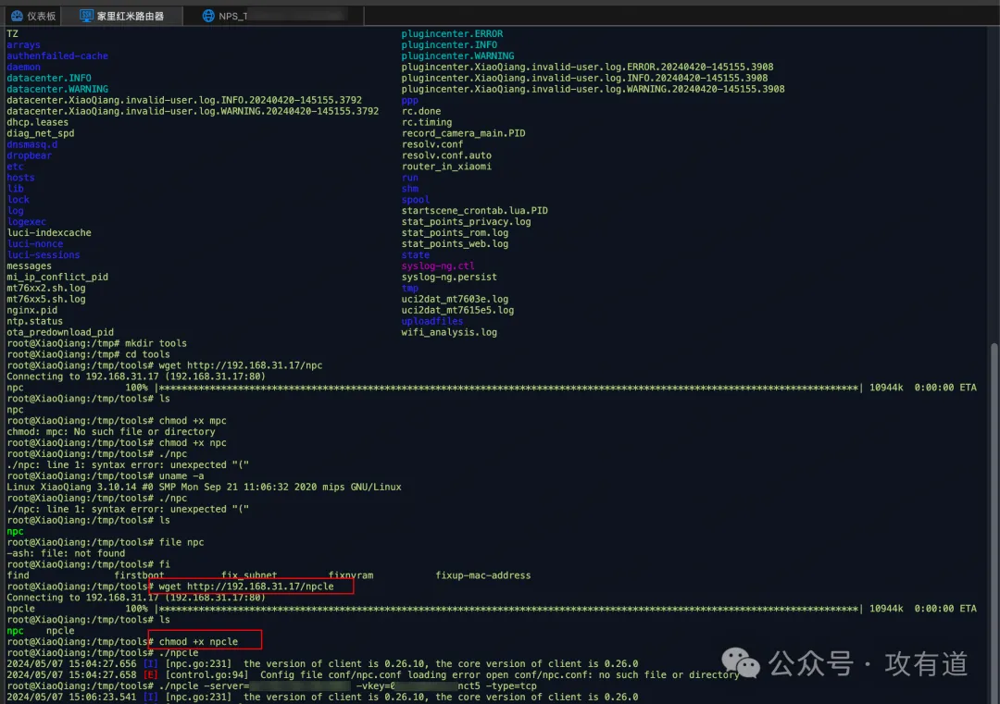

连接成功


测试代理，在 nps 后台添加 socks5 代理，连接 socks5 代理，测试远程桌面


## **设置开机自启 NPC**

### **方法一：使用 crash 工具的自动任务功能**

使用到我们装好的 crash 工具，选择下列选线，将我们上面的命令保存到`l.sh`文件，赋予可执行权限。

```
# 命令行执行,./npcle换成你的二进制的绝对路径，1.1.1.1你NPS服务器的IP，xxxxxxxx你NPS后台设置的秘钥
echo "./npcle -server=1.1.1.1:8024 -vkey=xxxxxxxx -type=tcp" >> /data/l.sh && chmod +x /data/l.sh
```

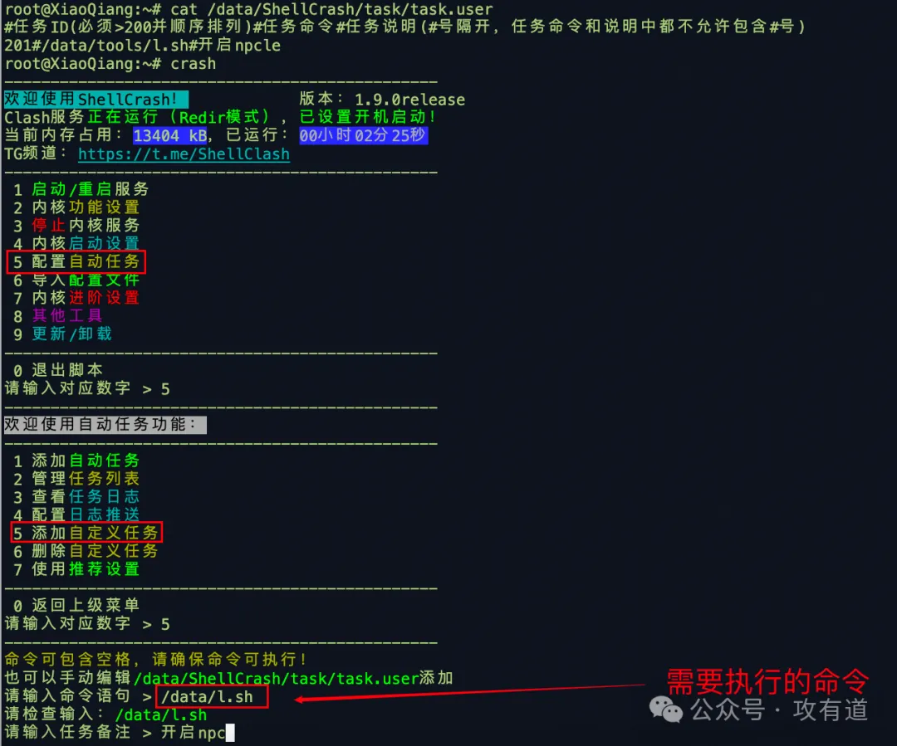

### **方法二：/etc/rc.local**

> ❝
>
> `/etc/rc.local` 文件在类 Unix 系统中用于定义系统启动时运行的脚本或命令。这个文件允许系统管理员在系统启动过程中执行特定的初始化任务，这些任务通常不由系统的主初始化机制（如 `systemd`、`System V` 或 `Upstart`）直接处理。

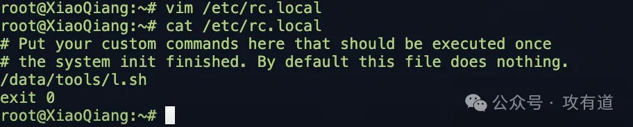

# **拓展资料**

红米 AX6 解锁 SSH,安装使用 ShellClash 教程：https://www.wifilu.com/1991.html

折腾日记：记红米 AC2100 开启 SSH 的经历:https://zhuanlan.zhihu.com/p/451636593

红米 AC2100 一键开启 SSH:https://zhuanlan.zhihu.com/p/260531160

恩山无线论坛：https://www.right.com.cn/forum/thread-8321180-1-1.html
