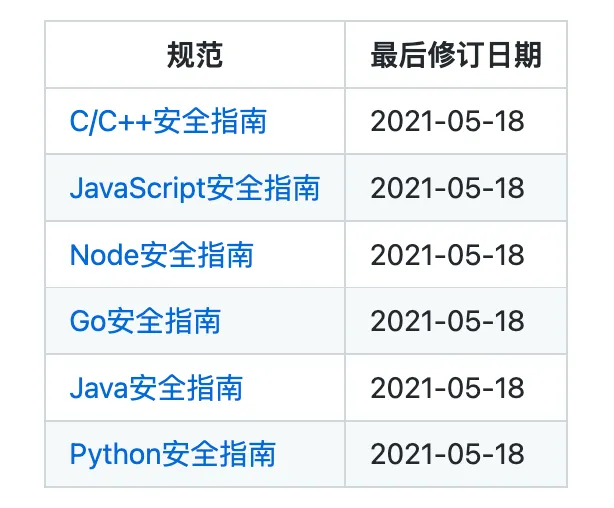
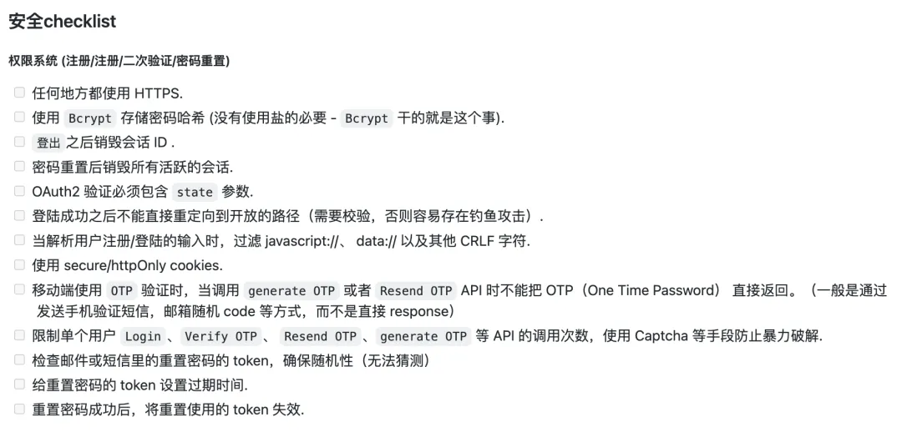
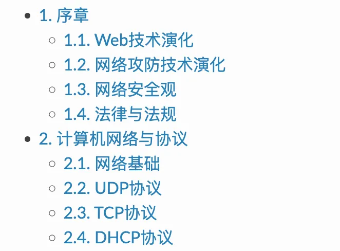
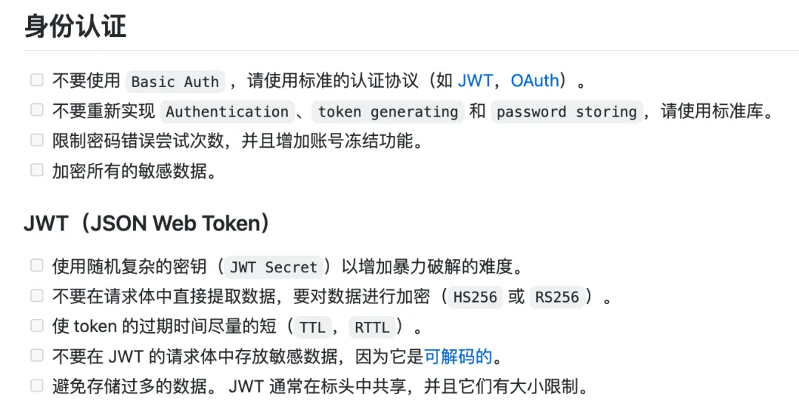
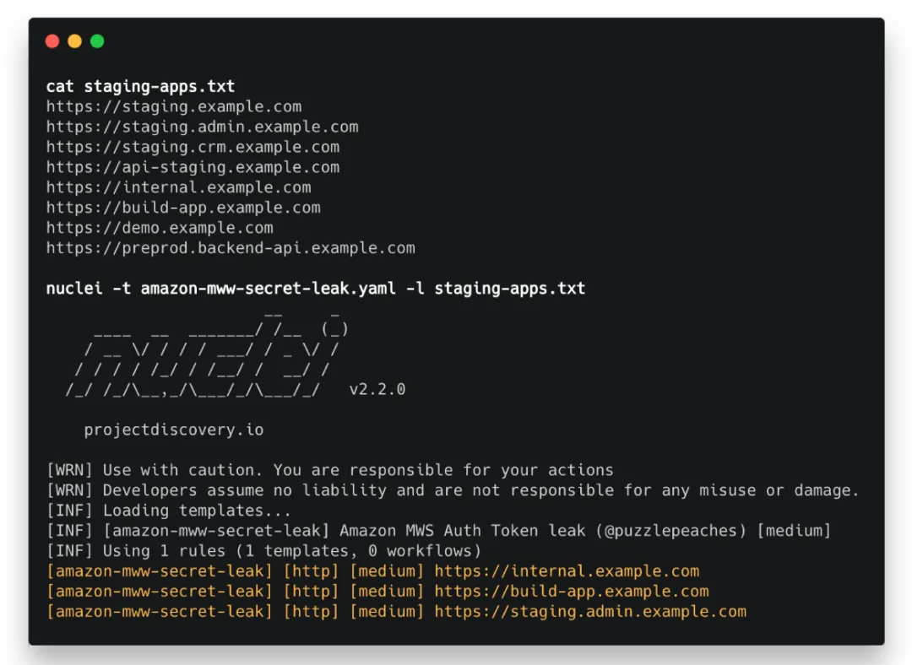
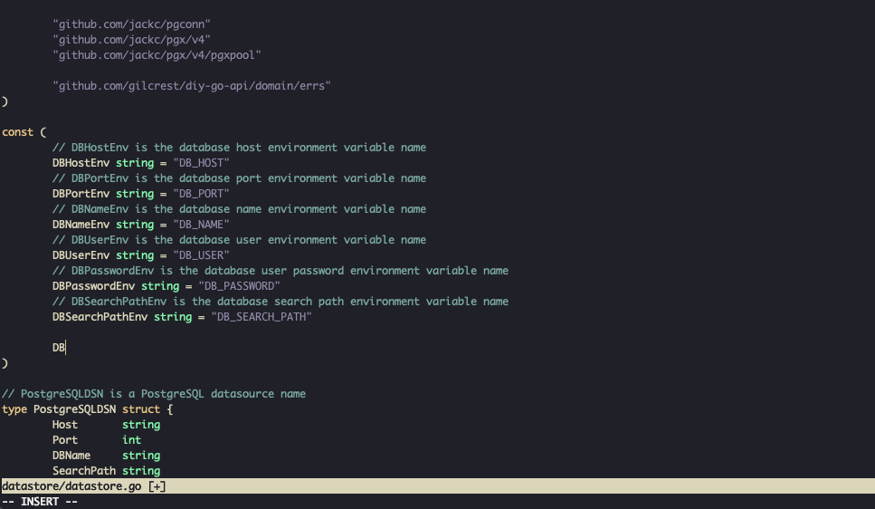
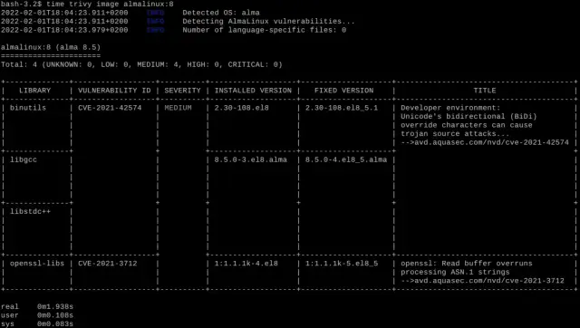
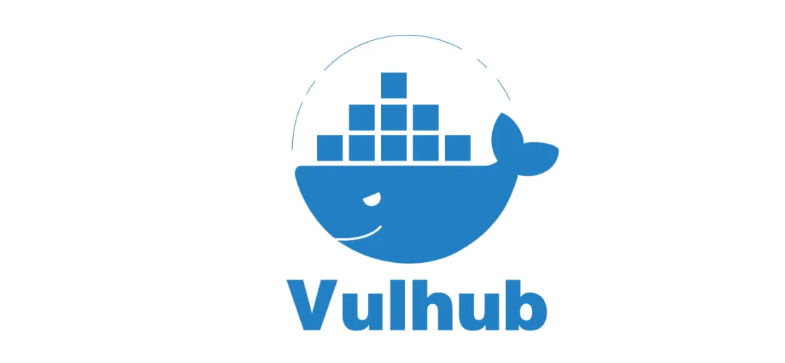

# 安全相关的开源项目

开源为我们的开发带来了极大便利，但这些便利也伴随着一些安全隐患。每当项目引入一个库、框架、服务时，随之而来的安全风险也不可忽视。

所以，当开源吞噬世界的时候，代码安全就更得重视了。今天 HelloGitHub 就给大家带来了 10 款关于安全主题的开源项目，涵盖了编码安全、Web 安全、工具三个方面，虽不能做到面面俱到，但希望它可以抛砖引玉，借此唤起大家的安全意识。

如果你早就认识到代码安全的重要性，那这些开源项目中肯定也有适合你的一款，话不多说，下面就开始今天的“安全教育”。

# 恶意软件源码

[vxunderground/MalwareSourceCode：以一系列不同的编程语言收集各种平台的恶意软件源代码。 (github.com)](https://github.com/vxunderground/MalwareSourceCode)

## 一、编码安全

从编码习惯入手，提高安全意识。

### 1、secguide

腾讯开源的代码安全指南。该项目包含：C/C++、Python、JavaScript、Java、Go 等语言的安全编码指南，内容简单易懂能够帮助开发者，在代码源头规避安全风险、减少漏洞。

> 地址：https://github.com/Tencent/secguide

### 2、safe-rules

由 360 质量工程部开源的《代码安全规则集合》。一份全面详细的 C/C++ 编程规范指南，适用于桌面、服务端以及嵌入式等软件开发。

> 地址：https://github.com/Qihoo360/safe-rules

## 二、Web 安全

通过检查容易出错的地方，从而保证 Web 服务的安全性。

### 3、security-guide-for-developers

实用的 Web 开发人员安全须知。作为一个 Web 开发者，你应该在实际工作中认真、经常地使用这套列表，能够有效地减少安全隐患。

> 地址：https://github.com/FallibleInc/security-guide-for-developers

### 4、Learn-Web-Hacking

一份很全面的 Web 安全学习笔记，内容包括网络协议、信息收集、常见漏洞攻防、内网渗透等。

> 地址：https://github.com/LyleMi/Learn-Web-Hacking

### 5、Top10

该项目由 OWASP 社区（开放式 Web 应用程序安全项目）一个致力于提高软件安全性的非盈利基金会维护，OWASP Top 10 是针对 Web 应用程序的 10 大安全风险提示。

> 地址：https://github.com/OWASP/Top10

### 6、API-Security-Checklist

开发安全的 API 所需要核对的清单。在设计、测试和发布 API 的时候，需要核对的重要安全措施。

> 地址：https://github.com/shieldfy/API-Security-Checklist

## 三、工具

代码千万行，安全第一行。代码量多了，就得借助工具来发现安全隐患啦。

### 7、nuclei

基于 YAML 语法模板的定制化快速漏洞扫描器，工程师可以轻松地使用它创建一套自定义的检查方式。

- 支持多种协议：TCP、DNS、HTTP 等
- 通过工作流和动态请求实现复杂的漏洞扫描
- 易于集成到 CI/CD，可以轻松的集成到发布流程上

> 地址：https://github.com/projectdiscovery/nuclei

### 8、gitleaks

一款静态应用程序安全测试(SAST)工具。它可以检测 Git 项目中是否包含密码、API Key、token 等敏感信息，还能够轻松整合到 Git Hook 和 GitHub Action，实现提交代码时自动检测，通过告警和阻止 push 等方式，有效地防止敏感信息泄漏。

> 地址：https://github.com/zricethezav/gitleaks

### 9、trivy

一款全面的容器安全扫描工具。当下最流行的开源容器镜像漏洞扫描工具，拥有速度快、精准度高、依赖检测、机密检查、对 CI 友好等特点。它不仅安装简单而且容易上手，仅需一条命令，即可发现镜像存在的安全漏洞。

> 地址：https://github.com/aquasecurity/trivy

### 10、vulhub

一个面向大众的开源漏洞环境集合。无需 Docker 知识，仅需通过一条简单的命令，就能跑起来一个存在某个漏洞的完整应用。使得安全研究人员能够方便地复现与研究漏洞，省去了学习复杂的部署知识、寻找有漏洞的旧版本应用、搭建依赖的服务等麻烦。

> 地址：https://github.com/vulhub/vulhub