# 网络安全教程

[信安之路私密内容 - 信安之路 (xazlsec.com)](https://wiki.xazlsec.com/static/forder.html)


# 汽车黑客知识体系

## 摘要

汽车安全是一个涉及到车辆电子系统和通信网络的重要领域。随着汽车技术的不断发展，包括智能驾驶功能和互联网连接性的增加，汽车面临着越来越多的安全挑战。常见的汽车安全问题包括:远程攻击、物理安全、CAN总线攻击、远程钓鱼攻击、软件漏洞、加密和认证、安全意识培训等。本篇文章将展示汽车安全的一些基础必备知识及基础攻击手法。

## CAN协议

CAN（Controller Area Network，控制器局域网）协议是一种用于实时控制系统中的通信协议。它最初由德国公司Bosch开发，用于汽车电子系统中，但现在已经广泛用于其他领域，如工业自动化、船舶、飞机等。

CAN协议的主要特点包括：

1. 实时性：CAN协议具有很高的实时性，能够满足对实时性要求较高的应用需求。
2. 高可靠性：CAN协议采用了冗余校验机制，能够自动检测和纠正错误，提高了通信的可靠性。
3. 抗干扰性：CAN总线采用差分信号传输，具有很强的抗干扰能力，能够在恶劣的工作环境下稳定运行。
4. 多主机结构：CAN总线支持多主机结构，多个节点可以同时发送数据，提高了总线的利用率。
5. 灵活性：CAN协议具有很高的灵活性，能够支持不同的数据传输速率和数据帧格式，满足不同应用的需求。

汽车黑客攻击也需要掌握基础知识，有点像在进行网络黑客攻击之前了解TCP/IP一样。汽车电子设备使用多种不同的协议在多个微控制器、传感器、仪表、执行器等之间进行通信。其中最广泛使用的协议是Controller Area Network（控制器局域网或CAN）。

CAN作为广播类型的网络运行，类似于以太网中的广播数据包或集线器（上世纪80-90年代的古董）。网络上的每个节点都可以“看到”每个传输。与以太网或TCP/IP不同（但类似于SCADA系统中的modbus），不能向单个节点发送消息，但CAN确实提供本地过滤功能，以使每个节点仅对其操作相关的消息做出响应。可以将此视为“内容消息传递”，其中内容确定目标节点。

CAN通过两根线路进行传输，分别是CAN高线和CAN低线。由于汽车系统中固有的“噪音”，CAN使用差分信号传输。协议通过调整两根线的电压来进行通信。在高速和低速CAN中，当发送零（0）时，信号将使高线向5V和低线向0V变化，但在发送1时，不会改变任何一根线的电压。


**CAN消息类型**

CAN使用四种不同类型的消息：

1. 数据帧（Data Frame）
2. 远程帧（Remote Frame）
3. 错误帧（Error Frame）
4. 过载帧（Overload Frame）

**(1).数据帧**

这是唯一用于数据传输的帧。在大多数情况下，数据源节点发送数据帧。

它有两种类型，标准和扩展。标准帧有11位标识符位，扩展帧有29位。CAN标准要求基本数据帧必须被接受，扩展帧必须被容忍，换句话说，它不会破坏协议或传输。

**(2).远程帧**

当数据目标节点请求数据源时使用远程帧。

**(3).错误帧**

错误帧有两个不同的字段，第一个由错误标志位给出，并由不同站点贡献，第二个是错误分隔符，简单地指示错误消息的结束。

**(4).过载帧**

过载帧有两个字段。这些是过载标志和过载分隔符。过载帧在接收器的内部条件触发或在传输过程中检测到主导位（0）时触发。

## 汽车诊断接口（OBD）II连接器

现在大多数汽车都配备了OBD-II连接器。如果将汽车送到修理店维修，机械师将连接其计算机到仪表板下的这个连接器，以读取车载计算机的信息。

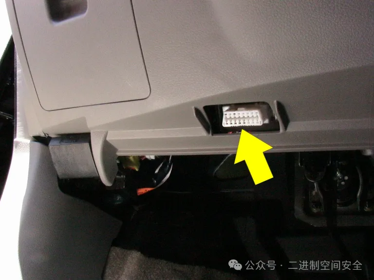

OBD-II有16个引脚，外观如下图所示。

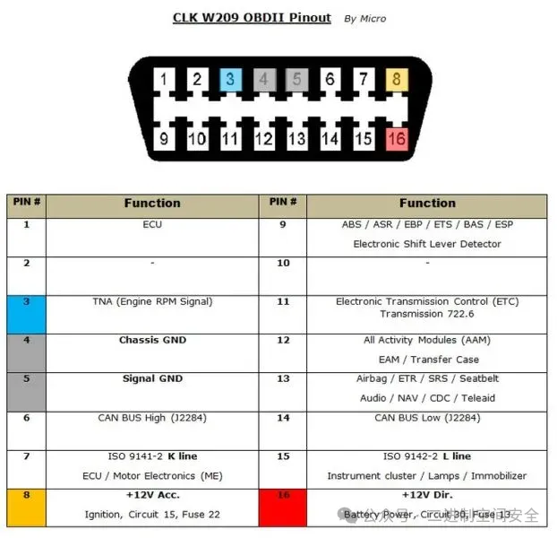

作为一个黑客/攻击者，也可以连接到这个OBD-II连接器，并在CAN网络上向各种设备发送消息。

**(1).CAN总线数据包布局**

CAN数据包有两种类型，标准和扩展。扩展数据包与标准数据包共享相同的元素，但扩展数据包有额外的空间来包含ID。

**标准数据包**

每个CAN数据包都有四个关键部分。它们是：

- 仲裁ID: 仲裁ID是发送数据包的设备的ID。

- 标识符扩展: 这一位对于标准CAN总是为0。

- 数据长度代码（DLC）:这表示数据的大小，从0到8个字节。

- 数据:这是消息中的数据。正如上面提到的，它可以长达8个字节。

正如上面提到的，所有的CAN数据包都是广播的，所以每个设备或控制器都可以看到每个数据包。没有任何设备能够知道哪个控制器发送了数据包（没有返回地址），所以在CAN网络上伪造消息是很简单的。这是CAN的一个关键弱点之一。

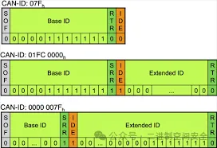

**(2).扩展CAN数据包**

扩展CAN数据包与标准CAN数据包相同，但它们被链接在一起以创建更长的ID。扩展CAN与标准CAN向后兼容。这意味着如果传感器没有设计用于接受扩展CAN数据包，这个系统不会出现故障。

**(3).安全性**

由于CAN是一种低级协议，它没有内置任何安全特性。默认情况下，它没有加密或身份验证。这可能导致中间人攻击（没有加密）和欺骗攻击（没有身份验证）。一些制造商在关键任务系统上已经实施了身份验证机制，例如修改软件和控制刹车，但并非所有制造商都已实施。即使在已实施密码的情况下，它们也相对容易被破解。

## Can-Utils和SocketCAN

can-utils是什么？

CAN是一种为车辆设计的基于消息的网络协议。最初由罗伯特·博世有限公司创建，这也是开发CAN协议的同一团队。此外，SocketCAN是由大众研究贡献给Linux内核的一组开源CAN驱动程序和网络堆栈。

**步骤1：安装can-utils**

如果使用的是Kali或其他基于Debian的存储库，可以使用apt-get下载并安装can-utils。

```
**kali > apt-get install can-utils**
```

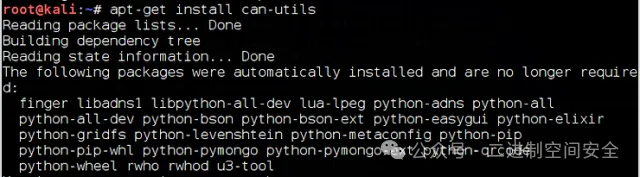

如果没有使用Kali存储库或没有can-utils的任何存储库，可以使用git clone命令从github.com下载can-utils。

```
kali > git clone https://github.com/linux-can/can-utils
```

**(1).can-utils的基础知识**

CAN实用工具是用于在Linux操作系统中处理车辆内CAN通信的工具。这些工具可以分为几个功能组：

- 显示、记录、生成和回放CAN流量的基本工具
- 通过IP套接字访问CAN
- CAN内核网关配置
- CAN总线测量
- ISO-TP工具
- 日志文件转换器
- 串行线规程（slc）配置

**(2).显示、记录、生成和重放CAN流量的基本工具**

- candump: 显示、过滤和记录CAN数据到文件

- canplayer: 重放CAN日志文件

- cansend: 发送单个帧

- cangen:生成（随机）CAN流量

- cansniffer: 显示CAN数据内容的差异（仅11位CAN ID）

**(3). 通过IP套接字访问CAN**

- canlogserver: 从远程/本地主机记录CAN帧

- bcmserver: 交互式BCM配置（远程/本地）

- socketcand: 通过TCP/IP套接字使用RAW/BCM/ISO-TP套接字

**(4).CAN内核网关配置**

- cangw: 用于netlink配置的CAN网关用户空间工具

**(5). CAN总线测量和测试**

- canbusload: 计算和显示CAN总线负载

- can-calc-bit-timing: 内核比特率计算的用户空间版本

- canfdtest: 全双工测试程序（DUT和主机部分）

**(6). ISO-TP工具ISO15765-2:2016适用于Linux**

- isotpsend: 发送单个ISO-TP PDU

- isotprecv: 接收ISO-TP PDU

- isotpsniffer: ‘窃听’ISO-TP PDU

- isotpdump: ‘窃听’并解释CAN消息（CAN_RAW）

- isotpserver: 用于简单TCP/IP <-> ISO 15765-2桥接（ASCII HEX）的IP服务器

- isotpperf: ISO15765-2协议性能可视化

- isotptun: 通过ISO-TP在CAN上创建双向IP隧道

**(7). 日志文件转换器**

- asc2log: 将ASC日志文件转换为紧凑的CAN帧日志文件

- log2asc: 将紧凑的CAN帧日志文件转换为ASC日志文件

- log2long: 将紧凑的CAN帧表示转换为用户可读格式

**(8). 串行线规程配置（用于slcan驱动程序）**

- slcan_attach: 用于串行线CAN接口配置的用户空间工具

- slcand: 用于串行线CAN接口配置的守护进程

- slcanpty: 为使用slcan ASCII协议的应用程序创建一个pty

## 建立虚拟CAN网络

首先，加载vcan（虚拟CAN）模块:

```
kali > modprobe vcan
```

然后, 设置虚拟接口:

```
kali > ip link add dev can0 type vcan

kali > ip link set up vcan0
```


一旦设置了虚拟CAN连接（vcan0），就可以使用ifconfig命令来测试它是否已启动，就像在Linux中查看任何其他接口一样。

```
kali > ifconfig vcan0
```

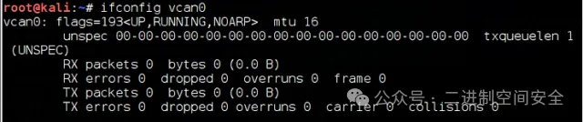

已经准备好开始处理CAN通信了。现在只需要将Linux操作系统连接到车辆上。有许多设备、方法和连接类型可以实现这一点。

## 利用Metasploit渗透汽车

Metasploit工具已经开发了连接汽车的能力和模块, 如果你的Metasploit版本没有硬件模块，可以输入msfupdate来获取最新版本和模块。值得注意的是，Metasploit在这个领域的耕耘才刚刚开始，框架在汽车黑客方面的能力相对有限，但相信在不久的将来有更多的汽车黑客模块。现在要解决的重要事情就是：“该如何将Metasploit框架连接到汽车网络？”


上面已经介绍过CAN协议,并且该协议是一个串行协议, 现在要做的就是通过串行接口连接到汽车的CAN协议, 从那里可以使用Metasploit中的几个预先构建的模块向汽车网络发送恶意流量。

**第一步: 获取OBD II连接器硬件**

现在需要有一种设备，能够连接到汽车的OBD II连接器, 这里可以选择相对便宜的蓝牙OBD II迷你接口, 里面包含ELM327芯片组。

ELM327芯片组是一种用于汽车诊断和车辆数据获取的芯片。它是一款非常流行的汽车诊断工具，可以通过车辆的OBD-II接口d与车辆通信，获取诊断数据、车辆参数以及故障码等信息。ELM327芯片组可以通过与智能手机、平板电脑或计算机等设备连接，使用相应的软件进行数据读取和分析，帮助车主或专业技师诊断车辆故障、监控车辆性能等， 通过蓝牙连接到电脑和Metasploit。

**第二步:安装串行端口**

使用以下命令安装:

```
kali > gem install serialport
```

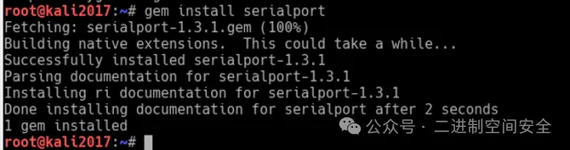

**第三步:连接到ELM327上的蓝牙**

接下来需要连接我们的蓝牙适配器, 以便与汽车中的ELM327适配器通信, 值的注意的是, 这里需要将ELM327放置在汽车的ODB II连接器中,并在汽车上启动工具。

要连接到ELM327设备, 首先需要知道它的MAC地址, 也可以使用内置工具hcitool扫描蓝牙设备, 并获取到目标MAC地址。

```
kali > hcitool scan
```

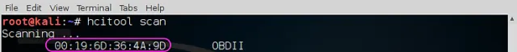

之后,需要使用该Mac地址将蓝牙适配器与汽车连接, 确保使用双引号将MAC地址括起来，如图:

```
kali > rfcomm connect /dev/rfcomm1 “00:19:6D:36:4A:9D”
```


**第四步:运行ELM327中继程序**

这一步是运行ELM 327中继程序，使Metasploit能够与ELM 327芯片组通信。可以通过转到/usr/share/metasploit-framework/tools/hardware来找到它。

```
kali > cd /usr/share/metasploit-framework/tools/hardware

kali > ls -l
```


在运行之前,首先看下帮助界面:

```
kali > ruby elm327_relay.rb -h
```

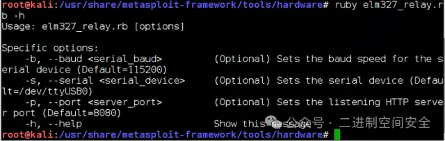

如上图所示,基本上只需要两个参数；速度（默认为115200）和串行设备（默认为/dev/ttyUSB0）。要确定使用哪个串行设备, 可以运行Linux实用程序dmesg（显示消息）并使用“tty”进行grep。在这里，显示的是ttyS0。

现在，使用串行设备运行elm327中继，并将速度保留在默认设置下，如下所示。

```
kali >ruby elm327_relay.rb -s /dev/ttyS0
```

**第五步:启动Metasploit**

现在已经配置了Kali Linux与ELM 327设备进行通信，还需要创建一个硬件桥接到Metasploit。记住，Metasploit是通过TCP/IP进行通信的, 现在需要它通过串行端口与汽车原生的CAN协议进行通信。

首先，启动Metasploit。

```
kali > msfconsole
```

搜索automotive模块,如图:

```
kali > search automotive
```

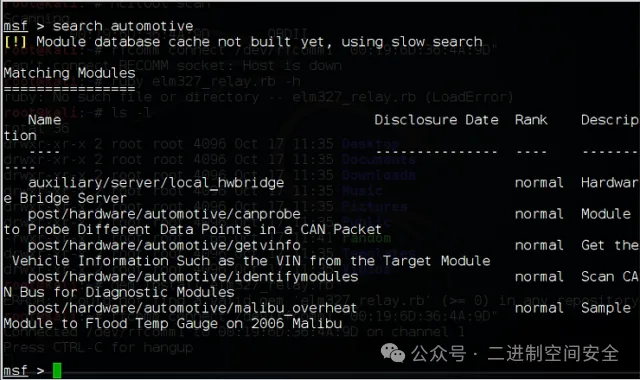

目前实际上只有几个汽车模块，它们的功能有限, 但后续肯定会越来越多。

现在这里需要使用auxiliary/client/hwbridge/connect模块。可以通过输入以下命令加载它：

```
msf >use auxiliary/client/hwbridge/connect
```

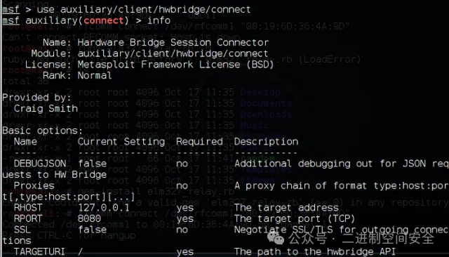

加载后，可以键入info获取有关此模块的更多信息, 如图:

```
kali > info
```

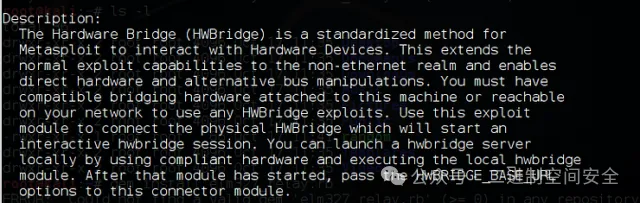

最后，执行该模块来创建硬件桥接:

```
msf >exploit
```

**第六步:使用Metasploit汽车模块**

现在已经在Metasploit和车辆中的CAN协议之间创建了硬件桥接，可以开始使用Metasploit的汽车黑客模块。


例如，如果想要检索车辆的信息，可以使用post/hardware/automotive/getvinfo模块。

```
msf > use post/hardware/automotive/getvinfo
```

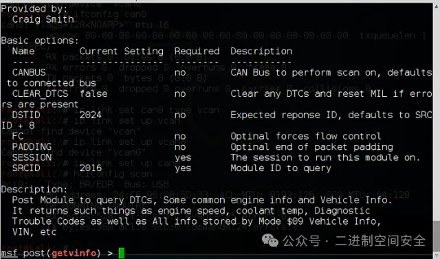

当输入该模块的info时，可以看到该模块将查询并收集所有车辆的DTC（诊断故障代码）和其他信息，例如速度、冷却液温度、VIN甚至可以清除DTC。

现在，可以直接将Linux系统和Metasploit框架连接到汽车网络，直接与汽车设备进行通信了。