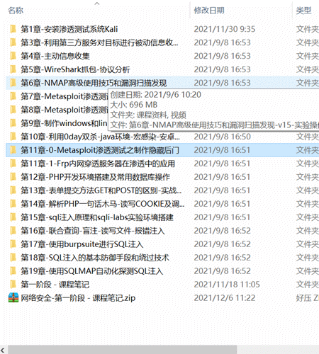

# 网络安全相关环境

## 做过的实战项目-内网实战靶场环境-渗透工具

在大多数的思维里总觉得学习网络安全得先收集资料、学习编程、学习计算机基础，自学那么久，看了那么多视频，还是挖不到漏洞，无法拿出自己最得意的作品。

整理了以前很多收藏过的储备内容。

网络安全是一门技术，任何技术的学习一定是以实践为主的。很多的理论知识其实是可以在实战中去验证拓展的，相对而言学习起来，比起看书、钻研理论要事半功倍，只有不断的实战，培养自己的思维，才能把技术运用自如。

对于学习来说，有内容引导会比自学要高效的多，自学困难的朋友不妨试试下面这些资料，面向零基础到找工作企业级项目内容，先不用担心跟不上，每个阶段的资料我都配备了对应的练习实战项目，可以在学习完理论知识后，直接去靶场练习（靶场环境在下面），在实践中加深理解并且拓展学习，坚持下来会发现其实学习网络安全非常容易

