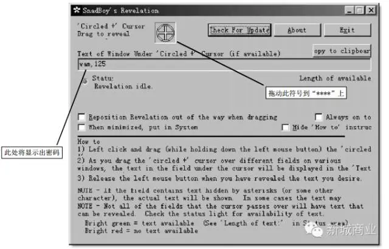
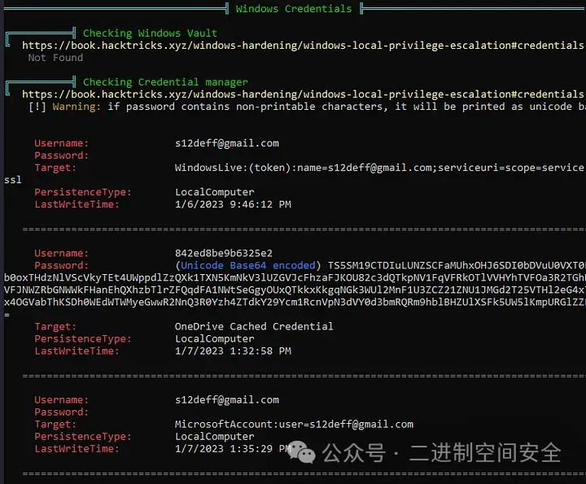
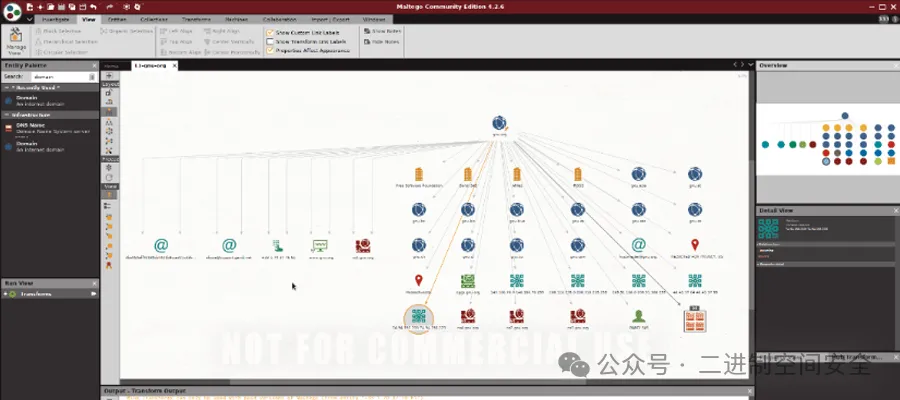

# 黑客工具系列

要学习黑客知识，必须要熟悉黑客们常用的工具。

黑客常用的工具软件大致可分为四类：**扫描器，炸弹，木马，破解器**。其实黑客工具软件虽然很多，但用法都大同小异，下面分类对几种有影响力的黑客工具软件的使用进行介绍。

## 扫描器

每一个黑客手中都有一两个用得顺手的扫描器，扫描器在一个老练的黑客手里有着相当大的作用。利用扫描器，黑客可以对某一网段的机器或是某台目标机器进行快速漏洞扫描，因为传统的手工查找，不但查找漏洞的速度过于缓慢，而且多数情况下只能针对某一个特定的漏洞，有点大海捞针的味道。

而扫描器就是一种快速寻找目标机多种漏洞的工具，它很容易找到系统的漏洞和弱点，根据扫描器最后提供的漏洞报告和信息，黑客可以很方便地采用合适的攻击方法给目标机以致命的一击。

扫描器中最常用的就是 **X-Scan** 和 **SuperScan**。对于 SuperScan，我们在上次的文中已经作过简单介绍，这里就以 X-Scan 为例来进行介绍。

同 SuperScan 一样，X-Scan 也是一款功能非常强大的扫描软件，大家可到各大软件网（比如非凡软件站）下载其最新版本 **V3.3**，该软件是由国内著名安全站点“安全焦点”开发的，是一个完全免费的软件。

X-Scan 运行在 Windows 平台下，它主要针对 Windows 操作系统的安全进行全面细致评估，可以扫描出很多 Windows 系统流行的漏洞，并详细指出安全措施的脆弱环节与弥补措施。它采用多线程方式对指定 I P 地址段（或单机）进行安全漏洞扫描，支持插件功能，提供了图形界面和命令行两种操作方式。

**扫描内容包括**：远程操作系统类型及版本，标准端口状态及端口 BANNER 信息，SNMP 信息，CGI 漏洞，IIS 漏洞，RPC 漏洞，SSL 漏洞，SQL-SERVER、FTP-SERVER、SMTP-SERVER、POP3-SERVER、NT-SERVER 弱口令用户，NT 服务器 NETBIOS 信息、注册表信息等。

PS：黑客最常用的还是有些服务器的 SQL 默认账户、FTP 弱口令和共享扫描，他们甚至能揭示出经验丰富的网管犯的一些低级错误。

---

X-Scan 是完全免费软件，无需注册，无需安装（解压缩即可运行），无需额外的驱动程序支持。其中，xscan_gui.exe （图形界面主程序）与 xscan.exe （命令行主程序）共用所有插件及数据文件，但二者之间没有任何依赖关系，均可独立运行。

**如图，最新版目前只保留了图形界面的主程序（xscan_gui.exe ）**


大家注意，使用中可能会遇到这样的问题

**很简单~下载一个 npptool.dll 就行啦~哇哈哈**


X-Scan 的使用非常简单，对于菜鸟黑客来讲，推荐使用其图形界面，即运行 xscan_gui.exe 程序，然后点击工具栏的扫描参数按钮，在选择如图的扫描模块设置对话框，勾选想要扫描的模块，确定。


再点击扫描参数按钮 ，设置要扫描的 I P 地址范围，在这里可以填写一个针对某一个特定的网站或服务器，也可以填写一个 I P 段范围来扫描一段 I P 地址上所有的计算机（格式参照图中示例）。最后点击开始扫描按钮即可按你的需要进行扫描。在这里，黑客还可以设置代理服务器的 I P 地址来躲避对方的追查。


扫描结束，X-Scan 会将扫描结果保存在 /log/ 目录中，`index_*.htm` 为扫描结果索引文件。对于一些已知漏洞，X-Scan 给出了相应的漏洞描述，利用程序及解决方案。

## 破解软件

除了采用猜测的方法猜测对方的密码外，还可以采用专门的破解软件来破解密码，下面我们就来见识一下黑客常用的一些破解软件。

### 1. 网络刺客 Ⅱ（英文名: NetHacker Ⅱ）

网络刺客 Ⅱ 是天行出品的专门为安全人士设计的中文网络安全检测软件， 大家可自行下载。用它可以轻松搜索出局域网里有共享的主机，然后对共享机器的共享资源进行扫描，并且猜解共享密码；其嗅探器功能还可截获局域网中使用的 POP3 、FTP、Telnet 服务时的密码。

现在的小区宽带也是局域网的一种哦，网络刺客 II 可以大展身手了。软件下载解压后，双击其中的主程序 nethacker.exe 就可以打开天行软件之网络刺客 I I 了。选择“主机资源”下面的“搜索共享主机”命令，然后输入想要扫描的 I P 地址范围，再点击“开始搜索”按钮即可开始搜索带有共享的主机，搜索完毕会在主界面的左下侧显示搜索结果。


#### 网络刺客 Ⅱ 的运行主界面

PS：如果没有搜索结果，可以试着将个人网络防火墙关闭再试试。

---

在左下角的小窗口中选择相应的主机并展开它，在相应的共享资源中右击鼠标按键，或者打开“共享资源”菜单选择相应的选项，将需要访问的目录“映射成网络硬盘”，如果右侧显示映射成 I ，J ，K 等驱动符，则表示映射成功，这样就可以直接在“我的电脑”中打开远端电脑的相应目录了。


如果本地电脑设置了共享密码，则可以利用其内置的密码猜解进行穷举破解。在指定的共享资源中右击鼠标，在弹出菜单中选择“共享猜解机”；或者打开“猜解机”菜单中的“共享资源”选项，输入正确的目标 I P 地址，在点按“开始猜解”以前，先要进行正确的字典设置，这是成败的关键所在。“字典设置”包括有 4 个标签页，主标签中包括有用户名和密码字典文件的选择，在这里你可以自己定义适当的密码字符集及组合方法和密码长度。

另外，网络刺客 Ⅱ 还集成了一些相关的网络工具，包括有 I P 与主机名转换器、Finger 客户查询工具、主机端口扫描工具以及主机查找器、域名查找器、Telnet 客户端程序等，在工具箱中还可以查看网络状态（netstat）和自己的 I P 地址，通过这些工具的使用可以极大地增强大家对网络的了解和认识。

### 2. SnadBoy’s Revelation

SnadBoy’s Revelation 是一个小巧强大的密码揭示工具，可以查看 Windows 中的“**”密码，包括一些应用程序（如邮件客户端程序、FTP 程序等）中保存的“** ”密码，大家自行去下载（这个软件比较难找）。



只需用鼠标左键拖动十字框到 密码上，即可将密码显示出来。这种查看法破解器比强力破解软件破解速度要快得多。

温馨提示：学会了~别干坏事哦~~

PS：小榕的“流光”也是一款黑客们喜欢使用的破解工具，它既是一款具有强大功能的扫描软件，又兼备强大的破解和攻击功能。

---

### 3. L0phtCrack 5.0 或 6.0（简称 lc5/6）

LC 是目前最流行的 Windows 密码破解工具。这个工具可以实现从保存密码的 Sam 文件中进行密码刺探破解，对于可以取得 Sam 文件的情况来说，选用它是最好的获取对方登录密码的办法，大家自行下载（目前很多国产软件以及汉化等安装程序捆绑流氓插件，大家在安装的时候务必留意每一个安装步骤，很多默认的小对勾~~千万别不知不觉的安装一堆捆绑软件 or 插件）。它不仅能够破解 Windows 的密码，还具备本地导入或远程导入密码的功能。

打开 LC，并新建一个任务。然后依次点击“导入（IMPORT）”|“从 SAM 文件导入（Importfrom SAM file）”，打开等待破解的 SAM 文件。此时 LC 会自动分析此文件，并显示出文件中的用户名。之后点击“任务（Session ）”中的“开始破解（Begin Audit）”，即可开始破解密码。如果密码不是很复杂的话，很短的时间内就会有结果。（无所谓 LC5.0/6.0，都可以使用。版本不同界面会有些许不同，但大同小异，这里就不上图了哦）

如果破解不出结果，可以选择“任务”下的“破解选项”，选择更全面的密码列表，并且**激活职能模式**和**暴力模式破解**，然后再选择“任务”栏下的“重新开始破解”命令。如果是 6 位数密码，很快就可以得到结果。

PS：大家可以根据用户名手工添加一些可能的密码在密码列表里，增大破解的可能性。

需要提醒大家注意的是，每开始一个新的破解任务都需要**重新选择字典文件**。否则，默认是简易密码文件。

## 木马

“特洛伊木马程序（简称木马）”技术是黑客常用的攻击手段。它通过在你的电脑系统隐藏一个会在 Windows 启动时运行的程序，采用服务器／客户机的运行方式，从而达到在上网时控制你电脑的目的。

黑客利用木马可以窃取你的口令、浏览你的驱动器、修改你的文件、登录注册表等等，如很久前流传极广的冰河木马。现在流行的很多病毒也都带有木马性质，如之前影响面极广的“Nimda ”、“求职信”和“红色代码”及“红色代码 Ⅱ”等。攻击者可以佯称自己为系统管理员（邮件地址和系统管理员完全相同），将这些东西通过电子邮件的方式发送给你。如某些单位的网络管理员会定期给用户免费发送防火墙升级程序，这些程序多为可执行程序，这就为黑客提供了可乘之机，一旦用户打开了这些邮件的附件或者执行了这些程序之后，它们就会像古代特洛伊人在敌人城外留下的藏满士兵的木马一样留在自己的电脑中，令很多用户在不知不觉中遗失重要信息。

### 1. Back Orifice 2000（简称 BO2K）

BO2K 是黑客组织“死牛崇拜”(Cult Dead Cow)开发的曾经令人闻之色变的黑客程序。它可以通过 Internet 去控制远端机器的操作并取得信息，黑客可以利用它搜集信息，执行系统命令，重新设置机器，重新定向网络等。

只要远程机器执行了 BO2K 的服务端程序，黑客就可以连接这部机器，利用它作为控制远程机器和搜集资料的工具。大家自己下载（好烦~我每次都要说同一句话~但切记小心捆绑的软件）。软件下载后不需安装，解压后即可使用。

BO2K 程序主要包括以下 3 个可执行程序：

① bo2k.exe ：这是服务器程序，它的作用就是负责执行远程用户所下的命令，我们通过它执行我们想要的动作，它可以正常地运行在安装了 Windows 98 和 Windows NT 的计算机当中。

② bo2kgui.exe：这是 BO2K 的控制程序，其主要作用就是用来控制服务器端程序执行我们想要的命令。当远程机器执行了该服务器程序后，你就可以使用 BO2K 的远程控制程序，通过网络连接获得对方系统的完全访问权限。

③ bo2kcfg.exe：这是服务器设置程序，在使用 BO2K 服务器程序之前，有一些相关的功能必须通过它来进行设置。如：使用的 TCP/IP 端口、程序名称、密码等。

PS:由于 BO2K 的特殊性，在解包的过程中，可能会被一些具有即时监控功能的杀病毒软件认为是病毒，从而无法继续执行，如果要使用 BO2K 必须关掉病毒监控程序。

在将 BO2K 服务器端程序发到远程机器运行之前，需要先运行 bo2kcfg.exe 文件启动“BO2K 配置向导”进行配置。向导会指导用户进行几个设置，包括服务器文件名( 可执行文件)、网络协议(TCP 或 UDP)、端口、密码等。

配置完成以后会出现的“BO2K 服务器配置”主界面，用鼠标单击“打开”按钮，在弹出“打开”对话框中选择你的服务器端 BO2K.exe 文件（解压缩后目录中的 BO2K.EXE 文件），再返回对 BO2K 服务器文件进行更详细的设置。

服务器端程序配置完毕，将它发送给到远程机器执行以后，黑客就可以通过运行 BO2K 控制程序 bo2kgui.exe 来进行控制远程机器了。


用鼠标单击“文件”菜单下的“新建服务器”选项，弹出“编辑服务器设定”对话框，输入正确的服务器名字和地址，并选择“连接类型”、“默认加密”和“证明”这 3 个下拉列表中的选项。设置好以后，就会出现“服务器命令客户控制”操作框。在该操作框中，控制端就可以使用其中的 7 0 多条命令对服务器端进行控制。只要两台计算机建立连接后，选中一个命令，加上参数( 如果需要) ，再单击“传送命令”按钮，就可以在远程服务器上执行这个命令，服务器的回应会在回应窗显示出来。这里 BO2K 的控制操作明显和我们现在使用的完全可视化控制操作不同，其命令的执行有点类似 DOS 环境下的操作。这样黑客就可以对运行了服务器端程序文件的远程计算机进行控制和操作了。**BO2K 里一共有 7 0 多条命令，这些命令主要用来在服务器上搜集数据和控制服务器。**

### 2. 广外女生

广外女生是广东外语外贸大学“广外女生”网络小组的“杰作”，因当时大多数杀毒软件无法查杀而受到黑客青睐。它也是一种基于网络客户 / 服务程序工作模式的远程监控工具，利用它可以通过 Internet 对远端机器进行控制，它不仅可以实现远程上传、下载、删除文件，还可以修改注册表。只要远程机器执行了广外女生的服务器端程序，我们就可以连接这部机器，对远程机器进行管理，老台词“大家自己下载去~软件下载后不需安装，解压后即可使用。”

PS：同样，广外女生在解包的过程中，也可能会被一些具有新版本的杀毒软件认为是病毒，从而无法继续，这时需要关掉这种即时病毒监控程序才能使用广外女生。

但是对于未升级的防病毒软件不但不会报警，还有可能被其关闭。因为广外女生为使其控制端能顺利管理和控制它的服务器端，它的服务端被执行后，会自动检查进程中是否含有“金山毒霸”、“防火墙”、“iparmor ”、“tcmonitor ”、“实时监控”、“lockdown ”、“kill”、“天网”等进程，如果发现就会将这些进程终止，再运行广外女生程序 gwg.exe。


#### 广外女生的服务器端设置界面

在“服务器设置”页面对服务器进行配置，在这里需填上安装后服务器端文件名和端口号，生成的文件名。还有就是针对防火墙处理进行设置，为使远程机器能监控其它病毒，你可以全部不选。配置完以后点击“生成服务器端”按钮，就生成了服务器端文件。然后将此服务器端文件传送给你想要控制的目标服务器主机，你便可以控制目标服务器主机了。

至于如何让对方运行你发过去的程序，就要靠你自己了，发邮件，Q Q 传送都可以，关键是要欺骗对方运行。比如采用一些捆绑软件将服务器端捆绑在某张图片或是某个应用程序上。在“添加主机”页面，在 I P 搜索栏搜索安装了广外女生服务器端的主机。搜索到之后会在下面的列表显示其 I P 地址及广外女生开放的端口，表明服务器端成功驻入目标主机了。这时在“文件共享”页面里就会显示出搜索到的主机的内容。


**查看被广外女生控制的机器内容（图源为某教材配图）**

看看，是不是什么都显示出来了？这下就可轻松管理远程目标主机了。当然也可在“远程注册表”页面对目标主机注册表进行远程操作；同时在“屏幕控制”页面里还可以对目标主机的屏幕进行控制，只是要受网络传输速度的影响。这样你就可以对运行了服务器端程序文件的远程计算机进行控制和操作了。 比 BO2K 的控制方式还要简单方便。

## 炸弹

使用炸弹也是黑客常用的技能。

当黑客不满意某人，可以当他正在网上浏览网站查找信息时，炸他一下，让他的屏幕变成蓝色，或者让他下线；另外，如果你知道他的邮箱地址，则可以在他邮箱塞满成千上万封一模一样的无用信件，让他根本无法收信等。使用炸弹这种方法来攻击对方，相对于其它的攻击手段来说比较简单。别说我教你们的...

回想学生时代，QQ 上炸死多少无辜网友~还和基友互炸~哇哈哈。

### 1．KaBoom!

现在貌似是 3.0 了，使用邮件炸弹是黑客常用的攻击手段，KaBoom! 就是邮件炸弹类软件的典型代表。运行主程序 KaBoom!3.exe，可以看到它分为两个部分，其中，Mailbomber 就是发炸弹的主要工具，点击 Mailbomber 按钮，进入设置界面。

由于上图的可能会暴露不必要的信息，这里大概讲一下操作步骤。主界面中，T o 后面填写收件人的地址，From 后面填写伪造的寄信人地址，你们懂得~~。Server 后面填写或选择由哪一个匿名邮件服务器发信（不过，其中有些已不能使用，建议你最好使用国内能用的 SMTP 服务器）；Subject 填写信件标题，Message Body 随便填写些信件内容，Number of Message 填写要寄几封出去(重覆的次数)，如果选择 Mail Perpetually 则是一直寄,直到按 Stop 钮为止，C C 里填写要同时攻击的地址，最后点击 Send 按钮便开始发送。

有些自以为十分精明的人把自己的信箱设成自动回复，以为别人炸我 100 封，我回复他 100 封，可 KaBoom!是对付自动回复的高手，它可将 T o 和 From 都填写为你的地址，而且用匿名邮件服务器发送。如果你收到 100 封垃圾，且你的信箱又是自动回复的，那么你现在有 200 封垃圾了，本来不会垮掉的邮箱垮掉了，你哭去吧！

### 2. IP hacker

这个软件比较古老咯~都是 WIN98 年代的了~目前可能都淘汰了，但还是能下载到的，大概介绍下~ IP Hacker 是由孤独剑客开发的一个集域名转换、主机探测、端口扫描和漏洞检测于一体的 Windows 网络漏洞检测工具；另外，它还可以被用来测试 Windows 的 D.O.S 漏洞和 Windows 的 FTPServer 系统漏洞。双击可执行文件 IPhacker.exe 即可进入运行主界面。

点击界面左侧工具栏中某一栏中某一测试项，输入待测试方的 I P 地址、端口等信息后，点击“测试”或其它可执行按钮，就可以进行测试和相应的检测工作了。相对前面的那些~这个明显没什么意思咯~~~还有很多软件，大家感兴趣也可以自己去挖掘~

## 神兵利器 - 2024New 红队远程管理工具

### 介绍

BackdoorSim 是一款专为教育和测试目的而设计的远程管理和监控工具。它由两个主要组件组成：ControlServer 和 BackdoorClient。服务器控制客户端，允许进行文件传输、系统监控等各种操作。

### 特征

- 文件传输：服务器和客户端之间上传和下载文件。
- 屏幕截图捕获：从客户端系统中截取屏幕截图。
- 系统信息收集：检索详细的系统和安全软件信息。
- 摄像头访问：从客户端的网络摄像头捕获图像。
- 通知：在客户端系统上发送和显示通知。
- 帮助菜单：轻松访问命令信息和用法。

### 安装

要进行设置 BackdoorSim，您需要将其安装在服务器和客户端计算机上。

```bash
克隆存储库：$ git clone https://github.com/HalilDeniz/BackDoorSim.git导航到项目目录：$ cd BackDoorSim安装所需的依赖项：$ pip install -r requirements.txt
```

### 用法

启动服务器和客户端后，可以在服务器的命令提示符中使用以下命令：

- `upload [file_path]`：上传文件到客户端。
- `download [file_path]`：从客户端下载文件。
- `screenshot`：从客户端截取屏幕截图。
- `sysinfo`：从客户端获取系统信息。
- `securityinfo`：从客户端获取安全软件状态。
- `camshot`：从客户端的网络摄像头捕获图像。
- `notify [title] [message]`：向客户端发送通知。
- `help`：显示帮助菜单。

**项目地址**

https://github.com/HalilDeniz/BackDoorSim

## 云渗透工具：SeaMoon

**项目地址**：https://github.com/DVKunion/SeaMoon

**项目介绍**

月海 (Sea Moon) 是一款 FaaS/BaaS 实现的 Serverless 代理/云渗透工具，致力于开启云原生的渗透模式。

## Windows 提权工具

### 1.工具介绍

该工具的 Github 地址为：https://github.com/carlospolop/PEASS-ng/releases/download/20230101/winPEASx64.exe。

根据创建者描述,该项目的目标是在 Windows 环境中搜索可能的权限升级路径。

执行几乎所有检测只需几秒，在最后一次检查中搜索可能包含密码的已知文件名(搜索时间取决于主文件夹中的文件数量)。默认情况下，仅搜索某些可能包含凭据的文件名，可以使用 searchall 参数搜索所有列表。

### 2.环境快速搭建

首先需要一台受害机器，下面的目标环境是一台包含完整补丁的 64 位 Windows10 系统。在我的 Linux 系统中，使用了 Python3 启动 HTTP 服务器，将可执行文件传到 Windows10 系统中，如图:


### 3.开始整活儿

在 Windows10 浏览器中搜索我自己的 IP:


通过之前搭建的 HTTP 服务，列出了该工具的文件名超链接，点击超链接下载文件，当执行该程序后，在屏幕中会看到以下界面:


看下系统基本信息:


总体来说，收集的关键信息还是蛮详细的，包括软硬件信息和补丁信息，如果要搜索具体的 Windows 漏洞信息，可以使用 Watson 工具进行搜索。

该工具的 GitHub 地址：https://github.com/rasta-mouse/Watson

凭证、系统信息、防御信息如下:


上图中该工具会检测目标机器中安装的杀软信息，这里检测出了 Windows 自带的 Windows Defender，并列出了程序所在的全路径信息，另外还列出了 UAC 的状态信息，并可以通过命令改变 UAC 的状态。

该工具列出的用户信息如下:


从上图中可以看到，该工具列出的用户信息非常详细，包括当前用户名，所在的用户组和权限信息，甚至将用户的邮箱和明文存储的信息也收集到了。在实战中这些信息非常有用,有时候可以大大节省渗透的时间。

下面再看一下工具收集到的服务提权和 DLL 劫持信息:


从上图中可以看到，不仅列出中关键的服务信息，还支持动态进行启动或终止服务。该工具还会自动搜索关键文件夹的权限，并自动列出能够支持 DLL 劫持的系统文件夹路径。

接着看下工具收集到的网络信息，如图:


从上图可以看出，列出的网络信息内容中规中矩，但信息的显示格式却让人感到舒适，能一眼找到我们想要的关键信息。

最后看下该工具搜索的密码信息:



从上图可以看到，该工具搜索检查了 Windows Vault，该功能用于存储和管理用户敏感信息，如:用户名和密码。

Windows Vault 的主要目的是提供一个安全的存储位置，使用户能够在需要时轻松地检索其凭据，而无需每次都输入用户名和密码。

而 Credential Manager 提供了一个集中的位置，让用户可以管理与系统、网络共享和网站相关的登录凭据。

# IP 扫描

## WatchYourLAN：开源轻量级网络 IP 扫描器

**项目地址**：**https://github.com/aceberg/WatchYourLAN**

在日常工作和生活中，我们经常需要管理局域网内的设备，例如查看 IP 地址、MAC 地址、主机名等信息。但是，传统的方法是使用命令行工具，例如 arp-scan 或 nmap。对于新手用户来说不太友好，缺乏直观性。

今天的给大家分享一个轻量的开源项目 - `WatchYourLAN`。


### 项目简介

`WatchYourLAN`是一个带有 WebGUI 的轻量级网络 IP 扫描器，采用 Go 语言编写，支持 Linux、macOS 和 Windows 等多平台运行。它提供了一个易于使用的 Web 界面，用户可以轻松地进行扫描和管理网络，轻松管理局域网内的设备。

此外，WatchYourLAN 还提供了许多实用的功能，如网络发现、设备识别、自定义设置等。

- 扫描局域网内的所有设备，并显示其 IP 地址、MAC 地址、设备名称、操作系统等信息。
- 支持按 IP 地址、MAC 地址、设备名称等信息进行筛选和排序。
- 提供详细的设备信息，包括制造商、型号、操作系统版本等。
- 支持 ping 设备，检查设备是否在线。
- 支持端口扫描，查看设备开放的端口。
- 支持自定义扫描范围和排除列表。

### 功能特性

- 轻量级：体积小巧，可以在短时间内扫描大量的 IP 地址，并提供准确的结果。
- 快速扫描：能够快速扫描局域网中的 IP 地址，找到已连接到网络的设备。
- 网络发现：可以自动检测整个局域网中的设备，并提供详细的信息，包括设备名称、IP 地址、MAC 地址等。
- 设备识别：能够识别连接到局域网的设备类型，如计算机、服务器、打印机、路由器等。
- 用户友好界面：WatchYourLAN 具有直观的用户界面，使用户可以轻松地进行扫描和管理网络。
- 自定义设置：WatchYourLAN 允许用户进行一些自定义设置，包括更改系统主题和访问端口等。
- 安全访问：WatchYourLAN 可以启动认证，设置登录账号和密码。

### 快速安装使用

官方推荐使用 docker 进行一键部署，

```dockerfile
docker run --name wyl \
 -e "IFACE=$YOURIFACE" \
 -e "TZ=$YOURTIMEZONE" \
 --network="host" \
 -v $DOCKERDATAPATH/wyl:/data \
    aceberg/watchyourlan
```

其中 YOURIFACE（要扫描的网络接口）、YOURTIMEZONE（系统时区）、DOCKERDATAPATH（数据存放位置） 修改为自己的系统参数。

还有更多配置参数


完成后浏览器打开 `http://localhost:8840` 即可访问。

### 项目使用展示

项目首页


查看在线、离线设备


查看历史设备


项目配置，包括端口，主题等等。


`WatchYourLAN`是一个功能强大、易于使用的局域网 IP 扫描工具。它可以帮助我们快速了解局域网内的设备信息，从而更好地管理和维护网络。

更多项目细节功能，感兴趣可以到项目地址查看：

# Online_tools：黑客软件集成管家

## 软件介绍

项目地址为：https://github.com/CuriousLearnerDev/Online_tools

这款工具是一个运行于 Windows 平台的类似软件商城的黑客工具箱，里面集成了差不多 80 款主流黑客工具，支持每款黑客工具的在线下载、更新和卸载，并支持自定义添加属于自己的黑客工具，软件主界面如下：


## 软件功能

该软件按照安全领域划分为 24 个不同种类的工具, 分别为:

- 渗透测试常用工具, 例如:NC、Burp 破解、Cobalt_Strike 等。
- 漏洞辅助扫描工具, 例如: Goby 红队版、Goby 社区版、nuclei、Xray 社区高级版等。
- 子域名探测类工具,例如:Layer 子域名挖掘、subfinder、DnsX 等。
- 端口扫描类工具, 例如: Naabu、Nmap。
- 指纹识别类工具, 例如: CMSeek、Wafw00f、EHole
- 目录扫描类工具,例如: 御剑后台扫描、Dirsearch
- 资产发现类工具, 例如:FofaViewer、Fofax、Search_Viewer
- 其他信息收集工具,例如:RouterScan 中文版、zpscan
- 密码爆破类工具,例如:超级加解密转换、Hashcat、Hydra、社工密码生成器、SNETCracker
- WebShell 管理类工具,例如:天蝎权限管理工具、中国蚁剑、中国菜刀
- Thinkphp 漏洞工具,例如:综合利用工具 v2.4.2
- spring 渗透工具,例如:SBSCAN
- Weblogic 漏洞工具,例如:WeblogicTool
- Struts2 漏洞检查工具,例如:Struts2 漏洞检查 v19.02
- 数据库漏洞利用和扫描工具,例如:Sqlmap、MDUT、ARDM
- Shiro 漏洞工具,例如:ShiroAttack2、ShiroExp1.3.1
- OA 漏洞利用工具, 例如:MYExploit、OA-EXPTOOL、通达 OA 漏洞利用工具
- 信息泄漏扫描工具, 例如:云存储泄漏工具、Dumpall
- 综合漏洞检查工具,例如:Full-Scanner、Yasso
- Fastjson 扫描器,例如:Fastjson 扫描工具
- XSS 漏洞检查工具,例如:XSS trike 工具、DalFox
- Jboss 漏洞工具
- 分析应急辅助类工具, 例如:BlueTeamTools、河马 webshell 查杀
- 抓包类工具,例如:Fiddler 中文版、Charles 中文版、Wireshark
- 代码审计类工具, 例如:Seay 源代码审计系统

在界面中, 默认工具图标都带有一个下载按钮, 如果想使用哪款工具, 点击图标进行下载, 下载进度显示如图：


全部下载完成后的界面如图:


当然,如果工具中没有包含到的工具,也可以通过以下界面自行添加,如图:


- 第一个工具名称：这个没有什么好说的就是添加的工具名称
- 第二个工具显示位置：图标的显示的位置
- 第三个工具图标：这个也没有什么好说的就是工具的图标
- 第四个程序启动的文件：启动程序的文件
- 第六个选择启动环境：就是启动程序的需要的环境，这个一共有 4 个选择可以选择 python3.8、JDK8、JDK20、无需环境这几个选项（使用的是工具内部的环境然后没有安装会自动下载）
- 第七个选择显示方式：这个就是你选择的工具的启动模式，然后是图形界面的就选择图形界面的，如果是命令行的就选择命令行的
- 第八个添加参数：这个就是运行的后面的参数，比如运行一个 nmap -h，这个-h 就是添加的默认启动的参数

详细的使用方法可以参考文档：https://github.com/CuriousLearnerDev/Online_tools?tab=readme-ov-file

# HackEr 破解包工具

🌀 各种检查器、实用程序和更多工具的集合

✨ 亚马逊有效电子邮件检查器
🔥BotMaster v1.0.1.1 破解
🌟 黑马木马病毒制造者
✨ 恶魔领主 v2 CC 检查器
✨EvilChecker - Minecraft 检查器
💥Instagram Bot Pro 完整激活
☠️Netflixer v3
☠️OnlyFans Vault
🦠 毒病毒制造者
👨‍💻SLayer Leecher v0.7
📩 短信发送器 v5
💲Spotify 高级版 1.2.16.947
💡 通用 IPTV 扫描 v2.1
👨‍💻Windows 和 Office 正版 ISO 验证器
🔥Windows 10 干净激活

⚡️ 拥有超过 25+ 种工具

# 引擎集合 GUI 图形界面化工具

Search_Viewer 是一款 python 写的集 fofa、鹰图、shodan 为一体的 gui 图形界面化工具，支持多线程解决大多数 GUI 假死状况，支持一键导出。


Search 工具：https://github.com/G3et/Search_Viewer

# 无线破解工具 wifte

## Wifite 介绍

Wifite 是一个开源的无线网络破解工具，专为攻击 WEP、WPA、WPS 加密的 WiFi 网络而设计。它利用了一系列的攻击技术，如字典攻击、暴力破解等，来尝试获取无线网络的密码。

特点：

自动化：Wifite 能够自动扫描并攻击附近的无线网络，无需用户进行过多的干预。

多网络攻击：该工具能够同时针对多个无线网络进行攻击，大大提高了破解的效率。

跨平台：虽然不支持 Windows 和 OS X，但 Wifite 可以在各种 Linux 发行版上运行，包括著名的 Kali Linux。

图形化界面：除了命令行版本外，Wifite 还有图形化界面版本，使得操作更加直观和简单。安装 Wifite 首先，确保您的系统是基于 Linux 的，因为 Wifite 不支持 Windows 和 OS X。在 Kali Linux 等发行版中，您可以通过以下命令安装`Wifite：bash`

```bash
sudo apt-get update
sudo apt-get install wifite
```

## 扫描可用的无线网络

使用 iwlist 或 airodump-ng 等工具扫描周围的无线网络，确定目标网络的 SSID 和信道等信息。

## 选择加密类型根据目标网络的加密类型（WEP、WPA、WPS 等），使用相应的 Wifite 命令。

例如，如果要攻击 WEP 加密的网络，可以使用：

```bash
wifite --wep
```

## 开始攻击

一旦确定了目标网络，使用 Wifite 的相应命令开始攻击。例如：

```bash
wifite --wpa 【目标网络的SSID】
```

Wifite 将自动执行一系列攻击，包括字典攻击、暴力破解等，以尝试获取网络的密码。

## 等待破解结果

Wifite 会自动运行并尝试破解网络密码。如果破解成功，密码将显示在屏幕上，并且 Wifite 还会生成一个包含破解结果的 JSON 文件

## 注意事项

合法性：请确保您有权访问目标网络，并且遵守相关法律法规。未经授权擅自破解他人网络是违法的。

安全性：在使用 Wifite 之前，确保您的系统已经采取了适当的安全措施，例如使用防火墙、关闭不必要的端口

# Top15 网络安全工具

## 1.Nmap


Nmap(https://nmap.org/)是“Network Mapper”的缩写，是一种免费的开源工具，用于网络映射、端口发现和安全评估。主要用于网络发现和安全审计，很少有系统/系统管理员发现它对于网络清单和监控主机和服务正常运行时间等任务没有用处。

#### 为什么大家喜欢 Nmap?

- **有效的端口检测：**有效识别开放端口和网络结构并支持全面映射，从而能够对潜在漏洞进行全面分析。
- **多功能信息收集：** Nmap 收集有关活动主机的重要信息，这对于漏洞评估很有用。
- **可靠的安全检查：**强大的功能使其成为白帽子黑客/安全专业人员的可靠选择。
- **网络安全实践的适应性：**:Nmap 的适应性使其对于从渗透测试到网络监控的各种网络安全实践都很有价值。

开源地址：https://github.com/nmap/nmap

## 2.Wireshark

Wireshark(https://www.wireshark.org/)是一种网络协议分析器，是一种从网络连接（例如从计算机到家庭办公室或互联网）实时捕获数据包的应用程序。它是一种基本的安全评估工具，可轻松检查数据、查看未加密的流量并识别网络瓶颈。

为什么大家喜欢 Wireshark：

- **全面的协议支持：**广泛的协议兼容性可以检查各种网络通信以进行彻底的安全评估。
- **用户友好的界面：** Wireshark 的自然界面简化了数据包分析的复杂任务，并使其可供广泛的用户（尤其是初学者）使用。
- **强大的过滤功能：**强大的过滤选项使 Wireshark 能够精确关注特定数据，提高威胁检测效率。
- **故障排除必不可少：** Wireshark 是一种重要的故障排除工具，可通过提供数据交换的详细视图来帮助识别和解决网络问题。

下载地址：https://www.wireshark.org/download.html

## 3.Metasploit


Metasploit(https://www.metasploit.com/)是一个非常强大的渗透测试工具，犯罪分子和白帽子黑客都可以使用它。Metasploit 是为了白帽子黑客攻击和安全评估而创建的，可帮助专业人士识别漏洞并利用它们。凭借大量的漏洞利用、有效负载和第三方模块，它可以进行受控和有针对性的渗透测试，并且由于它是开源的，因此可以轻松定制并与几乎所有操作系统一起使用。

为什么大家喜欢 Metasploit：

- **多功能的漏洞利用框架：** Metasploit 的大量漏洞利用库允许进行广泛的安全测试。
- **有效负载定制：**定制有效负载的能力可以灵活地针对特定场景定制攻击，从而提高白帽子黑客行为的精确度。
- **漏洞开发和研究：**其平台支持漏洞开发和研究，使其成为安全研究人员探索新漏洞和攻击类型的基本工具。
- **易于访问的界面：** Metasploit 的初学者友好界面使其对于专家和白帽子黑客新手来说都易于使用。

免费下载地址：https://www.metasploit.com/download

## 4.Aircrack-ng


Aircrack-ng(https://www.aircrack-ng.org/)是一款功能强大且完整的WiFi 安全评估套件。它专为白帽子黑客而设计，专门用于评估无线网络的漏洞。从数据包捕获到密码破解，Aircrack-ng 为网络安全专业人员提供了提高 WiFi 连接设备/机器安全性所需的工具。

为什么大家喜欢 Aircrack-ng：

- **抓包能力：**凭借其强大的抓包功能，Aircrack-ng 可以更轻松地进行深入分析以识别 WiFi 通信中的漏洞。
- **密码破解功能：** Aircrack-ng 使白帽子黑客能够通过寻找和测试破解密码的新方法来提高 WiFi 密码的强度。
- **平台独立性：** Aircrack-ng 的跨平台支持提供了多功能性，允许在各种操作系统上使用其功能。
- **社区支持和更新**：成熟活跃的社区帮助 Aircrack-ng 不断改进，同时保持工具最新。

免费下载地址：https://www.aircrack-ng.org/downloads.html

## 5.Burp Suite


Burp Suite(https://portswigger.net/burp)是一款功能强大的应用程序，专为WebApp 安全测试而设计。它在扫描、爬行和分析 Web 应用程序漏洞方面的令人印象深刻的功能使其成为白帽子黑客和安全专业人员的重要工具。

为什么大家喜欢 Burp Suite：

- **高级爬取**：Burp Suite 的高级爬取功能提供了对 Web 应用程序结构的详细映射，使得有针对性的漏洞评估变得更加全面。
- **强大的报告功能：**该工具生成详细的报告，简化了沟通漏洞及其潜在影响的过程。
- **实时分析：** Burp Suite 支持实时分析请求和响应，帮助快速识别和缓解安全问题。
- **社区版：**虽然 Burp Suite Premium 很好，但社区版是免费维护的，并且具有所有必要的功能，使 Burp Suite 成为世界上最常用的 Web 应用程序分析工具之一。

免费下载地址：https://portswigger.net/burp/releases/professional-community-2023-10-3-6?requestededition=community&requestedplatform=

## 6.OWASP ZAP


OWASP ZAP(https://www.zaproxy.org/)是一款功能强大的网络安全工具，旨在检测 Web 应用程序中的安全漏洞、抓取网站、暴力破解密码登录以及拦截和更改客户端向正在测试的网站发出的各种请求。

为什么大家喜欢 OWASP ZAP：

- **活跃的社区支持：**凭借活跃的社区，OWASP ZAP 会定期获得更新和改进。
- **拦截代理：**其拦截代理功能可以实时检查和修改请求。
- **详细报告：** OWASP ZAP 提供详细报告以帮助修复和预防漏洞。
- **不断发展：** OWASP ZAP 始终领先于不断变化的安全挑战和最佳实践，并每年更新。

免费下载地址：https://www.zaproxy.org/download/

## 7.Bettercap


Bettercap(https://www.bettercap.org/)是一款多功能、开源且用户友好的网络安全工具。它是专为网络探索、安全评估和渗透测试而创建的。白帽子黑客和渗透测试人员可以将其用于各种目的，例如网络映射、会话劫持和中间人攻击。

为什么大家喜欢 Bettercap：

- **全面的网络映射：** Bettercap 提供对网络结构的详细洞察，帮助用户识别漏洞。
- **会话劫持功能：**其拦截和操纵网络会话的能力是安全测试的强大功能。
- **积极发展：**定期更新和强大的社区有助于其不断改进。
- **中间人攻击：** Bettercap 强大的 MITM 功能对于测试网络安全而言非常宝贵。

免费下载地址：https://www.bettercap.org/installation/

## 8.OSINT Tools



Maltego(https://www.maltego.com/)是一种强大的网络安全工具，允许用户收集和分析开源情报，这对于调查和研究至关重要。凭借其用户友好的界面，Maltego 有助于可视化和理解复杂的数据，让您了解一个部分如何导致另一个部分。

为什么大家喜欢 Maltego：

- **强大的可视化：**该工具的可视化功能通过以清晰且有组织的方式呈现复杂的数据关系，帮助用户更好地理解全景。
- **全面的开源情报：**各种数据源都集成到 Maltego 中，为调查目标提供完整的视图。
- **可定制的工作流程：** Maltego 允许用户根据每个用户的特定需求定制调查流程，从而创建定制的工作流程。
- **协作功能：**Maltego 支持协作，使团队能够共同进行情报和威胁分析。

免费下载地址：https://www.maltego.com/downloads/

## 9.Snort


Snort(https://www.snort.org/)是一个功能强大的开源“网络入侵检测和预防系统”(NIDPS)，可以识别和减轻潜在的安全威胁。它擅长网络上的实时分析和数据包记录。Snort的多功能性使其成为系统管理员的首选。

为什么大家喜欢 Snort：

- **高级实时分析：** Snort 的高级实时分析可确保用户尽快识别潜在的安全威胁，从而立即做出响应。
- **数据包日志记录：**通过全面的数据包日志记录，Snort 可以详细概述网络活动，帮助检测和分析潜在的入侵。
- **可定制的规则：** Snort 的可定制规则允许用户定制其安全措施，从而实现灵活且定制的威胁防御方法。
- **警报系统：** Snort 一旦由用户设置，当在网络上检测到威胁时，会立即生成警报。

免费下载地址:https://www.snort.org/downloads

## 10.pfSense


pfSense(https://www.pfsense.org/)是一个基于FreeBSD的多功能开源防火墙和路由器发行版。它提供了强大且可定制的解决方案来提高网络安全性。其功能（例如 VPN 支持、流量整形和入侵检测）是任何路由器/防火墙的基础。其用户友好的界面使 pfSense 非常适合家庭和企业使用。

为什么大家喜欢 pfSense：

- **强大的防火墙：**pfSense 拥有强大的防火墙，可以让用户轻松启用高级安全配置，几乎任何人都可以对其进行管理。
- **VPN 功能：**该工具支持各种 VPN 协议，提高远程访问的安全性。
- **入侵检测系统 (IDS)：** pfSense 使用 IDS 进行主动威胁检测。
- **用户友好的界面：**其直观的界面使具有不同技术专业水平的用户都可以使用。

免费下载地址：https://www.pfsense.org/download/

## 11.ClamAV


ClamAV(https://www.clamav.net/)是一款开源防病毒工具，以其有效的恶意软件检测功能而闻名。由于它是跨平台的，因此主要用于邮件服务器，提供实时扫描和自动更新，以保护系统免受大多数已知威胁的侵害。

为什么大家喜欢 ClamAV：

- **出色的恶意软件检测：** ClamAV 使用强大的实时扫描引擎，不断更新最新的恶意软件签名，确保即时检测各种病毒。
- **用户友好的界面：**其设计使 ClamAV 适合初学者和经验丰富的用户，使其更简单的直接导航和配置。
- **ClamScan：** ClamScan（或 ClamD）提供了一个阻止文件访问的选项，直到扫描出恶意软件为止，从而防止错误地执行任何受感染的文件。
- **高效的资源利用：** ClamAV 旨在以最少的系统资源运行，确保高效的性能，而不会影响用户设备的速度。

免费下载地址:https://www.clamav.net/downloads

## 12.Radare2


Radare2(https://rada.re/n/)是一款功能强大的开源网络安全工具，为逆向工程师提供了一个工作平台。它提供了广泛的反汇编、调试和数据分析功能，使其成为安全专业人员，尤其是研究人员的多功能选择。

为什么大家喜欢 Radare2：

- **高级调试：** Radare2 因其使用本地本机和远程调试器进行调试的强大功能而脱颖而出，可以轻松查找和修复错误。
- **跨平台支持：**其多平台支持确保 Radare2 始终是网络安全任务的可靠选择，无论主机系统如何。
- **活跃的社区：**该工具受益于一个令人惊叹的用户和开发人员社区，确保为每个人提供良好的发展和支持。
- **插件和扩展：** Radare2 拥有大量插件和扩展。此功能允许用户根据自己的需要自定义该工具。

免费下载地址：https://rada.re/n/radare2.html

## 13.OllyDbg


OllyDbg(https://www.ollydbg.de/)是一种众所周知的调试器，允许用户分析二进制代码（仅适用于 Windows 应用程序）。它提供了必要的逆向工程和调试功能，有助于理解软件行为和安全分析。

为什么大家喜欢 OllyDbg：

- **直观的界面：** OllyDbg 拥有非常直观的界面，任何人都可以使用。
- **动态分析：**其动态分析功能可以对任何程序进行实时检查。
- **脚本支持：** OllyDbg 支持脚本语言（如 Python 和 PowerShell），允许用户自动执行任务并轻松增加工作流程。
- **定期更新：**其开发人员维护该工具，确保与最新的 Windows PC 和所有相关安全标准的兼容性。

免费下载地址：https://www.ollydbg.de/

## 14.Ghidra


Ghidra(https://ghidra-sre.org/)是由美国国家安全局 (NSA) 开发的一款功能强大的开源网络安全工具。它为安全专业人员提供了一些真正有效的逆向工程功能。其主要目的是分析和了解恶意软件。

**为什么大家喜欢 Ghidra：**

- **团队合作功能：** Ghidra 凭借其跨平台功能，让团队可以轻松地一起分析和找出复杂的代码。
- **令人惊叹的插件：** Ghidra 可以做许多额外的事情，这要归功于它对许多插件的支持，例如 Ghidra 中的函数图插件，它允许用户可视化函数的控制流图。
- **随处使用：** Ghidra 适用于不同的操作系统，因此可以在任何需要的地方使用它。
- **有用的社区：** Ghidra 拥有一个活跃的社区，网络安全专业人员在这里分享知识并互相帮助。

免费下载地址：https://github.com/NationalSecurityAgency/ghidra/releases

## 15.x64dbg


x64dbg(https://x64dbg.com/)是一个开源、功能丰富的调试器（仅适用于 Windows），允许用户剖析、分析和逆向工程软件。凭借其一系列功能/特性，x64dbg 已成为网络安全专业人士、爱好者和研究人员的**工具**。

为什么大家喜欢 x64dbg：

- **彻底的调试：**可以一步一步地检查代码，标记要停止和检查的地方，并查看计算机的内存。
- **观看程序：** x64dbg 允许用户实时查看程序运行情况。
- **用户友好的设计**：x64dbg 的友好设计使其适合每个人，从刚开始使用的人到已经了解很多的人。
- **活跃的社区：** x64dbg 拥有一个非常活跃的用户社区。这意味着它总是随着更新和新事物而变得更好，同时还可以从 x64dbg 论坛上其他人分享的内容中学到很多东西。

免费下载地址：https://sourceforge.net/projects/x64dbg/files/snapshots/

## 批量 Poc 漏洞扫描工具

> 利用 Poc 漏洞扫描工具，可以快速的扫描站点是否存在已知的漏洞。如任意文件上传、反序列化、Sql 注入等高危漏洞。方便安全测试人员进行维护。

注意：请遵守相关法律法规，否则自行承担相应后果，本文将不承担任何法律及连带责任。

### 关于

`POC bomber`是一款漏洞检测/利用工具，旨在利用大量高危害漏洞的 POC/EXP 快速获取目标服务器权限。

### 安装

```
git clone https://github.com/tr0uble-mAker/POC-bomber.git
cd POC-bomber
pip install -r requirements.txt
```

### 查看帮助

```
python3 pocbomber.py -h
```


### 常用参数

| 🎃 命令    |                     🎬 释义                      |
| :--------- | :----------------------------------------------: |
| `-u`       |                     目标 url                     |
| `-f`       |                指定目标 url 文件                 |
| `-o`       |                指定生成报告的文件                |
| `-p`       | 指定单个或多个 poc 进行检测, 直接传入 poc 文件名 |
| `-t`       |         指定线程池最大并发数量(默认 30)          |
| `--show`   |              展示 poc/exp 详细信息               |
| `--attack` |          使用 poc 文件中的 exp 进行攻击          |

### 使用

常规扫描

```
python3 pocbomber.py -u https://bbskali.cn
```

#### 攻击模式

```
python3 pocbomber.py -u http://bbskali.cn --poc="thinkphp2_rce.py" --attack
```


### 注意事项

- 运行程序前，先安装`requirements.txt`依赖库
- 需要指定一个 poc 才能调用--attack 攻击模式
- 请勿对非授权目标进行扫描。

# 密码破译主流工具和口令库

## 1.密码口令库

在现代信息社会中, 各种密码伴随着我们的日常生活, 如果设置简单了, 容易被黑客破译; 如果设置复杂了, 时间久了自己记不住, 所以很多人都选择一种折中的方式: 使用自己熟悉、容易记忆的特征信息来作为密码。而更多的人为了图一时的方便, 直接使用一些简单重复的数字作为密码, 为了防止大范围弱口令造成的安全隐患, 现代网站注册账号一般都对密码的复杂性有要求, 不满足要求无法注册。

根据统计,国内用户使用频率最高的 25 个弱密码如下:

000000、111111、11111111、112233、123123、123321、123456、12345678、654321、666666、888888、abcdef、abcabc、abc123、a1b2c3、aaa111、123qwe、qwerty、qweasd、admin、password、p@ssword、passwd、iloveyou、5201314。

在 Kali 系统中, 已经集成了大部分的弱口令单词列表, 目录为:/usr/share/wordlists, 如图:


另一个比较流行的密码库是：https://github.com/danielmiessler/SecLists/tree/master/Passwords , 该开源库也集成了各种弱密码,如图:


除此之外, 还可以利用 CUPP(Common User Passwords Profiler)工具,根据个人信息生成定向的单词列表, 可以利用的信息包括:姓名、宠物的名字、生日等, 最终创建一个可用于字典攻击的定制单词列表, 该工具使用过程如下:


## 2.Hydra：登录密码暴力破解工具

Hydra 是一个流行的登录暴力破解工具，搭配字典可以对 SSH、FTP 或 Web 服务器等许多服务执行登录暴力破解，并且可以轻松添加新模块。该工具被预装在 Kali Linux 操作系统上。Hydra 的帮助界面如下:


以下是对 DVWA 靶站进行密码破译的过程:


Hydra 是一款非常强大的暴力破解工具，支持多种服务协议的账号和密码进行爆破，包括 Web 登录、数据库、SSH、FTP 等服务，支持 Linux、Windows、Mac 平台安装.

- -l login：小写，指定用户名进行破解。
- -L file：大写，指定用户的用户名字典。
- -p pass：小写，用于指定密码破解，很少使用，一般采用密码字典。
- -P file：大写，用于指定密码字典。
- -C：使用冒号分割格式，例如“登录名:密码”来代替-L/-P 参数。
- -e ns：额外的选项，n：空密码试探；s：使用指定账户和密码试探。
- -o file：指定结果输出到文件。
- -s port：小写，可通过此参数指定非默认端口。
- -t tasks：指定并发任务数，默认为 16。
- -vV：显示详细过程。

在命令行中启动 Hydra：首先，打开命令行终端，然后输入 hydra 命令来启动 Hydra。此时，Hydra 会显示其版本信息、可用参数以及支持的协议列表。

指定目标：使用-t 参数来指定目标 IP 地址或主机名，以及要破解的协议和端口。例如，要破解目标 IP 为 192.168.1.1 的 SSH 服务（默认端口为 22），可以输入 hydra -t 192.168.1.1 ssh。

选择破解模式：Hydra 支持多种破解模式，如基于密码字典的破解、基于暴力破解的破解等。使用-P 参数指定密码字典文件，例如 hydra -t 192.168.1.1 ssh -P /path/to/password_dict.txt。

设置任务数量：使用-t 参数可以设置同时进行的破解任务数量，以提高破解速度。例如，hydra -t 192.168.1.1 ssh -P /path/to/password_dict.txt -t 16 将同时启动 16 个破解任务。

## 3.Burp Suite

BurpSuite 是专为渗透测试而设计的 Web 应用程序测试工具集合。它有一个名为“Intruder”的功能，允许用单词列表中的值替换用户名和密码字段, Burp 的核心功能是拦截代理，允许用户通过 Burp 代理服务器重定向浏览器流量，同时针对特定的 Web 应用程序，使其成为识别和解决 Web 应用程序漏洞的重要工具。

Burp Suite 工具包括 Proxy、Repeater、Intruder、Comparer、Extender 和 Extensions 等功能，可对 Web 应用程序进行快速且多功能的测试。

Burp Suite 包含社区版、专业版和企业版, 社区版是该工具的免费版本, 包含了网站和 Web 服务手动测试所需的基本功能。

以下是使用 BurpSuite 进行密码暴力破解并成功登录的界面:


## 4.Hashcat

Hashcat 是一款强大的密码破解工具，它可以利用 GPU（图形处理单元）的计算能力来破解不同类型的哈希值，支持多种攻击模式，包括暴力破解、字典攻击、组合攻击以及基于规则的攻击。

以下是使用 HashCat 破译密码的界面:


#### 摘要

HashCat 是一款非常好用的工具, 可以利用图形处理器单元的计算能力在离线环境下破解密码, 该工具处理密码猜测的效率非常高, 大大缩短了破解密码哈希所需的总时长。在本篇文章中, 将介绍在不同环境下的 Hashcat 使用方法, 通过一些实际操作演示来展示如何部署 Hashcat 来破解一些最常见的哈希值。

#### 关于 HashCat

Hashcat 是一款流行的密码破解开源软件, 可以使用各种攻击模式破解各种哈希值。它利用 GPU 的硬件加速, 可以比通用 CPU 更高效地执行计算任务。GPU 的速度直接影响破解速度, 更快的 GPU 可以同时处理更多的密码猜测。

根据哈希类型、密码的复杂性以及所使用的 GPU, Hashcat 在暴力攻击期间每秒可以测试多达数百万个密码组合, 这大大超出了 CPU 的能力。

#### 关于哈希

哈希是使用哈希函数从密码创建的固定长度字符串表示。简单来说,哈希函数接受输入数据, 并通过数学计算返回一个固定长度的字符串, 一旦数据被哈希化, 就无法逆转该过程并从哈希中检索原始数据。

以下是密码"password123"的 MD5 哈希的示例:


以下是密码"password1234"的 MD5 哈希值:


尽管只是在密码后面添加一个数字, 但它创建了一个完全唯一的哈希值。网站创建密码的哈希值作为保护用户敏感数据的安全措施, 当用户登录时, 输入的密码将被散列, 如果该散列与数据库中存储的散列匹配, 则用户将成功登录。

#### Hashcat 的密码列表

Kali Linux 预先打包了可用于破解密码的单词列表, 单词列表文件位于/usr/share/wordlists 目录中。最常用的文件是 rockyou.txt, 尤其是在进行 CTF 时, 这个文件非常庞大, 包含超过一千四百万个用户密码。


另一个不错的密码资源是 SecLists, 下载地址：https://github.com/danielmiessler/SecLists/tree/master/Passwords,

该资源包含很多密码列表, 包括“500-worst-passwords.txt”和“darkweb2017-top10000.txt”。密码列表是常用、默认或泄露密码的集合。


通过针对所测试的组织或人群进行定制，Hashcat 的正确单词列表可以显着提高密码破解的效率。

#### Windows 中安装 Hashcat

第一步从 Hashcat 站点下载二进制文件,下载地址：https://hashcat.net/hashcat/


下载之后, 解压到 X:\Hashcat 文件夹中, 接下来需要转到命令行中加载命令选项, 大致使用方式如下:


#### 使用 Hashcat 破解过程

Hashcat Wiki 拥有丰富的资源，可用于查找适用于该程序的所有哈希值。它提供了哈希表视图, 如图:


可以使用浏览器中的 find 命令轻松搜索。这将帮助找到与需要破解的哈希值一起使用的哈希模式。


还可以使用命令行查看哈希列表`--help`。


向下滚动, 直到看到标题为:"哈希模式"的部分,如图:


在 Linux 系统上, 还可以使用 grep 命令快速搜索特定的哈希值, 例如: hashcat --help | grep md5 。

Hashcat 可以运行不同的攻击模式, 例如: 字典攻击、组合攻击、掩码攻击和混合攻击, 这里将主要演示字典攻击。

在字典攻击中,密码文件中的每个单词都被哈希并与目标哈希进行比较。如果哈希匹配, 则找到了原始密码。

可以使用以下命令运行基本的 Hashcat 字典攻击:

```bash
hashcat -m 0 -a 0 hash.txt wordlist.txt
```

- -m 0: 哈希类型的选项。在这种情况下，0 代表 MD5。这里的值会根据你尝试破解的哈希类型而变化。例如，-m 1000 会用于 NTLM 哈希。

- -a 0: 这是攻击模式。在这种情况下，0 代表“直接”模式，即字典攻击。

- hash.txt: 这个文件包含你要尝试破解的哈希值。它应该是一个文本文件，每行一个哈希值。
- wordlist.txt: 这是你的字典或潜在密码列表。与哈希文件一样，这应该是一个文本文件，每行一个条目。

Hashcat 可以与其他选项一起使用，具体取决于你的需求。以下是一些示例：

- -r: 这个选项允许你指定一个规则文件。Hashcat 中的规则允许你以特定方式修改来自你的字典的单词，这可以大大扩展你测试的潜在密码数量。例如，一个规则可能是尝试将单词转换为小写和大写，或在单词的末尾添加特定数字。

- --debug: 这个选项启用调试模式。在调试模式下，Hashcat 会提供额外的输出来帮助你排除问题。例如，如果你正在使用规则文件，调试模式可以显示规则如何确切地修改来自你的字典的单词。
- --force: 这个选项会强制 Hashcat 启动，即使它检测到你的系统可能无法正确运行它。一般来说，只有在你知道自己在做什么的情况下才建议使用这个选项，因为它可能导致错误的结果，甚至损坏你的硬件。

下面的演示将向你展示如何在 Windows 中运行 Hashcat，但是在 Linux 中运行时语法是相同的。确保将哈希保存为 .txt 文件。

在 Windows 系统中执行以下命令:

```bash
hashcat.exe -m 18200 asrep.txt -a 0 rockyou.txt
```


可以看到, 只用了两秒就破解了密码。密码越弱，Hashcat 破解起来就越容易。

下面看看如何破解 NTLM 哈希密码:

执行破解语法为:

```bash
hashcat.exe -m 1000 ntlmhash.txt -a 0 rockyou.txt
```


可以看到，仅仅用了 3 秒就破解了密码。

## 5.John The Ripper：常用的密码破解工具

John 是另一款出色的密码破解工具，它采用多种方法尝试破解密码。最常见的技术是字典攻击，它尝试使用可能的密码列表, 还支持暴力攻击，尝试所有可能的字符组合。此外，它还能进行基于规则的攻击，根据预定义或自定义规则修改字典中的单词。

工具地址:https://www.openwall.com/john/

以下是利用 John 破译 SSH 密钥的过程:


John the Ripper 是一款开源密码安全审计和密码恢复工具，可用于许多操作系统

John the Ripper 是一个快速的密码破解工具，用于在已知密文的情况下尝试破解出明文的破解密码软件，支持大多数的加密算法，如 DES、MD4、MD5 等。它支持多种不同类型的系统架构，包括 Unix、Linux、Windows、DOS 模式、BeOS 和 OpenVMS，主要目的是破解不够牢固的 Unix/Linux 系统密码 1。

John the Ripper 有两个主要的破解模式，分别是字典破解模式和增强破解模式。字典破解模式需要用户指定一个字典文件，John the Ripper 既可以读取用户给定的字典文件，也自带了一个名为 password.lst 的字典文件。增强破解模式是 John the Ripper 中功能最强大的破解模式，它会自动尝试所有可能的字符组合，然后当作密码来破解，该模式属于暴力破解方法，所以破解过程中所用的时间较长

John the Ripper 的命令参数选项包括：

- --wordlist：设置字典模式的词汇表，从指定文件中读取词汇 1。
- --rules：打开字典模式的词汇表切分规则 1。
- --incremental：使用增量模式 1。
- --format：指定密文格式名称，为 DES/BSDI/MD5/BF/AFS/LM 之一 1。
- --show：显示已破解口令 1。
- --users：对指定用户组的账户进行破解，减号表示反向操作 1。
- --groups：对指定用户组的账户进行破解，减号表示反向操作 1。
- --shells：对使用指定 shell 的账户进行操作，减号表示反向操作 1。
- --salts：至少对 COUNT 口令加载加盐，减号表示反向操作

生成哈希值。可以使用命令 echo -n "password" | md5sum 生成密码"password"的 MD5 哈希值。

破解密码。可以使用命令 john --wordlist=dict.txt --format=md5 hashes.txt 启动 John the Ripper，其中"--wordlist"指定字典文件，"--format"指定哈希算，"hashes.txt"指定包含哈希值的文件路径。

## Aircrack-ng：无线网络破解工具

Aircrack-ng 是一个与 802.11 标准的无线网络分析有关的安全软件，主要功能有
网络侦测 。

可以捕获无线网络数据包，并对其进行分析和处理，以便获取无线网络的关键信息和加密密钥。

数据包嗅探 。可以嗅探 802.11a、802.11b、802.11g 的数据。

WEP 和 WPA/WPA2-PSK 破解 。可以破解无线网络的加密机制。

WEP 密码破解 。WEP 是一种已经过时的无线网络加密协议，Aircrack-ng 可以使用 FMS 攻击和 Korek 攻击等技术来破解 WEP 密码。

WPA/WPA2 密码破解 。WPA 和 WPA2 是现代的无线网络加密协议，Aircrack-ng 可以识别并使用相应的破解算法来进行密码破解。

数据包捕获和分析 。Aircrack-ng 可以捕获无线网络传输的数据包，并分析这些数据包以获取有关网络的信息，如网络名称、加密类型、设备 MAC 地址等。

欺骗网络设备 。Aircrack-ng 还可以用于欺骗无线网络设备，以进行进一步的渗透测试和安全评估。

使用方法可以分为以下步骤：

- 启动监听模式：使用命令 sudo airmon-ng start wlan0 启动监听模式，其中"wlan0"是无线网卡的接口名称 1。
- 扫描无线网络：使用命令 sudo airodump-ng wlan0mon 扫描周围的无线网络，其中"wlan0mon"是监听模式的接口名称 1。
- 选择目标网络并记录信息：从扫描结果中选择目标网络，并记录其 MAC 地址和信道号 1。
- 捕获握手包：使用命令 `airodump-ng -c <频道号> -w <文件名> --bssid <目标 BSSID> mon0` 捕获握手包，将相关参数替换为对应的目标无线网络信息 2。
- 进行字典攻击：使用命令 `aircrack-ng -w <字典文件> -b <目标 BSSID> <捕获文件>.cap` 对捕获的握手包进行字典攻击，将相关参数替换为对应的字典文件和密码破解所需的文件信息

# 浅盘电影《我是谁：没有绝对安全的系统》中展示的黑客技术

时隔几年再次回顾这部电影，不禁再次感叹社工的强大，想着以前看不懂里面的一些操作是什么意思，感觉很神奇，现如今来简单盘点一下

## 1.Linux 命令

看回显大概是 **ls** 命令，显示指定工作目录下的内容

## 2. Nmap

Nmap（Network Mapper）是一款用于网络发现和安全审计的工具。用于端口扫描和主机发现。通过分析网络上的主机和服务，可以评估网络的安全性，并发现可能存在的潜在漏洞和风险

```
-p 指定端口
-- script 指定脚本 （脚本一般都在Nmap的安装目录下的scripts目录）
还有一些常用的指令如
-sV （判断服务版本）
-O  （判断操作系统）
-PS （使用TCP SYN发现活跃主机）
-P0 （绕过ping扫描）
等等
```


## 3. Linux 命令

**set** 命令 可以回显并设置环境变量

**bash** 命令 这里是开启一个子进程以执行 shell 文件

```
Linux执行脚本的几种方式
1. bash filename
2. sh filename
3. . filename
4. source filename

区别：1和2的运行方式，是子shell，运行结束后退出；3和4的运行方式，是本shell
```


## 4. 中间人攻击

https 的大规模普及是在 2010 年代后期，之前多用的 http 协议，局域网中间人攻击很常见，可以用来做很多事情，影片这一段则是主角先将目标机器接入他们局域网内后进行操作


## 5. wlcrack

这个工具在网上没搜到，猜想可能是和 Aircrack-ng 类似的无线密码爆破工具


## 6. Linux 提权

bash 执行了一个脚本，可以看到用户变成了 root，提权脚本

cp -r 命令 :如果给出的源文件是一个目录文件，将复制该目录下的所有子目录和文件


接下来一个镜头列出了文件的详细信息，ll 命令 ls -l


## 7. Linux 命令

Linux scp 命令用于 Linux 之间复制文件和目录。

scp 是 secure copy 的缩写, scp 是 linux 系统下基于 ssh 登陆进行安全的远程文件拷贝命令。

scp 是加密的，rcp 是不加密的，scp 是 rcp 的加强版。


## 8. Linux 提权

跑 python 写的提取脚本，提权后估计是剧情里说的拷贝（cp）机密文件的操作


影片中还有一些其他内容，但是基本就是那些步骤，有时候还会放一些炫酷的二进制窗口，c 源码和 shell 脚本，增加视觉冲击力，只能说不愧是电影。不过这到挺不错的了，前段时间看的《孤注一掷》,开头主角 sqlmap 一道命令就进了服务器

# 黑客专用操作系统

工欲善其事，必先利其器，对于老司机而言，更多是喜欢自己安装部署使用得心应手的工具集，每个老司机都有自己的工具集和操作系统，但是对于初学者而言，使用的工具很少，也不知道哪些工具适合自己，而且每个工具的部署所依赖的环境和基础组件都有所不同，很容易耗费大量精力在工具的安装部署上，所以这些集成黑客系统就变成了初学者的首选。

收集整理了适用于黑客的操作系统，包括渗透测试、安全评估、IoT、安全取证等领域，总有一款适合你，当然，这也不是全部，国内也有不少团队整理这类操作系统，没在统计范围呢，大家自行搜索。

## 1.Kali Linux


耳熟能详、使用最多的一款专门用于渗透测试的黑客专用操作系统，现在是一个全球团队项目，全世界很多安全专家参与其中，Kali 为用户提供了一个完整的工具包，其中包含了大量的预设工具，按照信息收集、漏洞分析和无线攻击等组进行分类。

Kali Linux 易于使用且更新频繁，拥有规模庞大的在线社区，并提供技术支持、资源和教程，短时间内无人能撼动其作为全球顶级黑客操作系统的地位。

下载地址：https://www.kali.org/get-kali/#kali-platforms

**系统要求**

硬盘: 根据版本不同，至少需要 20GB 硬盘空间进行安装。

内存: i386 和 AMD64 架构需要至少 2GB 内存。

CPU: 为了获得良好性能，至少需要英特尔酷睿 i3 或 AMD E1 处理器。

**优点**

- **活跃的论坛社区：**Kali Linux 以其活跃的论坛社区脱颖而出，在这种氛围下诞生的技术细节甚至超过了官方文档水平。
- **自定义选项：**Kali Linux 允许用户根据个人偏好和项目需求添加或删除工具，从而定制安装。这种定制水平确保了安全专业人员的个性化体验。
- **与云服务的集成：**Kali Linux 轻松与各种云服务集成，使用户能够在基于云的基础设施上进行安全评估和渗透测试。这种能力反映了 Kali 在现代计算环境中的适应性。

**缺点**

- **工具优先于稳定性：**作为以工具为中心的发行版，Kali Linux 有时可能会优先考虑包含最新工具，而不是确保绝对稳定性。这种强调保持工具更新可能会导致某些工具仍处于测试阶段或尚未完全稳定。
- **手机支持有限：**Kali Linux 主要专注于桌面和服务器环境。官方对移动设备的支持仅限于 Kali NetHunter，对于初学者，在智能手机或平板电脑等移动设备上使用 Kali 可能会很困难。

## 2.Parrot Security OS


Parrot Security OS 是一款专为隐私和安全任务而构建的 Linux 系统，与 Kali Linux 一样，集成了众多网络安全工具，但 ParrotOS 的独特之处在于其对用户隐私和在线保持不被注意的承诺。

除此之外，Parrot Security OS 还成为 HackTheBox 和 CEH 实验室/考试的主要操作系统，因此 ParrotOS 实际上还作为一个教育系统，越来越多的将安全知识传递给每一个喜欢网络安全的人们。

下载地址：https://www.parrotsec.org/download/

**系统要求**

硬盘: 安装至少需要 400MB 硬盘空间。

内存: Parrot OS 可以在具有 512 MB RAM 的计算机上运行，但该项目的创建者强烈建议至少 2GB。

CPU: 至少相当于 Intel Core i3-2100 的 CPU 才能获得良好的性能。

**优点**

- **安全增强的内核：** ParrotOS 采用了安全强化的内核，增强了系统抵御各种攻击的能力。这增强了强大的防御能力，在网络安全情况下尤其重要。
- **隐藏通信：**ParrotOS 包含用于匿名通信的工具，例如:Tor 网络的集成。这意味着用户可以浏览、在线聊天等，而无需透露自己的身份。
- **容器化和沙箱：** ParrotOS 具有容器化和沙箱。这些工具可以让用户安全地测试有风险的应用程序。

**缺点**

- **低端系统的资源密集型：** 尽管 ParrotOS 旨在轻量级，但仍然会对资源有限的系统造成压力，特别是在操作需要大量电量的工具时。这可能会影响系统的工作效果并限制其在功能较弱的机器上的使用。
- **工具学习曲线：** 添加专注于加密货币安全和理解区块链的独特工具可能会增加不习惯这些特定领域的用户的难度。要掌握这些工具，需要额外的培训和对加密货币方法的更深入的了解。
- **有限的官方软件包存储库：** 与一些流行的 Linux 版本相比，ParrotOS 的官方程序选项可能较少。用户可能必须查看外部程序列表或手动安装某些软件，这可能会导致兼容性或安全问题。

## 3.CommandoVM


Commando VM 是由 Mandiant 领先的网络安全公司推出的一款独特的黑客系统。它是一个基于 Windows 的系统，专门用于在 Windows 环境和 Active Directory 中进行渗透测试和红队行动。

该系统具有一组精选的安全工具，用于发现和利用 Windows 系统中的漏洞。

Commando VM 通过提供一整套工具，专注于检查 Windows 网络、应用程序和服务的安全性，为在专用 Windows 环境中工作的安全专家铺平了道路。

下载地址：https://github.com/mandiant/commando-vm

**系统要求**

硬盘：安装最低需求为 80GB 硬盘空间，但建议更多。

内存：Commando VM 需要至少 4GB RAM 的机器。

CPU：任何能够顺畅运行 Windows 10 的中等级 CPU 都可以胜任。

**优点**

- **集成威胁情报源：** Commando VM 受益于集成的威胁情报源，提供关于新兴网络安全威胁、漏洞和攻击模式的实时信息。
- **与 FireEye 商业解决方案的链接**：Mediant FireEye 创建了 Commando VM，以便与其其他商业产品顺畅配合使用。这导致了一个互联互通、功能齐全的网络安全网络。
- **Windows 端点安全性测试支持：** Commando VM 在测试 Windows 系统和 Active Directory 的安全性方面表现突出。它对 Windows 机器针对不同网络威胁进行了广泛评估。

**缺点**

- **非 Windows 限制：** 与使用 Linux 的系统相比，Commando VM 可能没有那么多的工具。这可能会限制那些使用其他系统的用户的使用。
- **硬件：**一些 Commando VM 工具可能会占用大量资源。这可能会减慢那些使用旧硬件或性能较差的硬件的速度。
- **社区支持不足：**与众所周知的用于黑客的开源操作系统相比，使用 Commando VM 的人较少。这可能意味着在线社区的帮助较少，指南较少，以及来自社区的更新较少。这可能会减慢解决问题和添加新功能的速度。

## 4.BackBox


BackBox Linux 是 BackBox 团队的一个项目。它旨在测试计算机系统并发现安全漏洞，基于 ubuntu 系统，具有人性化的界面和内置的丰富安全工具。安全专家之间的团队合作是 BackBox 的核心关注点。它提供了许多促进合作和信息共享的工具。通过更新定期添加新工具和功能。

BackBox Linux 的灵活性是它与众不同的地方。它既适合新手，也适合专业人士寻找全新的渗透测试平台。操作系统提供自动化和脚本工具，简化任务。因此，BackBox Linux 是那些希望增强计算机和网络安全工具包的个人的绝佳资产。

下载地址：https://www.backbox.org/

**系统要求**

硬盘：安装最低需求为 80GB 硬盘空间，但建议更多。

内存：Commando VM 需要至少 4GB RAM 的机器。

CPU：任何能够顺畅运行 Windows 10 的中等级 CPU 都可以胜任。

**优点**

- **自动化的黑客工具包：** BackBox Linux 拥有丰富的自动化黑客工具包，简化了常见的安全任务。这些工具运行脚本和自动操作，使安全评估变得快速而简单。
- **任务自动化**：BackBox Linux 擅长自动化例行安全任务，提高了任何安全评估的效率。
- **多用户协作工具：** 除了合作方面，BackBox Linux 还包含用于安全评估期间的团队工作的独特工具。这些资源促进了开放式沟通、迅速合作和集体审查，建立了一个高效的安全专家团队。

**缺点**

- **工具稳定性：** 以拥有最新工具而闻名的 BackBox Linux，有时可能会出现一些工具仍在测试或尚未稳定的情况。这可能会偶尔在安全评估中引发问题。因此，用户必须小心并寻找不同的工具来执行特定的任务。
- **官方文档有限：**BackBox 可能没有像其他著名的黑客操作系统那样多的官方指南。用户可能需要使用其他社区成员创建的资源，这可能会使查找某些工具和配置的说明变得更加困难。

## 5.BlackArch


BlackArch Linux 是一款专门用于渗透测试和安全评估的发行版。BlackArch 项目团队负责开发此操作系统，专注于不断改进。该系统专为白帽子黑客和网络安全专家设计，内置了超过 2600 种准备就绪的工具。BlackArch 项目通过更新保持这个开源项目的新鲜度，以匹配网络安全领域的变化。

这个操作系统在设计上简洁灵活，适用于多种情况。基于 Arch Linux 框架构建，BlackArch 通过滚动发布策略为用户提供持续的工具和更新。其理念的构成鼓励用户添加工具，发现并报告问题，并参与操作系统未来决策的制定。

BlackArch 注重简单性，具有清晰的界面和极简主义设计。作为一个以黑客工具为重点并且由社区驱动的项目，BlackArch 在安全测试和白帽子黑客领域树立了自己的身份。

下载地址：https://blackarch.org/downloads.html

**系统要求**

硬盘：安装最低需求为 10 GB 的磁盘空间，建议至少 15 GB。

内存：至少需要 6GB 的 RAM 才能运行。

CPU：需要一个过去六年中的 4 核 CPU。

**优点**

- **高效的包管理**：BlackArch Linux 使用 Arch Linux 的包管理器 Pacman。它快速而功能强大，用户可以轻松添加、更新和删除软件包。Pacman 简单可靠，为用户提供了流畅的操作体验。
- **与 Arch 用户存储库（AUR）的集成**：BlackArch Linux 与 Arch 用户存储库（AUR）配合得很好。它扩展了软件仓库，为用户提供了比默认软件包更多的选择。借助这个功能，用户可以使用更多的工具和软件，使该发行版更具可定制性。
- **活跃的社区支持：**BlackArch 拥有一个强大、活跃的社区，用户可以使用论坛、邮件列表和其他资源。社区合作紧密，能够快速提供帮助，讨论问题，并在安全专业人员和爱好者之间共享知识。

**缺点**

- **定期更新可能导致问题：**BlackArch Linux 是一个滚动发布的发行版，经常会有更新。这意味着用户始终能够获得新功能和安全修复。然而，这也可能会使事情变得有些困难，因为系统及其兼容性需要不断检查。

- **依赖性挑战：**在 BlackArch 上安装和管理额外的工具有时可能会带来依赖性挑战，需要用户进行故障排除或手动解决兼容性问题。
- **官方文档有限：**与其他流行的黑客操作系统相比，BlackArch 的官方指南可能较少，需要用户更多地依赖社区创建的资源来获得指导和故障排除。

## 6.SamuraiWTF


Samurai Web Testing Framework，简称 SamuraiWTF，是专门用于检查 Web 应用程序安全性的免费软件。通过一个社区设置，SamuraiWTF 团队构建并完善了它。

该框架整合了有用的资源和代码，所有这些都是为 Web 渗透测试和白帽子黑客而选择的。它基于 Linux 系统，并包含了针对 Web 应用程序评估的不同阶段，包括侦察、发现、利用和后利用的独特工具。

SamuraiWTF 包括流行的 Web 应用程序渗透测试工具，如 OWASP Zap 和 Burp Suite，这些工具有助于形成一个完整的策略，以发现和管理 Web 应用程序中的任何漏洞。此外，SamuraiWTF 以其易于使用的格式为荣，使新手和经验丰富的黑客都能简单操作。

下载地址：https://github.com/SamuraiWTF/samuraiwtf

**系统要求**

硬盘：通常建议虚拟机和相关工具的最低空闲硬盘空间为 20-30 GB。

内存：通常建议至少有 4GB 的 RAM，但如果有 8GB 或更多，性能会得到显著改善。

CPU：建议使用至少具有两个核心的多核处理器。

**优点**

- **专注于 Web 应用程序安全：**SamuraiWTF 专注于 Web 应用程序安全测试，为用户提供了一套专门为此目的定制的工具和资源。因此，专业人士拥有了完成 Web 安全测试所需的一切。
- **便携式虚拟机：**SamuraiWTF 以虚拟机的形式分发，使其高度便携、快速且非常容易设置，从而使其对所有用户都具有可访问性。
- **包含培训资源：**除了工具外，SamuraiWTF 还包括培训资源和文档。用户不仅可以了解它们，还可以学习有关基础知识、虚拟化、标准和 Web 应用程序安全测试的最佳实践。

**缺点**

- **除了 Web 测试以外的范围有限**：虽然 SamuraiWTF 在 Web 应用程序安全测试方面表现出色，但其焦点较窄。如果需要更多工具，则可能不适用于所有类型的渗透测试。
- **资源密集型：**运行虚拟机可能会消耗大量资源，尤其是在硬件能力有限的系统上。根据分配虚拟机资源的方式，可能会出现性能问题。
- **需要虚拟化软件：**只能使用特定的虚拟化软件才能使用 SamuraiWTF。如果系统无法支持它，则可能在安装和使用 SamuraiWTF 时出现问题。

### 渗透工具 burp 汉化教程

_Burp_ *Suite*是一款常用的渗透测试工具，它包含了多个模块，其中的 Proxy 模块可以用于*抓包*和修改 HTTP/HTTPS 请求。

「Burp 插件汉化」是指利用 Java 调用补丁，在启动时引入汉化包的过程。首先，您需要在 Burp 的根目录下打开终端，并运行以下命令（模板命令，请根据您的实际情况进行修改）：

`java -Dfile.encoding=utf-8`（定义编码） `-javaagent:BurpSuiteCn.jar`（汉化补丁的名称）`-Xbootclasspath/p:burp-loader-keygen-2104.jar`（p:之后是加载器的名称）`-jar burpsuiteprov2.0.04.jar`（burp 的详细版本和文件名）

1.通过 `"-Dfile.encoding=utf-8"` 定义编码，以避免在打开软件后出现乱码的问题。

2.通过 `"-javaagent:BurpSuiteCn.jar"` 加载汉化补丁，这是利用 Java 的"javaagent"功能将特定的 jar 文件添加到 classpath 中供程序加载。

3.将加载器命令 `"-Xbootclasspath/p:burploader.jar -jar burpsuiteprov2.0.11beta.jar"` 添加到后面并回车即可打开 Burp。

另外，您还可以先正常安装 Burp，然后使用脚本一键启动。请将以下内容保存为 xxx.vbs 文件，双击运行。但请注意，脚本路径不能包含空格，否则会报错

```bash
set ws=createobject("wscript.shell")

ws.run("cmd /c java -Dfile.encoding=utf-8 -javaagent:BurpSuiteChs.jar -noverify -javaagent:burp-loader-keygen-2_1_04.jar -jar burpsuite_pro_v2.1.04.jar"),vbhide
```

## Tails OS（The Amnesic Incognito Live System）：暗网专用 Linux 操作系统

### 摘要

Tails OS（The Amnesic Incognito Live System）是一款专门设计用于保护用户隐私和匿名性的操作系统。它是一个基于 Debian Linux 的 Live 系统，可以从 USB 闪存驱动器或光盘启动，而不需要安装在计算机上。Tails OS 提供了一系列工具和功能，帮助用户在互联网上保持匿名性，包括 Tor 网络路由器、加密工具和匿名通信应用程序。Tails OS 还具有“自毁”功能，当用户结束会话时，它会尽可能地抹去用户在计算机上留下的任何痕迹，以增强隐私保护。

Tails OS 下载地址：https://tails.net/install/dvd/index.pt.html

### 选择 Tails OS 的理由

问题在于标准操作系统被设计用来在计算机的硬件中存储大量敏感数据。此外，第三方公司可以使用第三方 Cookie、跟踪像素、设备 ID 等方式追踪你的活动。由于许多这些追踪方法都是设计成无需同意的。保持在线匿名有时需要更多的措施，而不仅仅是隐藏 IP 地址和位置。这就是 Tails OS 的优势, 它是一个实时遗忘系统，这意味着它在主机内存上运行，而不是永久安装在物理驱动器上。当重新启动或关机时，使用者的活动会话被抹去，不留下任何文件或其他痕迹。此外，Tails 使用 Tor，这是一个设计用于尽可能保护隐私的分散网络。它能够实现私密和匿名的浏览，可以使用 Tor 搜索和访问普通网站和暗网，而不泄露个人信息。

### 虚拟机中安装 Tails OS

在虚拟机中安装 Tails OS 可以方便的在工作系统之间来回切换, 而不需要重启计算机, 另外, 使用 KVM Virt-manager,可以设置创建一个隔离网络和 VPN 断开开关, 同时可以最大程度保证自己的隐私被泄漏。

以下是在一台物理机上安装 virt-manager 的命令:

Debian 系统:

```bash
sudo apt install virt-manager libvirt-daemon-system
```

Ubuntu 系统:

```bash
sudo apt install virt-manager libvirt-bin qemu-kvm
```

下一步是在物理机系统中安装 openvpn, 命令如下:

Ubuntu/Debian:

```bash
sudo apt-get install openvpn -y
```

下一步选择安装和连接到 VPN 客户端, 其中,your_client.ovpn 为你自己的连接配置文件,里面包含了账号、密码、证书等信息:

```bash
sudo openvpn your_client.ovpn
```

打开 virt-manager,进入 Connection Details,如图:


点击 ➕ 按钮创建一个虚拟网络,如图:


设置转发到物理设备，然后添加 tun0 以将所有连接转发到主机 VPN，然后点击完成。如图:


打开 Virt-manager，点击“文件”，然后选择“创建新的虚拟机”。接着选择本地安装媒体（ISO 镜像或 CDROM）,如图:


选择下载的 Tails ISO 镜像，然后将要安装的操作系统设置为 Debian 11,如图:


分配至少 2048MB 内存, 这里根据实际情况分配了 4GB,如图:


取消选中“为此虚拟机启用存储”。如图:


接下来,将虚拟机重命名，并将网络设置更改为创建的网络-tails。如图:


在启动 Tails 后，会出现一个欢迎界面。点击“启动 Tails”按钮。如图:


测试连接到 tor 网络是否成功,如图:


前面在 KVM 中配置了一个带有 VPN 断开开关的 Tails, 当意外断开 VPN 连接时, 它将不再连接到 Tor 网络, 从而防止 IP 泄漏。

## 0x01 ArchStrike – 一键部署黑客常用软件

严格遵循 Arch Linux 标准，保持软件包简洁、安全且易于维护，官网：

> https://archstrike.org/


从 Github 项目中可以看到所有部署的软件列表：

> https://github.com/ArchStrike/ArchStrike/blob/master/archstrike/utc.patch


## 0x02 AttifyOS – 一款基于 Linux 系统的 IoT 渗透系统


AttifyOS 帮助安全专业人才对 IoT（物联网）设备进行安全评估，预装软件包括：


目前更新至 4.0 版本，项目地址：

> https://github.com/AttifyOS/AttifyOS

## 0x03 BackBox – 一款面向渗透测试和安全评估的 Linux 系统

其中安装部署了最常见/最常用的安全和分析工具，从 web 应用分析到网络分析、压力测试、抓包嗅探、漏洞评估、计算机取证、汽车漏洞利用等，基于 Ubuntu 系统。


## 0x04 BlackArch – 一款面向渗透测试人员等操作系统


预安装部署 2902 个软件，提供完整版和精简版两个版本供下载安装，当然，自己想要安装任何软件都是可以的，项目地址：

> https://blackarch.org/

## 0x05 CAINE – 一款用于计算机辅助调查的系统


专门用于计算机取证调查，项目地址：

> https://www.caine-live.net/

## 0x06 Fedora Security Lab – 一款用于安全审计、取证、系统救援等技术的操作系统


特色应用：


项目地址：

> https://fedoraproject.org/labs/security#download_section

## 0x07 Kali – 一款面向渗透人员的操作系统


算是老牌知名系统，集成工具非常丰富，项目地址：

> https://www.kali.org/

## 0x08 Network Security Toolkit (NST) – 网络安全工具集


项目地址：

> https://wiki.networksecuritytoolkit.org/nstwiki/index.php?title=Main_Page

## 0x09 ParrotOS – 一款适用于红蓝队员的操作系统


其中预装 600 多种软件，可以帮助 IT 和安全专业人员评估和安全测试，从信息收集到最终完成报告，项目地址：

> https://parrotsec.org/

# 暗网匿名访问Top10的浏览器

## 摘要

暗网就像一把双刃剑, 既提供了明网上没有的一些好的资料、书籍和技术论坛, 但也聚集了一批非法服务、诈骗、恶意软件和其他安全威胁。因此在浏览暗网的过程中, 选择一款为用户提供强力隐私保护和威胁甄别的浏览器至关重要。

## Tor(洋葱)浏览器

毋庸置疑,访问暗网最好的浏览器之一, 洋葱浏览器以其最高的安全性和匿名性而闻名，使其成为最常用的浏览器。Tor浏览器免费且开源, 适用于PC机、Android手机和平板电脑。

Tor项目最初是为了为美国军方提供更安全的通信而创建的, 现在任何拥有Windows、Mac、Linux机器和Android设备的人都可以使用。

Tor浏览器特点:

- 屏蔽跟踪器。
- 抵御指纹识别
- 匿名性
- 隐私保护
- 访问暗网
- 绕过审查
- 多层加密
- 抵御网络监视
- 跨平台兼容
- 用户界面友好
- 社区支持

下载链接：https://www.torproject.org/download/

## I2P-隐形互联网项目

I2P在使用端到端加密时保持用户匿名性。它通过4个层次来实现, 可以通过分层流访问表面网和地下网。该网络是基于消息的，并提供点对点通信。

使用I2P浏览暗网会将用户的流量通过多个分布式计算机发送，创建许多数据传输方式，几乎不可能追踪用户。

隐形互联网项目是一个I2P程序，允许用户通过分层流轻松访问互联网，包括表面网和暗网。由于这种一致数据流混淆并掩盖了信息，因此更难以确定和识别使用者身份。

I2P浏览器的特点：

- 设计和优化了隐藏服务
- 完全分布式和自组织的
- 高度安全的网络，防止黑客、第三方监视和其他入侵者。
- 使用分组交换，将负载分布到不同的对等节点，因此性能更高效。

下载链接:  https://geti2p.net/en/

## Brave浏览器

Brave浏览器是一款基于 Chromium 的开源网络浏览器，号称比Chrome快3倍, 非常重视隐私。它包含一个可选的集成 Tor 选项卡，用于秘密浏览会话。

**隐私**：默认情况下，Brave 会在常规浏览期间坚决阻止跟踪器和广告。Tor 选项卡通过 Tor 网络汇集流量，提高敏感浏览会话期间的匿名性。

**安全性**：Brave 拥有强大的安全功能，例如通用 HTTPS 强制执行。Tor 的集成在激活时会引入额外的加密层。

**体验**：Brave 的用户友好界面让人想起 Chrome，可以通过快速匿名浏览设置轻松启用 Tor 私人选项卡。

**主要特征：**

- Tor Private Tabs 无缝集成Tor路由。
- 默认阻止跟踪器和广告。
- 包含 HTTPS Everywhere 加密扩展。
- 用于为网站做出贡献的可选勇敢奖励系统。

下载地址：https://brave.com/zh/

## Opera浏览器

Opera是一种广泛接受的多平台 Web 浏览器，包含内置 VPN 服务。它通过 VPN 扩展了暗网访问的部分功能。

**隐私：** 本机 Opera VPN 通过远程服务器汇集流量来隐藏您的 IP 地址，从而增强匿名性。用户可以自由选择 VPN 服务器位置，从而进一步混淆他们的在线状态。

**安全性**：VPN 加密可保护流量免受监视和监视。不保留任何活动或连接记录。

**体验**：激活内置 VPN 非常简单，只需单击一下即可。尽管如此，配置 VPN 服务器的选项还是有限的。

**主要特征：**

- 一个一体的、无边无际的VPN服务
- 访问全球 2,000 多个 VPN 服务器位置。
- 采用强大的 256 位 AES 加密。
- 没有活动或流量记录。

下载地址：https://www.opera.com/zh-cn/download

## epic隐私浏览器

epic隐私浏览器，坚定地致力于隐私，集成了内置代理支持。它有助于通过全球代理服务器访问选定的暗网内容。

**隐私：** Epic 可以通过分散在不同大陆的代理服务器引导流量，从而隐藏用户的 IP 地址。虽然这提供了一定程度的匿名性，但它达不到 Tor 或 VPN 标准。

**安全性**：加密是浏览器和代理服务器之间的堡垒，加强流量以防止监视和数据收集。

**体验：** 事实证明，激活代理支持和选择服务器位置非常简单，界面简洁且用户友好。

**主要特征：**

- 代理服务器的无缝集成。
- 只需单击一下即可轻松激活代理。
- 有权选择代理服务器位置。
- 有效封锁跟踪器和广告。

下载地址：https://epicbrowser.com/

## GNUzilla and IceCat

GNU IceCat是一款致力于隐私和自由的改进版 Firefox 浏览器，诞生于 GNU 开源项目。

**隐私**：IceCat 擅长禁用向 Mozilla 传输数据的分析服务和遥测。这些修改提升了隐私标准，超出了标准 Firefox 提供的标准。

**安全性**：IceCat 建立在 Firefox 强大的安全架构之上，可能包含 Tor 等扩展以进行加密。

**体验**：IceCat 的界面与 Firefox 几乎没有区别，给人一种熟悉的感觉。然而，隐私扩展的设置需要一定程度的努力。

**主要特征：**

- 禁用分析和跟踪服务。
- 透明的开源代码。
- 与 Tor 和 VPN 等主要附加组件兼容。
- 摆脱版权限制和 DRM。

下载地址：https://www.gnu.org/software/gnuzilla/

## Comodo Dragon浏览器

Comodo Dragon浏览器是一款基于 Chromium 的浏览器，致力于安全和隐私。它包含通过扩展访问暗网的功能。

**隐私**：它擅长拦截广告、跟踪器和恶意网站。隐私设置允许禁用数据共享。

**安全性：** Comodo Dragon 采用容器隔离来减轻恶意软件暴露时造成的损害。该浏览器还拥有强大的防病毒功能。

**体验：**类似于 Chrome 的界面非常熟悉。然而，暗网访问需要安装 Tor 等扩展程序。

**主要特征：**

- 有效阻止广告、跟踪器和恶意网站。
- 隔离并减轻恶意软件影响的容器。
- 阻碍数据收集的隐私设置。
- 与 VPN 和 Tor 扩展兼容。

下载地址：https://www.comodo.com/home/browsers-toolbars/internet-products.php

## SRWare Iron浏览器

SRWare Iron浏览器是另一款基于 Chromium 的浏览器，非常注重隐私，消除了 Google 跟踪服务和 UI 修改。

**隐私：** 它消除了 Google Analytics、崩溃报告和拼写检查等 Google 服务。向谷歌的数据传输受到严格限制，给人一种透明感。

**安全性：** 在保留 Chromium 核心安全模型的同时，SRWare Iron 集成了广告和脚本拦截器以提高安全性。

**用户体验：** 该界面与 Chrome 几乎相同，给用户一种熟悉的感觉。然而，访问暗网的旅程需要安装扩展。

**主要特征：**

- 删除 Google 服务并进行修改。
- 用于阻止脚本和广告的选项。
- 丰富的高级隐私配置选择。
- 与 Tor 和 VPN 扩展兼容。

下载地址：https://www.srware.net/iron/

## 水狐浏览器

Waterfox是一款基于 Firefox 构建的开源浏览器，优先考虑隐私。它取消了 Mozilla 的分析服务。

**隐私：** Waterfox 禁用遥测、分析和 Windows 数据收集服务，从而显着减少发送到 Mozilla 的数据。

**安全性**：利用 Firefox 现有的安全框架，Waterfox 可以合并加密扩展。

**体验**：界面与 Firefox 非常相似。然而，配置 VPN 或 Tor 需要一定程度的手动设置。

**主要特征：**

- 消除分析和跟踪服务。
- 增强的性能优化。
- 植根于 Firefox 的成熟代码库。
- 与主要隐私扩展的兼容性。

下载地址：https://www.waterfox.net/

## 暗网代理

暗网代理是一个简单的 Tor 代理站点，无需安装即可访问暗网。

**隐私：** 它通过 Tor 网络引导流量来隐藏您的 IP 地址，提供一定程度的匿名性。然而，客户端加密明显缺失。

**安全性：** 该服务完全依赖于 Tor 网络加密，缺乏客户端加密和隔离。

**用户体验**：无需安装；只需加载页面并开始浏览。然而，定制选项仍然有限。

**主要特征：**

- 一个简单的基于网络的 Tor 代理。
- 零安装先决条件。
- 快速访问黑暗网站。
- 一些定制选择。

主页：https://www.darknetproxy.com/
