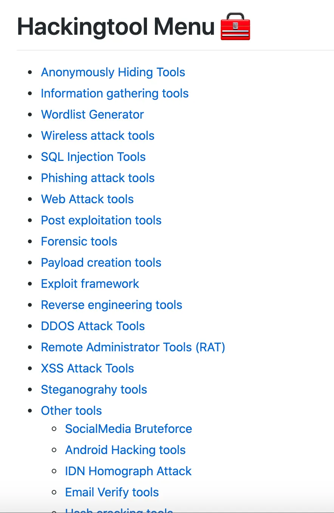

# 黑客开源项目

Hacker 这个词，大多数理解为黑客，而维基百科对其的定义为——黑客（Hacker）是指对设计、編程和计算机科学方面具高度理解的人，在本文中 hacker 主要侧重为对网络安全有自己想法的人，比如，让你了解黑客道德准则和安全实践的 hacker-roadmap；让你考验一把操作系统的 TheFatRat 工具，还有各角度让你了解到网络攻击姿势的 h4cker 和 hacker101，以及工具篇的 hackingtool。

## 黑客的艺术：h4cker

**GitHub Star 数** ：7k+

h4cker 是包含数千个与网络安全相关的参考资料和资源的项目，项目由 Omar Santos 维护，资料中包括：渗透测试，数字取证和事件响应（DFIR），漏洞研究，漏洞利用开发，逆向工程等内容。

> GitHub 地址：https://github.com/The-Art-of-Hacking/h4cker

## 变身黑客：TheFatRat

**GitHub Star 数** ：4,468

TheFatRat 是一种利用恶意软件编译具有著名负载的恶意软件，然后可以在 Linux，Windows，Mac 和Android 上执行该恶意软件。TheFatRat 提供了一种轻松创建后门和有效负载的方法，可以绕过大多数防病毒软件。特征：

- 全自动MSFvenom 和 Metasploit
- 本地或远程侦听器生成
- 按类别轻松地制作后门操作系统
- 生成各种格式的有效载荷
- 绕过反病毒后门
- 可用于增加文件大小的文件泵
- 能够检测外部 IP 和接口地址
- 自动创建用于 USB / CDROM 的 AutoRun 文件

> GitHub 地址：https://github.com/Screetsec/TheFatRat

## ALL IN ONE 黑客全家桶：hackingtool

**GitHub Star 数** ：4,611

hackingtool 收录 Hackers 所需的大部分工具，包括 SQL 注入、钓鱼攻击、Hash 破解、XSS、DDos 攻击等等分类工具。

> GitHub 地址：https://github.com/Z4nzu/hackingtool

## 黑客进阶：hacker101

**GitHub Star 数** ：11.5k+

hacker101 收录了 HackerOne 出品的 Web 安全免费在线课程的源代码，无论你是对漏洞众测（Bug Bounty）感兴趣，或是经验丰富的安全专家，阅读本 repo 想必都能有所收获。

> GitHub 地址：https://github.com/Hacker0x01/hacker101

## 黑客的技能路线图：hacker-roadmap

**GitHub Star 数** ：3,864

hacker-roadmap 是一份爱好者指南，并收集了黑客工具、资源和参考资料，以实践黑客道德准则和网络安全。

> GitHub 地址：https://github.com/sundowndev/hacker-roadmap

最后，安利一个传递黑客与极客精神的网络安全网站：https://www.freebuf.com/

# 云安全资源

## 收集一些国内外不错的云安全资源

GitHub：[teamssix/awesome-cloud-security: awesome cloud security 收集一些国内外不错的云安全资源，该项目主要面向国内的安全人员 (github.com)](https://github.com/teamssix/awesome-cloud-security)

文章：[云安全资源 | T Wiki (teamssix.com)](https://wiki.teamssix.com/cloudsecurityresources/)