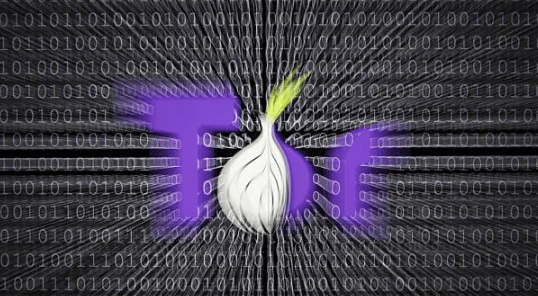
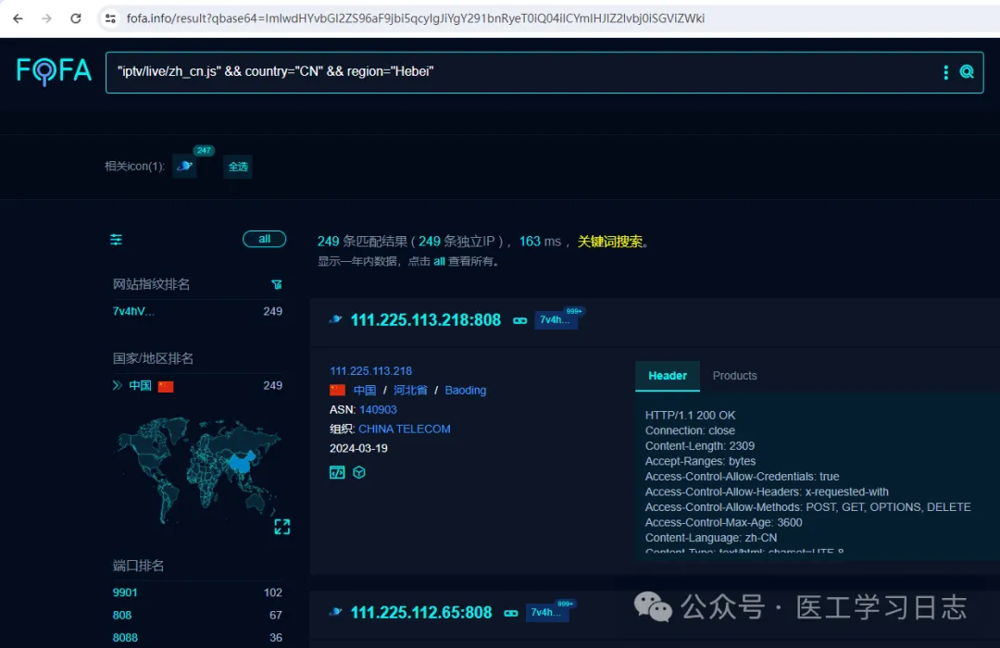

# 黑客辅助工具

## 指纹浏览器泄漏查询

[最佳 BrowserScan 指纹检测工具 - 提高您的在线隐私安全 | BrowserScan](https://www.browserscan.net/)

[掩盖你的踪迹 (firstpartysimulator.org)](https://firstpartysimulator.org/)

## Tor 浏览器：它是什么、它如何工作、它安全吗？它有什么用？

  您是否曾经感觉互联网在跟踪您？你是否曾经在 Google 上随机搜索过一些东西，结果却连续几天被奇怪的相关广告轰炸？这不是偏执——这是 21 世纪在线跟踪的现实。研究表明，72% 的美国人认为他们在网上所做的大部分事情都被公司跟踪。

  但是，如果有一种方法可以匿名浏览网络，就像数字幽灵溜过互联网的后巷呢？嗯，这就是 Tor 浏览器的用途。它是一个免费且功能强大的工具，可以帮助您收回您的在线隐私。在本文中，我们将讨论什么是 Tor 浏览器、它的用途、它的工作原理等等！

### 什么是 Tor 浏览器？


Tor 代表洋葱路由器，是一款免费的开源软件，可以匿名化您的互联网流量。它由 Tor 项目开发，利用由志愿者运行的服务器（称为中继）组成的庞大网络，在数据包到达目的地之前对其进行加密和重新路由。这个过程类似于剥洋葱，使得追踪您的在线活动的来源变得极其困难。

Tor 浏览器是 Firefox 的定制版本，专门设计用于与 Tor 网络无缝运行。它预先配置了安全功能，以进一步保护您的隐私，例如阻止恶意脚本和防止浏览器指纹识别。

### Tor 浏览器如何工作？

想象一下你自己在敌方领土上发送一条秘密信息。您不是使用单一路由，而是将消息分解成多个部分，然后通过一系列值得信赖的信使发送它们，每个信使都不知道消息的来源或最终目的地。这种分层方法，即每个快递员拆下一块包装纸以显示下一个收件人，构成了 Tor 网络背后的核心原则以及 Tor 浏览器如何利用它。

以下是该过程的更详细分解：

1. **入口节点：**当您使用 Tor 浏览器访问网站时，您的互联网流量首先通过入口节点进入 Tor 网络。该中继充当您的初始联系点，从数据包中剥离第一层信息。该层通常包含您尝试访问的网站的目标地址。入口节点不知道最终目的地或数据内容，只知道链中下一个中继的地址。
2. **电路选择：** Tor 浏览器采用称为电路选择的过程来选择数据通过网络的路径。此选择优先考虑正常运行时间、带宽可用性和出口节点位置等因素，以优化速度并避免中继过载。
3. **中间中继：**一旦入口节点删除第一层，它就会加密剩余的数据包并将其发送到 Tor 网络内随机选择的中间中继。与入口节点类似，这个中间中继只能看到序列中前一个中继和下一个中继的地址。它删除了另一层加密，揭示了下一跳的指令，并在加密的旅程中转发数据包。

在每个中间节点中继和解密单层的过程通过在电路选择阶段选择的预定数量的中继（通常是两个或三个）继续进行。中间中继的数量有助于通过添加更多混淆层来进一步匿名化您的流量。

1. **出口节点：**旅程的最后一站是出口节点。该中继接收最后一层加密数据，将其完全解密，然后将未加密的信息转发到您尝试访问的网站。该网站将连接视为源自出口节点的 IP 地址，而不是您的 IP 地址。
2. **返回路径：**来自网站的响应以相反的顺序通过已建立的电路返回。每个中继在传递数据包之前都会使用特定的层重新加密数据包。最后，完全加密的响应通过入口节点到达您的设备，完成匿名通信周期。

### Tor 浏览器有什么用？

Tor 浏览器为寻求增强在线隐私和匿名性的用户提供了一系列好处。以下是一些常见用例：

- **保护自己免受在线监视：**

- - **记者和活动人士：**在压迫政权中工作或报道敏感话题的个人可以利用 Tor 与消息来源安全地通信并访问经过审查的信息。
  - **举报者：**那些揭露组织内部不当行为的人可以利用 Tor 匿名举报不当行为，而不必担心遭到报复。
  - **注重隐私的个人：**任何关心政府、公司或其他实体在线监控的人都可以使用 Tor 以更大的匿名性浏览网络。

- **绕过审查：**

- - **受审查国家的用户：** Tor 允许生活在限制互联网访问的政权下的个人绕过审查制度并访问可能在其所在位置被阻止的信息。这可以包括新闻网站、社交媒体平台或教育资源。
  - **研究和教育：**学者和研究人员可以出于研究目的访问其所在地区可能受到限制的信息。学生还可以利用 Tor 访问可能被学校或机构屏蔽的教育材料。

- **增加隐私：**

- - **最大限度地减少在线跟踪：**通过隐藏您的 IP 地址和位置，Tor 使广告商和跟踪者很难在网络上跟踪您。这可以帮助您避免定向广告并创造更加私密的浏览体验。
  - **保护敏感信息：**在访问财务信息、在线购物或使用公共 Wi-Fi 网络时，Tor 可以提供额外的安全层，并帮助防止未经授权的访问您的数据。

- **其他合法用途：**

- - **访问被阻止的服务：** Tor 可用于访问您所在地区可能无法使用的地理限制服务，例如流媒体平台或在线游戏。
  - **法律研究：**律师和法律专业人士可以使用 Tor 访问可能限制公众访问的法律数据库或资源。

### Tor 浏览器的优点

使用 Tor 浏览器为注重隐私的个人提供了多种优势。以下是主要优势的更详细细分：

- **增强的匿名性：**多层加密和中继系统使任何人都很难跟踪您的在线活动。这种匿名性有利于：

- - **记者和活动人士：**他们可以与消息来源安全地沟通并访问经过审查的信息，而不必担心遭到报复。
  - **受限制地区的个人：**生活在压迫政权下的用户可以绕过审查制度并访问其政府可能限制的信息。
  - **任何寻求隐私的人：** Tor 允许您浏览互联网，而不会被广告商、数据经纪人甚至互联网服务提供商 (ISP) 跟踪。如果您担心有针对性的广告或在线分析，这可能特别有用。

- **绕过审查制度：** Tor 允许您访问在您所在地理位置可能被阻止的信息和网站。这可能有助于：

- - **访问教育资源：**学生和研究人员可以访问由于政治或教育限制而在其所在地区可能受到限制的信息。
  - **随时了解情况：**生活在互联网审查严格的国家/地区的用户可以访问世界各地的新闻和信息。
  - **探索多样化内容：** Tor 允许您访问可能受地理限制的网站和服务，例如您所在地区不可用的流媒体平台或社交媒体网站。

- **减少在线跟踪：**通过隐藏您的 IP 地址，Tor 使广告商和跟踪器难以在网络上跟踪您。这可以让关心以下问题的用户受益：

- - **有针对性的广告：** Tor 根据您的浏览历史记录帮助您避免受到广告轰炸。
  - **数据收集：**限制在线跟踪有助于减少第三方公司可以收集的有关您和您的浏览习惯的数据量。
  - **建立数字档案：**通过屏蔽您的 IP 地址和在线活动，Tor 使公司和网站更难建立有关您的全面档案。

- **提高安全性：**在访问公共 Wi-Fi 网络上的敏感信息时，Tor 可以增加额外的安全层。公共 Wi-Fi 连接通常不安全，使您的数据容易被拦截。使用 Tor 可以加密您的流量，使黑客或窥探者更难窃取您的信息。

### Tor、VPN 和代理服务器之间有什么区别？

虽然这三种工具都旨在增强在线隐私，但它们的功能各不相同，提供不同级别的匿名性、安全性和速度。以下是它们主要差异的详细分析：

**匿名：**

- **Tor 浏览器：**通过分散的中继网络路由您的流量，提供最高级别的匿名性。每个中继只知道链中的前一跳和下一跳，因此很难将您的活动追溯到其源头。然而，重要的是要记住，顽固的对手所采用的先进技术可能会导致用户去匿名化。
- **代理服务器：**提供中等程度的匿名性。它充当您的设备和互联网之间的中介，从您尝试访问的网站中屏蔽您的 IP 地址。但是，代理服务器本身可以看到您的活动并可能会记录它。此外，某些网站仍然可以检测到您正在使用代理。
- **VPN（虚拟专用网络）：**通过屏蔽您的 IP 地址并加密通往 VPN 服务器的安全隧道内的流量，提供适度的匿名性。这使得您的 ISP 或其他第三方很难跟踪您的在线活动。然而，匿名性依赖于 VPN 提供商的可信度，因为他们可能会看到您的真实 IP 地址和浏览活动。

**安全：**

- **Tor 浏览器：**通过对通过 Tor 网络传输的流量进行多次加密，提供良好的安全性。然而，重要的是要意识到恶意退出节点是有可能的，而且 Tor 本身并不能防御恶意软件或其他在线威胁。
- **代理服务器：**提供有限的安全性。虽然它可以隐藏您的 IP 地址，但它不会加密您的流量。这意味着您的数据仍然容易在不安全的网络上被拦截。
- **VPN：**通过加密您的整个互联网流量来提供良好的安全性，使任何窥探您连接的人都无法读取。这增加了一层保护，尤其是在公共 Wi-Fi 网络上。然而，安全性最终取决于 VPN 提供商使用的加密强度。

**速度：**

- **Tor 浏览器：** Tor 中的多层路由过程会显着减慢您的互联网连接速度。这是因为与直接连接相比，您的数据需要更长的路径。
- **代理服务器：**速度可能因代理服务器的位置和负载而异。一般来说，与 Tor 相比，使用代理服务器对互联网速度的影响最小。
- **VPN：**提供中等速度，具体取决于 VPN 服务器位置和您的互联网连接计划。虽然存在一些加密开销，但信誉良好的 VPN 提供商通常会提供良好的浏览和流媒体速度。

**成本：**

- **Tor 浏览器：**完全免费的开源软件。
- **代理服务器：**有免费和付费代理服务器可供使用。免费代理服务器通常存在速度较慢或侵入性广告等限制。付费代理服务器可能会提供更好的性能和功能。
- **VPN：**通常需要订阅费，但也有免费的 VPN 选项。免费 VPN 通常存在数据上限、速度较慢或侵入性广告等限制。付费 VPN 通常提供更好的性能、安全功能和服务器位置。

**使用方便：**

- **Tor 浏览器：**相对容易使用，具有基于 Firefox 的熟悉界面。但是，配置高级设置可能需要一些技术知识。
- **代理服务器：**设置代理服务器可能更具技术性，需要更改网络浏览器或设备设置中的配置。
- **VPN：**通常最容易使用。大多数 VPN 提供商通过简单的一键连接过程为各种设备提供用户友好的应用程序。

### Tor 浏览器使用安全吗？



Tor 提供了显着的隐私优势，但也并非没有限制和潜在风险。以下是您需要了解的内容：

- **速度较慢：**由于多层路由过程，Tor 会显着减慢您的互联网连接速度。
- **并非万无一失的匿名：**虽然追踪您的活动很困难，但这并非不可能。拥有先进资源的执法机构也许能够在某些情况下对用户进行去匿名化。
- **恶意退出节点：**遇到可能监视您的流量的恶意退出节点的可能性很小。
- **深网与暗网：**了解其中的区别很重要。Tor 通常与暗网联系在一起，暗网可能藏匿非法活动。然而，Tor 本身只是一个隐私工具，也可以用来匿名访问常规网络（表面网络）。

### 如何在使用 Tor 浏览器时保持安全？

Tor 浏览器为在线隐私提供了强大的盾牌，但它并不是一座坚不可摧的堡垒。以下是在 Tor 网络中最大限度地提高安全性的一些关键步骤：

#### 1. 保持软件更新

就像任何其他软件一样，Tor 浏览器会定期接收更新，以修补漏洞并增强安全功能。确保您始终使用最新版本才能从这些改进中受益。Tor 项目通常会在其官方网站https://www.torproject.org/上发布更新。

#### 2.养成安全的浏览习惯

常识适用于 Tor 领域，就像适用于常规网络一样。警惕点击可疑链接、下载未知文件或在未经验证的网站上输入个人信息。请记住，匿名可能是一把双刃剑，恶意行为者可能会试图利用毫无戒心的用户。

#### 3.谨防恶意退出节点

正如前面提到的，在 Tor 网络中遇到受损的出口节点的可能性很小。虽然这种情况并不常见，但仍然可以考虑。以下是减轻这种风险的一些方法：

- **使用网桥：**网桥是未公开列出的 Tor 网络的附加入口点。您可以从 Tor 项目网站获取网桥信息，但要小心，因为某些网桥也可能受到损害。
- **考虑使用 VPN：**将 Tor 与受信任的 VPN 服务配对会在您的数据进入 Tor 网络之前添加一层额外的加密。这可以针对恶意退出节点提供一些额外的保护。

#### 4.使用注重隐私的搜索引擎

使用 Tor 时，请避免使用 Google 或 Bing 等搜索引擎，它们可能会跟踪您的搜索并建立您的个人资料。相反，选择注重隐私的搜索引擎，例如 DuckDuckGo https://duckduckgo.com/，优先考虑用户匿名。

#### 5. 注意您访问的内容

暗网是只能通过 Tor 访问的深层网络的子集，可能成为非法活动和恶意软件的滋生地。最好避开这些区域，除非您有特定且合法的理由访问它们。即便如此，也要极其谨慎，只访问受信任的暗网资源。

#### 6. 不要使用 Tor 进行非法活动

Tor 是保护隐私的合法工具，但将其用于非法目的可能会产生严重后果。执法机构有办法追踪参与犯罪活动的用户，甚至在 Tor 网络上也是如此。

#### 7.使用防病毒和反恶意软件

虽然 Tor 可以保护您的在线流量，但它无法保护您的设备免受可能潜伏在您访问的网站上的恶意软件的侵害。拥有一个与 Tor 一起运行的强大的防病毒和反恶意软件程序是一项重要的安全措施。

#### 8.禁用不必要的插件

Tor 浏览器具有预先启用的安全功能，包括阻止 Flash 和 Java 等插件。这些插件可能是漏洞，因此除非绝对必要，否则请避免启用它们。

### 要点

- Tor 浏览器通过中继网络路由您的互联网流量，从而使您的互联网流量匿名，从而难以跟踪您的在线活动。
- 虽然 Tor 提供强大的匿名性并有助于绕过审查，但它可能比传统连接慢，并且需要遵循安全实践。
- Tor 是一款免费工具，非常适合记者、活动人士或任何寻求增强在线隐私的人，但它并不是万无一失的解决方案，不应用于非法活动。
- 为了最大限度地利用 Tor 保护您的在线隐私，请考虑将其与 VPN 结合使用、保持软件更新并养成安全的浏览习惯。

### 常见问题解答

#### 谁拥有 Tor？

Tor 由 The Tor Project 所有并维护，该项目是一个致力于在线隐私和匿名的非营利组织。

#### 黑客为何使用 Tor？

黑客使用 Tor 来隐藏他们的身份和在线活动，使当局更难追踪他们的行为。

#### Tor 哪里不合法？

Tor 在中国、俄罗斯和伊朗等国家是非法的或受到严格限制，这些国家的政府试图控制和监控互联网的使用。

#### Tor 能给我病毒吗？

Tor 本身不会给您带来病毒，但使用它并不能保证免受恶意网站或下载的侵害。用户仍应谨慎行事。

#### Google 比 Tor 更安全吗？

Google 和 Tor 服务于不同的目的；Google 专注于搜索和服务，而 Tor 则强调隐私和匿名。每个的安全性取决于您的需求和使用情况。


## 暗网排名Top10的搜索引擎

### 摘要


实际上,我们熟悉的互联网被分为三个层次: 明网、深网和暗网。所谓的明网就是能被搜索引擎抓取的网站, 这个数量大概只占整个互联网Web网页的10%, 而剩下的90%的网页均为深网和暗网。深网是指不被常见搜索引擎索引到的网站, 这其中包括各种各样的内容,例如:私人数据库、机密的企业网页、安全的政府网络和学术数据库。深网内容通常只对特定用户群体开放。而暗网是深网的一小部分, 被故意隐藏,需要特定的软件和配置才能访问, 其中Tor是最常用浏览器, 暗网通常用于非法活动, 因为它具有匿名性和保密性、托管黑市和非法服务。


### DuckDuckGo


DuckDuckGo是一款以个人隐私为导向的搜索引擎, 致力于为用户提供更加私密和安全的在线搜索体验, 与其他搜索引擎不同, DuckDuckGo不会追踪用户的搜索历史或个人信息, 也不会个性化搜索结果, 它使用严格的隐私政策来保护用户数据, 并提供一种更加匿名的搜索方式, 基于该特点, DuckDuckGo也成为Tor的默认搜索引擎。


### Onion URL Repository


Onion URL Repository是一个收集和索引暗网网站链接的存储库或目录。暗网网站通常使用.onion域名, 而不是传统的互联网域名, 以提供更高的匿名性和安全性。Onion URL Repository收集这些.onion链接,并为用户提供一个集中的位置来查找和访问暗网中的各种资源和服务。


### Yippy


Yippy是一款为用户提供更加隐私安全搜索体验的网络搜索引擎, 与传统搜索引擎不同, Yippy采用了一种称为"Clustering"的技术, 它会将搜索结果分组成相关主题, 以帮助用户更快找到所需信息。Yippy还提供了一些额外的隐私保护功能, 例如:不跟踪用户的搜索历史或个人信息,并且不会向广告商披露用户数据, 使得用户可以更加放心的进行在线搜索, 而不必担心个人隐私泄漏。

### notEvil Dark Web


notEvil是一个暗网搜索引擎，它允许用户在暗网中搜索并访问暗网上的网站。与传统的互联网搜索引擎不同，notEvil专注于暗网，这意味着它索引和提供的是.onion域名的网站，这些网站通常在传统的互联网上无法访问到。

notEvil提供了一个类似于Google的搜索界面，用户可以在其中输入关键词，然后notEvil会返回与这些关键词相关的暗网网站链接。这使得用户能够发现并访问暗网上的各种资源，从论坛和新闻网站到市场和资源分享站点。

### Torch


Torch是一个古老的搜索引擎, 创建于1996年, 该搜索引擎既可以从明网访问,也可以从暗网访问, 其声称数据库中至少有十亿个暗网网站链接。该搜索引擎不仅搜索响应速度快(平均响应速度不超过3秒), 而且尊重个人隐私, 不会监视用户行为。

### Haystak


Haystak是专为暗网而设计的一款搜索引擎, 其索引的暗网页面超过十亿个, 需要注意的是, 暗网网站在一定时间后会被删除,因此搜索出的暗网页面可能有许多已经无法打开。同样,该搜索引擎不会记录用户个人隐私或其他行为。


### Ahmia.fi


Ahmia.fi 是一个知名的暗网搜索引擎，主要服务于Tor网络。它允许用户在暗网中搜索并访问.onion 域名的网站。Ahmia.fi 提供了一个简单的搜索界面，用户可以输入关键词，然后返回与这些关键词相关的暗网网站链接。

Ahmia.fi 旨在帮助用户在暗网上发现资源和信息，同时保护他们的隐私。它是一个非营利性的项目，致力于提供一个安全、私密的搜索体验。Ahmia.fi 还致力于保护用户的隐私，不追踪用户的搜索历史或个人信息，并且不向广告商披露用户数据。

### Fazzle


Fazzle.com是一个元网络索引的深网搜索引擎，支持英语、法语和荷兰语。Fazzle查看了超过120个不同的网络搜索引擎，提供“快速准确的结果”，并附带每个列表的预览页面。Fazzle的深网搜索引擎查询结果包括网页、下载、图片、视频、音频、黄页、白页、购物和新闻。在这个深网搜索引擎中，与大多数更知名的元网络搜索引擎不同，Fazzle的结果没有混杂着赞助链接，而且Fazzle只为广告分配了列表中的第一位。

### Ecosia


Ecosia是一个搜索引擎，工作方式类似于Tor搜索引擎, 与其他主流搜索引擎（如Google、Bing等）类似，但有一个独特的特点：它承诺将其广告收入的大部分用于植树项目。

当用户使用Ecosia进行搜索时，它会显示与他们的搜索相关的广告。当用户点击这些广告时，Ecosia会从广告收入中获利。然后，Ecosia承诺将大部分这些收入用于植树项目，例如在全球各地植树以对抗气候变化和森林砍伐。

Ecosia致力于可持续发展和环境保护，并通过植树来实现这一目标。因此，用户可以通过使用Ecosia搜索引擎来支持环保事业，而不会产生额外的费用或捐款。

### Internet Archive


Internet Archive 其实不是真正意义上的搜索引擎，而是一个数字化图书馆和网络档案馆，旨在保存互联网上的历史记录和数字内容。它提供了一个名为 Wayback Machine 的功能，允许用户查看过去的网页快照，以及浏览存档的网页版本。

尽管Internet Archive 并不是真正意义上的搜索引擎，但它的 Wayback Machine 功能允许用户搜索并访问过去的网页内容。用户可以通过输入特定的网址或关键词来查找存档的网页，并查看它们在不同时间点的快照。

## 如何利用钟馗之眼(zoomeye)手动获取酒店节目源

利用工具网络测绘：钟馗之眼（*https://www.zoomeye.org/*）

### 一、酒店源获取

首先需要找到有效的酒店源IP，其次在该IP的服务器上下载播放列表。


要找到有效的酒店源IP，可以通过在测绘空间搜索关键字如"iptv/live/zh_cn.js"加地区关键字就可以搜出部分酒店源IP，然后通过IP+/iptv/live/1000.json?key=txiptv 就可以获取节目列表内容的json，最后通过程序化语言获取改json的节目名称和链接制作成节目列表。

如通过钟馗之眼搜索：*iptv/live/zh_cn.js*

得到第一个结果为广州的 *219.137.29.213:4433*，然后通过访问

http://*219.137.29.213:4433*/iptv/live/1000.json?key=txiptv,得到节目内容的json：


该节目列表有29个，然后节目名称和url均在该json数据中。我们可以打开第一条数据的url测试一下是否可以正常播放：


节目是可以正常播放的，最后可以通过正则表达式或者相关代码提取需要的name和url值就获得了我们需要的节目列表了。

例如还可以通过钟馗之眼搜索：zhgxtv


得到第一个结果为赣州的 *117.44.0.79:20000*

然后通过访问http://*117.44.0.79:20000*/ZHGXTV/Public/json/live_interface.txt,得到节目列表：


网页显示乱码，我们可以右键点击 【另存页面为】（本人使用firefox浏览器，其他浏览器差不多）


来看看下载下来的txt文件：


节目名称正常了，需要注意的是这个节目列表前端的IP：*10.8.8.200*为内网IP，我们如果需要正常播放，需要将10.8.8.200修改为之前搜索到的IP，即*117.44.0.79:20000*，我们可以通过批量替换掉*10.8.8.200*，替换后即为我们所需要的节目列表了：


测试一下节目是否可以正常播放：


### 二、相关说明

1、我们可以通过添加限定条件来获取我们需要的节目，如增加限定区域：

ZHGXTV +subdivisions:"广西"只搜索广西的酒店源的IP。

2、不是每个空间测绘搜索出来的IP都有节目源，通常日期最近的能找到相关节目列表。另外登录用户或者高级账户可能会获取更多的数据，获取有效IP可能性更高。

3、酒店源的特种关键字不止*iptv/live/zh_cn.js* 和 *ZHGXTV*，我们要找到酒店源需要找到对应的关键字和对应的节目列表位置才行，还有一些其他的关键字，待大家探索。

4、通过以上基本原理，可以设计python代码（如前面文章分享的用python通过fofa自动获取酒店源节目），自动获取IP和匹配节目列表。

5、获取有效的酒店源IP不止从空间测绘获取，也可以用过扫描IP段，测试对应的节目列表网页是否可正常访问，正常访问则判定有效IP，然后获取节目列表并保存。

## 酒店直播源和直播APP抓包记录

带视频教程：[经验：酒店直播源和直播APP抓包记录 (qq.com)](https://mp.weixin.qq.com/s/wXtZZlqEz_xLVMM8Z9Q9og)

### 一、酒店源直播源获取

#### 1、用到工具：FOFA搜索、酒店源直播地址检测

##### 1）关于FOFA：https://fofa.info/

FOFA 是一款由北京华顺信安科技有限公司研发的网络空间搜索引擎，主要用于网络空间测绘。该系统通过在全球范围内部署扫描节点，采用独特的域名爬虫技术以及丰富的资产指纹数据库（超过35万个），能够发现并识别互联网上的各类网络资产，包括但不限于服务器、网站、物联网设备等。
通过FOFA，安全研究人员和企业能够高效地完成以下任务：

1. 网络资产匹配：快速查找和定位指定类型的网络资产，例如具有某种特定服务、端口、应用程序或组件的服务器。
2. 漏洞影响范围分析：当新的安全漏洞公布时，可以迅速评估受影响的资产数量和分布情况，为应急响应和补丁管理提供依据。
3. 应用分布统计：统计特定应用在全球范围内的部署情况，分析其流行程度、版本分布以及潜在的安全风险。
4. IPv6测绘：支持IPv6协议下的网络资产搜索，适应未来互联网的发展趋势。

总的来说，FOFA在网络空间安全管理中扮演了重要的角色，为企业提供了强大的态势感知能力，有助于提升整体的信息安全水平。
此外，FOFA在网络空间测绘领域的应用还体现在以下几个关键方面：

5. 资产安全基线构建：通过持续监测和分析网络资产的状态和属性，帮助企业构建全面的资产安全基线，以便及时发现异常变化，并根据基准进行安全合规性评估。
6. 供应链风险管理：在复杂的IT供应链环境中，FOFA能够追踪并识别第三方组件及服务的部署情况，助力企业深度洞察供应链潜在的安全风险点，有效预防供应链攻击事件的发生。
7. 威胁情报挖掘与预警：结合对海量网络资产数据的实时分析，FOFA可以发现新型的攻击手段、恶意行为模式以及被黑资产等重要威胁情报，提前发出预警，为安全防护策略提供有力的数据支撑。
8. 行业对比分析：针对不同行业的网络资产分布特征，FOFA能够进行深入的横向比较分析，有助于各行业用户了解自身网络安全状况在全行业中的相对位置，从而更好地制定有针对性的安全优化策略。
9. 应急响应支持：在发生网络安全事件时，FOFA能够快速定位受影响资产的具体信息，协助安全团队迅速启动应急响应机制，降低损失并提升恢复效率。

总之，FOFA凭借其高效精准的搜索能力、强大的数据分析功能以及广泛的资产覆盖范围，在全球网络空间测绘领域树立了新的技术标杆。它不仅为企业提供了细致入微的态势感知视图，更是在实战中成为各类组织机构强化信息安全防御体系、抵御网络威胁的关键利器。


##### 2）酒店直播源地址检测：

恩山找到的PHP源码（源码下载在文章最后），搭建PHP环境或者上传至PHP空间使用


如没有PHP环境或者PHP空间可以用我提供的地址：

http://iptivi.000.pe/


#### 2、酒店直播源获取方法：

fofa地址：https://fofa.info/

利用fofa进行搜索：region可以改成其他省份

```
"iptv/live/zh_cn.js" && country="CN" && region="Hebei"
```

搜索结果如下：



然后复制IP（111.225.113.218:808）到酒店直播地址检测进行检测：


检测出来相关列表：


也可以限定端口，如：

```
"iptv/live/zh_cn.js" && country="CN" && region="guangdong" && port="9901"
```

搜索结果如下：


然后对搜索到的IP按上述方法进行检测。

#### 3、其他酒店直播源获取方式：

1）恩山的酒店源自动更新获取：通过python脚本进行爬取各地酒店IPTV数据并保存，需搭建python环境和安装相关运行库。差不多就是上述人工运行方式进行了程序自动化。

2）当然也有相关网站列出酒店源和组播源

网址：http://foodieguide.com/iptvsearch/

列出了最新的酒店源和组播源：


点击相关IP就可以获得节目列表


复制相关列表就可以了。

### 二、直播APP抓包

#### 1、用到工具：Packet Capture


#### 2、抓包方法：以抓取DIYP影音为例

1）打开需要抓包的节目


2）Packet Capture点击1的图标，搜索需要抓包的APP


3）对抓包数据进行分析：


```
12:04 GET /live/tdtv.m3u8 HTTP/1.1
User-Agent: SYTV/1.6
Accept: */*
Range: bytes=0-
Connection: close
Host: live.tongdaotv.com:8087
```

host：即为主机，GET后面即为地址：

http://live.tongdaotv.com:8087/live/tdtv.m3u8

3、说明：抓包app还有其他类似，操作差不多，以上只是对于未加密数据的直播源，对于加密的直播源可能无法抓取。

### 三、相关下载

#### 酒店直播源检测php源码和python源码：


##### index.php

```php
<?php
/**
 * 检查给定的主机是否在线。
 *
 * @param string $host    主机名称或 IP 地址
 * @param int    $port    端口号
 * @param int    $timeout 超时时间（默认为 5 秒）
 *
 * @return bool 如果主机在线则返回 true，否则返回 false
 */
function isHostOnline($host, $port, $timeout = 5) {
    $socket = @fsockopen($host, $port, $errno, $errstr, $timeout);
    if (!$socket) {
        return false; // 主机不在线或连接超时
    } else {
        fclose($socket);
        return true; // 主机在线
    }
}


/**
 * 检查给定的 IPv4 地址是否属于公共网络地址，而不是私有网络地址。
 *
 * @param string $ip IPv4 地址
 *
 * @return bool 如果是公共网络地址则返回 true，否则返回 false
 */
function isPublicIPv4Address($ip) {
    // 定义私有网络地址范围
    $privateIPs = [
        '10.0.0.0/8',
        '172.16.0.0/12',
        '192.168.0.0/16',
    ];

    // 将 IPv4 地址转换为长整数
    $ipLong = ip2long($ip);

    if ($ipLong !== false) {
        foreach ($privateIPs as $privateIP) {
            list($network, $subnet) = explode('/', $privateIP);
            $networkLong = ip2long($network);
            $subnetMask = -1 << (32 - $subnet);

            // 检查是否在私有网络地址范围内
            if (($ipLong & $subnetMask) == ($networkLong & $subnetMask)) {
                return false; // IPv4 在私有网络地址范围内
            }
        }
    }

    return true; // IPv4 是外网地址
}


/**
 * 判断给定的主机地址是否是域名、IPv4地址或未知类型的地址。
 *
 * @param string $host 主机地址
 *
 * @return int 1 表示域名，0 表示IPv4地址，-1 表示未知类型
 */
function isDomainOrIPv4($host) {
    // 正则表达式匹配域名的模式
    $domainPattern = '/^(?:(?:[a-zA-Z0-9-]+\.){1,}[a-zA-Z]{2,}(?::\d+)?|localhost(?::\d+)?)$/';

    // 正则表达式匹配IPv4地址的模式
    $ipv4Pattern = '/^(25[0-5]|2[0-4][0-9]|[01]?[0-9][0-9]?)\.(25[0-5]|2[0-4][0-9]|[01]?[0-9][0-9]?)\.(25[0-5]|2[0-4][0-9]|[01]?[0-9][0-9]?)\.(25[0-5]|2[0-4][0-9]|[01]?[0-9][0-9]?)$/';

    if (preg_match($domainPattern, $host)) {
        // 匹配到域名
        return 1;
    } elseif (preg_match($ipv4Pattern, $host)) {
        // 匹配到IPv4地址
        return 0;
    } else {
        // 未匹配到，表示未知类型
        return -1;
    }
}


/**
 * 检测通道URL是否可达，并根据条件进行处理
 *
 * @param string $channelUrl 通道URL
 * @param string $srcHost 源主机
 * @param int $srcPort 源端口
 * @return string|false 处理后的URL或false
 */
function isChannelUrlReachable($channelUrl, $srcHost, $srcPort) {
    // 使用正则表达式匹配可能的地址
    $pattern = '/^(http|https|udp|rtp|rtmp|rtsp):\/\/([^\/: ]+)(?::(\d+))?(\/[^# ]*)?/';
    preg_match($pattern, $channelUrl, $matches);
    
    if (isset($matches[0])) {
        $address = $matches[0];   // 完整匹配的地址
        $protocol = $matches[1];  // 协议（http、https、udp、rtp、rtmp、rtsp）
        $host = $matches[2];      // 主机名或IP地址
        $port = $matches[3];      // 端口号（如果存在）
        $path = $matches[4];      // 路径（如果存在）
        
        if (!($protocol == "udp" || $protocol == "rtp" || $protocol == "rtmp" || $protocol == "rtsp")) {
           // 判断主机类型（域名或IPv4）
            if (isDomainOrIPv4($host) == 0) {
                // 使用源主机地址和源端口构建URL
                return "$protocol://$srcHost:$srcPort$path";
            } else if (isDomainOrIPv4($host) == 1) {
                // 域名类型，直接返回原始地址
                return "$address";
            } else {
                // 未知类型
                return "未知类型";
            }
        } else {
            // udp、rtp、rtmp、rtsp协议类型，直接返回频道地址
            return "$channelUrl";
        }
    } else {
        return false; // 未找到匹配的地址
    }
}


/**
 * 验证输入的主机地址是否有效，并解析主机名和端口。
 *
 * @param string $src 输入的主机地址
 *
 * @return array|false 如果地址有效，则返回包含主机名和端口的关联数组；否则返回 false。
 */
function isValidHost($src) {
    // 使用正则表达式匹配可能的格式
    $pattern = '/^((?:[a-zA-Z0-9-]+\.)*[a-zA-Z0-9-]+)(?::(\d+))?$/';

    if (preg_match($pattern, $src, $matches)) {
        // 如果匹配成功，提取主机名和端口
        $host = isset($matches[1]) ? $matches[1] : "localhost"; // 默认主机名为 "localhost"
        $port = isset($matches[2]) ? $matches[2] : 80; // 默认端口为 80

        // 返回包含主机名和端口的关联数组
        return array("host" => $host, "port" => $port);
    } else {
        // 如果地址无效，返回 false
        return false;
    }
}


/**
 * 解析输入的主机地址，并检测其可达性，根据解析结果构建新的地址。
 *
 * @param string $src 输入的主机地址
 * @param string $channelUrl 频道地址需要解析和检测
 *
 * @return string 生成的新地址或错误消息
 */
function parseAddress($srcHost, $srcPort, $channelUrl) {
    // 调用 isChannelUrlReachable 函数，检查频道地址的可达性
    $url = isChannelUrlReachable($channelUrl, $srcHost, $srcPort);
    if ($url) {
        return $url; // 如果频道地址可达，返回频道地址
    } else {
        // 使用正则表达式匹配频道地址中可能的地址，提取出路径
        // 正则表达式匹配以斜杠开头的路径部分，忽略了 "#" 之后的内容
        $pattern = '/^(?:(https?|udp|rtp|rtmp|rtsp)[^\/]*)?(.*)/';
        preg_match($pattern, $channelUrl, $matches);
        
        if (isset($matches[0])) {
            $protocol = $matches[1];  // 协议（http、https、udp、rtp、rtmp、rtsp）
            $path = $matches[2];      // 路径（如果存在）
            if (!empty($protocol)) {
                return "$channelUrl";
            } else {
                return "http://$srcHost:$srcPort$path";
            }
        } else {
            return "未找到匹配的地址"; // 如果没有找到匹配的路径，返回错误消息
        }
    }

}

// 主函数，处理用户输入和展示酒店直播源信息
function processHotelLiveSource() {
    // 获取来自前端的src参数值
    $src = isset($_GET['src']) ? $_GET['src'] : "";

    // 获取当前页面的URL地址
    $currentUrl = "http" . (isset($_SERVER['HTTPS']) && $_SERVER['HTTPS'] === 'on' ? "s" : "") . "://" . $_SERVER['HTTP_HOST'];

    if (empty($src)) {
        // 如果没有提供src参数，则显示表单
        echo <<<EOL
        <body style="margin: 0; padding: 0; background: linear-gradient(to bottom, #3498db, #2980b9);">
            <div style="height: 100vh; display: flex; justify-content: center; align-items: center;">
                <form method="post">
                    <div style="text-align: center;">
                        <p style="font-size: 18px; font-weight: bold; margin-right: 10px; color: #fff;">酒店直播源地址：</p>
                        <input type="text" name="src" placeholder="42.176.185.28:9901" required style="padding: 8px; font-size: 16px; border-radius: 5px 0 0 5px; border: 1px solid #ccc; border-right: none; height: 40px; outline: none;"><input type="submit" name="submit" value="检测" style="padding: 6px 12px; font-size: 16px; background-color: #007bff; color: #fff; border: none; border-radius: 0 5px 5px 0; cursor: pointer; height: 40px; margin: 0;">
                    </div>
                </form>
            </div>
        </body>
EOL;
        if ($_SERVER["REQUEST_METHOD"] == "POST") {
            // 检查是否提交了表单
            if (isset($_POST["submit"])) {
                // 获取输入框的值
                $src = $_POST["src"];
                
                // 重定向当前页面，并附带src参数
                header("Location: " . $currentUrl . "?src=" . $src);
                exit; // 确保页面立即终止执行
            }
        }
    } else {
        // 处理用户提供的地址
        $address = isValidHost($src);
        if ($address) {
            $srcHost = $address['host'];
            $srcPort = $address['port'];
            
            // 设置超时时间为1秒，多数酒店源可用，个别酒店源服务器因响应速度太慢，可设置成10秒或者30秒
            $context = stream_context_create(['http' => ['timeout' => 1]]);
            // 尝试从主URL获取JSON数据
            $url = @file_get_contents("http://" . $src . "/iptv/live/1000.json", false, $context);
            
            // 检查是否成功获取JSON数据
            if ($url === false || empty($url)) {
                // 尝试备用URL（与主URL相同）
                $backupUrl = "http://" . $src . "/ZHGXTV/Public/json/live_interface.txt";
            
                // 尝试从备用URL获取JSON数据
                $json = @file_get_contents($backupUrl, false, $context);
                
                // 在备用URL上执行正则表达式替换
                $json = preg_replace("/\s+/", "<br>", $json);
                // print_r($json);
                // 输出格式化后的URL
                if ($json === false || empty($json)) {
                    echo "未找到酒店直播源<br>";
                    exit; // 停止执行代码
                } else {
                    // 解析JSON数据并展示酒店直播源信息
                    $channels = explode("<br>", $json);
                    array_pop($channels); // 移除最后一个元素
                    
                    foreach ($channels as $channel) {
                        $channelInfo = explode(",", $channel);
                        
                        $channelName = $channelInfo[0];
                        $channelUrl = $channelInfo[1];
                        
                        // 输出格式化后的URL
                        echo $channelName . "," . parseAddress($srcHost, $srcPort, $channelUrl) . "<br>";
                    }
                }
            } else {
                // 使用正则表达式提取JSON数据中的名称字段
                preg_match_all('|"name":\s*"(.*?)"|', $url, $nameMatches);
                
                if (!empty($nameMatches[1])) {
                    // 使用正则表达式提取JSON数据中的URL字段
                    preg_match_all('|"url":\s*"(.*?)"|', $url, $urlMatches);
                
                    // 将名称数组和URL数组合并为关联数组
                    $channelData = array_combine($nameMatches[1], $urlMatches[1]);
                    
                    // 遍历关联数组，输出名称和完整URL
                    foreach ($channelData as $channelName => $channelUrl) {
                        // 输出格式化后的URL
                        echo $channelName . "," . parseAddress($srcHost, $srcPort, $channelUrl) . "<br>";
                    }
                } else {
                    // 处理没有匹配结果的情况
                    echo "未找到酒店直播源<br>";
                    exit; // 停止执行代码
                }
            }
        } else {
            // 处理无效的用户输入
            echo "请输入有效的域名或IP地址<br>";
            exit; // 停止执行代码
        }
    }
}
// 调用主函数
processHotelLiveSource();
?>
```

##### 酒店源iptv更新

```python
import re
import requests
import concurrent.futures

def test_speed(channel_name, channel_url):
    try:
        response = requests.get(channel_url, timeout=2)
        if response.status_code == 200:
            speed = response.elapsed.total_seconds()
            return channel_name, channel_url, f"{speed:.3f} seconds"
        else:
            return channel_name, channel_url, "Failed"
    except:
        return channel_name, channel_url, "Failed"

def channel_key(channel):
    match = re.search(r'\d+', channel)
    if match:
        return int(match.group())
    else:
        return float('inf')  # 返回一个无穷大的数字作为关键字

channels = []

with open("IPTV.txt", 'r', encoding='utf-8') as file:
    lines = file.readlines()

    for line in lines:
        line = line.strip()
        if line:
            if 'rtp' in line or 'udp' in line:
                pass
            else:
                channel_name, channel_url = line.split(',')
                channels.append((channel_name, channel_url))

with concurrent.futures.ThreadPoolExecutor(max_workers=100) as executor:
    futures = []

    for channel in channels:
        channel_name, channel_url = channel
        futures.append(executor.submit(test_speed, channel_name, channel_url))

    results = []
    for future in concurrent.futures.as_completed(futures):
        result = future.result()
        results.append(result)

results.sort(key=lambda x: (x[0], x[2]))

with open("speed_results.txt", 'w', encoding='utf-8') as file:
    for result in results:
        channel_name, channel_url, speed = result
        file.write(f"{channel_name},{channel_url},{speed}\n")


channels = []
with open("speed_results.txt", 'r', encoding='utf-8') as file:
    for line in file:
        line = line.strip()
        if line:
            channel_name, channel_url, speed = line.split(',')
            if speed != "Failed":
                channels.append((channel_name,channel_url))


# 对频道进行排序
channels.sort(key=lambda x: channel_key(x[0]))

with open("IPTV_speed.txt", 'w', encoding='utf-8') as file:
    for channel_name,channel_url in channels:
        file.write(f'{channel_name},{channel_url}\n')
```

##### 全国酒店源自动更新获取

```python
import time
import concurrent.futures
from selenium import webdriver
from selenium.webdriver.chrome.options import Options
import requests
import json
import re

hebei = "https://fofa.info/result?qbase64=ImlwdHYvbGl2ZS96aF9jbi5qcyIgJiYgY291bnRyeT0iQ04iICYmIHJlZ2lvbj0iSGViZWki"        #河北
beijing = "https://fofa.info/result?qbase64=ImlwdHYvbGl2ZS96aF9jbi5qcyIgJiYgY291bnRyeT0iQ04iICYmIHJlZ2lvbj0iYmVpamluZyI%3D"   #北京
guangdong = "https://fofa.info/result?qbase64=ImlwdHYvbGl2ZS96aF9jbi5qcyIgJiYgY291bnRyeT0iQ04iICYmIHJlZ2lvbj0iZ3Vhbmdkb25nIg%3D%3D"    #广东
shanghai = "https://fofa.info/result?qbase64=ImlwdHYvbGl2ZS96aF9jbi5qcyIgJiYgY291bnRyeT0iQ04iICYmIHJlZ2lvbj0ic2hhbmdoYWki"    #上海
tianjin = "https://fofa.info/result?qbase64=ImlwdHYvbGl2ZS96aF9jbi5qcyIgJiYgY291bnRyeT0iQ04iICYmIHJlZ2lvbj0idGlhbmppbiI%3D"    #天津
chongqing = "https://fofa.info/result?qbase64=ImlwdHYvbGl2ZS96aF9jbi5qcyIgJiYgY291bnRyeT0iQ04iICYmIHJlZ2lvbj0iY2hvbmdxaW5nIg%3D%3D"    #重庆
shanxi = "https://fofa.info/result?qbase64=ImlwdHYvbGl2ZS96aF9jbi5qcyIgJiYgY291bnRyeT0iQ04iICYmIHJlZ2lvbj0ic2hhbnhpIg%3D%3D"    #山西
shaanxi = "https://fofa.info/result?qbase64=ImlwdHYvbGl2ZS96aF9jbi5qcyIgJiYgY291bnRyeT0iQ04iICYmIHJlZ2lvbj0iU2hhYW54aSI%3D"    #陕西
liaoning = "https://fofa.info/result?qbase64=ImlwdHYvbGl2ZS96aF9jbi5qcyIgJiYgY291bnRyeT0iQ04iICYmIHJlZ2lvbj0ibGlhb25pbmci"    #辽宁
jiangsu = "https://fofa.info/result?qbase64=ImlwdHYvbGl2ZS96aF9jbi5qcyIgJiYgY291bnRyeT0iQ04iICYmIHJlZ2lvbj0iamlhbmdzdSI%3D"    #江苏
zhejiang = "https://fofa.info/result?qbase64=ImlwdHYvbGl2ZS96aF9jbi5qcyIgJiYgY291bnRyeT0iQ04iICYmIHJlZ2lvbj0iemhlamlhbmci"    #浙江
anhui = "https://fofa.info/result?qbase64=ImlwdHYvbGl2ZS96aF9jbi5qcyIgJiYgY291bnRyeT0iQ04iICYmIHJlZ2lvbj0i5a6J5b69Ig%3D%3D"    #安徽
fujian = "https://fofa.info/result?qbase64=ImlwdHYvbGl2ZS96aF9jbi5qcyIgJiYgY291bnRyeT0iQ04iICYmIHJlZ2lvbj0iRnVqaWFuIg%3D%3D"    #福建
jiangxi = "https://fofa.info/result?qbase64=ImlwdHYvbGl2ZS96aF9jbi5qcyIgJiYgY291bnRyeT0iQ04iICYmIHJlZ2lvbj0i5rGf6KW%2FIg%3D%3D"    #江西
shandong = "https://fofa.info/result?qbase64=ImlwdHYvbGl2ZS96aF9jbi5qcyIgJiYgY291bnRyeT0iQ04iICYmIHJlZ2lvbj0i5bGx5LicIg%3D%3D"    #山东
henan = "https://fofa.info/result?qbase64=ImlwdHYvbGl2ZS96aF9jbi5qcyIgJiYgY291bnRyeT0iQ04iICYmIHJlZ2lvbj0i5rKz5Y2XIg%3D%3D"    #河南
hubei = "https://fofa.info/result?qbase64=ImlwdHYvbGl2ZS96aF9jbi5qcyIgJiYgY291bnRyeT0iQ04iICYmIHJlZ2lvbj0i5rmW5YyXIg%3D%3D"    #湖北
hunan = "https://fofa.info/result?qbase64=ImlwdHYvbGl2ZS96aF9jbi5qcyIgJiYgY291bnRyeT0iQ04iICYmIHJlZ2lvbj0i5rmW5Y2XIg%3D%3D"    #湖南

def process_url(url):
    # 创建一个Chrome WebDriver实例
    chrome_options = Options()
    chrome_options.add_argument('--headless')
    chrome_options.add_argument('--no-sandbox')
    chrome_options.add_argument('--disable-dev-shm-usage')

    driver = webdriver.Chrome(options=chrome_options)
    # 使用WebDriver访问网页
    driver.get(url)  # 将网址替换为你要访问的网页地址
    time.sleep(10)
    # 获取网页内容
    page_content = driver.page_source

    # 关闭WebDriver
    driver.quit()

    # 查找所有符合指定格式的网址
    pattern = r"http://\d{1,3}\.\d{1,3}\.\d{1,3}\.\d{1,3}:\d+"  # 设置匹配的格式，如http://8.8.8.8:8888
    urls_all = re.findall(pattern, page_content)
    #urls = list(set(urls_all))  # 去重得到唯一的URL列表
    urls = set(urls_all)  # 去重得到唯一的URL列表
    x_urls = []
    for url in urls: # 对urls进行处理，ip第四位修改为1，并去重
        url = url.strip()
        ip_start_index = url.find("//") + 2
        ip_end_index = url.find(":", ip_start_index)
        ip_dot_start = url.find(".") + 1
        ip_dot_second = url.find(".", ip_dot_start) + 1
        ip_dot_three = url.find(".", ip_dot_second) + 1
        base_url = url[:ip_start_index]  # http:// or https://
        ip_address = url[ip_start_index:ip_dot_three]
        port = url[ip_end_index:]
        ip_end = "1"
        modified_ip = f"{ip_address}{ip_end}"
        x_url = f"{base_url}{modified_ip}{port}"
        x_urls.append(x_url)
    urls = set(x_urls) # 去重得到唯一的URL列表

    valid_urls = []
    #   多线程获取可用url
    with concurrent.futures.ThreadPoolExecutor(max_workers = 100) as executor:
        futures = []
        for url in urls:
            url = url.strip()
            modified_urls = modify_urls(url)
            for modified_url in modified_urls:
                futures.append(executor.submit(is_url_accessible, modified_url))

        for future in concurrent.futures.as_completed(futures):
            result = future.result()
            if result:
                valid_urls.append(result)

    for url in valid_urls:
        print(url)
    # 遍历网址列表，获取JSON文件并解析
    results = []
    for url in valid_urls:
        try:
            # 发送GET请求获取JSON文件，设置超时时间为0.5秒
            ip_start_index = url.find("//") + 2
            ip_dot_start = url.find(".") + 1
            ip_index_second = url.find("/", ip_dot_start)
            base_url = url[:ip_start_index]  # http:// or https://
            ip_address = url[ip_start_index:ip_index_second]
            url_x = f"{base_url}{ip_address}"
            
            json_url = f"{url}"
            response = requests.get(json_url, timeout=0.5)
            json_data = response.json()

            try:
                # 解析JSON文件，获取name和url字段
                for item in json_data['data']:
                    if isinstance(item, dict):
                        name = item.get('name')
                        urlx = item.get('url')
                        if 'http' in urlx.lower():
                            urld = f"{urlx}"
                        else:
                            urld = f"{url_x}{urlx}"

                        if name and urlx:
                            # 删除特定文字
                            name = name.replace("中央", "CCTV")
                            name = name.replace("高清", "")
                            name = name.replace("HD", "")
                            name = name.replace("标清", "")
                            name = name.replace("频道", "")
                            name = name.replace("-", "")
                            name = name.replace(" ", "")
                            name = name.replace("PLUS", "+")
                            name = name.replace("＋", "+")
                            name = name.replace("(", "")
                            name = name.replace(")", "")
                            name = name.replace("CCTV1综合", "CCTV1")
                            name = name.replace("CCTV2财经", "CCTV2")
                            name = name.replace("CCTV3综艺", "CCTV3")
                            name = name.replace("CCTV4国际", "CCTV4")
                            name = name.replace("CCTV4中文国际", "CCTV4")
                            name = name.replace("CCTV5体育", "CCTV5")
                            name = name.replace("CCTV6电影", "CCTV6")
                            name = name.replace("CCTV7军事", "CCTV7")
                            name = name.replace("CCTV7军农", "CCTV7")
                            name = name.replace("CCTV7国防军事", "CCTV7")
                            name = name.replace("CCTV8电视剧", "CCTV8")
                            name = name.replace("CCTV9记录", "CCTV9")
                            name = name.replace("CCTV9纪录", "CCTV9")
                            name = name.replace("CCTV10科教", "CCTV10")
                            name = name.replace("CCTV11戏曲", "CCTV11")
                            name = name.replace("CCTV12社会与法", "CCTV12")
                            name = name.replace("CCTV13新闻", "CCTV13")
                            name = name.replace("CCTV新闻", "CCTV13")
                            name = name.replace("CCTV14少儿", "CCTV14")
                            name = name.replace("CCTV15音乐", "CCTV15")
                            name = name.replace("CCTV16奥林匹克", "CCTV16")
                            name = name.replace("CCTV17农业农村", "CCTV17")
                            name = name.replace("CCTV5+体育赛视", "CCTV5+")
                            name = name.replace("CCTV5+体育赛事", "CCTV5+")
                            if 'udp' in urld or 'rtp' in urld:
                                pass
                            else:
                                results.append(f"{name},{urld}")
            except:
                continue
        except:
            continue

    return results
def save_results(results, filename):
    # 将结果保存到文本文件
    with open(filename, "w", encoding="utf-8") as file:
        for result in results:
            file.write(result + "\n")
            print(result)

def modify_urls(url):
    modified_urls = []
    ip_start_index = url.find("//") + 2
    ip_end_index = url.find(":", ip_start_index)
    base_url = url[:ip_start_index]  # http:// or https://
    ip_address = url[ip_start_index:ip_end_index]
    port = url[ip_end_index:]
    ip_end = "/iptv/live/1000.json?key=txiptv"
    for i in range(1, 256):
        modified_ip = f"{ip_address[:-1]}{i}"
        modified_url = f"{base_url}{modified_ip}{port}{ip_end}"
        modified_urls.append(modified_url)

    return modified_urls

def is_url_accessible(url):
    try:
        response = requests.get(url, timeout=0.5)
        if response.status_code == 200:
            return url
    except requests.exceptions.RequestException:
        pass

    return None

# 处理第1个URL
results_hebei = process_url(hebei)
save_results(results_hebei, "hebei.txt")

# 处理第2个URL
results_beijing = process_url(beijing)
save_results(results_beijing, "beijing.txt")

# 处理第3个URL
results_guangdong = process_url(guangdong)
save_results(results_guangdong, "guangdong.txt")

# 处理第4个URL
results_shanghai = process_url(shanghai)
save_results(results_shanghai, "shanghai.txt")

# 处理第5个URL
results_tianjin = process_url(tianjin)
save_results(results_tianjin, "tianjin.txt")

# 处理第6个URL
results_chongqing = process_url(chongqing)
save_results(results_chongqing, "chongqing.txt")

# 处理第7个URL
results_shanxi = process_url(shanxi)
save_results(results_shanxi, "shanxi.txt")

# 处理第8个URL
results_shaanxi = process_url(shaanxi)
save_results(results_shaanxi, "shaanxi.txt")

# 处理第9个URL
results_liaoning = process_url(liaoning)
save_results(results_liaoning, "liaoning.txt")

# 处理第10个URL
results_jiangsu = process_url(jiangsu)
save_results(results_jiangsu, "jiangsu.txt")

# 处理第11个URL
results_zhejiang = process_url(zhejiang)
save_results(results_zhejiang, "zhejiang.txt")

# 处理第12个URL
results_anhui = process_url(anhui)
save_results(results_anhui, "anhui.txt")

# 处理第13个URL
results_fujian = process_url(fujian)
save_results(results_fujian, "fujian.txt")

# 处理第14个URL
results_jiangxi = process_url(jiangxi)
save_results(results_jiangxi, "jiangxi.txt")

# 处理第15个URL
results_shandong = process_url(shandong)
save_results(results_shandong, "shandong.txt")

# 处理第16个URL
results_henan = process_url(henan)
save_results(results_henan, "henan.txt")

# 处理第17个URL
results_hubei = process_url(hubei)
save_results(results_hubei, "hubei.txt")

# 处理第18个URL
results_hunan = process_url(hunan)
save_results(results_hunan, "hunan.txt")

# 合并文件内容
file_contents = []
file_paths = ["hebei.txt", "beijing.txt", "guangdong.txt", "shanghai.txt", "tianjin.txt", "chongqing.txt", "shanxi.txt", "shaanxi.txt", "liaoning.txt", "jiangsu.txt", "zhejiang.txt", "anhui.txt", "fujian.txt", "jiangxi.txt", "shandong.txt", "henan.txt", "hubei.txt", "hunan.txt"]  # 替换为实际的文件路径列表
for file_path in file_paths:
    with open(file_path, 'r', encoding="utf-8") as file:
        content = file.read()
        file_contents.append(content)

# 写入合并后的文件
with open("IPTV.txt", "w", encoding="utf-8") as output:
    output.write('\n'.join(file_contents))
```


#### 抓包Packet Capture 1.7.2下载：https://wwo.lanzn.com/ivnP91rywkni
